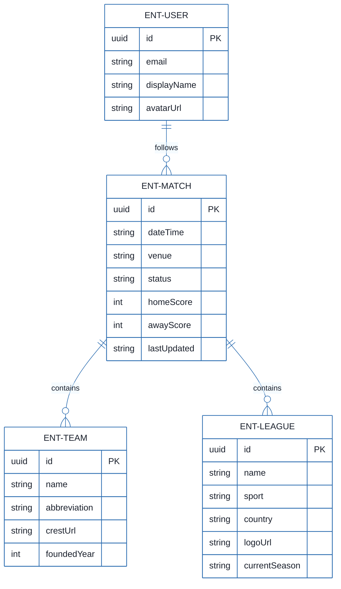
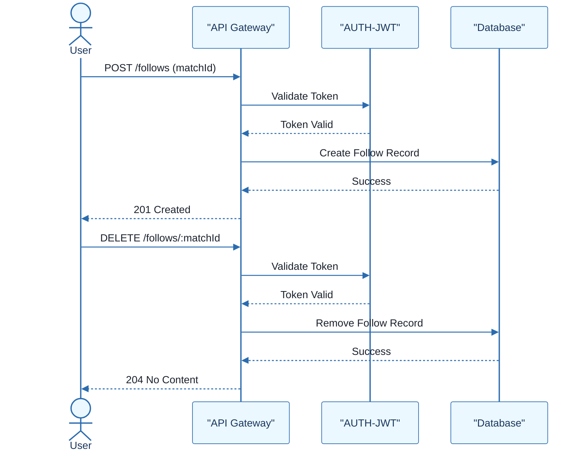

# Football Match Manager - Technical Specification & Architecture Document

## 1. Executive Summary & Architecture Overview

### 1.1 Executive Brief
The Football Match Manager is a RESTful API designed to manage football matches, teams, and leagues, featuring a user-following system for specific matches. The system implements a JWT-based authentication pattern and a versioned routing structure (`/api/v1`) to ensure backward compatibility and secure access to personalized user data.

### 1.2 Maturity Assessment
The project is in a REFINEMENT state. While the API contract is technically complete with a high completeness score, it lacks critical business context. The absence of high-priority 'Goals & Objectives' and 'Scope' definitions creates a strategic vacuum, meaning the technical implementation is ready but the product direction is not yet anchored.

### 1.3 Technical Stack
* **API Architecture**: RESTful
* **Data Format**: JSON
* **Authentication**: JWT (JSON Web Token)
* **Identifier Standard**: UUID

### 1.4 Architectural Constraints
* **API Versioning**: Mandatory URL path prefix `/api/v1/`.
* **Rate Limiting (Auth)**: Maximum 5 requests per minute per IP.
* **Rate Limiting (General)**: Maximum 60 requests per minute per user.
* **Authentication**: Bearer Token (JWT) required for all non-auth endpoints.
* **Pagination Defaults**: Matches list default page 1, limit 20.
* **Teams List Default**: Limit 50 results.

### 1.5 Critical Dependencies
* JWT for secure session management and access control.
* Referential integrity between `ENT-MATCH`, `ENT-TEAM`, and `ENT-LEAGUE`.
* User-Match relationship for the following functionality.
* ISO string format for date-based match filtering (`dateFrom`, `dateTo`).

## 2. Architecture Workflows

```mermaid
%%{init: {
  'theme': 'base',
  'themeVariables': {
    'primaryColor': '#1A365D',
    'primaryTextColor': '#1A202C',
    'primaryBorderColor': '#2B6CB0',
    'lineColor': '#2B6CB0',
    'secondaryColor': '#EBF8FF',
    'tertiaryColor': '#EBF8FF',
    'background': '#FFFFFF',
    'mainBkg': '#FFFFFF',
    'secondBkg': '#EBF8FF',
    'tertiaryBkg': '#F7FAFC',
    'secondaryTextColor': '#4A5568',
    'fontSize': '16px',
    'fontFamily': 'Inter, system-ui, sans-serif',
    'nodePadding': '15px',
    'borderRadius': '8px',
    'edgeLabelBackground': '#EBF8FF',
    'clusterBkg': '#F7FAFC',
    'clusterBorder': '#2B6CB0',
    'defaultLinkColor': '#2B6CB0',
    'titleColor': '#1A365D',
    'actorBorder': '#2B6CB0',
    'actorBkg': '#EBF8FF',
    'actorTextColor': '#1A365D',
    'actorLineColor': '#2B6CB0',
    'signalColor': '#2B6CB0',
    'signalTextColor': '#1A202C',
    'labelBoxBorderColor': '#2B6CB0',
    'labelBoxBkgColor': '#EBF8FF',
    'labelTextColor': '#1A202C',
    'loopTextColor': '#1A202C',
    'arrowHeadColor': '#2B6CB0',
    'sequenceNumberColor': '#1A365D',
    'sequenceActorBorder': '#2B6CB0',
    'sequenceActorBkg': '#EBF8FF',
    'sequenceArrowColor': '#2B6CB0',
    'noteBkgColor': '#FFF5EB',
    'noteBorderColor': '#DD6B20',
    'noteTextColor': '#1A202C'
  }
}}%%
flowchart TD
    subgraph Auth_Layer [Authentication & Security]
        AUTH-JWT["AUTH-JWT: JWT Bearer Token"]
    end
    subgraph Functional_Requirements [Functional Requirements]
        API-AUTH-REG["API-AUTH-REG: User Registration"]
        API-AUTH-LOGIN["API-AUTH-LOGIN: User Login"]
        API-MATCH-LIST["API-MATCH-LIST: Get Matches"]
        API-MATCH-DETAIL["API-MATCH-DETAIL: Get Match Detail"]
        API-FOLLOW-MATCH["API-FOLLOW-MATCH: Follow Match"]
        API-UNFOLLOW-MATCH["API-UNFOLLOW-MATCH: Unfollow Match"]
    end
    subgraph Data_Entities [Data Entities]
        ENT-MATCH["ENT-MATCH: Match Entity"]
        ENT-USER["ENT-USER: User Entity"]
    end
    API-FOLLOW-MATCH -->|"depends_on"| AUTH-JWT
    API-UNFOLLOW-MATCH -->|"depends_on"| AUTH-JWT
    API-MATCH-LIST -->|"relates_to"| ENT-MATCH
    API-MATCH-DETAIL -->|"relates_to"| ENT-MATCH
    API-AUTH-REG -->|"creates"| ENT-USER
    API-FOLLOW-MATCH -->|"links"| ENT-MATCH
```







```mermaid
%%{init: {
  'theme': 'base',
  'themeVariables': {
    'primaryColor': '#1A365D',
    'primaryTextColor': '#1A202C',
    'primaryBorderColor': '#2B6CB0',
    'lineColor': '#2B6CB0',
    'secondaryColor': '#EBF8FF',
    'tertiaryColor': '#EBF8FF',
    'background': '#FFFFFF',
    'mainBkg': '#FFFFFF',
    'secondBkg': '#EBF8FF',
    'tertiaryBkg': '#F7FAFC',
    'secondaryTextColor': '#4A5568',
    'fontSize': '16px',
    'fontFamily': 'Inter, system-ui, sans-serif',
    'nodePadding': '15px',
    'borderRadius': '8px',
    'edgeLabelBackground': '#EBF8FF',
    'clusterBkg': '#F7FAFC',
    'clusterBorder': '#2B6CB0',
    'defaultLinkColor': '#2B6CB0',
    'titleColor': '#1A365D',
    'actorBorder': '#2B6CB0',
    'actorBkg': '#EBF8FF',
    'actorTextColor': '#1A365D',
    'actorLineColor': '#2B6CB0',
    'signalColor': '#2B6CB0',
    'signalTextColor': '#1A202C',
    'labelBoxBorderColor': '#2B6CB0',
    'labelBoxBkgColor': '#EBF8FF',
    'labelTextColor': '#1A202C',
    'loopTextColor': '#1A202C',
    'arrowHeadColor': '#2B6CB0',
    'sequenceNumberColor': '#1A365D',
    'sequenceActorBorder': '#2B6CB0',
    'sequenceActorBkg': '#EBF8FF',
    'sequenceArrowColor': '#2B6CB0',
    'noteBkgColor': '#FFF5EB',
    'noteBorderColor': '#DD6B20',
    'noteTextColor': '#1A202C'
  }
}}%%
flowchart TD
    START["Start Request"] --> RL_CHECK{"Is Rate Limit Exceeded?"}
    RL_CHECK -- Yes --> ERR_429["Return 429 Too Many Requests"]
    RL_CHECK -- No --> AUTH_CHECK{"Requires Auth?"}
    AUTH_CHECK -- No --> PROCESS_REQ["Process Request"]
    AUTH_CHECK -- Yes --> JWT_VAL{"Valid JWT Token?"}
    JWT_VAL -- No --> ERR_401["Return 401 Unauthorized"]
    JWT_VAL -- Yes --> PROCESS_REQ
    PROCESS_REQ --> DB_OP{"Database Operation Successful?"}
    DB_OP -- No --> ERR_500["Return 500 Internal Error"]
    DB_OP -- Yes --> RESP_200["Return 200 OK / 201 Created"]
    ERR_429 --> END["End"]
    ERR_401 --> END
    ERR_500 --> END
    RESP_200 --> END
``` & Visual Diagrams

### 2.1 Football Match Manager Data Model
```mermaid
%%{init: {
  'theme': 'base',
  'themeVariables': {
    'primaryColor': '#1A365D',
    'primaryTextColor': '#1A202C',
    'primaryBorderColor': '#2B6CB0',
    'lineColor': '#2B6CB0',
    'secondaryColor': '#EBF8FF',
    'tertiaryColor': '#EBF8FF',
    'background': '#FFFFFF',
    'mainBkg': '#FFFFFF',
    'secondBkg': '#EBF8FF',
    'tertiaryBkg': '#F7FAFC',
    'secondaryTextColor': '#4A5568',
    'fontSize': '16px',
    'fontFamily': 'Inter, system-ui, sans-serif',
    'nodePadding': '15px',
    'borderRadius': '8px',
    'edgeLabelBackground': '#EBF8FF',
    'clusterBkg': '#F7FAFC',
    'clusterBorder': '#2B6CB0',
    'defaultLinkColor': '#2B6CB0',
    'titleColor': '#1A365D',
    'actorBorder': '#2B6CB0',
    'actorBkg': '#EBF8FF',
    'actorTextColor': '#1A365D',
    'actorLineColor': '#2B6CB0',
    'signalColor': '#2B6CB0',
    'signalTextColor': '#1A202C',
    'labelBoxBorderColor': '#2B6CB0',
    'labelBoxBkgColor': '#EBF8FF',
    'labelTextColor': '#1A202C',
    'loopTextColor': '#1A202C',
    'arrowHeadColor': '#2B6CB0',
    'sequenceNumberColor': '#1A365D',
    'sequenceActorBorder': '#2B6CB0',
    'sequenceActorBkg': '#EBF8FF',
    'sequenceArrowColor': '#2B6CB0',
    'noteBkgColor': '#FFF5EB',
    'noteBorderColor': '#DD6B20',
    'noteTextColor': '#1A202C'
  }
}}%%
erDiagram
    ENT-MATCH ||--o{ ENT-TEAM : "contains"
    ENT-MATCH ||--o{ ENT-LEAGUE : "contains"
    ENT-USER ||--o{ ENT-MATCH : "follows"
    ENT-MATCH {
        uuid id PK
        string dateTime
        string venue
        string status
        int homeScore
        int awayScore
        string lastUpdated
    }
    ENT-TEAM {
        uuid id PK
        string name
        string abbreviation
        string crestUrl
        int foundedYear
    }
    ENT-LEAGUE {
        uuid id PK
        string name
        string sport
        string country
        string logoUrl
        string currentSeason
    }
    ENT-USER {
        uuid id PK
        string email
        string displayName
        string avatarUrl
    }
```

### 2.2 Match Following Sequence


### 2.3 Requirements Traceability Map


### 2.4 API Request Processing Workflow
```mermaid
%%{init: {
  'theme': 'base',
  'themeVariables': {
    'primaryColor': '#1A365D',
    'primaryTextColor': '#1A202C',
    'primaryBorderColor': '#2B6CB0',
    'lineColor': '#2B6CB0',
    'secondaryColor': '#EBF8FF',
    'tertiaryColor': '#EBF8FF',
    'background': '#FFFFFF',
    'mainBkg': '#FFFFFF',
    'secondBkg': '#EBF8FF',
    'tertiaryBkg': '#F7FAFC',
    'secondaryTextColor': '#4A5568',
    'fontSize': '16px',
    'fontFamily': 'Inter, system-ui, sans-serif',
    'nodePadding': '15px',
    'borderRadius': '8px',
    'edgeLabelBackground': '#EBF8FF',
    'clusterBkg': '#F7FAFC',
    'clusterBorder': '#2B6CB0',
    'defaultLinkColor': '#2B6CB0',
    'titleColor': '#1A365D',
    'actorBorder': '#2B6CB0',
    'actorBkg': '#EBF8FF',
    'actorTextColor': '#1A365D',
    'actorLineColor': '#2B6CB0',
    'signalColor': '#2B6CB0',
    'signalTextColor': '#1A202C',
    'labelBoxBorderColor': '#2B6CB0',
    'labelBoxBkgColor': '#EBF8FF',
    'labelTextColor': '#1A202C',
    'loopTextColor': '#1A202C',
    'arrowHeadColor': '#2B6CB0',
    'sequenceNumberColor': '#1A365D',
    'sequenceActorBorder': '#2B6CB0',
    'sequenceActorBkg': '#EBF8FF',
    'sequenceArrowColor': '#2B6CB0',
    'noteBkgColor': '#FFF5EB',
    'noteBorderColor': '#DD6B20',
    'noteTextColor': '#1A202C'
  }
}}%%
flowchart TD
    START["Start Request"] --> RL_CHECK{"Is Rate Limit Exceeded?"}
    RL_CHECK -- Yes --> ERR_429["Return 429 Too Many Requests"]
    RL_CHECK -- No --> AUTH_CHECK{"Requires Auth?"}
    AUTH_CHECK -- No --> PROCESS_REQ["Process Request"]
    AUTH_CHECK -- Yes --> JWT_VAL{"Valid JWT Token?"}
    JWT_VAL -- No --> ERR_401["Return 401 Unauthorized"]
    JWT_VAL -- Yes --> PROCESS_REQ
    PROCESS_REQ --> DB_OP{"Database Operation Successful?"}
    DB_OP -- No --> ERR_500["Return 500 Internal Error"]
    DB_OP -- Yes --> RESP_200["Return 200 OK / 201 Created"]
    ERR_429 --> END["End"]
    ERR_401 --> END
    ERR_500 --> END
    RESP_200 --> END
```

## 3. Detailed Technical Specifications & Business Rules

### 3.1 Requirements Traceability
| Identifier | Type | Requirement / Entity Description | Source Section |
| :--- | :--- | :--- | :--- |
| `AUTH-JWT` | NFR | All endpoints except auth endpoints require a valid JWT token in the Authorization header. | Authentication |
| `API-AUTH-REG` | FR | Allow new users to register via POST /auth/register. | Authentication |
| `API-AUTH-LOGIN` | FR | Allow users to login and receive a JWT token via POST /auth/login. | Authentication |
| `API-MATCH-LIST` | FR | Retrieve a list of matches with filtering by leagueId, date range, status, and team search, including pagination. | Matches |
| `API-MATCH-DETAIL` | FR | Retrieve a specific match by its unique ID. | Matches |
| `API-FOLLOW-MATCH` | FR | Allow an authenticated user to follow a match via POST /follows. | User Follows |
| `API-UNFOLLOW-MATCH` | FR | Allow an authenticated user to unfollow a match via DELETE /follows/:matchId. | User Follows |
| `ENT-MATCH` | Entity | Match entity containing homeTeam, awayTeam, dateTime, venue, league, status, and scores. | Match |
| `ENT-TEAM` | Entity | Team entity containing name, abbreviation, crestUrl, and foundedYear. | Team |
| `ENT-LEAGUE` | Entity | League entity containing name, sport, country, logoUrl, and currentSeason. | League |
| `ENT-USER` | Entity | User entity containing email, displayName, and avatarUrl. | User (authenticated user only) |
| `NFR-RATE-LIMIT` | NFR | Auth endpoints limited to 5 req/min per IP; other endpoints limited to 60 req/min per user. | Rate Limiting |
| `CON-VERSIONING` | Constraint | API versioning must be handled via URL path (/api/v1/). | Versioning |

### 3.2 Security Rules
* **Authentication Mechanism**: Bearer Token (JWT).
* **Access Control**: All endpoints except `/auth/*` require a valid JWT.
* **Rate Limiting**:
    * Authentication endpoints: 5 requests/minute per IP.
    * General endpoints: 60 requests/minute per authenticated user.
* **Error Handling**: Standardized error response body: `{ "error": "string", "message": "string", "details": "object (optional)" }`.

### 3.3 Data Models

#### ENT-MATCH
```json
{
  "id": "uuid",
  "homeTeam": { "id": "uuid", "name": "string" },
  "awayTeam": { "id": "uuid", "name": "string" },
  "dateTime": "ISO string",
  "venue": "string",
  "league": { "id": "uuid", "name": "string" },
  "status": "upcoming|live|finished|postponed|cancelled",
  "homeScore": "integer (nullable)",
  "awayScore": "integer (nullable)",
  "lastUpdated": "ISO string"
}
```

#### ENT-TEAM
```json
{
  "id": "uuid",
  "name": "string",
  "abbreviation": "string",
  "crestUrl": "url",
  "foundedYear": "integer"
}
```

#### ENT-LEAGUE
```json
{
  "id": "uuid",
  "name": "string",
  "sport": "string",
  "country": "string",
  "logoUrl": "url",
  "currentSeason": "string"
}
```

#### ENT-USER
```json
{
  "id": "uuid",
  "email": "string",
  "displayName": "string",
  "avatarUrl": "url"
}
```

## 4. Project Governance & Structural Gaps

### 4.1 Structural Gaps
| Missing Section | Priority | Remediation Advice |
| :--- | :--- | :--- |
| Goals & Objectives | HIGH | The document is purely technical. Business goals, target audience, and the 'Why' behind the API are missing. |
| Scope & Out-of-Scope | MEDIUM | Define what the API will NOT handle (e.g., real-time socket updates, payment processing). |
| Open Questions & Uncertainties | LOW | Identify any pending decisions regarding the API contract or data models. |

### 4.2 Remediation & Workflow
To move from the REFINEMENT state to a PRODUCTION-READY state, the project lead must define the business objectives and scope. Once the "Why" is anchored, the technical specifications can be validated against these goals to ensure no functional gaps exist in the API contract.

## 5. Technical & Domain Glossary (Terminology Reference)

| Term | Category | Context Anchor | Project Definition |
| :--- | :--- | :--- | :--- |
| API | TECHNICAL_STACK | API Contract: Football Match Manager | The RESTful interface providing endpoints for match, team, and league management. |
| CORS Standard | TECHNICAL_STACK | Error Responses | The browser security mechanism governing cross-origin resource sharing for the backend endpoints. |
| ID | TECHNICAL_STACK | ENT-MATCH | The primary unique identifier for system entities. |
| IP | TECHNICAL_STACK | NFR-RATE-LIMIT | The network address used to track and limit authentication requests to 5 per minute. |
| JSON | TECHNICAL_STACK | Data Models | The lightweight data-interchange format used for all request and response bodies. |
| JWT | TECHNICAL_STACK | AUTH-JWT | The signed credential passed in the Authorization header to secure non-auth endpoints. |
| UUID | TECHNICAL_STACK | ENT-USER | The 128-bit universally unique format used for all entity primary keys. |
| dateFrom | BUSINESS_DOMAIN | API-MATCH-LIST | The lower temporal boundary for filtering matches using an ISO string. |
| dateTo | BUSINESS_DOMAIN | API-MATCH-LIST | The upper temporal boundary for filtering matches using an ISO string. |
| leagueId | BUSINESS_DOMAIN | API-MATCH-LIST | The specific identifier used to filter match results by a particular competition. |