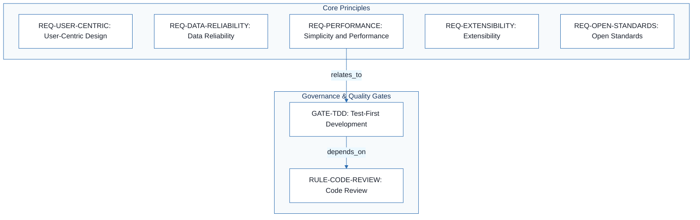
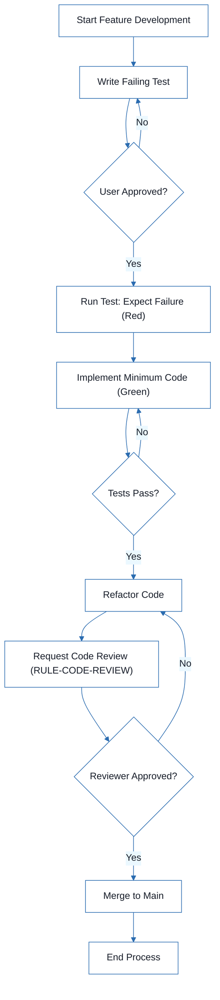

# Football Match Manager - Technical Specification & Architecture Document

## 1. Executive Summary & Architecture Overview

### 1.1 Executive Brief
Football Match Manager is a sports data application focused on delivering high-reliability match information to football fans. The system is governed by a strict TDD-driven development lifecycle and a commitment to open standards to ensure extensibility and performance. It operates as a lightweight platform prioritizing intuitive user experience and data accuracy from external providers.

### 1.2 Maturity Assessment
The project is currently in a REFINEMENT state. While the core development philosophy and testing gates are well-defined, there is a critical structural gap regarding Coding Standards & Style, which prevents a consistent implementation baseline. The absence of a defined style guide and linting rules represents a high-severity omission that must be addressed to ensure maintainability.

### 1.3 Technical Stack
*   **Languages & Frameworks**: Not specified in source data.
*   **Databases**: Not specified in source data.
*   **SDKs/Tools**: Not specified in source data.

### 1.4 Architectural Constraints
*   **Mandatory TDD cycle**: Tests written $\rightarrow$ User approved $\rightarrow$ Tests fail $\rightarrow$ Implementation.
*   **Strict enforcement of Red-Green-Refactor cycle**.
*   **Minimum of 1 peer review** required for all code changes prior to merging.
*   **Adherence to open standards** for technology selection.

### 1.5 Critical Dependencies
*   Reliable external match data providers for data accuracy.
*   Sequential dependency: TDD gate completion must precede the Code Review workflow.
*   Documentation and migration plan requirement for any constitution amendments affecting existing data.

## 2. Architecture Workflows



```mermaid
%%{init: {
  'theme': 'base',
  'themeVariables': {
    'primaryColor': '#1A365D',
    'primaryTextColor': '#1A202C',
    'primaryBorderColor': '#2B6CB0',
    'lineColor': '#2B6CB0',
    'secondaryColor': '#EBF8FF',
    'tertiaryColor': '#EBF8FF',
    'background': '#FFFFFF',
    'mainBkg': '#FFFFFF',
    'secondBkg': '#EBF8FF',
    'tertiaryBkg': '#F7FAFC',
    'secondaryTextColor': '#4A5568',
    'fontSize': '16px',
    'fontFamily': 'Inter, system-ui, sans-serif',
    'nodePadding': '15px',
    'borderRadius': '8px',
    'edgeLabelBackground': '#EBF8FF',
    'clusterBkg': '#F7FAFC',
    'clusterBorder': '#2B6CB0',
    'defaultLinkColor': '#2B6CB0',
    'titleColor': '#1A365D',
    'actorBorder': '#2B6CB0',
    'actorBkg': '#EBF8FF',
    'actorTextColor': '#1A365D',
    'actorLineColor': '#2B6CB0',
    'signalColor': '#2B6CB0',
    'signalTextColor': '#1A202C',
    'labelBoxBorderColor': '#2B6CB0',
    'labelBoxBkgColor': '#EBF8FF',
    'labelTextColor': '#1A202C',
    'loopTextColor': '#1A202C',
    'arrowHeadColor': '#2B6CB0',
    'sequenceNumberColor': '#1A365D',
    'sequenceActorBorder': '#2B6CB0',
    'sequenceActorBkg': '#EBF8FF',
    'sequenceArrowColor': '#2B6CB0',
    'noteBkgColor': '#FFF5EB',
    'noteBorderColor': '#DD6B20',
    'noteTextColor': '#1A202C'
  }
}}%%
flowchart TD
    START["Start Feature Development"] --> WRITE_TEST["Write Failing Test"]
    WRITE_TEST --> USER_APP{"User Approved?"}
    USER_APP -- "No" --> WRITE_TEST
    USER_APP -- "Yes" --> RUN_TEST["Run Test: Expect Failure (Red)"]
    RUN_TEST --> IMPLEMENT["Implement Minimum Code (Green)"]
    IMPLEMENT --> VERIFY{"Tests Pass?"}
    VERIFY -- "No" --> IMPLEMENT
    VERIFY -- "Yes" --> REFACTOR["Refactor Code"]
    REFACTOR --> REVIEW_REQ["Request Code Review (RULE-CODE-REVIEW)"]
    REVIEW_REQ --> REVIEW_DEC{"Reviewer Approved?"}
    REVIEW_DEC -- "No" --> REFACTOR
    REVIEW_DEC -- "Yes" --> MERGE["Merge to Main"]
    MERGE --> END["End Process"]
``` & Visual Diagrams

### 2.1 Requirements Traceability Map
Maps the core architectural requirements and their relationships to the development gates and constraints.

```mermaid
%%{init: {
  'theme': 'base',
  'themeVariables': {
    'primaryColor': '#1A365D',
    'primaryTextColor': '#1A202C',
    'primaryBorderColor': '#2B6CB0',
    'lineColor': '#2B6CB0',
    'secondaryColor': '#EBF8FF',
    'tertiaryColor': '#EBF8FF',
    'background': '#FFFFFF',
    'mainBkg': '#FFFFFF',
    'secondBkg': '#EBF8FF',
    'tertiaryBkg': '#F7FAFC',
    'secondaryTextColor': '#4A5568',
    'fontSize': '16px',
    'fontFamily': 'Inter, system-ui, sans-serif',
    'nodePadding': '15px',
    'borderRadius': '8px',
    'edgeLabelBackground': '#EBF8FF',
    'clusterBkg': '#F7FAFC',
    'clusterBorder': '#2B6CB0',
    'defaultLinkColor': '#2B6CB0',
    'titleColor': '#1A365D',
    'actorBorder': '#2B6CB0',
    'actorBkg': '#EBF8FF',
    'actorTextColor': '#1A365D',
    'actorLineColor': '#2B6CB0',
    'signalColor': '#2B6CB0',
    'signalTextColor': '#1A202C',
    'labelBoxBorderColor': '#2B6CB0',
    'labelBoxBkgColor': '#EBF8FF',
    'labelTextColor': '#1A202C',
    'loopTextColor': '#1A202C',
    'arrowHeadColor': '#2B6CB0',
    'sequenceNumberColor': '#1A365D',
    'sequenceActorBorder': '#2B6CB0',
    'sequenceActorBkg': '#EBF8FF',
    'sequenceArrowColor': '#2B6CB0',
    'noteBkgColor': '#FFF5EB',
    'noteBorderColor': '#DD6B20',
    'noteTextColor': '#1A202C'
  }
}}%%
flowchart TD
    subgraph "Core Principles"
        REQ-USER-CENTRIC["REQ-USER-CENTRIC: User-Centric Design"]
        REQ-DATA-RELIABILITY["REQ-DATA-RELIABILITY: Data Reliability"]
        REQ-PERFORMANCE["REQ-PERFORMANCE: Simplicity and Performance"]
        REQ-EXTENSIBILITY["REQ-EXTENSIBILITY: Extensibility"]
        REQ-OPEN-STANDARDS["REQ-OPEN-STANDARDS: Open Standards"]
    end
    subgraph "Governance & Quality Gates"
        GATE-TDD["GATE-TDD: Test-First Development"]
        RULE-CODE-REVIEW["RULE-CODE-REVIEW: Code Review"]
    end
    REQ-PERFORMANCE -->|"relates_to"| GATE-TDD
    GATE-TDD -->|"depends_on"| RULE-CODE-REVIEW
```

### 2.2 TDD & Code Review Workflow
Detailed operational workflow for the Red-Green-Refactor cycle and the mandatory code review process.



## 3. Detailed Technical Specifications & Business Rules

### 3.1 Requirements Traceability

| Identifier | Type | Description | Source Section |
| :--- | :--- | :--- | :--- |
| REQ-USER-CENTRIC | Requirement | Every feature must prioritize the user's experience and needs, ensuring that the app is intuitive and valuable for football fans. | I. User-Centric Design |
| REQ-DATA-RELIABILITY | Requirement | Match data must be accurate and up-to-date, sourced from reliable providers. | II. Data Reliability |
| REQ-PERFORMANCE | Requirement | The application should be fast and lightweight, avoiding unnecessary complexity. | III. Simplicity and Performance |
| REQ-EXTENSIBILITY | Requirement | The system should be designed to allow for easy addition of new features and leagues. | IV. Extensibility |
| REQ-OPEN-STANDARDS | Requirement | Use open standards and technologies where possible to ensure longevity and flexibility. | V. Open Standards |
| GATE-TDD | Testing Gate | TDD mandatory: Tests written $\rightarrow$ User approved $\rightarrow$ Tests fail $\rightarrow$ Then implement; Red-Green-Refactor cycle strictly enforced. | VI. Test-First Development |
| RULE-CODE-REVIEW | Workflow Constraint | All code changes must be reviewed by at least one other team member before merging. | VII. Code Review |

### 3.2 Security Rules
No specific security rules were identified in the source data.

### 3.3 Data Models
No specific data models were identified in the source data.

## 4. Project Governance & Structural Gaps

### 4.1 Structural Gaps

| Missing Section | Priority | Remediation Advice |
| :--- | :--- | :--- |
| Coding Standards & Style | HIGH | Define a style guide (e.g., Airbnb, Google) and linting rules to ensure code consistency. |
| Open Questions & Uncertainties | LOW | Create a section to track technical debts or undecided architectural choices. |

### 4.2 Remediation & Workflow
The project follows a strict governance model where the constitution supersedes all other practices. Any amendments to the core principles require formal documentation, approval, and a migration plan if existing data is affected.

## 5. Technical & Domain Glossary (Terminology Reference)

| Term | Category | Context Anchor | Project Definition |
| :--- | :--- | :--- | :--- |
| TDD | TECHNICAL_STACK | GATE-TDD | A mandatory engineering discipline requiring verification scripts to be authored and validated by the end-user before any functional logic is produced, following a strict Red-Green-Refactor sequence. |