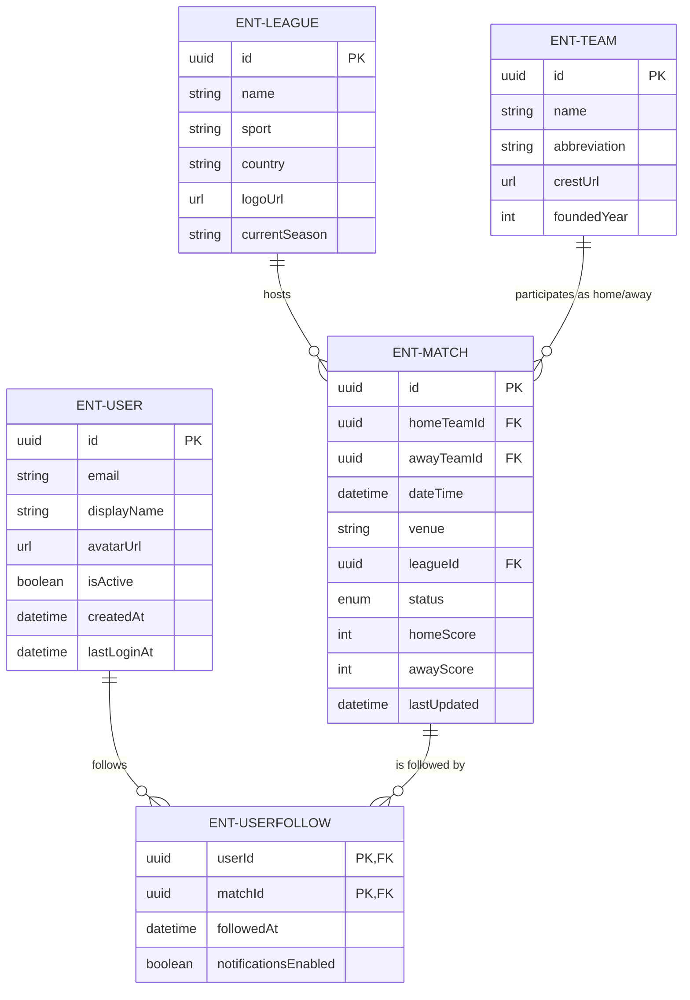
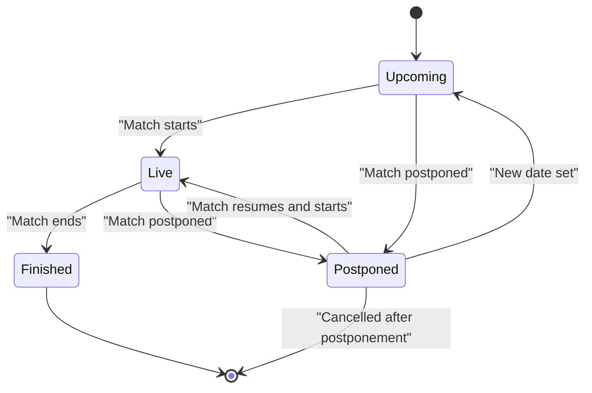
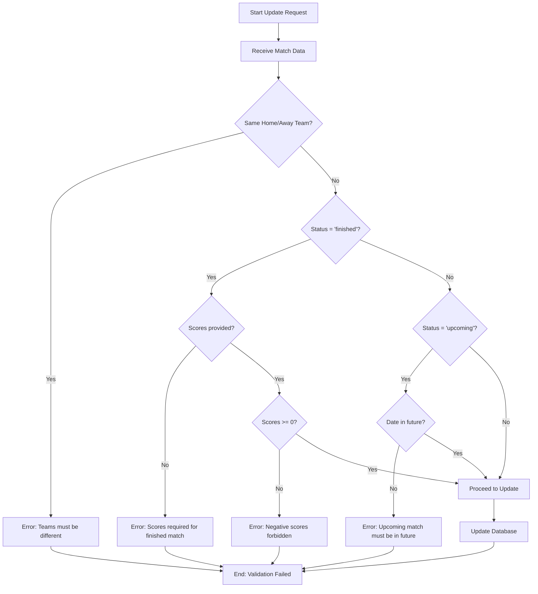

# Football Match Manager - Technical Specification & Architecture Document

## 1. Executive Summary & Architecture Overview

### 1.1 Executive Brief
Football Match Manager is a technical data model designed to manage the lifecycle of football competitions, focusing on the relational mapping between Leagues, Teams, Matches, and Users. The system implements a specific tracking pattern for match statuses and user-based match following, operating as a structured backend specification for sports data management.

### 1.2 Maturity Assessment
The project is currently in **REFINEMENT** status. While the data model is structurally complete in terms of entity mapping, the specifications lack a strategic framework (Goals, Scope) and contain unresolved technical uncertainties regarding password complexity and the precise scope of team name uniqueness.

### 1.3 Technical Stack
*   **Primary Identifiers**: UUID (128-bit)
*   **Temporal Standard**: UTC
*   **Data Types**: DateTime, Enum, Boolean, Integer, String, URL

### 1.4 Architectural Constraints
*   **Entity Integrity**: Match `homeTeamId` must not equal `awayTeamId`.
*   **Temporal Logic**: Match `dateTime` must be in the future if status is 'upcoming'.
*   **State-Based Requirements**: Match `homeScore` and `awayScore` must be non-null when status is 'finished'.
*   **Value Constraints**: Scores must be >= 0; Team `foundedYear` must be between 1800 and the current year.
*   **Uniqueness**: Team name must be globally unique; User email must be unique.
*   **Relational Constraints**: `UserFollow` must maintain a composite unique constraint on (`userId`, `matchId`).
*   **State Machine**: Match state transition flow: Upcoming $\rightarrow$ Live $\rightarrow$ Finished; Upcoming/Live $\rightarrow$ Postponed; Postponed $\rightarrow$ Live/Upcoming.
*   **Character Limits**: Team name (100), Team abbreviation (5), Venue (200), User displayName (50), League name (100), League country (100).

### 1.5 Critical Dependencies
*   **Foreign Key Dependencies**: 
    *   `Match` $\rightarrow$ `League`, `Team`
    *   `UserFollow` $\rightarrow$ `User`, `Match`
*   **Performance Indexes**:
    *   `Match`: (`leagueId`, `dateTime`) and (`status`)
    *   `Team`: (`name`)
    *   `User`: (`email`)
    *   `UserFollow`: (`userId`) and (`matchId`)

## 2. Architecture Workflows & Visual Diagrams

### 2.1 Entity Relationship Diagram

### 2.2 Match State Lifecycle

### 2.3 Requirements Traceability Matrix

```mermaid
flowchart TD
    subgraph Validation_Rules [Validation Rules]
        RULE-MATCH-TEAM-UNIQ["RULE-MATCH-TEAM-UNIQ: No same team home/away"]
        RULE-MATCH-DATE-FUTURE["RULE-MATCH-DATE-FUTURE: Upcoming date in future"]
        RULE-MATCH-FINISH-SCORE["RULE-MATCH-FINISH-SCORE: Scores required if finished"]
        RULE-SCORE-NONNEG["RULE-SCORE-NONNEG: No negative scores"]
        RULE-TEAM-NAME-UNIQ["RULE-TEAM-NAME-UNIQ: Global team name unique"]
        RULE-USER-EMAIL-UNIQ["RULE-USER-EMAIL-UNIQ: Unique email"]
        RULE-FOLLOW-UNIQ["RULE-FOLLOW-UNIQ: User follows match once"]
        RULE-MATCH-STATE["RULE-MATCH-STATE: Valid state transitions"]
    end

    subgraph Performance_NFRs [Performance Requirements]
        NFR-INDEX-MATCH["NFR-INDEX-MATCH: League/Date/Status Index"]
        NFR-INDEX-TEAM["NFR-INDEX-TEAM: Name Index"]
        NFR-INDEX-USER["NFR-INDEX-USER: Email Index"]
        NFR-INDEX-FOLLOW["NFR-INDEX-FOLLOW: User/Match Index"]
    end

    subgraph Entities [Data Entities]
        ENT-MATCH["ENT-MATCH: Match Entity"]
        ENT-TEAM["ENT-TEAM: Team Entity"]
        ENT-USER["ENT-USER: User Entity"]
        ENT-USERFOLLOW["ENT-USERFOLLOW: UserFollow Entity"]
    end

    RULE-MATCH-TEAM-UNIQ -->|implements| ENT-MATCH
    RULE-MATCH-DATE-FUTURE -->|implements| ENT-MATCH
    RULE-MATCH-FINISH-SCORE -->|implements| ENT-MATCH
    RULE-SCORE-NONNEG -->|implements| ENT-MATCH
    RULE-MATCH-STATE -->|implements| ENT-MATCH
    RULE-TEAM-NAME-UNIQ -->|implements| ENT-TEAM
    RULE-USER-EMAIL-UNIQ -->|implements| ENT-USER
    RULE-FOLLOW-UNIQ -->|implements| ENT-USERFOLLOW

    NFR-INDEX-MATCH -->|relates_to| ENT-MATCH
    NFR-INDEX-TEAM -->|relates_to| ENT-TEAM
    NFR-INDEX-USER -->|relates_to| ENT-USER
    NFR-INDEX-FOLLOW -->|relates_to| ENT-USERFOLLOW
```

### 2.4 Match Update Validation Workflow

## 3. Detailed Technical Specifications & Business Rules

### 3.1 Requirements Traceability
| Identifier | Requirement Type | Description | Target Entity |
| :--- | :--- | :--- | :--- |
| ENT-MATCH | Entity | Football match entity containing schedule, score and status. | N/A |
| ENT-TEAM | Entity | Football team entity containing identity and basic club info. | N/A |
| ENT-LEAGUE | Entity | Football league or tournament entity. | N/A |
| ENT-USER | Entity | Application user entity for authentication and personalization. | N/A |
| ENT-USERFOLLOW | Entity | Association entity between Users and Matches they follow. | N/A |
| RULE-MATCH-TEAM-UNIQ | Functional | A match cannot have the same team as both home and away. | ENT-MATCH |
| RULE-MATCH-DATE-FUTURE | Functional | Match dateTime must be in the future for status 'upcoming'. | ENT-MATCH |
| RULE-MATCH-FINISH-SCORE | Functional | When status changes to 'finished', both homeScore and awayScore must be set (non-null). | ENT-MATCH |
| RULE-SCORE-NONNEG | Constraint | Scores cannot be negative. | ENT-MATCH |
| RULE-TEAM-NAME-UNIQ | Functional | Team name must be globally unique. | ENT-TEAM |
| RULE-USER-EMAIL-UNIQ | Functional | Email must be unique. | ENT-USER |
| RULE-FOLLOW-UNIQ | Constraint | A user can only follow a match once (Composite unique on userId, matchId). | ENT-USERFOLLOW |
| RULE-MATCH-STATE | Functional | Match state transitions: Upcoming $\rightarrow$ Live $\rightarrow$ Finished; Upcoming/Live $\rightarrow$ Postponed; Postponed $\rightarrow$ Live/Upcoming. | ENT-MATCH |
| NFR-INDEX-MATCH | Non-Functional | Indexes on (leagueId, dateTime) and (status) for Match performance. | ENT-MATCH |
| NFR-INDEX-TEAM | Non-Functional | Index on (name) for Team search. | ENT-TEAM |
| NFR-INDEX-USER | Non-Functional | Index on (email) for User authentication. | ENT-USER |
| NFR-INDEX-FOLLOW | Non-Functional | Indexes on (userId) and (matchId) for UserFollow retrieval. | ENT-USERFOLLOW |

### 3.2 Security Rules
*   **Authentication**: User email must be unique (`RULE-USER-EMAIL-UNIQ`).
*   **Credential Policy**: Passwords must meet complexity requirements (minimum 8 characters), though specific detailed requirements are currently listed as an open question.
*   **Account Status**: User activity is tracked via the `isActive` boolean flag.

### 3.3 Data Models

#### ENT-MATCH
| Field | Type | Description | Validation |
| :--- | :--- | :--- | :--- |
| id | UUID | Unique identifier | Required, unique |
| homeTeamId | UUID | Reference to Team | Required, exists |
| awayTeamId | UUID | Reference to Team | Required, exists, $\neq$ homeTeamId |
| dateTime | DateTime | Match date and time (UTC) | Required, future if 'upcoming' |
| venue | String (200) | Stadium or location name | Optional |
| leagueId | UUID | Reference to League | Required, exists |
| status | Enum | upcoming, live, finished, postponed, cancelled | Required, default: upcoming |
| homeScore | Integer | Goals scored by home team | Optional, min 0, default null |
| awayScore | Integer | Goals scored by away team | Optional, min 0, default null |
| lastUpdated | DateTime | Timestamp of last update | Auto-set on update |

#### ENT-TEAM
| Field | Type | Description | Validation |
| :--- | :--- | :--- | :--- |
| id | UUID | Unique identifier | Required, unique |
| name | String (100) | Team name | Required, globally unique |
| abbreviation | String (5) | Team abbreviation | Optional, unique per league |
| crestUrl | URL | URL to team crest/logo | Optional, valid URL |
| foundedYear | Integer | Year the club was founded | Optional, 1800 $\le$ year $\le$ current |

#### ENT-LEAGUE
| Field | Type | Description | Validation |
| :--- | :--- | :--- | :--- |
| id | UUID | Unique identifier | Required, unique |
| name | String (100) | League name | Required |
| sport | String | Sport type | Required, default: "football" |
| country | String (100) | Country where league is based | Optional |
| logoUrl | URL | URL to league logo | Optional, valid URL |
| currentSeason | String | Current season identifier | Optional |

#### ENT-USER
| Field | Type | Description | Validation |
| :--- | :--- | :--- | :--- |
| id | UUID | Unique identifier | Required, unique |
| email | String (email) | User email address | Required, unique, valid format |
| displayName | String (50) | Display name for the user | Required |
| avatarUrl | URL | URL to user avatar/image | Optional, valid URL |
| isActive | Boolean | Whether the user account is active | Required, default: true |
| createdAt | DateTime | Account creation timestamp | Auto-set on create |
| lastLoginAt | DateTime | Last login timestamp | Updated on login |

#### ENT-USERFOLLOW
| Field | Type | Description | Validation |
| :--- | :--- | :--- | :--- |
| userId | UUID | Reference to User | Required, exists |
| matchId | UUID | Reference to Match | Required, exists |
| followedAt | DateTime | Timestamp of following | Required, auto-set on create |
| notificationsEnabled | Boolean | Notification preference | Optional, default: false |

## 4. Project Governance & Structural Gaps

### 4.1 Structural Gaps
| Missing Section | Priority | Remediation Advice |
| :--- | :--- | :--- |
| Goals & Objectives | HIGH | Add a section describing the purpose of the football match manager and its primary goals. |
| Scope & Out-of-Scope | MEDIUM | Define what the system will and will not do (e.g., no real-time betting, no complex player stats). |
| Open Questions & Uncertainties | LOW | Document any undecided parts of the data model, like the specific password complexity requirements. |

### 4.2 Remediation & Workflow
1.  **Immediate Action**: Define the "Goals & Objectives" to align technical implementation with business value.
2.  **Refinement**: Resolve the open question regarding whether team name uniqueness is global or per-league.
3.  **Specification**: Formalize the password complexity requirements to complete the `ENT-USER` security profile.

## 5. Technical & Domain Glossary (Terminology Reference)

| Term | Category | Context Anchor | Project Definition |
| :--- | :--- | :--- | :--- |
| Constraints | TECHNICAL_STACK | RULE-FOLLOW-UNIQ | Persistence layer rules enforcing data integrity, specifically including multi-column uniqueness requirements. |
| Cryptographic Hashing | TECHNICAL_STACK | RULE-USER-EMAIL-UNIQ | One-way transformation process required for securing stored credentials as implied by the password complexity mandate. |
| DateTime | TECHNICAL_STACK | ENT-MATCH | Temporal data primitive used for scheduling events and recording system-generated timestamps. |
| MUN | BUSINESS_DOMAIN | ENT-TEAM | An example of a short-form identifier for a sports club used to demonstrate the five-character limit. |
| Match Validation | BUSINESS_DOMAIN | Validation Rules | Logical checks ensuring no team plays itself, dates are chronologically correct for upcoming states, and scores are provided upon completion. |
| Relationships | BUSINESS_DOMAIN | ENT-MATCH | Structural associations between entities such as leagues, teams, and users. |
| Team Validation | BUSINESS_DOMAIN | RULE-TEAM-NAME-UNIQ | Enforcement of a globally distinct identifier for every registered sports organization. |
| UTC | TECHNICAL_STACK | ENT-MATCH | The standardized time reference used to synchronize match schedules across different geographic zones. |
| UUID | TECHNICAL_STACK | ENT-MATCH | 128-bit unique identifier used as the primary key for all main entities to ensure global uniqueness. |
| User Validation | BUSINESS_DOMAIN | RULE-USER-EMAIL-UNIQ | Verification of distinct electronic mail addresses and strict adherence to credential complexity standards. |
| UserFollow | BUSINESS_DOMAIN | ENT-USERFOLLOW | An association entity that maps the interest of an account holder toward a specific athletic event. |
| UserFollow Validation | BUSINESS_DOMAIN | RULE-FOLLOW-UNIQ | The restriction preventing a single account from creating duplicate interest records for the same event. |