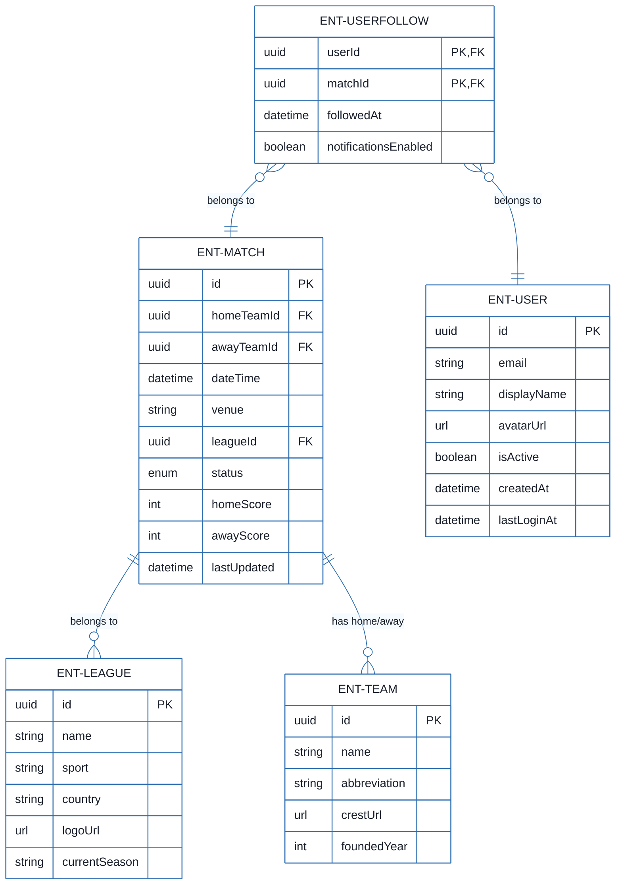
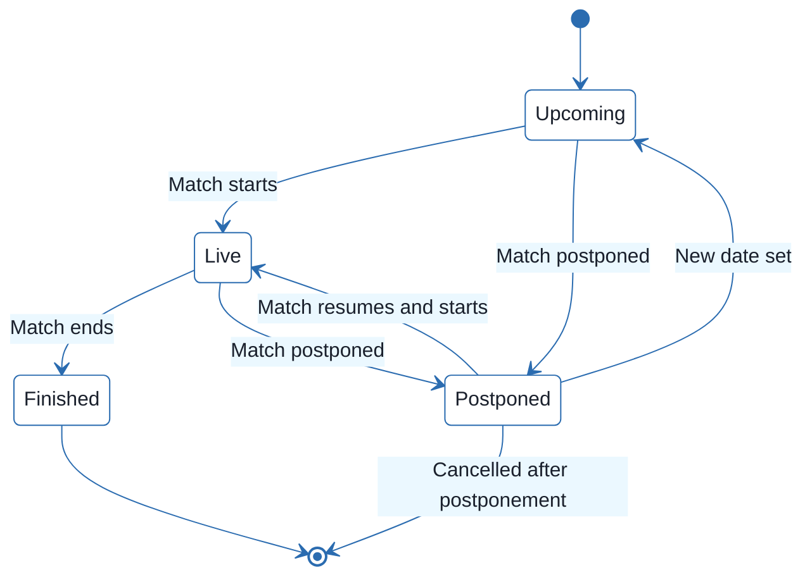
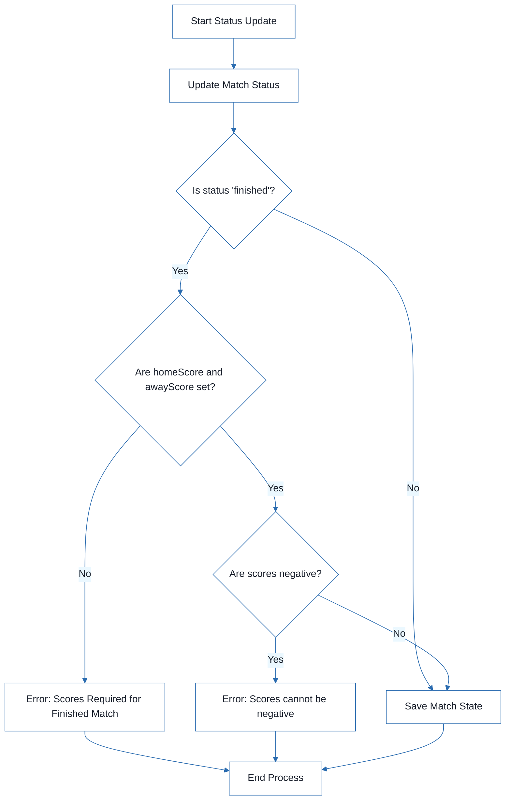

# Football Match Manager - Technical Specification & Architecture Document

## 1. Executive Summary & Architecture Overview

### 1.1 Executive Brief
The Football Match Manager is a data-centric system designed to manage football match lifecycles, team registries, and league structures. It implements a relational pattern to track match states (upcoming to finished), score validations, and user-match following relationships. The system focuses on strict data integrity and optimized query performance through specific indexing strategies for match filtering and user authentication.

### 1.2 Maturity Assessment
The project is currently in **REFINEMENT**. While the data model is structurally complete with a high completeness score, it lacks critical business context. The absence of defined Goals & Objectives and Scope boundaries creates a high-severity gap that prevents full execution readiness, as the functional purpose of the application remains implicit rather than explicit.

### 1.3 Technical Stack
* **Primary Identifiers**: UUID (128-bit)
* **Temporal Standard**: UTC
* **Data Types**: Enum (Match Status), DateTime, URL, Boolean, Integer, String

### 1.4 Architectural Constraints
* **Match Integrity**: `homeTeamId` must not equal `awayTeamId`.
* **Temporal Logic**: Match `dateTime` must be in the future if status is 'upcoming'.
* **State-Based Requirements**: `homeScore` and `awayScore` must be non-null when status is 'finished'.
* **Value Constraints**: `homeScore` and `awayScore` minimum value: 0.
* **Uniqueness**: Team name must be globally unique; User email must be unique.
* **Data Limits**: Team abbreviation max 5 characters (unique per league); Team name max 100 characters; User displayName max 50 characters; Match venue max 200 characters.
* **Relational Constraints**: Composite unique constraint on `UserFollow` (`userId`, `matchId`).
* **Domain Range**: Team `foundedYear` must be between 1800 and the current year.

### 1.5 Critical Dependencies
* **Entity Dependencies**: `Match` entity has strict foreign key dependence on `Team` and `League` entities.
* **Relational Dependencies**: `UserFollow` entity has strict foreign key dependence on `User` and `Match` entities.
* **Performance Dependencies**: 
    * Index on `(leagueId, dateTime)` for Match filtering.
    * Index on `(status)` for Match state filtering.
    * Index on `(email)` for User authentication.
    * Index on `(userId)` and `(matchId)` for UserFollow relational lookups.

## 2. Architecture Workflows

```mermaid
%%{init: {
  'theme': 'base',
  'themeVariables': {
    'primaryColor': '#1A365D',
    'primaryTextColor': '#1A202C',
    'primaryBorderColor': '#2B6CB0',
    'lineColor': '#2B6CB0',
    'secondaryColor': '#EBF8FF',
    'tertiaryColor': '#EBF8FF',
    'background': '#FFFFFF',
    'mainBkg': '#FFFFFF',
    'secondBkg': '#EBF8FF',
    'tertiaryBkg': '#F7FAFC',
    'secondaryTextColor': '#4A5568',
    'fontSize': '16px',
    'fontFamily': 'Inter, system-ui, sans-serif',
    'nodePadding': '15px',
    'borderRadius': '8px',
    'edgeLabelBackground': '#EBF8FF',
    'clusterBkg': '#F7FAFC',
    'clusterBorder': '#2B6CB0',
    'defaultLinkColor': '#2B6CB0',
    'titleColor': '#1A365D',
    'actorBorder': '#2B6CB0',
    'actorBkg': '#EBF8FF',
    'actorTextColor': '#1A365D',
    'actorLineColor': '#2B6CB0',
    'signalColor': '#2B6CB0',
    'signalTextColor': '#1A202C',
    'labelBoxBorderColor': '#2B6CB0',
    'labelBoxBkgColor': '#EBF8FF',
    'labelTextColor': '#1A202C',
    'loopTextColor': '#1A202C',
    'arrowHeadColor': '#2B6CB0',
    'sequenceNumberColor': '#1A365D',
    'sequenceActorBorder': '#2B6CB0',
    'sequenceActorBkg': '#EBF8FF',
    'sequenceArrowColor': '#2B6CB0',
    'noteBkgColor': '#FFF5EB',
    'noteBorderColor': '#DD6B20',
    'noteTextColor': '#1A202C'
  }
}}%%
flowchart TD
    subgraph "Validation Rules"
        RULE-MATCH-TEAMS["RULE-MATCH-TEAMS: Unique Teams"]
        RULE-MATCH-DATE["RULE-MATCH-DATE: Future Date"]
        RULE-MATCH-FINISHED["RULE-MATCH-FINISHED: Score Required"]
        RULE-MATCH-SCORE["RULE-MATCH-SCORE: Non-negative"]
        RULE-TEAM-UNIQUE["RULE-TEAM-UNIQUE: Unique Team Name"]
        RULE-USER-EMAIL["RULE-USER-EMAIL: Unique Email"]
        RULE-FOLLOW-UNIQUE["RULE-FOLLOW-UNIQUE: Unique Follow Pair"]
    end
    subgraph "Performance Requirements"
        NFR-INDEX-MATCH["NFR-INDEX-MATCH: Match Filtering Index"]
    end
    subgraph "Data Entities"
        ENT-MATCH["ENT-MATCH: Match Entity"]
        ENT-TEAM["ENT-TEAM: Team Entity"]
        ENT-USER["ENT-USER: User Entity"]
        ENT-USERFOLLOW["ENT-USERFOLLOW: Follow Entity"]
    end
    RULE-MATCH-TEAMS -->|"relates_to"| ENT-MATCH
    RULE-MATCH-DATE -->|"relates_to"| ENT-MATCH
    RULE-MATCH-FINISHED -->|"relates_to"| ENT-MATCH
    RULE-MATCH-SCORE -->|"relates_to"| ENT-MATCH
    NFR-INDEX-MATCH -->|"relates_to"| ENT-MATCH
    RULE-TEAM-UNIQUE -->|"relates_to"| ENT-TEAM
    RULE-USER-EMAIL -->|"relates_to"| ENT-USER
    RULE-FOLLOW-UNIQUE -->|"relates_to"| ENT-USERFOLLOW
```







```mermaid
%%{init: {
  'theme': 'base',
  'themeVariables': {
    'primaryColor': '#1A365D',
    'primaryTextColor': '#1A202C',
    'primaryBorderColor': '#2B6CB0',
    'lineColor': '#2B6CB0',
    'secondaryColor': '#EBF8FF',
    'tertiaryColor': '#EBF8FF',
    'background': '#FFFFFF',
    'mainBkg': '#FFFFFF',
    'secondBkg': '#EBF8FF',
    'tertiaryBkg': '#F7FAFC',
    'secondaryTextColor': '#4A5568',
    'fontSize': '16px',
    'fontFamily': 'Inter, system-ui, sans-serif',
    'nodePadding': '15px',
    'borderRadius': '8px',
    'edgeLabelBackground': '#EBF8FF',
    'clusterBkg': '#F7FAFC',
    'clusterBorder': '#2B6CB0',
    'defaultLinkColor': '#2B6CB0',
    'titleColor': '#1A365D',
    'actorBorder': '#2B6CB0',
    'actorBkg': '#EBF8FF',
    'actorTextColor': '#1A365D',
    'actorLineColor': '#2B6CB0',
    'signalColor': '#2B6CB0',
    'signalTextColor': '#1A202C',
    'labelBoxBorderColor': '#2B6CB0',
    'labelBoxBkgColor': '#EBF8FF',
    'labelTextColor': '#1A202C',
    'loopTextColor': '#1A202C',
    'arrowHeadColor': '#2B6CB0',
    'sequenceNumberColor': '#1A365D',
    'sequenceActorBorder': '#2B6CB0',
    'sequenceActorBkg': '#EBF8FF',
    'sequenceArrowColor': '#2B6CB0',
    'noteBkgColor': '#FFF5EB',
    'noteBorderColor': '#DD6B20',
    'noteTextColor': '#1A202C'
  }
}}%%
flowchart TD
    START["Start Status Update"] --> UPDATE_STATUS["Update Match Status"]
    UPDATE_STATUS --> CHECK_FINISHED{"Is status 'finished'?"}
    CHECK_FINISHED -- "No" --> SAVE_MATCH["Save Match State"]
    CHECK_FINISHED -- "Yes" --> VAL_SCORES{"Are homeScore and awayScore set?"}
    VAL_SCORES -- "No" --> ERR_SCORE["Error: Scores Required for Finished Match"]
    VAL_SCORES -- "Yes" --> VAL_NEGATIVE{"Are scores negative?"}
    VAL_NEGATIVE -- "Yes" --> ERR_NEG["Error: Scores cannot be negative"]
    VAL_NEGATIVE -- "No" --> SAVE_MATCH
    ERR_SCORE --> END["End Process"]
    ERR_NEG --> END
    SAVE_MATCH --> END
``` & Visual Diagrams

### 2.1 Data Model (ERD)
```mermaid
%%{init: {
  'theme': 'base',
  'themeVariables': {
    'primaryColor': '#1A365D',
    'primaryTextColor': '#1A202C',
    'primaryBorderColor': '#2B6CB0',
    'lineColor': '#2B6CB0',
    'secondaryColor': '#EBF8FF',
    'tertiaryColor': '#EBF8FF',
    'background': '#FFFFFF',
    'mainBkg': '#FFFFFF',
    'secondBkg': '#EBF8FF',
    'tertiaryBkg': '#F7FAFC',
    'secondaryTextColor': '#4A5568',
    'fontSize': '16px',
    'fontFamily': 'Inter, system-ui, sans-serif',
    'nodePadding': '15px',
    'borderRadius': '8px',
    'edgeLabelBackground': '#EBF8FF',
    'clusterBkg': '#F7FAFC',
    'clusterBorder': '#2B6CB0',
    'defaultLinkColor': '#2B6CB0',
    'titleColor': '#1A365D',
    'actorBorder': '#2B6CB0',
    'actorBkg': '#EBF8FF',
    'actorTextColor': '#1A365D',
    'actorLineColor': '#2B6CB0',
    'signalColor': '#2B6CB0',
    'signalTextColor': '#1A202C',
    'labelBoxBorderColor': '#2B6CB0',
    'labelBoxBkgColor': '#EBF8FF',
    'labelTextColor': '#1A202C',
    'loopTextColor': '#1A202C',
    'arrowHeadColor': '#2B6CB0',
    'sequenceNumberColor': '#1A365D',
    'sequenceActorBorder': '#2B6CB0',
    'sequenceActorBkg': '#EBF8FF',
    'sequenceArrowColor': '#2B6CB0',
    'noteBkgColor': '#FFF5EB',
    'noteBorderColor': '#DD6B20',
    'noteTextColor': '#1A202C'
  }
}}%%
erDiagram
    ENT-MATCH ||--o{ ENT-LEAGUE : "belongs to"
    ENT-MATCH ||--o{ ENT-TEAM : "has home/away"
    ENT-USERFOLLOW }o--|| ENT-USER : "belongs to"
    ENT-USERFOLLOW }o--|| ENT-MATCH : "belongs to"
    ENT-MATCH {
        uuid id PK
        uuid homeTeamId FK
        uuid awayTeamId FK
        datetime dateTime
        string venue
        uuid leagueId FK
        enum status
        int homeScore
        int awayScore
        datetime lastUpdated
    }
    ENT-TEAM {
        uuid id PK
        string name
        string abbreviation
        url crestUrl
        int foundedYear
    }
    ENT-LEAGUE {
        uuid id PK
        string name
        string sport
        string country
        url logoUrl
        string currentSeason
    }
    ENT-USER {
        uuid id PK
        string email
        string displayName
        url avatarUrl
        boolean isActive
        datetime createdAt
        datetime lastLoginAt
    }
    ENT-USERFOLLOW {
        uuid userId PK, FK
        uuid matchId PK, FK
        datetime followedAt
        boolean notificationsEnabled
    }
```

### 2.2 Match State Lifecycle


### 2.3 Data Validation & Constraint Traceability


### 2.4 Match Status Update Workflow


## 3. Detailed Technical Specifications & Business Rules

### 3.1 Requirements Traceability
| ID | Type | Description | Source Section |
|:---|:---|:---|:---|
| ENT-MATCH | Entity | Represents a football match with details on teams, date, venue, league, status and scores. | Match |
| ENT-TEAM | Entity | Represents a football team including name, abbreviation, crest and foundation year. | Team |
| ENT-LEAGUE | Entity | Represents a football league or tournament. | League |
| ENT-USER | Entity | Represents an application user with email and profile information. | User |
| ENT-USERFOLLOW | Entity | Represents the relationship between a User and a Match they are following. | UserFollow |
| RULE-MATCH-TEAMS | Constraint | A match cannot have the same team as both home and away. | Validation Rules |
| RULE-MATCH-DATE | Constraint | Match dateTime must be in the future for status 'upcoming'. | Validation Rules |
| RULE-MATCH-FINISHED | Constraint | When status changes to 'finished', both homeScore and awayScore must be set (non-null). | Validation Rules |
| RULE-MATCH-SCORE | Constraint | Scores cannot be negative. | Validation Rules |
| RULE-TEAM-UNIQUE | Constraint | Team name must be unique across all teams. | Validation Rules |
| RULE-USER-EMAIL | Constraint | Email must be unique. | Validation Rules |
| RULE-FOLLOW-UNIQUE | Constraint | A user can only follow a match once (Composite unique constraint on userId, matchId). | Validation Rules |
| NFR-INDEX-MATCH | NFR | Indexes on (leagueId, dateTime) and (status) for Match filtering performance. | Indexes (for performance) |

### 3.2 Security Rules
* **Authentication**: User email must be unique and follow a valid email format (`RULE-USER-EMAIL`).
* **Credential Safety**: Passwords (where applicable) must meet complexity requirements (min 8 characters).
* **Account State**: User accounts are managed via an `isActive` boolean flag.

### 3.3 Data Models

#### ENT-MATCH
| Field | Type | Description | Validation |
|:---|:---|:---|:---|
| id | UUID | Unique identifier | Required, unique |
| homeTeamId | UUID | Reference to Team | Required, exists |
| awayTeamId | UUID | Reference to Team | Required, exists, != homeTeamId |
| dateTime | DateTime | Match date and time (UTC) | Required, future if 'upcoming' |
| venue | String | Stadium or location name | Optional, max 200 |
| leagueId | UUID | Reference to League | Required, exists |
| status | Enum | upcoming, live, finished, postponed, cancelled | Required, default: upcoming |
| homeScore | Integer | Goals scored by home team | Optional, min 0, default null |
| awayScore | Integer | Goals scored by away team | Optional, min 0, default null |
| lastUpdated | DateTime | Timestamp of last update | Auto-set on update |

#### ENT-TEAM
| Field | Type | Description | Validation |
|:---|:---|:---|:---|
| id | UUID | Unique identifier | Required, unique |
| name | String | Team name | Required, max 100, unique |
| abbreviation | String | Team abbreviation | Optional, max 5, unique per league |
| crestUrl | URL | URL to team crest/logo | Optional, valid URL |
| foundedYear | Integer | Year the club was founded | Optional, 1800 to current year |

#### ENT-LEAGUE
| Field | Type | Description | Validation |
|:---|:---|:---|:---|
| id | UUID | Unique identifier | Required, unique |
| name | String | League name | Required, max 100 |
| sport | String | Sport type | Required, default: "football" |
| country | String | Country where league is based | Optional, max 100 |
| logoUrl | URL | URL to league logo | Optional, valid URL |
| currentSeason | String | Current season identifier | Optional (e.g., "2023/24") |

#### ENT-USER
| Field | Type | Description | Validation |
|:---|:---|:---|:---|
| id | UUID | Unique identifier | Required, unique |
| email | String | User email address | Required, unique, valid email |
| displayName | String | Display name for the user | Required, max 50 |
| avatarUrl | URL | URL to user avatar/image | Optional, valid URL |
| isActive | Boolean | Whether the user account is active | Required, default: true |
| createdAt | DateTime | Account creation timestamp | Auto-set on create |
| lastLoginAt | DateTime | Last login timestamp | Updated on login |

#### ENT-USERFOLLOW
| Field | Type | Description | Validation |
|:---|:---|:---|:---|
| userId | UUID | Reference to User | Required, exists |
| matchId | UUID | Reference to Match | Required, exists |
| followedAt | DateTime | Timestamp of following | Required, auto-set on create |
| notificationsEnabled | Boolean | Notification preference | Optional, default: false |

## 4. Project Governance & Structural Gaps

### 4.1 Structural Gaps
| Missing Section | Priority | Remediation Advice |
|:---|:---|:---|
| Goals & Objectives | HIGH | Define the business goals and the purpose of the Football Match Manager application. |
| Scope & Out-of-Scope | MEDIUM | Clarify what the system will and will not handle (e.g., player stats, ticket sales). |
| Open Questions & Uncertainties | LOW | List any unresolved technical or business decisions. |

### 4.2 Remediation & Workflow
The project must transition from the **REFINEMENT** phase to **EXECUTION** by addressing the high-priority gaps. The primary focus should be the definition of the business purpose to ensure the data model aligns with the intended user experience and operational goals.

## 5. Technical & Domain Glossary (Terminology Reference)

| Term | Category | Context Anchor | Project Definition |
|:---|:---|:---|:---|
| Constraints | TECHNICAL_STACK | ENT-USERFOLLOW | The set of structural limitations, such as composite uniqueness on user and match identifiers, ensuring data integrity. |
| Cryptographic Hashing | TECHNICAL_STACK | RULE-USER-EMAIL | The required security mechanism for storing sensitive authentication credentials to meet complexity and safety standards. |
| DateTime | TECHNICAL_STACK | ENT-MATCH | The temporal data type used for scheduling events and recording audit timestamps. |
| MUN | BUSINESS_DOMAIN | ENT-TEAM | An example of a short-form identifier for a sports club, limited to five characters. |
| Match Validation | BUSINESS_DOMAIN | Validation Rules | The logic ensuring that opposing teams are distinct, dates are future-dated for upcoming events, and scores are non-negative. |
| Relationships | TECHNICAL_STACK | ENT-MATCH | The associative links between entities, such as the connection between a game and its participating clubs or league. |
| Team Validation | BUSINESS_DOMAIN | RULE-TEAM-UNIQUE | The requirement that a club's name must be globally unique across the system. |
| UTC | TECHNICAL_STACK | ENT-MATCH | The standardized time zone used for all temporal records to ensure global synchronization. |
| UUID | TECHNICAL_STACK | ENT-MATCH | The 128-bit universally unique identifier used as the primary key for all major entities. |
| User Validation | BUSINESS_DOMAIN | RULE-USER-EMAIL | The set of rules enforcing unique email addresses and minimum character lengths for security credentials. |
| UserFollow | BUSINESS_DOMAIN | ENT-USERFOLLOW | The associative entity linking a person to a specific game they wish to monitor. |
| UserFollow Validation | BUSINESS_DOMAIN | RULE-FOLLOW-UNIQUE | The restriction preventing a single person from monitoring the same game multiple times. |