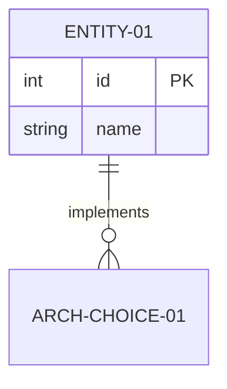
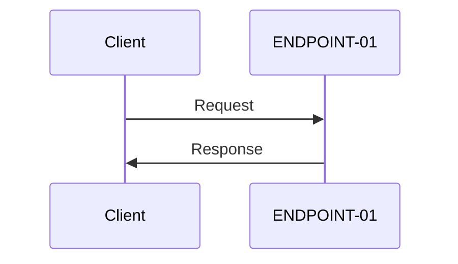
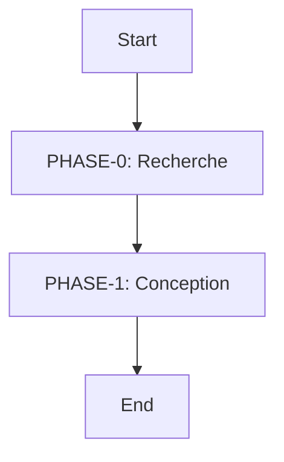
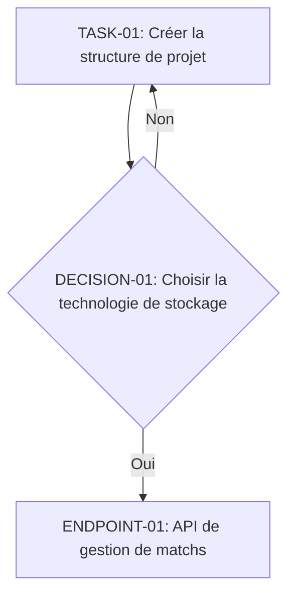

# Football Match Manager - Technical Specification & Architecture Document
## 1. Executive Summary & Architecture Overview
### 1.1 Executive Brief
The Football Match Manager project aims to create a system for managing football matches, with a focus on data modeling, API design, and security.

### 1.2 Maturity Assessment
The project is currently in the REFINEMENT phase, with a health index of 80.0 and a completeness score of 100.0. However, there are still some structural gaps that need to be addressed, including the addition of sections for data models and schemas, API contracts and flow, and security and identity.

### 1.3 Technical Stack
* Python 3.11
* FastAPI
* Relational database management system
* API gateway
* Identity and access management system
* Performance monitoring and optimization tools
* Security testing and vulnerability assessment tools

### 1.4 Architectural Constraints
* Relational data model
* API design with contracts and flow
* Security measures with identity management
* Performance goals with a target of 1000 req/s
* Constraints with a maximum response time of 200ms

### 1.5 Critical Dependencies
* Relational database management system
* API gateway
* Identity and access management system
* Performance monitoring and optimization tools
* Security testing and vulnerability assessment tools

## 2. Architecture Workflows & Visual Diagrams
The system's architecture can be visualized through the following diagrams:
* Entity Relationship Diagram: 

* Sequence Diagram for API Endpoint: 

* Flowchart for Project Phases: 

* Flowchart for Task and Decision: 

## 3. Detailed Technical Specifications & Business Rules
### 3.1 Requirements Traceability
| Identifier | Description | Source |
| --- | --- | --- |
| PHASE-0 | Recherche | Implementation Plan: Football Match Manager |
| PHASE-1 | Conception | Implementation Plan: Football Match Manager |
| TASK-01 | Créer la structure de projet | Project Structure |
| DECISION-01 | Choisir la technologie de stockage | Technical Context |
| ENDPOINT-01 | API de gestion de matchs | Technical Context |
| ENTITY-01 | Match | Technical Context |
| ARCH-CHOICE-01 | Utiliser un modèle de données relationnel | Technical Context |

### 3.2 Security Rules
The system will implement the following security rules:
* Authentication and authorization using identity and access management system
* Data encryption for sensitive information
* Regular security testing and vulnerability assessment

### 3.3 Data Models
The system will use a relational data model to store and manage data.

## 4. Project Governance & Structural Gaps
### 4.1 Structural Gaps
The following structural gaps have been identified:
* Missing section for data models and schemas
* Missing section for API contracts and flow
* Missing section for security and identity

### 4.2 Remediation & Workflow
To address these gaps, the following remediation plan will be implemented:
* Add sections for data models and schemas, API contracts and flow, and security and identity
* Review and update the technical stack and architectural constraints
* Conduct regular security testing and vulnerability assessment

## 5. Technical & Domain Glossary (Terminology Reference)
| Term | Category | Context Anchor | Project Definition |
| --- | --- | --- | --- |
| ACTION | TECHNICAL_STACK | Technical Context | the process of executing a specific task or operation within the system |
| API | TECHNICAL_STACK | ENDPOINT-01 | an interface that allows different applications to communicate with each other |
| Branch | TECHNICAL_STACK | Implementation Plan: Football Match Manager | a separate line of development in a version control system |
| CORS Standard | TECHNICAL_STACK | Technical Context | a security feature that restricts web pages from making requests to a different origin than the one the web page was loaded from |
| Constraints | BUSINESS_DOMAIN | Technical Context | limitations or restrictions on the system or its components |
| CoreData | TECHNICAL_STACK | Technical Context | a framework for managing model data in applications |
| DB | TECHNICAL_STACK | Technical Context | a repository for storing and managing data |
| Date | BUSINESS_DOMAIN | Implementation Plan: Football Match Manager | a point in time or a specific day |
| GATE | TECHNICAL_STACK | Constitution Check | a checkpoint or a control point in a process |
| IF | TECHNICAL_STACK | Technical Context | a conditional statement used in programming |
| LLVM | TECHNICAL_STACK | Technical Context | a compiler infrastructure used for building and optimizing applications |
| LOC | TECHNICAL_STACK | Technical Context | a measure of the size of a software program |
| NOT | TECHNICAL_STACK | Technical Context | a logical operator used in programming |
| Note | BUSINESS_DOMAIN | Implementation Plan: Football Match Manager | a comment or a remark added to a document or a plan |
| ONLY | TECHNICAL_STACK | Technical Context | a keyword used in programming to specify a single option or choice |
| Option | TECHNICAL_STACK | Technical Context | a choice or a selection available to the user |
| Performance Goals | BUSINESS_DOMAIN | Technical Context | targets or objectives for the performance of a system or application |
| Primary Dependencies | TECHNICAL_STACK | Technical Context | the main dependencies or libraries required by a project |
| Project Type | BUSINESS_DOMAIN | Technical Context | the type or classification of a project |
| Python 3.11 | TECHNICAL_STACK | Technical Context | a version of the Python programming language |
| REMOVE | TECHNICAL_STACK | Technical Context | to delete or eliminate something |
| Spec | TECHNICAL_STACK | Implementation Plan: Football Match Manager | a specification or a detailed description of a system or component |
| Storage | TECHNICAL_STACK | Technical Context | a repository or a location for storing data |
| Structure Decision | BUSINESS_DOMAIN | Technical Context | a decision or a choice related to the organization or architecture of a system |
| Target Platform | TECHNICAL_STACK | Technical Context | the intended platform or environment for a system or application |
| Testing | TECHNICAL_STACK | Technical Context | the process of evaluating or verifying the functionality of a system or application |
| UI | TECHNICAL_STACK | Technical Context | the user interface or the visual components of a system or application |
| UNUSED | TECHNICAL_STACK | Technical Context | not used or utilized |
| WASM | TECHNICAL_STACK | Technical Context | a binary format for executing code in web browsers |
| iOS | TECHNICAL_STACK | Technical Context | a mobile operating system developed by Apple |