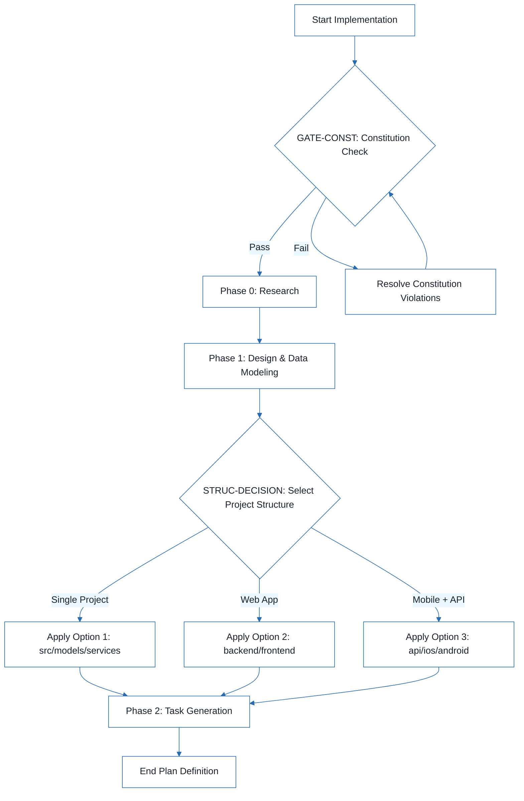
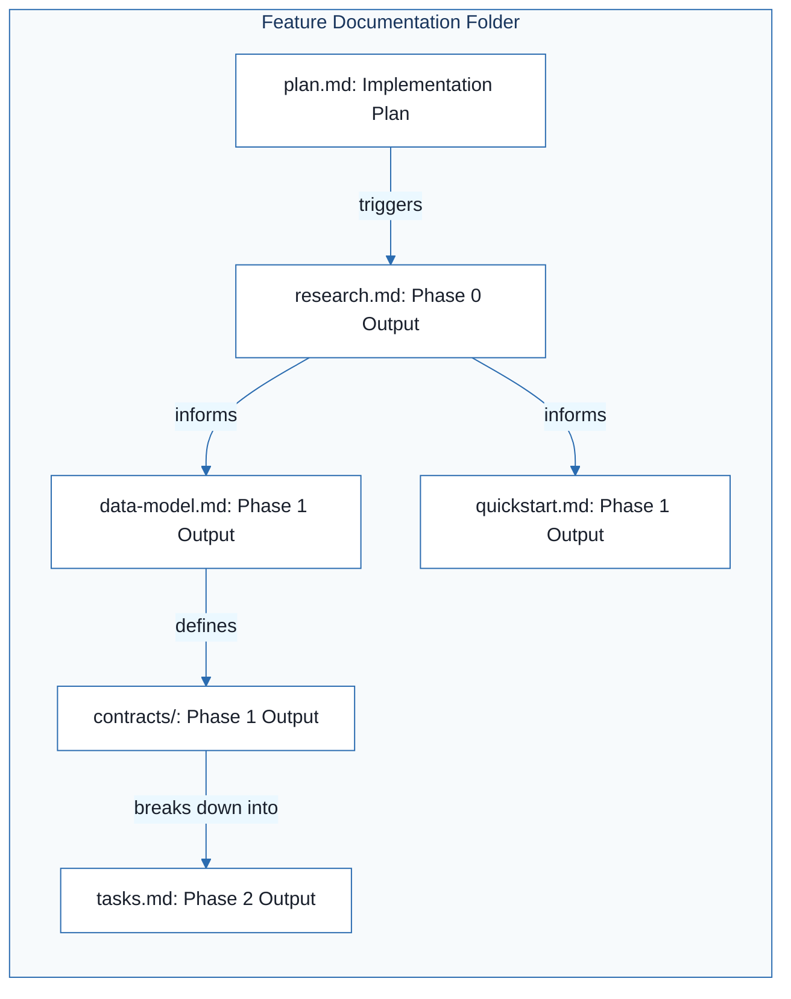

# Football Match Manager - Technical Specification & Architecture Document

## 1. Executive Summary & Architecture Overview

### 1.1 Executive Brief
The Football Match Manager is currently in a pre-architectural phase, represented by an implementation plan template. The project aims to establish a system for managing football matches, but it currently lacks a defined technical stack, data pattern, and host platform. It serves as a structural shell awaiting concrete technical specifications.

### 1.2 Maturity Assessment
The project is currently **BLOCKED**. The specifications consist entirely of placeholders and advisory templates with no concrete technical decisions made. Critical structural gaps include the total absence of data models, API contracts, and security identity definitions, rendering the current state unfit for execution.

### 1.3 Technical Stack
*   **Languages & Frameworks**: NEEDS CLARIFICATION
*   **Primary Dependencies**: NEEDS CLARIFICATION
*   **Storage**: NEEDS CLARIFICATION
*   **Testing**: NEEDS CLARIFICATION
*   **Target Platform**: NEEDS CLARIFICATION
*   **Project Type**: NEEDS CLARIFICATION

### 1.4 Architectural Constraints
*   **Constitution Check Gate**: Mandatory validation required before Phase 0 research and after Phase 1 design.

### 1.5 Critical Dependencies
*   Definition of target language and version.
*   Selection of primary dependencies and storage mechanism.
*   Determination of target platform and project type.
*   Resolution of the project structure decision (Single project vs Web app vs Mobile+API).

## 2. Architecture Workflows



```mermaid
%%{init: {
  'theme': 'base',
  'themeVariables': {
    'primaryColor': '#1A365D',
    'primaryTextColor': '#1A202C',
    'primaryBorderColor': '#2B6CB0',
    'lineColor': '#2B6CB0',
    'secondaryColor': '#EBF8FF',
    'tertiaryColor': '#EBF8FF',
    'background': '#FFFFFF',
    'mainBkg': '#FFFFFF',
    'secondBkg': '#EBF8FF',
    'tertiaryBkg': '#F7FAFC',
    'secondaryTextColor': '#4A5568',
    'fontSize': '16px',
    'fontFamily': 'Inter, system-ui, sans-serif',
    'nodePadding': '15px',
    'borderRadius': '8px',
    'edgeLabelBackground': '#EBF8FF',
    'clusterBkg': '#F7FAFC',
    'clusterBorder': '#2B6CB0',
    'defaultLinkColor': '#2B6CB0',
    'titleColor': '#1A365D',
    'actorBorder': '#2B6CB0',
    'actorBkg': '#EBF8FF',
    'actorTextColor': '#1A365D',
    'actorLineColor': '#2B6CB0',
    'signalColor': '#2B6CB0',
    'signalTextColor': '#1A202C',
    'labelBoxBorderColor': '#2B6CB0',
    'labelBoxBkgColor': '#EBF8FF',
    'labelTextColor': '#1A202C',
    'loopTextColor': '#1A202C',
    'arrowHeadColor': '#2B6CB0',
    'sequenceNumberColor': '#1A365D',
    'sequenceActorBorder': '#2B6CB0',
    'sequenceActorBkg': '#EBF8FF',
    'sequenceArrowColor': '#2B6CB0',
    'noteBkgColor': '#FFF5EB',
    'noteBorderColor': '#DD6B20',
    'noteTextColor': '#1A202C'
  }
}}%%
flowchart LR
    subgraph "Feature Documentation Folder"
        PLAN["plan.md: Implementation Plan"]
        RES["research.md: Phase 0 Output"]
        DM["data-model.md: Phase 1 Output"]
        QS["quickstart.md: Phase 1 Output"]
        CON["contracts/: Phase 1 Output"]
        TSK["tasks.md: Phase 2 Output"]
    end
    PLAN -->|"triggers"| RES
    RES -->|"informs"| DM
    RES -->|"informs"| QS
    DM -->|"defines"| CON
    CON -->|"breaks down into"| TSK
``` & Visual Diagrams

### 2.1 Implementation Workflow
This diagram models the execution workflow of the implementation plan, including the mandatory Constitution Check gate and the structural decision process.

```mermaid
%%{init: {
  'theme': 'base',
  'themeVariables': {
    'primaryColor': '#1A365D',
    'primaryTextColor': '#1A202C',
    'primaryBorderColor': '#2B6CB0',
    'lineColor': '#2B6CB0',
    'secondaryColor': '#EBF8FF',
    'tertiaryColor': '#EBF8FF',
    'background': '#FFFFFF',
    'mainBkg': '#FFFFFF',
    'secondBkg': '#EBF8FF',
    'tertiaryBkg': '#F7FAFC',
    'secondaryTextColor': '#4A5568',
    'fontSize': '16px',
    'fontFamily': 'Inter, system-ui, sans-serif',
    'nodePadding': '15px',
    'borderRadius': '8px',
    'edgeLabelBackground': '#EBF8FF',
    'clusterBkg': '#F7FAFC',
    'clusterBorder': '#2B6CB0',
    'defaultLinkColor': '#2B6CB0',
    'titleColor': '#1A365D',
    'actorBorder': '#2B6CB0',
    'actorBkg': '#EBF8FF',
    'actorTextColor': '#1A365D',
    'actorLineColor': '#2B6CB0',
    'signalColor': '#2B6CB0',
    'signalTextColor': '#1A202C',
    'labelBoxBorderColor': '#2B6CB0',
    'labelBoxBkgColor': '#EBF8FF',
    'labelTextColor': '#1A202C',
    'loopTextColor': '#1A202C',
    'arrowHeadColor': '#2B6CB0',
    'sequenceNumberColor': '#1A365D',
    'sequenceActorBorder': '#2B6CB0',
    'sequenceActorBkg': '#EBF8FF',
    'sequenceArrowColor': '#2B6CB0',
    'noteBkgColor': '#FFF5EB',
    'noteBorderColor': '#DD6B20',
    'noteTextColor': '#1A202C'
  }
}}%%
flowchart TD
    START["Start Implementation"] --> GATE-CONST{"GATE-CONST: Constitution Check"}
    GATE-CONST -- "Pass" --> PHASE0["Phase 0: Research"]
    GATE-CONST -- "Fail" --> FIX_CONST["Resolve Constitution Violations"]
    FIX_CONST --> GATE-CONST
    PHASE0 --> PHASE1["Phase 1: Design & Data Modeling"]
    PHASE1 --> STRUC-DECISION{"STRUC-DECISION: Select Project Structure"}
    STRUC-DECISION -- "Single Project" --> OPT1["Apply Option 1: src/models/services"]
    STRUC-DECISION -- "Web App" --> OPT2["Apply Option 2: backend/frontend"]
    STRUC-DECISION -- "Mobile + API" --> OPT3["Apply Option 3: api/ios/android"]
    OPT1 --> PHASE2["Phase 2: Task Generation"]
    OPT2 --> PHASE2
    OPT3 --> PHASE2
    PHASE2 --> END["End Plan Definition"]
```

### 2.2 Documentation Traceability
This diagram maps the relationship between the implementation plan and the required documentation artifacts.



## 3. Detailed Technical Specifications & Business Rules

### 3.1 Requirements Traceability
| Identifier | Requirement / Choice | Source Section | Status |
| :--- | :--- | :--- | :--- |
| STRUC-DECISION | Selection of project structure (Single project, Web app, or Mobile+API) | [REMOVE IF UNUSED] Option 3: Mobile + API | Pending |
| GATE-CONST | Constitution Check Gate: Must pass before Phase 0 research | Constitution Check | High Criticality |

### 3.2 Security Rules
*   **Security & Identity**: NEEDS CLARIFICATION (Structural Gap).

### 3.3 Data Models
*   **Data Models & Schemas**: NEEDS CLARIFICATION (Structural Gap).

## 4. Project Governance & Structural Gaps

### 4.1 Structural Gaps
| Missing Section | Priority | Remediation Advice |
| :--- | :--- | :--- |
| Data Models & Schemas | HIGH | Define the entities and database schema for the Football Match Manager. |
| API Contracts & Flow | HIGH | Define the endpoints and integration flows between components. |
| Security & Identity | MEDIUM | Specify authentication and authorization mechanisms. |
| Open Questions & Uncertainties | LOW | List technical unknowns to be resolved during research phase. |

### 4.2 Remediation & Workflow
The project must transition from the current template state to a concrete specification by resolving the "Open Questions" (Language, Dependencies, Storage, Platform) and completing the Phase 0 (Research) and Phase 1 (Design) activities as defined in the Implementation Workflow.

## 5. Technical & Domain Glossary (Terminology Reference)

| Term | Category | Context Anchor | Project Definition |
| :--- | :--- | :--- | :--- |
| Branch | TECHNICAL_STACK | Implementation Plan: Football Match Manager | The specific version control pointer 001-football-match-manager used for this implementation cycle. |
| Date | TECHNICAL_STACK | Implementation Plan: Football Match Manager | The temporal marker 2026-07-30 designating the plan creation. |
| Spec | TECHNICAL_STACK | Implementation Plan: Football Match Manager | The external markdown file containing the detailed feature requirements. |
| Python 3.11 | TECHNICAL_STACK | Technical Context | An example runtime environment listed as a potential candidate for the logic layer. |
| Primary Dependencies | TECHNICAL_STACK | Technical Context | The external libraries or frameworks required for system operation, currently awaiting final selection. |
| CoreData | TECHNICAL_STACK | Technical Context | An example local persistence framework listed for potential use. |
| Storage | TECHNICAL_STACK | Technical Context | The mechanism for data persistence, currently marked as needing clarification. |
| Testing | TECHNICAL_STACK | Technical Context | The verification suite and tools used to ensure code correctness. |
| Target Platform | TECHNICAL_STACK | Technical Context | The intended deployment environment, such as a mobile operating system or server. |
| Project Type | TECHNICAL_STACK | Technical Context | The architectural classification of the software, such as a web-service or mobile-app. |
| Performance Goals | TECHNICAL_STACK | Technical Context | The quantitative efficiency targets the system must achieve. |
| Constraints | TECHNICAL_STACK | Technical Context | The non-functional limitations and boundaries imposed on the implementation. |
| GATE | TECHNICAL_STACK | GATE-CONST | A mandatory validation checkpoint that must be cleared before proceeding to the next phase. |
| Structure Decision | TECHNICAL_STACK | STRUC-DECISION | The final selection of the repository layout from the provided architectural options. |
| iOS | TECHNICAL_STACK | [REMOVE IF UNUSED] Option 3: Mobile + API | The mobile operating system target for the client-side implementation. |
| API | TECHNICAL_STACK | [REMOVE IF UNUSED] Option 2: Web application | The interface layer facilitating communication between the backend and external clients. |
| UI | TECHNICAL_STACK | [REMOVE IF UNUSED] Option 3: Mobile + API | The visual interaction layer for the end user. |
| WASM | TECHNICAL_STACK | Technical Context | An example binary instruction format for a stack-based virtual machine listed as a potential target. |
| LLVM | TECHNICAL_STACK | Technical Context | An example compiler infrastructure listed as a potential dependency. |
| LOC | TECHNICAL_STACK | Technical Context | The metric for measuring the volume of source code. |