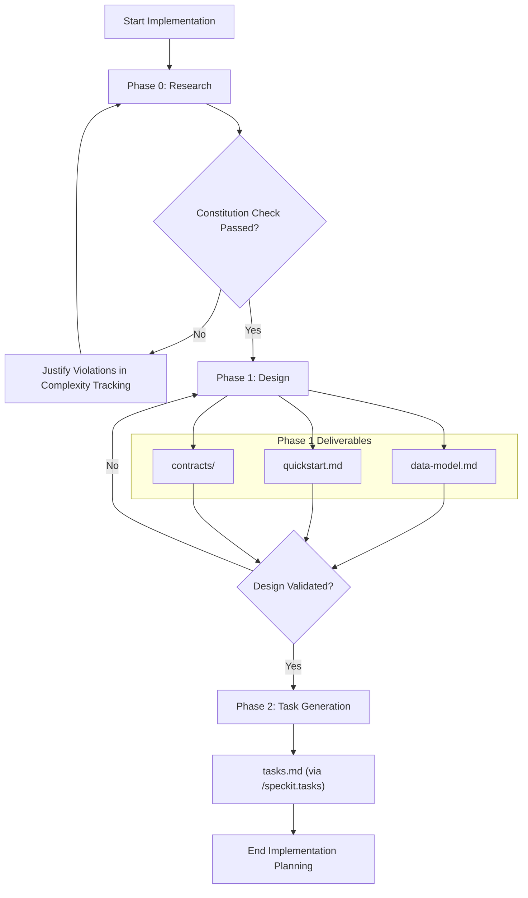
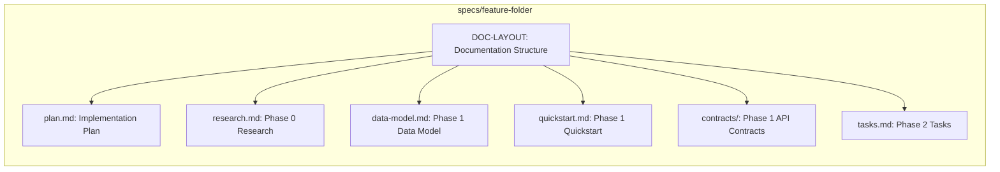

# Football Match Manager - Technical Specification & Architecture Document

## 1. Executive Summary & Architecture Overview

### 1.1 Executive Brief
The Football Match Manager is currently in its initial conceptual phase, represented by a skeletal implementation plan template. The project aims to build a system for managing football matches, but it lacks a defined host platform, specific data patterns, and a concrete architectural identity. It serves as a structural blueprint awaiting technical specification.

### 1.2 Maturity Assessment
The project is in a nascent state, consisting only of a placeholder template. With a total absence of extracted nodes and edges for technical logic, and high-severity gaps in Data Models and API Contracts, the architecture is fundamentally undefined. Status: REFINEMENT.

### 1.3 Technical Stack
*   **Languages/Frameworks**: Not yet specified (Template suggests Python 3.11)
*   **Dependencies**: Not yet specified
*   **Storage**: Not yet specified
*   **Testing**: Not yet specified
*   **Target Platform**: Not yet specified
*   **Project Type**: Not yet specified

### 1.4 Architectural Constraints
*   **Documentation Layout**: The project must strictly adhere to the prescribed documentation structure: `plan.md`, `research.md`, `data-model.md`, `quickstart.md`, `contracts/`, and `tasks.md`.

### 1.5 Critical Dependencies
*   **Feature Specification**: A complete feature specification from `/specs/[###-feature-name]/spec.md` is required to populate the plan.
*   **Constitution Check**: A mandatory constitution file check must be passed before initiating Phase 0 research.

## 2. Architecture Workflows & Visual Diagrams

### 2.1 Implementation Workflow Process
This flowchart models the execution workflow of the implementation plan from research to task generation.

### 2.2 Project Documentation Topology
Visual representation of the structured documentation layout defined in the `DOC-LAYOUT` element.

## 3. Detailed Technical Specifications & Business Rules

### 3.1 Requirements Traceability
| Identifier | Requirement / Component | Description | Source Section |
| :--- | :--- | :--- | :--- |
| DOC-LAYOUT | Documentation Structure | Defined documentation structure including plan.md, research.md, data-model.md, quickstart.md, contracts/, and tasks.md | Documentation (this feature) |

### 3.2 Security Rules
*   *No security rules defined in the current source data.*

### 3.3 Data Models
*   *No data models defined in the current source data.*

## 4. Project Governance & Structural Gaps

### 4.1 Structural Gaps
| Gap | Priority | Remediation Advice |
| :--- | :--- | :--- |
| Data Models & Schemas | HIGH | Define the core entities and database schema for football matches, players, and teams. |
| API Contracts & Flow | HIGH | Define the endpoints, request/response payloads, and the sequence of calls for match management. |
| Security & Identity | MEDIUM | Specify authentication and authorization requirements for the match manager. |
| Open Questions & Uncertainties | LOW | Identify technical risks or unknowns regarding the football domain logic. |

### 4.2 Remediation & Workflow
The project must transition from the current "Template" state to a "Specified" state by populating the `research.md` and `data-model.md` files as outlined in the Implementation Workflow Process (Section 2.1).

## 5. Technical & Domain Glossary (Terminology Reference)

| Term | Category | Context Anchor | Project Definition |
| :--- | :--- | :--- | :--- |
| Branch | TECHNICAL_STACK | Implementation Plan: Football Match Manager | The specific version control pointer designated for the development of this feature set. |
| Date | TECHNICAL_STACK | Implementation Plan: Football Match Manager | The chronological timestamp marking the creation or last update of the operational roadmap. |
| Spec | TECHNICAL_STACK | Implementation Plan: Football Match Manager | The markdown document containing the detailed functional and non-functional requirements. |
| Python 3.11 | TECHNICAL_STACK | Technical Context | The designated runtime environment version for backend logic execution. |
| Primary Dependencies | TECHNICAL_STACK | Technical Context | The external software libraries and frameworks essential for system operation. |
| Storage | TECHNICAL_STACK | Technical Context | The persistence layer mechanism used for retaining state and entity data. |
| Testing | TECHNICAL_STACK | Technical Context | The framework and methodology used to verify the correctness of the implementation. |
| Target Platform | TECHNICAL_STACK | Technical Context | The intended operating system or hardware environment where the software will be deployed. |
| Project Type | TECHNICAL_STACK | Technical Context | The high-level architectural classification of the software artifact. |
| Performance Goals | TECHNICAL_STACK | Technical Context | The quantitative throughput and latency targets the system must satisfy. |
| Constraints | TECHNICAL_STACK | Technical Context | The hard technical limitations regarding memory, time, or environment connectivity. |
| GATE | TECHNICAL_STACK | Constitution Check | The mandatory validation checkpoint that must be cleared before progressing to the next development phase. |
| Structure Decision | TECHNICAL_STACK | [REMOVE IF UNUSED] Option 3: Mobile + API | The final selection of the directory layout from the provided architectural templates. |
| iOS | TECHNICAL_STACK | [REMOVE IF UNUSED] Option 3: Mobile + API | The specific mobile operating system targeted for the frontend implementation. |