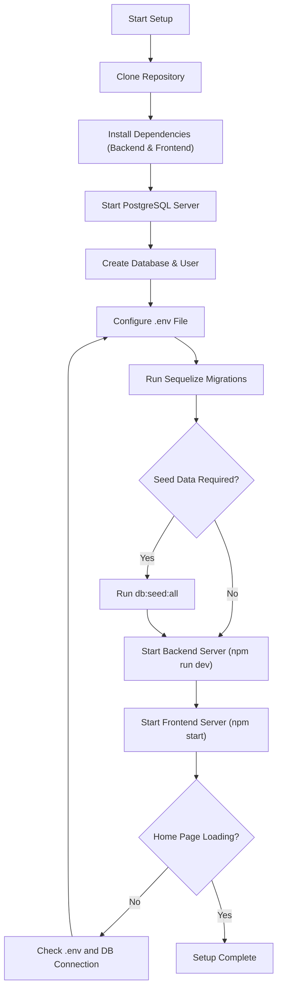
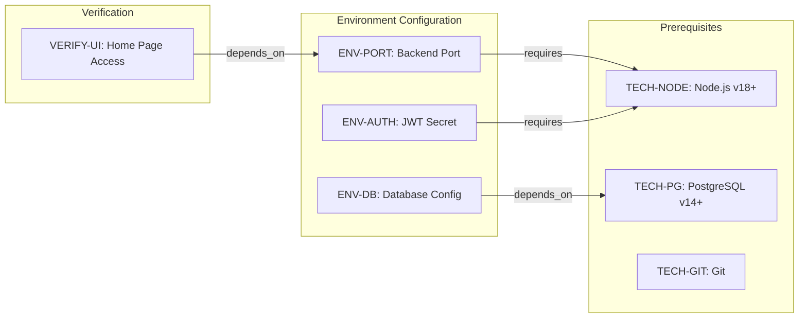

# Football Match Manager - Technical Specification & Architecture Document

## 1. Executive Summary & Architecture Overview

### 1.1 Executive Brief
Football Match Manager is a full-stack application featuring a Node.js backend and a frontend client. It utilizes a PostgreSQL database managed via the Sequelize ORM and implements JWT-based authentication. The project is currently in a local development setup phase, focusing on environment configuration and basic service orchestration.

### 1.2 Maturity Assessment
The project is currently in a state of **REFINEMENT**. While the installation and environment setup are fully documented, there is a critical absence of functional specifications, business goals, and defined user stories. The high severity of structural gaps regarding functional requirements and project scope indicates that the technical foundation is present, but the architectural purpose remains undefined.

### 1.3 Technical Stack
* **Runtime**: Node.js (v18+)
* **Package Managers**: npm, Yarn
* **Database**: PostgreSQL (v14+)
* **ORM**: Sequelize
* **Authentication**: JWT (JSON Web Tokens)
* **Version Control**: Git

### 1.4 Architectural Constraints
* Node.js runtime version must be >= 18.
* PostgreSQL database version must be >= 14.
* Backend server default port is 5000.
* Frontend server default port is 3000.
* Authentication requires a Bearer token in the Authorization header.
* Backend must utilize `.env` for all sensitive configuration.

### 1.5 Critical Dependencies
* **PostgreSQL Server**: Essential for `DB_HOST`/`DB_PORT` connectivity.
* **JWT_SECRET**: Required environment variable for secure authentication.
* **FOOTBALL_API_KEY**: Necessary for third-party data integration.
* **Sequelize Migrations**: Mandatory execution to ensure database schema integrity.
* **Environment Mapping**: Correct `.env` file configuration is required for backend service startup.

## 2. Architecture Workflows & Visual Diagrams

### 2.1 Local Development Setup Workflow
A detailed process flow for setting up the Football Match Manager environment, including dependency installation, database configuration, and server startup.

### 2.2 Technical Dependency Map
Traceability map showing the relationship between environment configurations and technical prerequisites.

## 3. Detailed Technical Specifications & Business Rules

### 3.1 Requirements Traceability
| ID | Type | Description | Source Section |
| :--- | :--- | :--- | :--- |
| TECH-NODE | Constraint | Node.js v18 or later required | Prerequisites |
| TECH-PG | Constraint | PostgreSQL v14 or later required | Prerequisites |
| TECH-GIT | Constraint | Git installed for repository cloning | Prerequisites |
| ENV-DB | Entity | Database configuration variables: DB_HOST, DB_PORT, DB_NAME, DB_USER, DB_PASSWORD | 4. Configure Environment Variables |
| ENV-AUTH | Entity | JWT_SECRET for authentication | JWT secret for authentication |
| ENV-PORT | Entity | Backend server port configuration | Port for the backend server |
| VERIFY-UI | Success Criterion | Browser navigation to http://localhost:3000 displays the home page | 8. Verify the Setup |

### 3.2 Security Rules
* **Authentication**: All protected endpoints require a JWT provided as a `Bearer <token>` in the `Authorization` header.
* **Secret Management**: The `JWT_SECRET` must be a strong, random string and must never be committed to version control (managed via `.env`).

### 3.3 Data Models
* **Database Engine**: PostgreSQL.
* **Schema Management**: Managed via Sequelize ORM migrations.
* **Initial State**: Optional seeding available via `npx sequelize-cli db:seed:all` for leagues and teams.

## 4. Project Governance & Structural Gaps

### 4.1 Structural Gaps
| Missing Section | Priority | Remediation Advice |
| :--- | :--- | :--- |
| Goals & Objectives | HIGH | The document is a setup guide. A separate specification document defining the purpose and business goals of the Football Match Manager is needed. |
| Functional Requirements | HIGH | No functional rules or user stories are defined here. Provide a document detailing the features and expected behaviors. |
| Scope & Out-of-Scope | MEDIUM | Define the boundaries of the application to avoid scope creep. |
| Open Questions & Uncertainties | LOW | Identify any technical or business ambiguities. |

### 4.2 Remediation & Workflow
The current documentation serves as a "Quick Start Guide". To transition to a full Technical Specification, the development team must prioritize the definition of functional requirements and business logic to align the technical setup with the project's intended purpose.

## 5. Technical & Domain Glossary (Terminology Reference)

| Term | Category | Context Anchor | Project Definition |
| :--- | :--- | :--- | :--- |
| API | TECHNICAL_STACK | API Documentation | The set of endpoints exposed by the backend server for external integration and data retrieval. |
| Authorization | TECHNICAL_STACK | Common Issues | The security mechanism requiring a specific header to verify the identity of the requester. |
| Bearer \<token\> | TECHNICAL_STACK | Common Issues | The exact format for passing the security credential within the request header. |
| JSON | TECHNICAL_STACK | API Documentation | The lightweight data-interchange format used for communication between the client and server. |
| JWT | TECHNICAL_STACK | ENV-AUTH | The compact, URL-safe means of representing claims to be transferred between two parties, signed with a secret. |
| ORM | TECHNICAL_STACK | 5. Run Database Migrations | The library provided by Sequelize to map object-oriented models to relational tables. |
| Sql | TECHNICAL_STACK | 3. Set Up the Database | The domain-specific language used to manage and manipulate the relational data in the storage engine. |
| npm install | TECHNICAL_STACK | 2. Install Dependencies | The command executed to retrieve and localize all required third-party packages for the project. |
| npm start | TECHNICAL_STACK | From the frontend directory | The script triggered to launch the application in its production-ready or development server mode. |
| npm test | TECHNICAL_STACK | Running Tests | The command used to execute the automated validation suite for both client and server logic. |