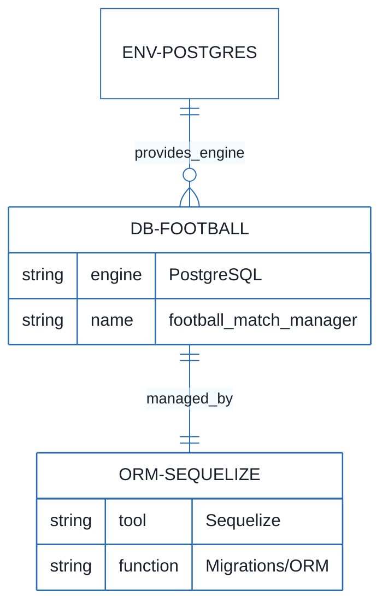
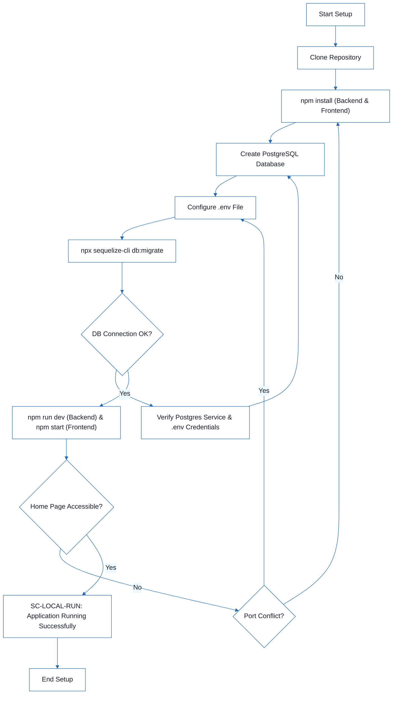
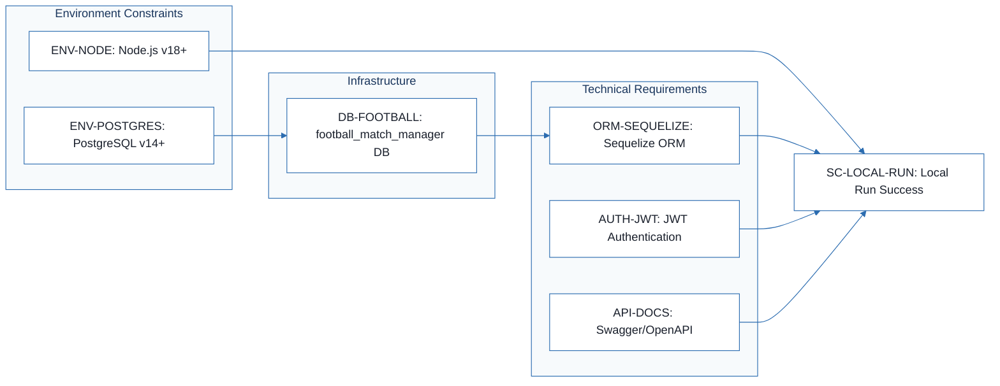
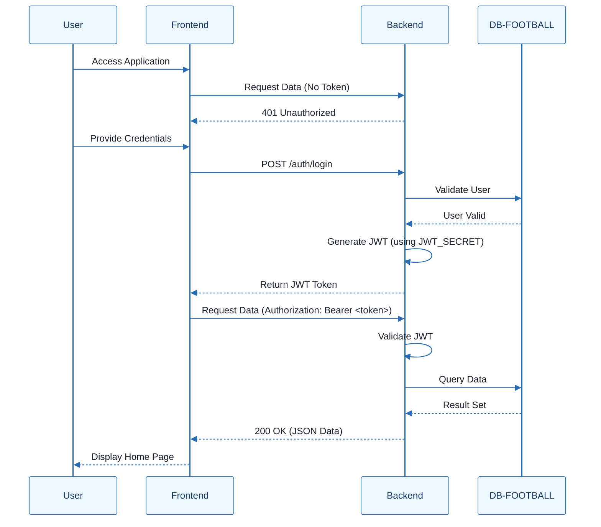

# Football Match Manager - Technical Specification & Architecture Document

## 1. Executive Summary & Architecture Overview

### 1.1 Executive Brief
Football Match Manager is a full-stack application featuring a Node.js backend and a React frontend. It utilizes a PostgreSQL database managed via Sequelize ORM and implements JWT-based authentication for secure API access. The system is designed for local development and testing, providing a structured environment for managing football match data.

### 1.2 Maturity Assessment
The project is currently in a REFINEMENT state. While the technical environment and installation pipeline are fully documented, there is a critical absence of functional specifications, business rules, and project goals. The current documentation is a setup guide rather than a technical specification, leaving the core application logic undefined.

### 1.3 Technical Stack
* Node.js
* React
* PostgreSQL
* Sequelize
* npm
* Yarn
* Git

### 1.4 Architectural Constraints
* Node.js version >= 18
* PostgreSQL version >= 14
* Backend server port: 5000
* Frontend server port: 3000
* Authentication: JWT via Bearer token in Authorization header
* Database migrations: Mandatory use of Sequelize ORM
* API Documentation: Swagger/OpenAPI available at /api-docs

### 1.5 Critical Dependencies
* PostgreSQL server instance for DB-FOOTBALL entity
* JWT_SECRET environment variable for authentication
* FOOTBALL_API_KEY for third-party data integration
* DB_HOST, DB_PORT, DB_NAME, DB_USER, DB_PASSWORD for database connectivity
* Sequelize ORM for database schema migrations and entity mapping

## 2. Architecture Workflows







```mermaid
%%{init: {
  'theme': 'base',
  'themeVariables': {
    'primaryColor': '#1A365D',
    'primaryTextColor': '#1A202C',
    'primaryBorderColor': '#2B6CB0',
    'lineColor': '#2B6CB0',
    'secondaryColor': '#EBF8FF',
    'tertiaryColor': '#EBF8FF',
    'background': '#FFFFFF',
    'mainBkg': '#FFFFFF',
    'secondBkg': '#EBF8FF',
    'tertiaryBkg': '#F7FAFC',
    'secondaryTextColor': '#4A5568',
    'fontSize': '16px',
    'fontFamily': 'Inter, system-ui, sans-serif',
    'nodePadding': '15px',
    'borderRadius': '8px',
    'edgeLabelBackground': '#EBF8FF',
    'clusterBkg': '#F7FAFC',
    'clusterBorder': '#2B6CB0',
    'defaultLinkColor': '#2B6CB0',
    'titleColor': '#1A365D',
    'actorBorder': '#2B6CB0',
    'actorBkg': '#EBF8FF',
    'actorTextColor': '#1A365D',
    'actorLineColor': '#2B6CB0',
    'signalColor': '#2B6CB0',
    'signalTextColor': '#1A202C',
    'labelBoxBorderColor': '#2B6CB0',
    'labelBoxBkgColor': '#EBF8FF',
    'labelTextColor': '#1A202C',
    'loopTextColor': '#1A202C',
    'arrowHeadColor': '#2B6CB0',
    'sequenceNumberColor': '#1A365D',
    'sequenceActorBorder': '#2B6CB0',
    'sequenceActorBkg': '#EBF8FF',
    'sequenceArrowColor': '#2B6CB0',
    'noteBkgColor': '#FFF5EB',
    'noteBorderColor': '#DD6B20',
    'noteTextColor': '#1A202C'
  }
}}%%
sequenceDiagram
    participant User
    participant Frontend
    participant Backend
    participant DB-FOOTBALL
    User->>Frontend: Access Application
    Frontend->>Backend: Request Data (No Token)
    Backend-->>Frontend: 401 Unauthorized
    User->>Frontend: Provide Credentials
    Frontend->>Backend: POST /auth/login
    Backend->>DB-FOOTBALL: Validate User
    DB-FOOTBALL-->>Backend: User Valid
    Backend->>Backend: Generate JWT (using JWT_SECRET)
    Backend-->>Frontend: Return JWT Token
    Frontend->>Backend: Request Data (Authorization: Bearer <token>)
    Backend->>Backend: Validate JWT
    Backend->>DB-FOOTBALL: Query Data
    DB-FOOTBALL-->>Backend: Result Set
    Backend-->>Frontend: 200 OK (JSON Data)
    Frontend-->>User: Display Home Page
``` & Visual Diagrams

### 2.1 Technical Infrastructure ER Diagram
Models the persistent data layer and its relationship with the ORM and environment constraints.

```mermaid
%%{init: {
  'theme': 'base',
  'themeVariables': {
    'primaryColor': '#1A365D',
    'primaryTextColor': '#1A202C',
    'primaryBorderColor': '#2B6CB0',
    'lineColor': '#2B6CB0',
    'secondaryColor': '#EBF8FF',
    'tertiaryColor': '#EBF8FF',
    'background': '#FFFFFF',
    'mainBkg': '#FFFFFF',
    'secondBkg': '#EBF8FF',
    'tertiaryBkg': '#F7FAFC',
    'secondaryTextColor': '#4A5568',
    'fontSize': '16px',
    'fontFamily': 'Inter, system-ui, sans-serif',
    'nodePadding': '15px',
    'borderRadius': '8px',
    'edgeLabelBackground': '#EBF8FF',
    'clusterBkg': '#F7FAFC',
    'clusterBorder': '#2B6CB0',
    'defaultLinkColor': '#2B6CB0',
    'titleColor': '#1A365D',
    'actorBorder': '#2B6CB0',
    'actorBkg': '#EBF8FF',
    'actorTextColor': '#1A365D',
    'actorLineColor': '#2B6CB0',
    'signalColor': '#2B6CB0',
    'signalTextColor': '#1A202C',
    'labelBoxBorderColor': '#2B6CB0',
    'labelBoxBkgColor': '#EBF8FF',
    'labelTextColor': '#1A202C',
    'loopTextColor': '#1A202C',
    'arrowHeadColor': '#2B6CB0',
    'sequenceNumberColor': '#1A365D',
    'sequenceActorBorder': '#2B6CB0',
    'sequenceActorBkg': '#EBF8FF',
    'sequenceArrowColor': '#2B6CB0',
    'noteBkgColor': '#FFF5EB',
    'noteBorderColor': '#DD6B20',
    'noteTextColor': '#1A202C'
  }
}}%%
erDiagram
    ENV-POSTGRES ||--o{ DB-FOOTBALL : "provides_engine"
    DB-FOOTBALL ||--|| ORM-SEQUELIZE : "managed_by"
    DB-FOOTBALL {
        string engine "PostgreSQL"
        string name "football_match_manager"
    }
    ORM-SEQUELIZE {
        string tool "Sequelize"
        string function "Migrations/ORM"
    }
```

### 2.2 Local Environment Setup Workflow
Detailed technical workflow for setting up the Football Match Manager development environment, including validation steps.


### 2.3 Technical Traceability Map
Maps technical constraints and non-functional requirements to the final success criterion.


### 2.4 Authentication & API Interaction Sequence
Models the interaction between the Frontend, Backend, and Database based on the JWT and API requirements.



## 3. Detailed Technical Specifications & Business Rules

### 3.1 Requirements Traceability

| Identifier | Type | Description | Source Section |
| :--- | :--- | :--- | :--- |
| ENV-NODE | Constraint | Node.js v18 or later is required. | Prerequisites |
| ENV-POSTGRES | Constraint | PostgreSQL v14 or later is required. | Prerequisites |
| DB-FOOTBALL | Entity | Database named 'football_match_manager' for application data storage. | 3. Set Up the Database |
| AUTH-JWT | NFR | Authentication must be handled via JWT using a strong secret key and Bearer token in the Authorization header. | Common Issues |
| ORM-SEQUELIZE | NFR | The application must use Sequelize for ORM and database migrations. | 5. Run Database Migrations |
| SC-LOCAL-RUN | Success Criterion | The application is successfully running when the home page is accessible at http://localhost:3000. | 8. Verify the Setup |
| API-DOCS | NFR | API documentation should be available via Swagger/OpenAPI at /api-docs. | API Documentation |

### 3.2 Security Rules
* **Authentication Mechanism**: All protected API endpoints require a JWT (JSON Web Token).
* **Token Transmission**: Tokens must be transmitted via the `Authorization` header using the `Bearer <token>` scheme.
* **Secret Management**: The `JWT_SECRET` must be stored in environment variables and must be a strong, random string in production environments.

### 3.3 Data Models
* **Database Engine**: PostgreSQL (v14+).
* **Schema Management**: Managed exclusively via Sequelize ORM migrations.
* **Primary Entity**: `DB-FOOTBALL` (football_match_manager) serves as the central persistent store.

## 4. Project Governance & Structural Gaps

### 4.1 Structural Gaps

| Missing Section | Priority | Remediation Advice |
| :--- | :--- | :--- |
| Goals & Objectives | HIGH | The document is a setup guide. A business-oriented document defining the purpose and goals of the Football Match Manager is needed. |
| Functional Requirements | HIGH | No business rules or user features (e.g., match creation, team management) are defined. A functional spec is required. |
| Scope & Out-of-Scope | MEDIUM | Define the boundaries of the application to avoid scope creep. |
| Open Questions & Uncertainties | LOW | Identify technical or business unknowns. |

### 4.2 Remediation & Workflow
To transition from a "Quick Start Guide" to a full "Technical Specification", the following workflow is recommended:
1. Conduct stakeholder interviews to define the core business goals.
2. Draft a comprehensive list of Functional Requirements (User Stories).
3. Define the detailed Data Model (ERD) including tables for Matches, Teams, and Users.
4. Map these functional requirements to the existing technical constraints (ENV-NODE, AUTH-JWT).

## 5. Technical & Domain Glossary (Terminology Reference)

| Term | Category | Context Anchor | Project Definition |
| :--- | :--- | :--- | :--- |
| API | TECHNICAL_STACK | API-DOCS | The interface providing endpoints for external data retrieval and system interaction, documented via Swagger/OpenAPI. |
| Authorization | TECHNICAL_STACK | AUTH-JWT | The security layer verifying identity via a specific header to grant access to protected resources. |
| Bearer \<token\> | TECHNICAL_STACK | AUTH-JWT | The specific credential format required within the request header for identity verification. |
| JSON | TECHNICAL_STACK | API-DOCS | The lightweight data-interchange format used for communication between the frontend and backend. |
| JWT | TECHNICAL_STACK | AUTH-JWT | The compact, URL-safe means of representing claims to be transferred between two parties, secured by a strong secret key. |
| ORM | TECHNICAL_STACK | ORM-SEQUELIZE | The abstraction layer provided by Sequelize to manage relational data without writing raw queries. |
| Sql | TECHNICAL_STACK | 3. Set Up the Database | The standard language used to define and manipulate the relational schema in PostgreSQL. |
| USER | BUSINESS_DOMAIN | 3. Set Up the Database | The system actor granted specific privileges to interact with the persistent storage. |
| npm install | TECHNICAL_STACK | 2. Install Dependencies | The command used to resolve and download project dependencies for both the client and server. |
| npm start | TECHNICAL_STACK | 7. Start the Development Servers | The execution script used to launch the application in production or development mode. |
| npm test | TECHNICAL_STACK | Running Tests | The command used to trigger the automated validation suite for both the frontend and backend. |