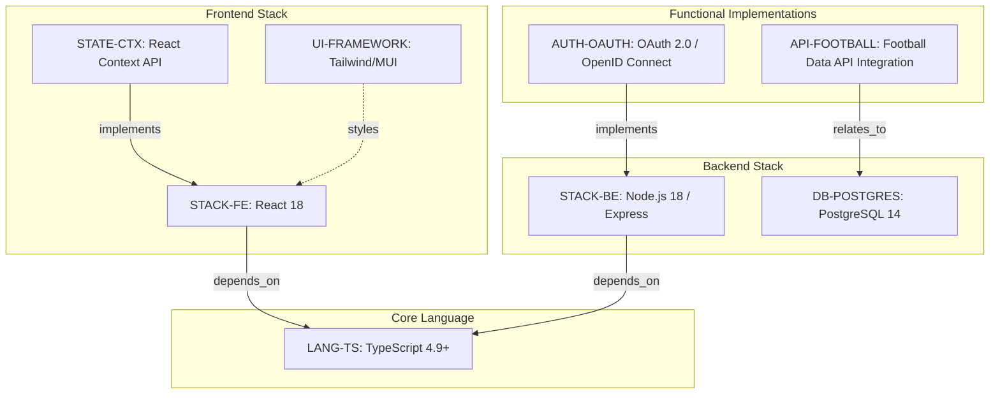
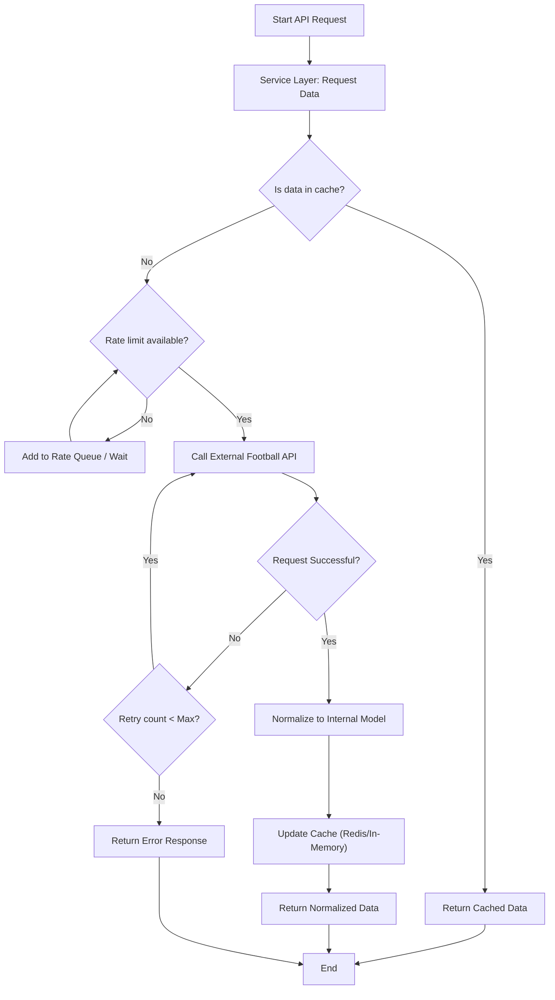
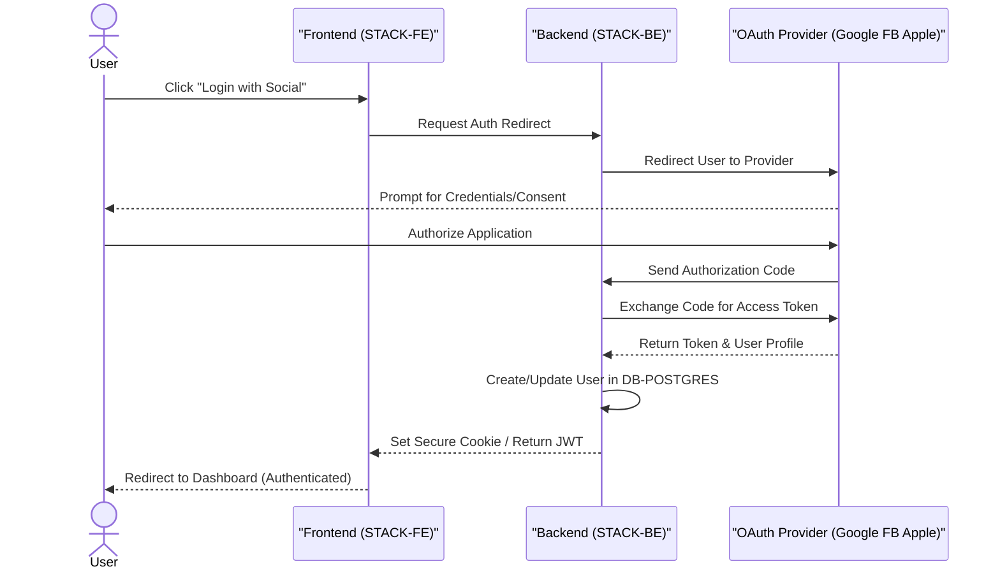

# Football Match Manager - Technical Specification & Architecture Document

## 1. Executive Summary & Architecture Overview

### 1.1 Executive Brief
The Football Match Manager is a full-stack application designed to manage football match tracking. It utilizes a TypeScript-driven architecture with a React 18 frontend and a Node.js 18 Express backend. The system implements a relational data pattern via PostgreSQL 14, ensuring ACID compliance for user follows and match data, integrated with third-party football data APIs.

### 1.2 Maturity Assessment
The project is currently **BLOCKED**. While the technology stack is exhaustively defined and consistent, there is a critical void regarding business logic and project boundaries. The absence of 'Goals & Objectives' and 'Scope & Out-of-Scope' definitions means the technical implementation lacks a functional target, representing a high-severity structural gap that prevents execution.

### 1.3 Technical Stack
* **Languages & Frameworks**:
    * TypeScript 4.9
    * React 18
    * Node.js 18
    * Express.js
    * PostgreSQL 14
    * Sequelize / TypeORM
    * Jest
    * React Testing Library
    * Supertest
    * Passport.js
    * Tailwind CSS / Material-UI (MUI)
    * React Context API

### 1.4 Architectural Constraints
* **Type Safety**: Static type checking mandatory via TypeScript 4.9 across all layers.
* **Data Integrity**: ACID compliance for data integrity using PostgreSQL 14.
* **State Management**: Frontend state management restricted to React Context API.
* **Session Security**: Secure session management via JWT or encrypted cookies.
* **Network Security**: Mandatory security layers including HTTPS and CSRF protection.
* **API Integration**: Integration must include a dedicated service layer, caching (Redis or in-memory), and rate limiting.

### 1.5 Critical Dependencies
* **OAuth 2.0 / OpenID Connect providers**: Google, Facebook, Apple.
* **External Football Data API**: Football-Data.org or API-FOOTBALL.
* **Passport.js**: For authentication strategy implementation.
* **PostgreSQL 14**: Relational engine for match and user entity storage.
* **Redis / In-memory store**: For API response caching.

## 2. Architecture Workflows & Visual Diagrams

### 2.1 Technology Stack Traceability Map

### 2.2 Football Data API Integration Workflow

### 2.3 Authentication Sequence Flow

## 3. Detailed Technical Specifications & Business Rules

### 3.1 Requirements Traceability
| ID | Type | Requirement Description | Source Section |
| :--- | :--- | :--- | :--- |
| **LANG-TS** | Constraint | Use TypeScript 4.9 (or latest stable) for static type checking and maintainability. | 1. Language/Version |
| **STACK-FE** | Constraint | Frontend must be built with React 18 and TypeScript. | 2. Primary Dependencies |
| **STACK-BE** | Constraint | Backend must be built with Node.js 18 and Express.js. | 2. Primary Dependencies |
| **DB-POSTGRES** | Constraint | Use PostgreSQL 14 as the primary relational database for ACID compliance. | 3. Storage: Database Choice |
| **TEST-STRAT** | Constraint | Use Jest and React Testing Library for Frontend; Jest and Supertest for Backend API testing. | 4. Testing Strategy |
| **AUTH-OAUTH** | Functional | Implement third-party login using OAuth 2.0 / OpenID Connect via passport.js (Google, Facebook, Apple). | Authentication Integration |
| **API-FOOTBALL** | Functional | Integrate a RESTful Football Data API with a service layer, caching (Redis/in-memory), and rate limiting. | Football Data API Integration |
| **STATE-CTX** | Constraint | Use React Context API for frontend state management of authentication and followed matches. | State Management (Frontend) |
| **UI-FRAMEWORK** | Constraint | Utilize Tailwind CSS or Material-UI (MUI) for the user interface styling. | Styling and UI Framework |

### 3.2 Security Rules
* **Authentication**: Mandatory use of OAuth 2.0 / OpenID Connect.
* **Session Management**: Implementation of JWT or encrypted cookies.
* **Transport**: All traffic must be served over HTTPS.
* **Attack Mitigation**: CSRF protection must be active on all state-changing requests.

### 3.3 Data Models
* **Relational Model**: PostgreSQL 14 used for structured data (Users, Teams, Leagues, Matches).
* **Flexible Storage**: Use of `JSONB` columns for storing semi-structured data received from external Football APIs.
* **Persistence Layer**: Abstraction via Sequelize or TypeORM to manage migrations and queries.

## 4. Project Governance & Structural Gaps

### 4.1 Structural Gaps
| Gap | Priority | Remediation Advice |
| :--- | :--- | :--- |
| **Goals & Objectives** | HIGH | The document focuses on technology but does not define the business goals or high-level objectives of the Football Match Manager. |
| **Scope & Out-of-Scope** | HIGH | Define specifically what features are included (e.g., which football data is tracked) and what is explicitly excluded. |
| **Open Questions** | MEDIUM | While some alternatives were considered, a dedicated section for unresolved technical or business questions is missing. |

### 4.2 Remediation & Workflow
To move the project from **BLOCKED** to **ACTIVE**, the following workflow is required:
1. Define the Product Vision and high-level business goals.
2. Establish a detailed Functional Scope (Feature List).
3. Resolve the pending technical decisions:
    * Select between Sequelize and TypeORM.
    * Perform a cost-benefit analysis between Football-Data.org and API-FOOTBALL.

## 5. Technical & Domain Glossary (Terminology Reference)

| Term | Category | Context Anchor | Project Definition |
| :--- | :--- | :--- | :--- |
| ACID | TECHNICAL_STACK | DB-POSTGRES | The set of properties ensuring transactional reliability and data integrity for user follows and match records. |
| API | TECHNICAL_STACK | API-FOOTBALL | The RESTful interface used to retrieve external football data through a service layer with caching and rate limiting. |
| CSRF | TECHNICAL_STACK | AUTH-OAUTH | The security mechanism implemented to prevent cross-site request forgery within the authentication flow. |
| CSS | TECHNICAL_STACK | UI-FRAMEWORK | The styling layer implemented via a utility-first approach for rapid interface development. |
| ID | BUSINESS_DOMAIN | AUTH-OAUTH | The unique minimal identifier stored for users linked to third-party authentication providers. |
| JSON | TECHNICAL_STACK | DB-POSTGRES | The lightweight data-interchange format used for communicating with external football data providers. |
| JSONB | TECHNICAL_STACK | DB-POSTGRES | The binary storage format in the relational database used for flexible data schemas from external sources. |
| JWT | TECHNICAL_STACK | AUTH-OAUTH | The signed token format utilized for secure session management. |
| JavaScript | TECHNICAL_STACK | LANG-TS | The baseline scripting language rejected as the primary development choice in favor of a typed alternative. |
| LTS | TECHNICAL_STACK | STACK-BE | The long-term support version of the runtime environment to ensure stability and performance. |
| MUI | TECHNICAL_STACK | UI-FRAMEWORK | The component library following Material Design guidelines for the user interface. |
| OAuth 2.0 | TECHNICAL_STACK | AUTH-OAUTH | The authorization framework used for third-party logins via Google, Facebook, and Apple. |
| ORM | TECHNICAL_STACK | DB-POSTGRES | The abstraction layer provided by Sequelize or TypeORM for database interactions and migrations. |
| PostgreSQL | TECHNICAL_STACK | DB-POSTGRES | The primary relational database engine version 14 used for structured match and user data. |
| React | TECHNICAL_STACK | STACK-FE | The frontend library version 18 utilizing concurrent features and hooks for the user interface. |
| TypeScript | TECHNICAL_STACK | LANG-TS | The static type-checked language version 4.9 used across the entire application stack. |
| UI | TECHNICAL_STACK | UI-FRAMEWORK | The visual layer developed using a combination of utility-first styles or pre-built components. |