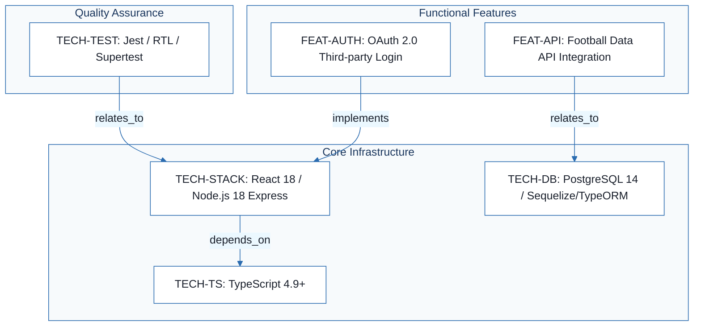
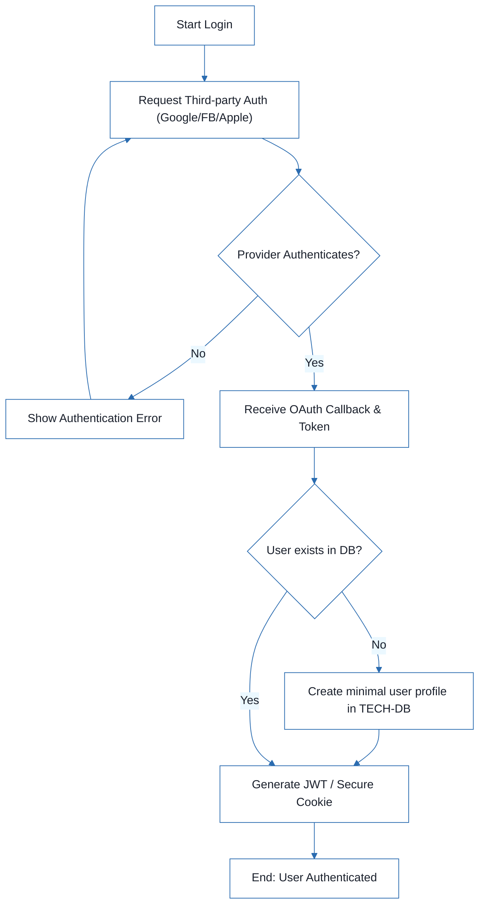
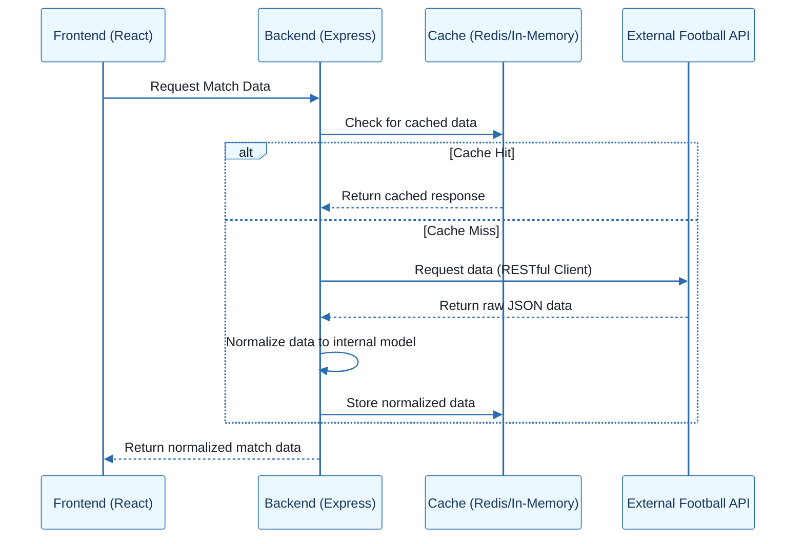
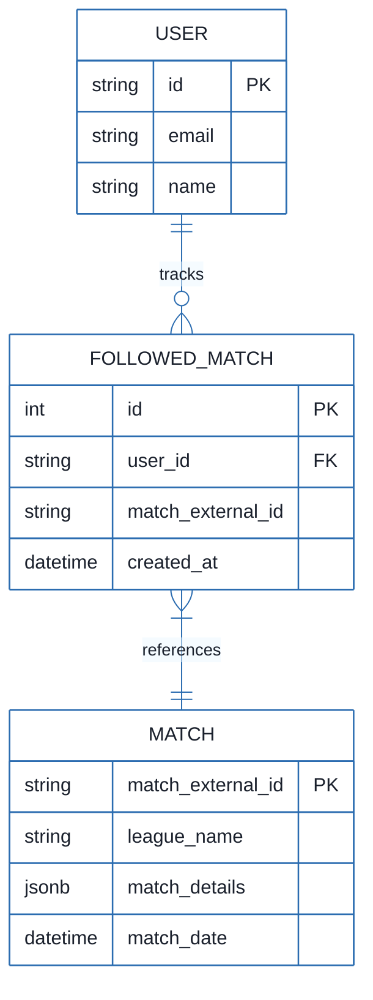

# Football Match Manager - Technical Specification & Architecture Document

## 1. Executive Summary & Architecture Overview

### 1.1 Executive Brief
The Football Match Manager is a full-stack application designed to track football matches and manage user follows. It utilizes a TypeScript-based architecture with a React 18 frontend and a Node.js 18/Express backend, persisting structured match and user data in a PostgreSQL 14 relational database. The system integrates third-party authentication via OAuth 2.0 and consumes external football data through a RESTful API client with a dedicated caching layer.

### 1.2 Maturity Assessment
The project is currently **BLOCKED**. While the technical stack is well-defined and the completeness score is high, the documentation is a research log rather than a functional specification. There are critical structural gaps regarding business goals, project scope, and unresolved architectural decisions (e.g., final UI framework and API provider), rendering the specifications insufficient for immediate execution.

### 1.3 Technical Stack
* **Languages**: TypeScript 4.9
* **Frontend**: React 18, React Context API
* **Backend**: Node.js 18, Express.js
* **Database**: PostgreSQL 14, Sequelize / TypeORM
* **Caching**: Redis
* **Authentication**: Passport.js, JWT
* **Testing**: Jest, React Testing Library, Supertest
* **Styling**: Tailwind CSS / Material-UI (MUI)

### 1.4 Architectural Constraints
* **Type Safety**: Strict static type checking via TypeScript 4.9+ is mandatory across the entire codebase.
* **Data Integrity**: ACID compliance is required for all transactions involving user follows and match data.
* **Authentication**: Third-party authentication must follow OAuth 2.0 / OpenID Connect standards.
* **Security**: Mandatory implementation of HTTPS, secure cookies, and CSRF protection for all session management.
* **API Consumption**: External API calls must be abstracted via a service layer and implement mandatory caching and rate-limiting mechanisms.
* **State Management**: Frontend state management is restricted to React Context API to maintain simplicity for moderate complexity.

### 1.5 Critical Dependencies
* **PostgreSQL 14**: Primary relational data storage.
* **External Football Data API**: Dependency on Football-Data.org or API-FOOTBALL.
* **OAuth 2.0 Providers**: Integration with Google, Facebook, and Apple.
* **Redis**: Required for API response caching.
* **JWT**: Used for secure session management.
* **Passport.js**: Orchestration of authentication strategies.

## 2. Architecture Workflows







```mermaid
%%{init: {
  'theme': 'base',
  'themeVariables': {
    'primaryColor': '#1A365D',
    'primaryTextColor': '#1A202C',
    'primaryBorderColor': '#2B6CB0',
    'lineColor': '#2B6CB0',
    'secondaryColor': '#EBF8FF',
    'tertiaryColor': '#EBF8FF',
    'background': '#FFFFFF',
    'mainBkg': '#FFFFFF',
    'secondBkg': '#EBF8FF',
    'tertiaryBkg': '#F7FAFC',
    'secondaryTextColor': '#4A5568',
    'fontSize': '16px',
    'fontFamily': 'Inter, system-ui, sans-serif',
    'nodePadding': '15px',
    'borderRadius': '8px',
    'edgeLabelBackground': '#EBF8FF',
    'clusterBkg': '#F7FAFC',
    'clusterBorder': '#2B6CB0',
    'defaultLinkColor': '#2B6CB0',
    'titleColor': '#1A365D',
    'actorBorder': '#2B6CB0',
    'actorBkg': '#EBF8FF',
    'actorTextColor': '#1A365D',
    'actorLineColor': '#2B6CB0',
    'signalColor': '#2B6CB0',
    'signalTextColor': '#1A202C',
    'labelBoxBorderColor': '#2B6CB0',
    'labelBoxBkgColor': '#EBF8FF',
    'labelTextColor': '#1A202C',
    'loopTextColor': '#1A202C',
    'arrowHeadColor': '#2B6CB0',
    'sequenceNumberColor': '#1A365D',
    'sequenceActorBorder': '#2B6CB0',
    'sequenceActorBkg': '#EBF8FF',
    'sequenceArrowColor': '#2B6CB0',
    'noteBkgColor': '#FFF5EB',
    'noteBorderColor': '#DD6B20',
    'noteTextColor': '#1A202C'
  }
}}%%
erDiagram
    USER ||--o{ FOLLOWED_MATCH : "tracks"
    USER {
        string id PK
        string email
        string name
    }
    FOLLOWED_MATCH {
        int id PK
        string user_id FK
        string match_external_id
        datetime created_at
    }
    MATCH {
        string match_external_id PK
        string league_name
        jsonb match_details
        datetime match_date
    }
    FOLLOWED_MATCH }|--|| MATCH : "references"
``` & Visual Diagrams

### 2.1 Technical Stack Traceability Map
```mermaid
%%{init: {
  'theme': 'base',
  'themeVariables': {
    'primaryColor': '#1A365D',
    'primaryTextColor': '#1A202C',
    'primaryBorderColor': '#2B6CB0',
    'lineColor': '#2B6CB0',
    'secondaryColor': '#EBF8FF',
    'tertiaryColor': '#EBF8FF',
    'background': '#FFFFFF',
    'mainBkg': '#FFFFFF',
    'secondBkg': '#EBF8FF',
    'tertiaryBkg': '#F7FAFC',
    'secondaryTextColor': '#4A5568',
    'fontSize': '16px',
    'fontFamily': 'Inter, system-ui, sans-serif',
    'nodePadding': '15px',
    'borderRadius': '8px',
    'edgeLabelBackground': '#EBF8FF',
    'clusterBkg': '#F7FAFC',
    'clusterBorder': '#2B6CB0',
    'defaultLinkColor': '#2B6CB0',
    'titleColor': '#1A365D',
    'actorBorder': '#2B6CB0',
    'actorBkg': '#EBF8FF',
    'actorTextColor': '#1A365D',
    'actorLineColor': '#2B6CB0',
    'signalColor': '#2B6CB0',
    'signalTextColor': '#1A202C',
    'labelBoxBorderColor': '#2B6CB0',
    'labelBoxBkgColor': '#EBF8FF',
    'labelTextColor': '#1A202C',
    'loopTextColor': '#1A202C',
    'arrowHeadColor': '#2B6CB0',
    'sequenceNumberColor': '#1A365D',
    'sequenceActorBorder': '#2B6CB0',
    'sequenceActorBkg': '#EBF8FF',
    'sequenceArrowColor': '#2B6CB0',
    'noteBkgColor': '#FFF5EB',
    'noteBorderColor': '#DD6B20',
    'noteTextColor': '#1A202C'
  }
}}%%
flowchart TD
    subgraph "Core Infrastructure"
        TECH-STACK["TECH-STACK: React 18 / Node.js 18 Express"]
        TECH-TS["TECH-TS: TypeScript 4.9+"]
        TECH-DB["TECH-DB: PostgreSQL 14 / Sequelize/TypeORM"]
    end
    subgraph "Functional Features"
        FEAT-AUTH["FEAT-AUTH: OAuth 2.0 Third-party Login"]
        FEAT-API["FEAT-API: Football Data API Integration"]
    end
    subgraph "Quality Assurance"
        TECH-TEST["TECH-TEST: Jest / RTL / Supertest"]
    end
    TECH-STACK -->|"depends_on"| TECH-TS
    FEAT-AUTH -->|"implements"| TECH-STACK
    FEAT-API -->|"relates_to"| TECH-DB
    TECH-TEST -->|"relates_to"| TECH-STACK
```

### 2.2 Authentication Workflow


### 2.3 Football Data API Integration Sequence


### 2.4 Data Model Entity Relationship


## 3. Detailed Technical Specifications & Business Rules

### 3.1 Requirements Traceability
| ID | Type | Requirement Description | Source Section |
| :--- | :--- | :--- | :--- |
| **TECH-TS** | NFR | Use TypeScript 4.9+ for static type checking and maintainability. | 1. Language/Version |
| **TECH-STACK** | NFR | Frontend: React 18 with TypeScript; Backend: Node.js 18 with Express.js. | 2. Primary Dependencies |
| **TECH-DB** | NFR | Use PostgreSQL 14 with Sequelize or TypeORM for ACID compliance and relational data. | 3. Storage: Database Choice |
| **TECH-TEST** | NFR | Testing strategy using Jest, React Testing Library (Frontend), and Supertest (Backend). | 4. Testing: Testing Framework |
| **FEAT-AUTH** | FR | Implement Third-party Login using OAuth 2.0 / OpenID Connect via passport.js (Google, Facebook, Apple). | Authentication Integration |
| **FEAT-API** | FR | Integrate Football Data API via a RESTful client with a service layer, caching (Redis), and rate limiting. | Football Data API Integration |
| **TECH-STATE** | NFR | Use React Context API for frontend state management. | State Management (Frontend) |
| **TECH-UI** | NFR | Use Tailwind CSS or Material-UI (MUI) for styling. | Styling and UI Framework |

### 3.2 Security Rules
* **Authentication**: All third-party logins must be orchestrated via `passport.js` using OAuth 2.0.
* **Session Management**: Secure session handling must be implemented using JWT or encrypted cookies.
* **Transport**: HTTPS is mandatory for all communications.
* **Protection**: CSRF protection must be active for all state-changing requests.

### 3.3 Data Models
* **User**: Minimal profile containing `id`, `email`, and `name`.
* **Match**: Relational record containing `match_external_id`, `league_name`, `match_date`, and a `jsonb` field for flexible `match_details`.
* **Followed Match**: Junction table linking `USER` to `MATCH` with a `created_at` timestamp.

## 4. Project Governance & Structural Gaps

### 4.1 Structural Gaps
| Missing Section | Priority | Remediation Advice |
| :--- | :--- | :--- |
| **Goals & Objectives** | HIGH | Define the business goals and the 'Why' behind the Football Match Manager. |
| **Scope & Out-of-Scope** | HIGH | Explicitly list which features are included (e.g., match tracking) and which are not. |
| **Open Questions** | MEDIUM | Document unresolved decisions, such as the final choice between Tailwind and MUI or the specific API provider. |

### 4.2 Remediation & Workflow
To move the project from **BLOCKED** to **READY**, the following actions are required:
1. Define the functional scope (User Stories).
2. Select the final Football Data API provider (Football-Data.org vs API-FOOTBALL).
3. Finalize the UI framework choice (Tailwind CSS vs MUI).
4. Decide between Sequelize and TypeORM for the database abstraction layer.

## 5. Technical & Domain Glossary (Terminology Reference)

| Term | Category | Context Anchor | Project Definition |
| :--- | :--- | :--- | :--- |
| ACID | TECHNICAL_STACK | TECH-DB | The set of properties ensuring that database transactions are processed reliably to maintain data integrity for user follows and match records. |
| API | TECHNICAL_STACK | FEAT-API | The RESTful interface used to fetch external football data, managed via a service layer with caching and rate limiting. |
| CSRF | TECHNICAL_STACK | FEAT-AUTH | A security mechanism implemented to prevent unauthorized commands from being transmitted from a user the web application trusts. |
| CSS | TECHNICAL_STACK | TECH-UI | The styling layer implemented via a utility-first approach for rapid interface development. |
| ID | BUSINESS_DOMAIN | FEAT-AUTH | The unique alphanumeric identifier stored for each authenticated user to link them to followed matches. |
| JSON | TECHNICAL_STACK | FEAT-API | The standard lightweight data-interchange format used for responses from external football data providers. |
| JSONB | TECHNICAL_STACK | TECH-DB | The binary storage format used within the relational database to handle flexible data structures from external sources. |
| JWT | TECHNICAL_STACK | FEAT-AUTH | The compact, URL-safe means of representing claims to be transferred between two parties for secure session management. |
| JavaScript | TECHNICAL_STACK | 1. Language/Version | The dynamic scripting language rejected as the primary development tool in favor of a statically typed alternative. |
| LTS | TECHNICAL_STACK | TECH-STACK | The long-term support version of the runtime environment used to ensure stability and performance. |
| MUI | TECHNICAL_STACK | TECH-UI | The library of pre-built components following Material Design guidelines for the user interface. |
| OAuth 2.0 | TECHNICAL_STACK | FEAT-AUTH | The industry-standard protocol for authorization used to implement third-party logins via Google, Facebook, and Apple. |
| ORM | TECHNICAL_STACK | TECH-DB | The abstraction layer used to facilitate database interactions and migrations without writing raw queries. |
| PostgreSQL | TECHNICAL_STACK | TECH-DB | The robust, open-source relational database engine selected for its reliability and advanced feature set. |
| React | TECHNICAL_STACK | TECH-STACK | The frontend library used to build the user interface, utilizing version 18 concurrent features and hooks. |
| TypeScript | TECHNICAL_STACK | TECH-TS | The statically typed superset of the primary scripting language used to catch errors early and improve maintainability. |
| UI | TECHNICAL_STACK | TECH-UI | The visual layer of the application, developed using either a utility-first framework or a component library. |
| Vue | TECHNICAL_STACK | TECH-STACK | The frontend framework considered but rejected due to the team's existing expertise in other libraries. |