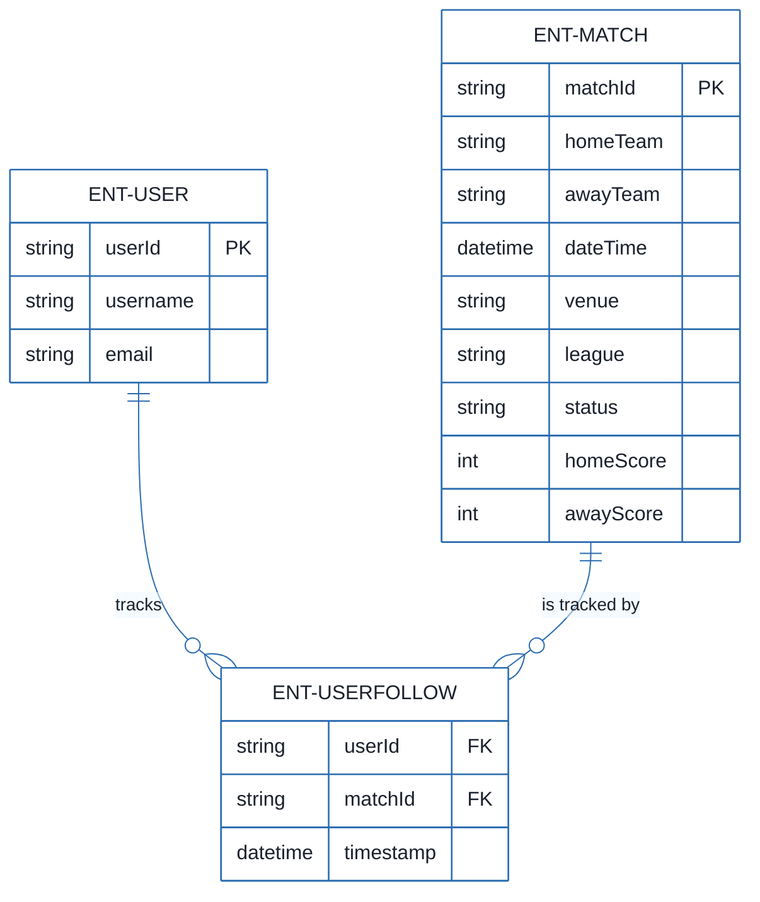
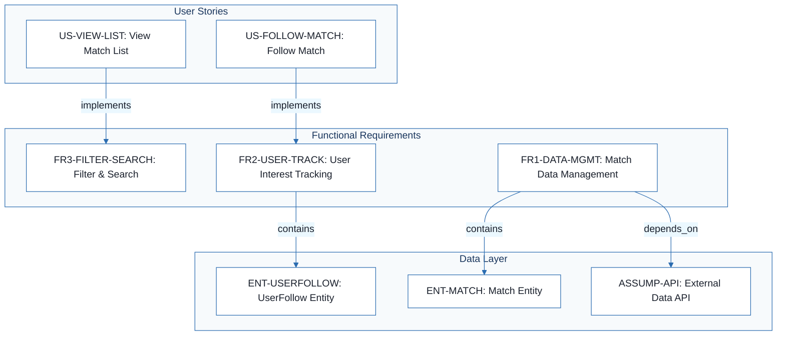
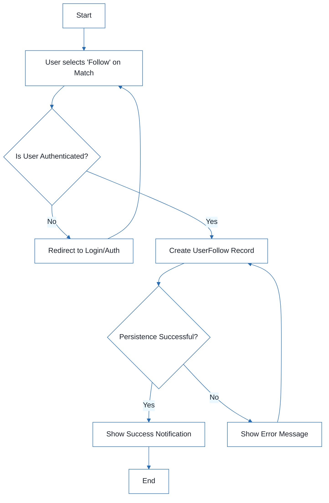
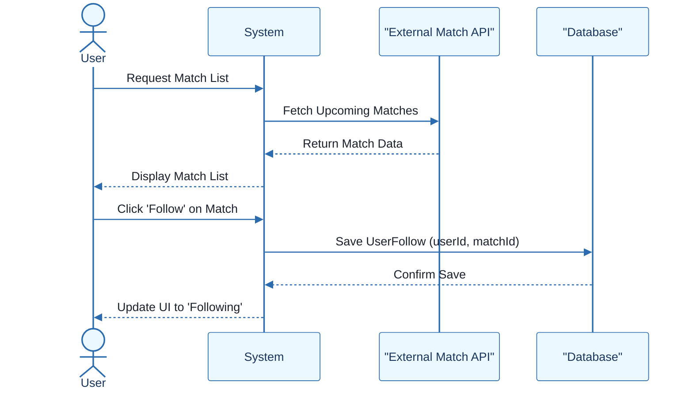

# Football Match Manager - Technical Specification & Architecture Document

## 1. Executive Summary & Architecture Overview

### 1.1 Executive Brief
The Football Match Manager is a web application designed for football fans to discover, filter, and track upcoming matches. The system implements a data-driven pattern centered on real-time match updates and user-specific interest tracking, utilizing a relational mapping between users and match entities to persist following states across sessions.

### 1.2 Maturity Assessment
The project is currently in a state of REFINEMENT. While the functional requirements and entity relationships are well-defined, there is a high-severity structural gap regarding the absence of 'Goals & Objectives', leaving the primary business drivers undefined. Additionally, critical uncertainties remain regarding the authentication method and the specific data provider.

### 1.3 Technical Stack
*   **External Data API**: Required for schedules, scores, and team information.
*   **Database**: Relational storage for User and UserFollow entities.
*   **Caching Layer**: Required to meet performance thresholds.

### 1.4 Architectural Constraints
*   **Performance**: Match list load time must be < 2 seconds for 95% of requests using cached data.
*   **MVP Scope Exclusion**: Social features, predictive analytics, and push notifications are strictly out of scope.

### 1.5 Critical Dependencies
*   External Football Match Data API for schedules, scores, and team information.
*   User authentication system for persisting UserFollow relationships.
*   Referential integrity between UserFollow, User, and Match entities.
*   Caching layer to meet the 2-second performance threshold.

## 2. Architecture Workflows







```mermaid
%%{init: {
  'theme': 'base',
  'themeVariables': {
    'primaryColor': '#1A365D',
    'primaryTextColor': '#1A202C',
    'primaryBorderColor': '#2B6CB0',
    'lineColor': '#2B6CB0',
    'secondaryColor': '#EBF8FF',
    'tertiaryColor': '#EBF8FF',
    'background': '#FFFFFF',
    'mainBkg': '#FFFFFF',
    'secondBkg': '#EBF8FF',
    'tertiaryBkg': '#F7FAFC',
    'secondaryTextColor': '#4A5568',
    'fontSize': '16px',
    'fontFamily': 'Inter, system-ui, sans-serif',
    'nodePadding': '15px',
    'borderRadius': '8px',
    'edgeLabelBackground': '#EBF8FF',
    'clusterBkg': '#F7FAFC',
    'clusterBorder': '#2B6CB0',
    'defaultLinkColor': '#2B6CB0',
    'titleColor': '#1A365D',
    'actorBorder': '#2B6CB0',
    'actorBkg': '#EBF8FF',
    'actorTextColor': '#1A365D',
    'actorLineColor': '#2B6CB0',
    'signalColor': '#2B6CB0',
    'signalTextColor': '#1A202C',
    'labelBoxBorderColor': '#2B6CB0',
    'labelBoxBkgColor': '#EBF8FF',
    'labelTextColor': '#1A202C',
    'loopTextColor': '#1A202C',
    'arrowHeadColor': '#2B6CB0',
    'sequenceNumberColor': '#1A365D',
    'sequenceActorBorder': '#2B6CB0',
    'sequenceActorBkg': '#EBF8FF',
    'sequenceArrowColor': '#2B6CB0',
    'noteBkgColor': '#FFF5EB',
    'noteBorderColor': '#DD6B20',
    'noteTextColor': '#1A202C'
  }
}}%%
sequenceDiagram
    actor User
    participant System
    participant API as "External Match API"
    participant DB as "Database"
    User->>System: Request Match List
    System->>API: Fetch Upcoming Matches
    API-->>System: Return Match Data
    System-->>User: Display Match List
    User->>System: Click 'Follow' on Match
    System->>DB: Save UserFollow (userId, matchId)
    DB-->>System: Confirm Save
    System-->>User: Update UI to 'Following'
``` & Visual Diagrams

### 2.1 Football Match Manager Data Model
```mermaid
%%{init: {
  'theme': 'base',
  'themeVariables': {
    'primaryColor': '#1A365D',
    'primaryTextColor': '#1A202C',
    'primaryBorderColor': '#2B6CB0',
    'lineColor': '#2B6CB0',
    'secondaryColor': '#EBF8FF',
    'tertiaryColor': '#EBF8FF',
    'background': '#FFFFFF',
    'mainBkg': '#FFFFFF',
    'secondBkg': '#EBF8FF',
    'tertiaryBkg': '#F7FAFC',
    'secondaryTextColor': '#4A5568',
    'fontSize': '16px',
    'fontFamily': 'Inter, system-ui, sans-serif',
    'nodePadding': '15px',
    'borderRadius': '8px',
    'edgeLabelBackground': '#EBF8FF',
    'clusterBkg': '#F7FAFC',
    'clusterBorder': '#2B6CB0',
    'defaultLinkColor': '#2B6CB0',
    'titleColor': '#1A365D',
    'actorBorder': '#2B6CB0',
    'actorBkg': '#EBF8FF',
    'actorTextColor': '#1A365D',
    'actorLineColor': '#2B6CB0',
    'signalColor': '#2B6CB0',
    'signalTextColor': '#1A202C',
    'labelBoxBorderColor': '#2B6CB0',
    'labelBoxBkgColor': '#EBF8FF',
    'labelTextColor': '#1A202C',
    'loopTextColor': '#1A202C',
    'arrowHeadColor': '#2B6CB0',
    'sequenceNumberColor': '#1A365D',
    'sequenceActorBorder': '#2B6CB0',
    'sequenceActorBkg': '#EBF8FF',
    'sequenceArrowColor': '#2B6CB0',
    'noteBkgColor': '#FFF5EB',
    'noteBorderColor': '#DD6B20',
    'noteTextColor': '#1A202C'
  }
}}%%
erDiagram
    ENT-USER ||--o{ ENT-USERFOLLOW : "tracks"
    ENT-MATCH ||--o{ ENT-USERFOLLOW : "is tracked by"
    ENT-USER {
        string userId PK
        string username
        string email
    }
    ENT-MATCH {
        string matchId PK
        string homeTeam
        string awayTeam
        datetime dateTime
        string venue
        string league
        string status
        int homeScore
        int awayScore
    }
    ENT-USERFOLLOW {
        string userId FK
        string matchId FK
        datetime timestamp
    }
```

### 2.2 Requirements Traceability Matrix


### 2.3 Match Following Workflow


### 2.4 Match Tracking Interaction


## 3. Detailed Technical Specifications & Business Rules

### 3.1 Requirements Traceability
| ID | Type | Description | Relation / Dependency |
| :--- | :--- | :--- | :--- |
| US-VIEW-LIST | User Story | As a football fan, I want to see a list of upcoming football matches so that I can decide which matches to follow. | Implements FR3-FILTER-SEARCH |
| US-FOLLOW-MATCH | User Story | As a football fan, I want to mark a match as interesting so that I can easily track it later. | Implements FR2-USER-TRACK |
| FR1-DATA-MGMT | Functional Req | The system shall provide functionality to manage football match data including storage, retrieval via API, real-time updates, and archiving. | Contains ENT-MATCH; Depends on ASSUMP-API |
| FR2-USER-TRACK | Functional Req | The system shall allow authenticated users to follow/unfollow matches and persist these relationships across sessions. | Contains ENT-USERFOLLOW |
| FR3-FILTER-SEARCH | Functional Req | The system shall enable users to filter matches by league, date range, and search by team name. | - |
| NFR-PERF-LOAD | Non-Functional Req | Match list loads in under 2 seconds for 95% of requests (with cached data). | - |
| ENT-MATCH | Entity | Match: Attributes include matchId, homeTeam, awayTeam, dateTime, venue, league, status, homeScore, awayScore. | - |
| ENT-USER | Entity | User: Attributes include userId, username, email. | - |
| ENT-USERFOLLOW | Entity | UserFollow: Join entity linking userId to matchId with a timestamp. | Depends on ENT-USER, ENT-MATCH |
| ASSUMP-API | Assumption | Assume access to a reliable football match data API for schedules, scores, and team info. | - |
| CONS-MVP-SCOPE | Constraint | Social features, predictive analytics, and push notifications are out of scope for MVP. | - |

### 3.2 Security Rules
*   **Authentication**: Required for any action involving `ENT-USERFOLLOW` persistence.
*   **Authorization**: Users may only modify their own `UserFollow` relationships.

### 3.3 Data Models
*   **ENT-USER**: Primary identity record for application users.
*   **ENT-MATCH**: Core data object retrieved from external API and cached locally.
*   **ENT-USERFOLLOW**: Associative entity managing the M:N relationship between Users and Matches.

## 4. Project Governance & Structural Gaps

### 4.1 Structural Gaps
| Gap | Priority | Remediation Advice |
| :--- | :--- | :--- |
| Goals & Objectives | HIGH | Add a section defining the primary business goal and the 'Why' behind the Football Match Manager to align stakeholders. |

### 4.2 Remediation & Workflow
*   **Immediate Action**: Define the high-level business objectives to resolve the structural gap.
*   **Technical Decision Required**: Select the specific Football Data API provider.
*   **Technical Decision Required**: Define the authentication method (e.g., OAuth2, JWT) for the MVP.

## 5. Technical & Domain Glossary (Terminology Reference)

| Term | Category | Context Anchor | Project Definition |
| :--- | :--- | :--- | :--- |
| API | TECHNICAL_STACK | ASSUMP-API | The external interface used for retrieving schedules, scores, and team information. |
| MVP | TECHNICAL_STACK | CONS-MVP-SCOPE | The initial version of the product excluding social features, predictive analytics, and push notifications. |
| UserFollow | BUSINESS_DOMAIN | ENT-USERFOLLOW | A join entity linking a specific person to a game with a timestamp to persist interest across sessions. |