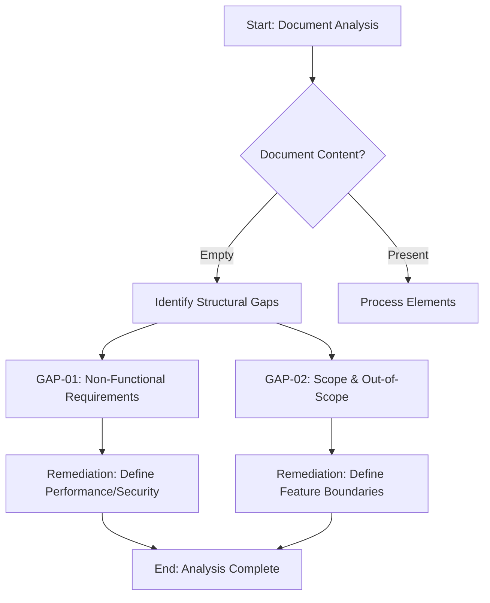

# Football Match Manager - Technical Specification & Architecture Document

## 1. Executive Summary & Architecture Overview

### 1.1 Executive Brief
The project is a 'Football Match Manager' application currently in a pre-conceptual stage. The provided documentation consists solely of empty section headers, meaning no core value proposition, host platform, or data patterns have been defined. It serves as a structural shell without any technical implementation details.

### 1.2 Maturity Assessment
The project is currently in a state of critical emptiness. While the document structure is present, the total absence of extracted nodes and edges, combined with high-severity gaps regarding Non-Functional Requirements and Scope definition, indicates that the specification is not actionable. Status: REFINEMENT.

### 1.3 Technical Stack
*   No languages, frameworks, or databases have been defined.

### 1.4 Architectural Constraints
*   No architectural constraints have been specified.

### 1.5 Critical Dependencies
*   No critical dependencies identified.

## 2. Architecture Workflows & Visual Diagrams

### Project Structure & Gap Analysis
A high-level map of the provided document structure and the identified critical gaps for the Football Match Manager project.

## 3. Detailed Technical Specifications & Business Rules

### 3.1 Requirements Traceability
| Requirement ID | Description | Source Section | Status |
| :--- | :--- | :--- | :--- |
| N/A | No requirements identified in source data | N/A | MISSING |

### 3.2 Security Rules
*   No security rules defined.

### 3.3 Data Models
*   No data models identified.

## 4. Project Governance & Structural Gaps

### 4.1 Structural Gaps
| Gap ID | Missing Section | Priority | Remediation Advice |
| :--- | :--- | :--- | :--- |
| GAP-01 | Non-Functional Requirements | HIGH | The document lacks a section for performance, security, and availability constraints. |
| GAP-02 | Scope & Out-of-Scope | HIGH | Define the boundaries of the feature to avoid scope creep. |

### 4.2 Remediation & Workflow
The current state of the documentation requires a full content definition phase. The remediation workflow involves:
1. Defining the specific feature name and objectives.
2. Establishing the functional and non-functional requirements.
3. Mapping the scope boundaries to prevent scope creep.
4. Defining the key entities and their relationships.

## 5. Technical & Domain Glossary (Terminology Reference)

| Term | Category | Context Anchor | Project Definition |
| :--- | :--- | :--- | :--- |
| NAME | BUSINESS_DOMAIN | Feature Specification: [FEATURE NAME] | The unique alphanumeric identifier assigned to a specific functional module within the sports coordination system. |