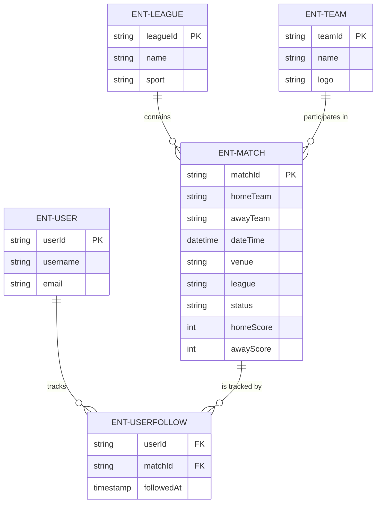
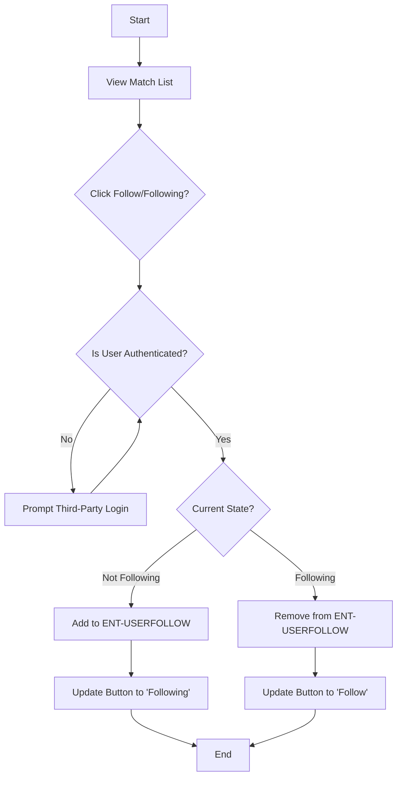
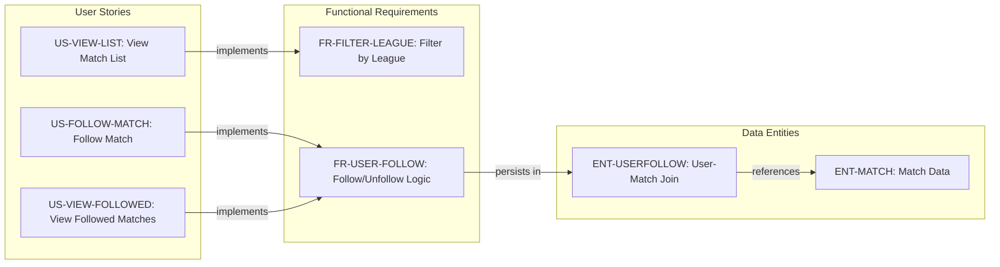
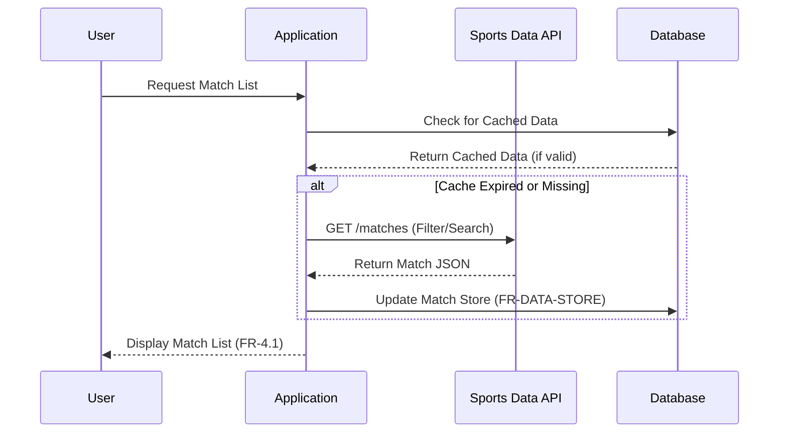

# Football Match Manager - Technical Specification & Architecture Document

## 1. Executive Summary & Architecture Overview

### 1.1 Executive Brief
The Football Match Manager is a web-based tracking platform enabling users to browse, filter, and follow football matches in real-time. The system acts as a data aggregator, consuming third-party sports APIs to persist match states and user-specific interest mappings. Its core value lies in delivering high-freshness score updates and a personalized 'followed matches' experience for authenticated users.

### 1.2 Maturity Assessment
The specification is logically sound regarding user journeys but lacks a strategic foundation. The absence of a 'Goals & Objectives' section represents a critical structural gap that hinders the alignment of success KPIs with business value. While the functional requirements are granular, the project requires REFINEMENT to resolve uncertainties regarding the specific API provider and the final authentication protocol before execution.

### 1.3 Technical Stack
*   **External Data Source**: Sports Data API (Mandatory)
*   **Authentication**: Third-party OAuth Providers (Google, Facebook, Apple)
*   **Frontend**: Responsive Web Design (Mobile & Desktop)

### 1.4 Architectural Constraints
*   **Data Refresh Intervals**: Upcoming match data must be refreshed at least every 6 hours.
*   **Live Update Frequency**: Live score updates must occur at least every 1 minute during active matches.
*   **Completion Latency**: Final scores must be updated within 5 minutes of match completion.
*   **Performance Thresholds**: Match list load time < 2 seconds (95% requests, cached); Detail page load time < 1.5 seconds (95% requests).
*   **Data Accuracy**: Live score delay must be < 60 seconds.
*   **Scope Exclusions**: Push notifications, social features (sharing, commenting), and predictive analytics are strictly out-of-scope for MVP.

### 1.5 Critical Dependencies
*   **External Football Data API**: Mandatory for match schedules, live scores, and team/league metadata.
*   **Third-party Authentication Provider**: Required for user session persistence and "Follow" functionality.
*   **UserFollow Entity**: Strict relational join dependency between User and Match entities.
*   **Referential Integrity**: UserFollow records must depend on existing User and Match IDs.

## 2. Architecture Workflows & Visual Diagrams

### 2.1 Data Model (ER Diagram)

### 2.2 Match Following Workflow

### 2.3 Requirements Traceability Matrix

### 2.4 Match Data Retrieval Sequence

## 3. Detailed Technical Specifications & Business Rules

### 3.1 Requirements Traceability
| Identifier | Type | Description | Source Section |
| :--- | :--- | :--- | :--- |
| **US-VIEW-LIST** | User Story | View upcoming football matches to decide which to follow | Scenario 1: Viewing Match List |
| **US-FOLLOW-MATCH** | User Story | Mark a match as interesting for later tracking | Scenario 2: Adding Match to Interests |
| **US-UNFOLLOW-MATCH** | User Story | Remove a match from the followed list | Scenario 3: Removing Match from Interests |
| **US-MATCH-DETAILS** | User Story | View detailed information about a specific match | Scenario 4: Viewing Match Details |
| **US-VIEW-FOLLOWED** | User Story | View only the matches currently being followed | Scenario 5: Viewing Followed Matches |
| **FR-DATA-STORE** | Functional Req | Store match information (teams, date/time, venue, league, status) | FR1: Match Data Management |
| **FR-DATA-API** | Functional Req | Retrieve match data from a reliable sports data source via API | FR1: Match Data Management |
| **FR-USER-FOLLOW** | Functional Req | Authenticated users can follow/unfollow any match | FR2: User Interest Tracking |
| **FR-FILTER-LEAGUE** | Functional Req | Filter matches by league/competition | FR3: Match Filtering and Search |
| **NFR-FRESH-LIVE** | Non-Functional Req | Live match scores updated at least every minute during active matches | FR5: Data Freshness |
| **SC-PERF-LOAD** | Success Criterion | Match list loads in under 2 seconds for 95% of requests (cached) | SC2: Performance |
| **ENT-MATCH** | Entity | Match: matchId, homeTeam, awayTeam, dateTime, venue, league, status, scores | Match |
| **ENT-TEAM** | Entity | Team: teamId, name, logo | Team |
| **ENT-USER** | Entity | User: userId, username, email | User (if authentication implemented) |
| **ENT-USERFOLLOW** | Entity | UserFollow: Links a user to a match they follow (userId, matchId) | UserFollow (join entity) |
| **AS-API-AVAIL** | Assumption | Assume access to a reliable football match data API | A1: Data Source |
| **C-NO-NOTIF** | Constraint | Push notifications are considered a post-MVP enhancement | A3: Scope Limitations |

### 3.2 Security Rules
*   **Authentication**: Access to "Follow" and "My Matches" features requires a valid session via third-party OAuth (Google, Facebook, Apple).
*   **Session Persistence**: User follow relationships must be persisted across sessions via the `ENT-USERFOLLOW` entity.

### 3.3 Data Models
*   **Match (ENT-MATCH)**: Primary entity containing match metadata and real-time scores.
*   **Team (ENT-TEAM)**: Reference entity for team names and branding.
*   **League (ENT-LEAGUE)**: Categorization entity for grouping matches.
*   **User (ENT-USER)**: Account entity for authenticated fans.
*   **UserFollow (ENT-USERFOLLOW)**: Join table managing the many-to-many relationship between Users and Matches.

## 4. Project Governance & Structural Gaps

### 4.1 Structural Gaps
| Gap | Priority | Remediation Advice |
| :--- | :--- | :--- |
| **Goals & Objectives** | HIGH | Define the high-level business goals and success KPIs for the project to align the team on 'Why' this is being built. |

### 4.2 Remediation & Workflow
1.  **Strategic Alignment**: Conduct a stakeholder workshop to define the "Goals & Objectives" section.
2.  **Technical Selection**: Evaluate and select a specific Football Data API provider based on cost and reliability.
3.  **Auth Protocol**: Finalize the specific OAuth flow for the chosen third-party providers.

## 5. Technical & Domain Glossary (Terminology Reference)

| Term | Category | Context Anchor | Project Definition |
| :--- | :--- | :--- | :--- |
| API | TECHNICAL_STACK | FR-DATA-API | the external sports data interface used to retrieve schedules, live scores, and league information |
| MVP | TECHNICAL_STACK | A3: Scope Limitations | the initial version of the product focused on tracking interests and viewing data, excluding social features and push notifications |
| Scenario | BUSINESS_DOMAIN | Scenario 1: Viewing Match List | a described user journey mapping specific interactions and expected outcomes for a football fan |
| UserFollow | BUSINESS_DOMAIN | ENT-USERFOLLOW | the join entity associating a specific authenticated account with a targeted game via a timestamped relationship |