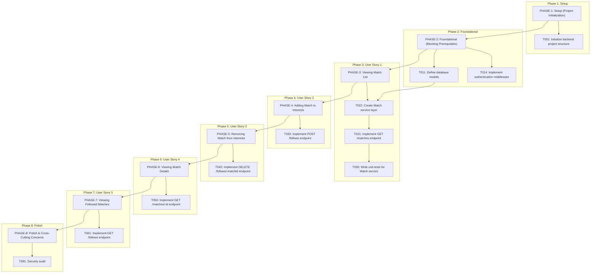
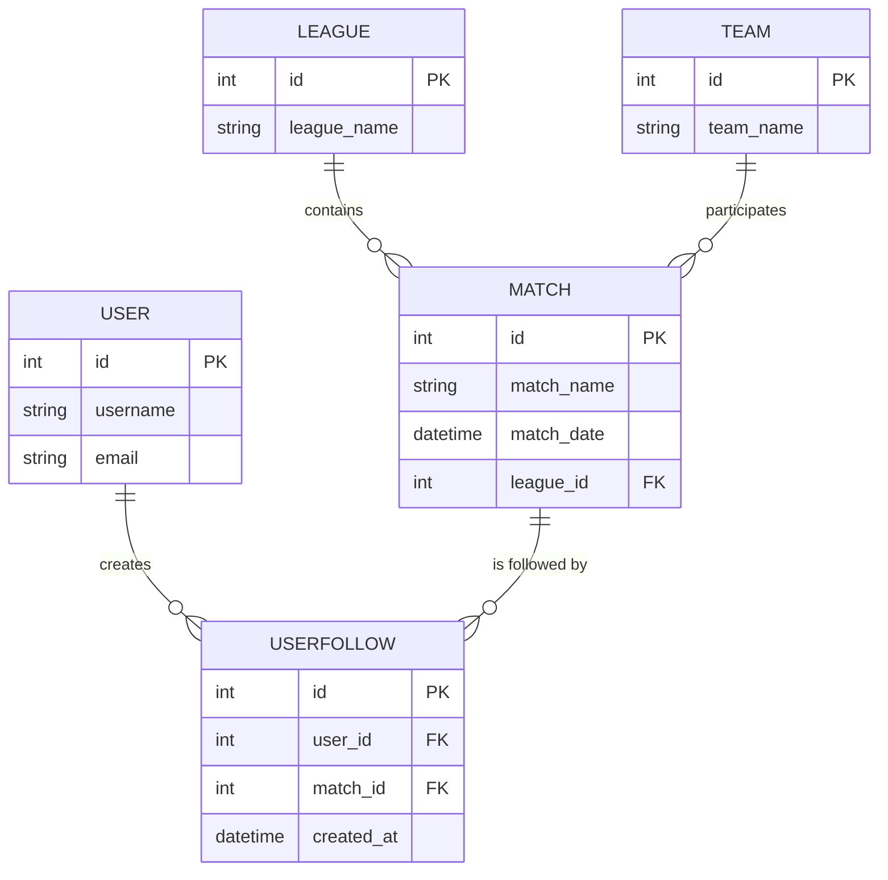
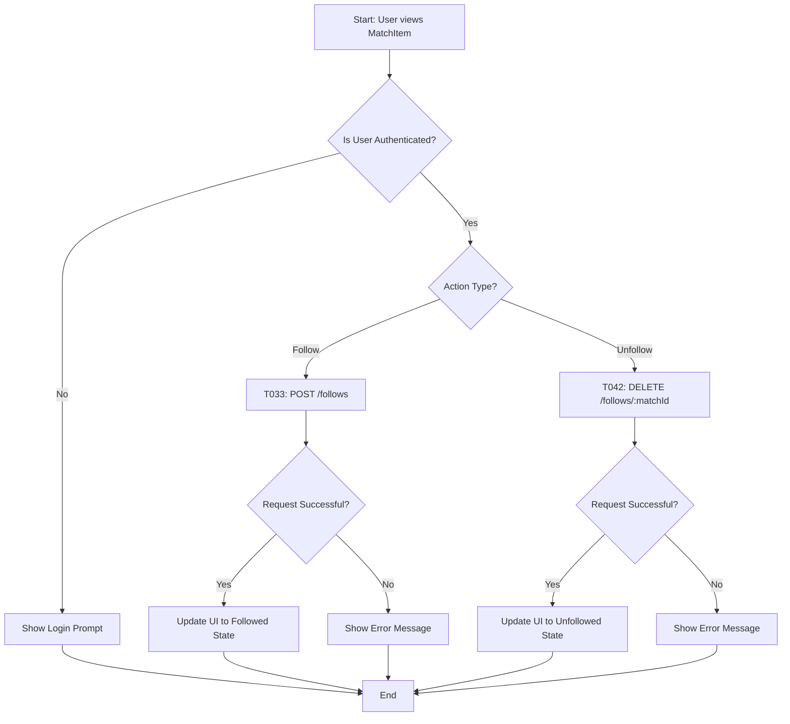
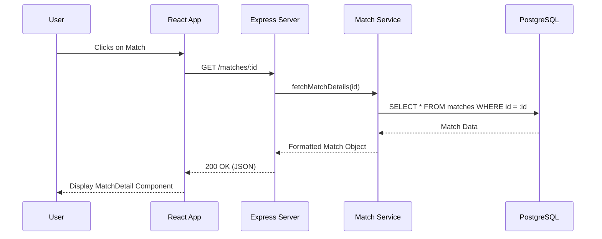

# Football Match Manager - Technical Specification & Architecture Document

## 1. Executive Summary & Architecture Overview

### 1.1 Executive Brief
Football Match Manager is a full-stack sports management application enabling users to browse football matches and manage a personalized list of interests. The system utilizes a Node.js/Express backend with a PostgreSQL database and a React/TypeScript frontend, implementing a standard REST API pattern with JWT-based authentication and a service-layer architecture.

### 1.2 Maturity Assessment
The project is currently in the REFINEMENT stage. While the execution roadmap is comprehensive and the structural completeness score is high, there is a critical lack of defined Acceptance Criteria for User Stories, which poses a risk of scope creep. The presence of high-severity gaps regarding 'done' definitions and the absence of a consolidated test plan necessitate further specification before full-scale implementation can be considered stable.

### 1.3 Technical Stack
* **Languages & Frameworks**: Node.js, Express, TypeScript, React
* **Database**: PostgreSQL
* **ORM**: Sequelize
* **Testing**: Jest
* **API Client**: Axios
* **Routing**: React Router
* **Tooling**: ESLint, Prettier

### 1.4 Architectural Constraints
* Mobile-first responsive design for all frontend components.
* JWT verification required for all protected endpoints via authentication middleware.
* Backend API must support filtering, sorting, and pagination for match listing.
* CORS and security headers must be explicitly configured on the server.
* Optimistic UI updates required for match follow/unfollow actions.
* Client-side caching for static data including leagues and teams.
* Mandatory security audit encompassing dependency scanning and penetration checks.

### 1.5 Critical Dependencies
* PostgreSQL database connection and schema migration integrity.
* JWT for session management and identity verification.
* Strict foreign key dependence between User and Match entities via the UserFollow model.
* Environment variables configuration (.env) for database and server credentials.
* Sequelize ORM for data mapping and connection pooling.
* Integration between the Match service layer and the REST controllers.

## 2. Architecture Workflows & Visual Diagrams

### 2.1 Project Execution Roadmap & Traceability

### 2.2 Match Management Data Model

### 2.3 Match Interest Workflow

### 2.4 Match Detail Retrieval Sequence

## 3. Detailed Technical Specifications & Business Rules

### 3.1 Requirements Traceability
| ID | Requirement / Task Description | Phase | Type |
| :--- | :--- | :--- | :--- |
| T001 | Initialize backend project structure with Node.js, Express, TypeScript | PHASE-1 | Task |
| T002 | Initialize frontend project structure with React, TypeScript | PHASE-1 | Task |
| T003 | Set up PostgreSQL database and configure connection | PHASE-1 | Task |
| T004 | Configure development tools (ESLint, Prettier, Jest) | PHASE-1 | Task |
| T005 | Create initial README with project overview and setup instructions | PHASE-1 | Task |
| T006 | Set up version control (git) and initial commit | PHASE-1 | Task |
| T007 | Configure environment variables template (.env.example) | PHASE-1 | Task |
| T008 | Set up basic backend server with health check endpoint | PHASE-1 | Task |
| T009 | Set up basic frontend app with routing (React Router) | PHASE-1 | Task |
| T010 | Configure CORS and basic security headers | PHASE-1 | Task |
| T011 | Define database models based on data-model.md (Match, Team, League, User, UserFollow) | PHASE-2 | Task |
| T012 | Implement database migrations for initial schema | PHASE-2 | Task |
| T013 | Set up Sequelize ORM configuration and connection pooling | PHASE-2 | Task |
| T014 | Implement authentication middleware for JWT verification | PHASE-2 | Task |
| T015 | Create base API controller structure with error handling | PHASE-2 | Task |
| T016 | Set up API documentation structure (Swagger/OpenAPI) | PHASE-2 | Task |
| T017 | Create frontend layout components (header, footer, layout) | PHASE-2 | Task |
| T018 | Implement global state management context (AuthContext) | PHASE-2 | Task |
| T019 | Set up HTTP service layer for API requests (Axios instance) | PHASE-2 | Task |
| T020 | Implement basic error boundary and loading components | PHASE-2 | Task |
| T021 | Implement GET /matches endpoint with filtering, sorting, and pagination | PHASE-3 | Task |
| T022 | Create Match service layer for data access and business logic | PHASE-3 | Task |
| T023 | Design and implement MatchList page route | PHASE-3 | Task |
| T024 | Create MatchList component to display list of matches | PHASE-3 | Task |
| T025 | Create MatchItem component for individual match display | PHASE-3 | Task |
| T026 | Implement FilterPanel component for league and date filters | PHASE-3 | Task |
| T027 | Implement SearchBar component for team name search | PHASE-3 | Task |
| T028 | Add loading and error states for match list | PHASE-3 | Task |
| T029 | Style match list with responsive design (mobile-first) | PHASE-3 | Task |
| T030 | Write unit tests for Match service and API controller | PHASE-3 | Test Case |
| T031 | Write integration tests for match listing endpoint | PHASE-3 | Task |
| T032 | Write frontend unit tests for MatchList and MatchItem components | PHASE-3 | Task |
| T033 | Implement POST /follows endpoint to follow a match | PHASE-4 | Task |
| T034 | Create UserFollow service layer for follow operations | PHASE-4 | Task |
| T035 | Add follow/unfollow button to MatchItem component | PHASE-4 | Task |
| T036 | Add follow/unfollow button to MatchDetail component | PHASE-4 | Task |
| T037 | Implement optimistic UI updates for follow actions | PHASE-4 | Task |
| T038 | Handle authentication state for follow button visibility | PHASE-4 | Task |
| T039 | Write unit tests for UserFollow service | PHASE-4 | Task |
| T040 | Write integration tests for follow/unfollow endpoints | PHASE-4 | Task |
| T041 | Write frontend tests for follow button interactions | PHASE-4 | Task |
| T042 | Implement DELETE /follows/:matchId endpoint to unfollow a match | PHASE-5 | Task |
| T043 | Extend UserFollow service to handle unfollow operations | PHASE-5 | Task |
| T044 | Update follow button to toggle between follow/unfollow states | PHASE-5 | Task |
| T045 | Add visual feedback for follow/unsuccessful unfollow operations | PHASE-5 | Task |
| T046 | Ensure followed state persists across page refreshes | PHASE-5 | Task |
| T047 | Write unit tests for unfollow functionality | PHASE-5 | Task |
| T048 | Write integration tests for unfollow endpoint | PHASE-5 | Task |
| T049 | Test follow/unfollow race conditions and edge cases | PHASE-5 | Task |
| T050 | Implement GET /matches/:id endpoint to retrieve single match | PHASE-6 | Task |
| T051 | Enhance Match service to fetch detailed match data | PHASE-6 | Task |
| T052 | Design and implement MatchDetails page route | PHASE-6 | Task |
| T053 | Create MatchDetail component with comprehensive match information | PHASE-6 | Task |
| T054 | Display venue, league info, timestamps, and scores | PHASE-6 | Task |
| T055 | Add follow/unfollow button to match detail view | PHASE-6 | Task |
| T056 | Implement loading and error states for match details | PHASE-6 | Task |
| T057 | Style match detail page with responsive design | PHASE-6 | Task |
| T058 | Write unit tests for match detail service and controller | PHASE-6 | Task |
| T059 | Write integration tests for match detail endpoint | PHASE-6 | Task |
| T060 | Write frontend tests for MatchDetail component | PHASE-6 | Task |
| T061 | Implement GET /follows endpoint to get user's followed matches | PHASE-7 | Task |
| T062 | Extend UserFollow service to retrieve followed matches with details | PHASE-7 | Task |
| T063 | Design and implement FollowedMatches page route | PHASE-7 | Task |
| T064 | Create FollowedMatches list component (similar to MatchList) | PHASE-7 | Task |
| T065 | Show follow status and ability to unfollow from this list | PHASE-7 | Task |
| T066 | Add empty state message when no matches are followed | PHASE-7 | Task |
| T067 | Implement sorting and filtering for followed matches | PHASE-7 | Task |
| T068 | Write unit tests for followed matches service | PHASE-7 | Task |
| T069 | Write integration tests for followed matches endpoint | PHASE-7 | Task |
| T070 | Write frontend tests for FollowedMatches page | PHASE-7 | Task |
| T071 | Implement global error handling boundary (frontend) | PHASE-8 | Task |
| T072 | Add loading skeletons and placeholder UI for better UX | PHASE-8 | Task |
| T073 | Optimize API responses with selective field inclusion | PHASE-8 | Task |
| T074 | Implement client-side caching for frequently accessed data (leagues, teams) | PHASE-8 | Task |
| T075 | Add form validation and error display for any future forms | PHASE-8 | Task |
| T076 | Ensure responsive design works across mobile, tablet, desktop | PHASE-8 | Task |
| T077 | Implement basic accessibility (ARIA labels, keyboard navigation) | PHASE-8 | Task |
| T078 | Add meta tags and basic SEO for public pages | PHASE-8 | Task |
| T079 | Write comprehensive end-to-end tests for critical user flows | PHASE-8 | Task |
| T080 | Performance audit and optimization (bundle size, lazy loading) | PHASE-8 | Task |
| T081 | Security audit (dependency scanning, basic penetration checks) | PHASE-8 | Constraint |
| T082 | Prepare production build scripts and deployment documentation | PHASE-8 | Task |
| T083 | Create final README with API documentation and contribution guidelines | PHASE-8 | Task |
| T084 | Conduct code review and address all linting issues | PHASE-8 | Task |
| T085 | Prepare release notes and version tagging | PHASE-8 | Task |

### 3.2 Security Rules
* **Authentication**: All protected endpoints must be guarded by JWT verification middleware (T014).
* **Access Control**: Follow/Unfollow actions (T033, T042) require a valid authenticated session.
* **Infrastructure**: CORS and security headers must be explicitly configured to prevent unauthorized cross-origin requests (T010).
* **Audit**: A mandatory security audit including dependency scanning and penetration checks must be performed before release (T081).

### 3.3 Data Models
* **User**: Core identity entity (id, username, email).
* **Match**: Core event entity (id, match_name, match_date, league_id).
* **Team**: Participating entity (id, team_name).
* **League**: Organizing entity (id, league_name).
* **UserFollow**: Junction table linking Users to Matches (id, user_id, match_id, created_at).

## 4. Project Governance & Structural Gaps

### 4.1 Structural Gaps
| Gap | Priority | Remediation Advice |
| :--- | :--- | :--- |
| Acceptance Criteria | HIGH | Define specific 'done' criteria for each User Story phase to avoid scope creep. |
| Testing & Validation | MEDIUM | Create a consolidated test plan beyond the per-task unit test requirements. |
| Security & Performance Constraints | MEDIUM | Specify minimum performance benchmarks and detailed security standards. |
| Dependencies & Integration Points | MEDIUM | Identify external API dependencies or library requirements explicitly. |
| Implementation Notes & References | LOW | Link to design documents or data model specs (e.g., data-model.md). |
| Open Questions & Uncertainties | LOW | Log unknown requirements for the polish phase. |
| Checkboxes Checklist | LOW | Create a separate final validation checklist. |

### 4.2 Remediation & Workflow
The project will move from the Refinement stage to Implementation once the High-priority gaps (Acceptance Criteria) are addressed. The workflow follows a strict sequential dependency: Setup $\rightarrow$ Foundational $\rightarrow$ User Stories (1-5) $\rightarrow$ Polish.

## 5. Technical & Domain Glossary (Terminology Reference)

| Term | Category | Context Anchor | Project Definition |
| :--- | :--- | :--- | :--- |
| API | TECHNICAL_STACK | T015 | The structural interface for server-side controllers handling requests and responses. |
| ARIA | TECHNICAL_STACK | PHASE-8 | Attributes used to improve the accessibility of the user interface for assistive technologies. |
| AuthContext | TECHNICAL_STACK | PHASE-2 | The global state provider managing session-related information across the frontend. |
| CORS | TECHNICAL_STACK | PHASE-1 | The security mechanism regulating cross-origin resource sharing between the client and server. |
| CORS Standard | TECHNICAL_STACK | PHASE-1 | The industry-standard protocol for managing cross-domain request permissions. |
| FilterPanel | TECHNICAL_STACK | PHASE-3 | A frontend component facilitating the refinement of the match list by league or date. |
| FollowedMatches | BUSINESS_DOMAIN | PHASE-7 | A curated collection of sports events a user has marked as interests. |
| JWT | TECHNICAL_STACK | T014 | The signed token used for stateless authentication and verification of identities. |
| MatchDetail | TECHNICAL_STACK | T053 | The frontend component rendering exhaustive information for a single specific game. |
| MatchDetails | BUSINESS_DOMAIN | T052 | The granular data view containing venue, timestamps, and scoring information. |
| MatchItem | TECHNICAL_STACK | T025 | The atomic frontend unit representing a single entry within a listing of games. |
| MatchList | TECHNICAL_STACK | T024 | The frontend component responsible for iterating and displaying a collection of sports events. |
| Middleware | TECHNICAL_STACK | T014 | The interceptor layer used for authentication verification before reaching the final request handler. |
| ORM | TECHNICAL_STACK | PHASE-2 | The abstraction layer used for mapping relational database tables to software objects via Sequelize. |
| README | TECHNICAL_STACK | PHASE-1 | The primary documentation file containing setup instructions and architectural overviews. |
| SEO | TECHNICAL_STACK | PHASE-8 | The application of meta tags and indexing optimizations to increase search engine visibility. |
| SearchBar | TECHNICAL_STACK | T027 | The frontend input field used for filtering games by team names. |
| TypeScript | TECHNICAL_STACK | T001 | The strongly-typed superset of JavaScript used across both frontend and backend layers. |
| UI | TECHNICAL_STACK | T037 | The visual layer of the application, including the implementation of optimistic updates. |
| UX | TECHNICAL_STACK | T072 | The overall user interaction quality, enhanced by loading skeletons and placeholders. |
| UserFollow | BUSINESS_DOMAIN | T011 | The relational entity linking a person to a specific sports event of interest. |