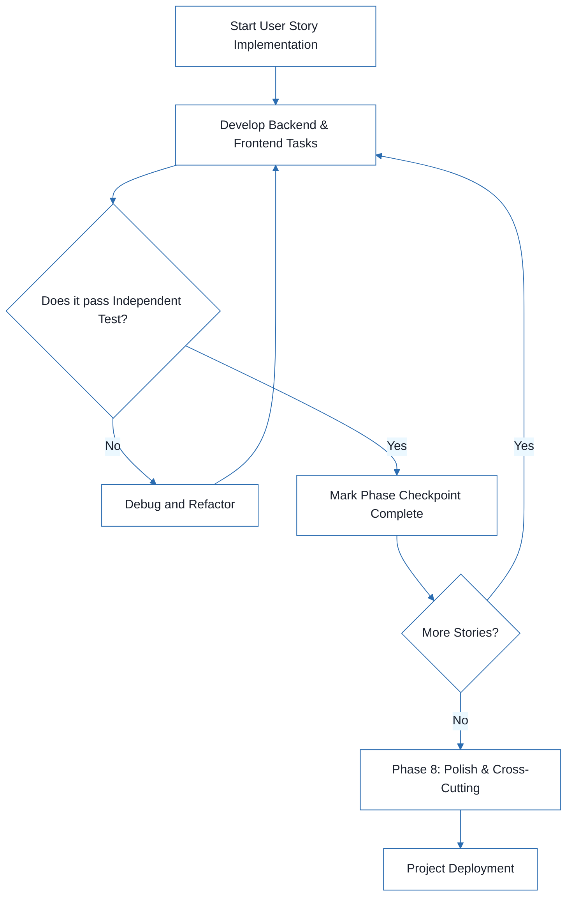
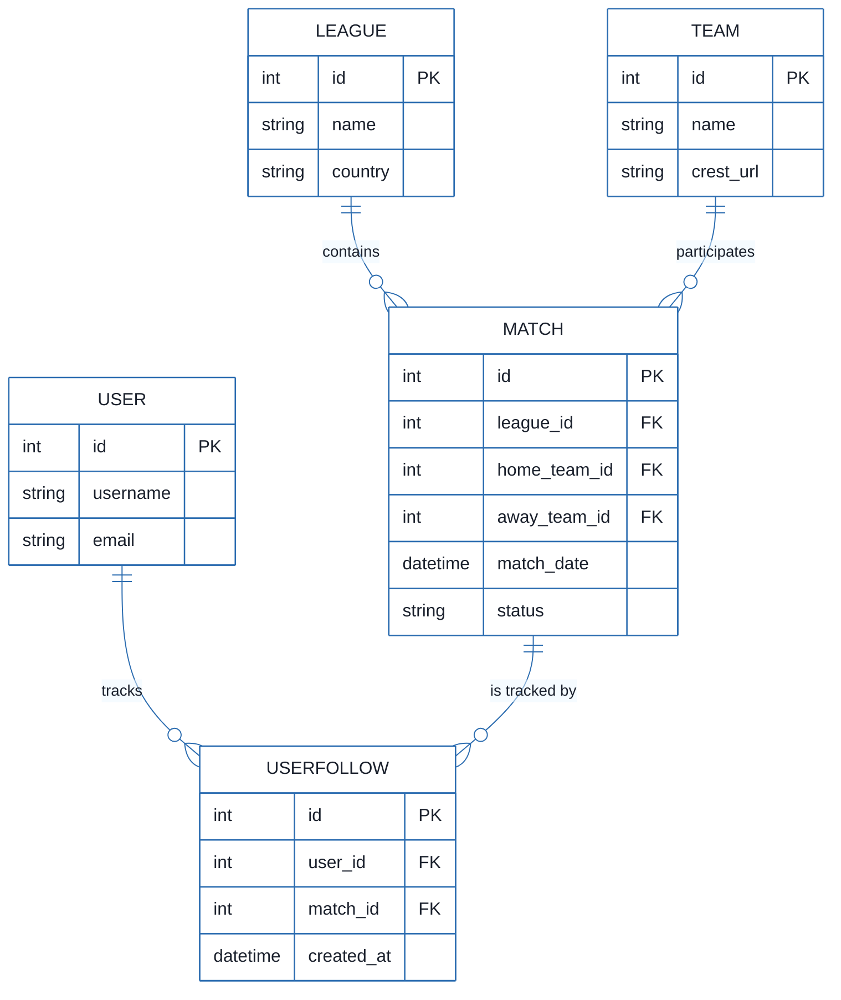
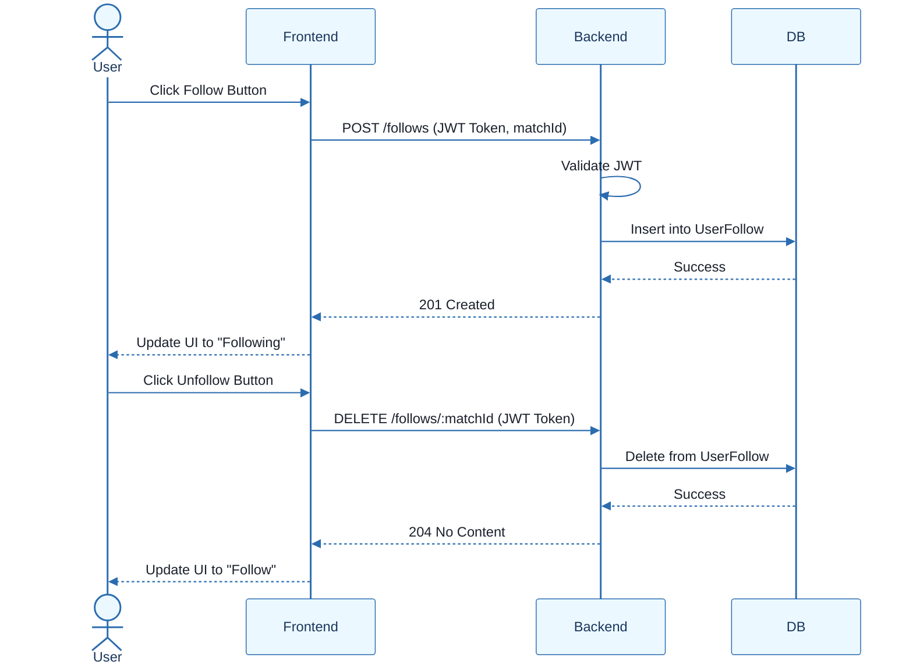

# Football Match Manager - Technical Specification & Architecture Document

## 1. Executive Summary & Architecture Overview

### 1.1 Executive Brief
The Football Match Manager is a full-stack tracking system designed to allow users to view, filter, and follow football matches. Hosted on a Node.js/React architecture with a PostgreSQL backend, the system implements a relational data pattern to manage matches, teams, leagues, and user-specific interests via a following mechanism.

### 1.2 Maturity Assessment
The project structure is logically sequenced with a clear MVP path, but it is currently in REFINEMENT. While the task mapping is complete, there are critical architectural voids regarding formalized Acceptance Criteria and detailed Security & Performance constraints (e.g., rate limiting, password hashing) that must be addressed to ensure production-grade stability.

### 1.3 Technical Stack
* **Backend**: Node.js 18, Express.js, TypeScript 4.9
* **Frontend**: React 18, TypeScript, Vite
* **Database**: PostgreSQL
* **Authentication**: JWT
* **Tooling**: ESLint, Prettier, Docker, docker-compose

### 1.4 Architectural Constraints
* **Source Isolation**: Strict separation of concerns with backend source in `backend/src/` and frontend source in `frontend/src/`.
* **Sequential Execution**: Phase 2 (Foundational) must be 100% complete before any User Story implementation begins.
* **Testing Policy**: Tests are OPTIONAL unless explicitly requested in feature specifications.
* **Security**: Mandatory JWT-based authentication middleware for all protected routes.
* **UI/UX**: Responsive design requirement for mobile devices.
* **Deployment**: Containerization via Dockerfile and docker-compose.

### 1.5 Critical Dependencies
* PostgreSQL database schema and migrations framework.
* JWT for session management and authentication.
* Environment variables defined in `.env` for backend configuration.
* Referential integrity between `User`, `Match`, and `UserFollow` entities.
* Strict dependency chain: Models $\rightarrow$ Services $\rightarrow$ API Endpoints.
* Seed data for Teams, Leagues, and Matches required for initial validation.

## 2. Architecture Workflows

```mermaid
%%{init: {
  'theme': 'base',
  'themeVariables': {
    'primaryColor': '#1A365D',
    'primaryTextColor': '#1A202C',
    'primaryBorderColor': '#2B6CB0',
    'lineColor': '#2B6CB0',
    'secondaryColor': '#EBF8FF',
    'tertiaryColor': '#EBF8FF',
    'background': '#FFFFFF',
    'mainBkg': '#FFFFFF',
    'secondBkg': '#EBF8FF',
    'tertiaryBkg': '#F7FAFC',
    'secondaryTextColor': '#4A5568',
    'fontSize': '16px',
    'fontFamily': 'Inter, system-ui, sans-serif',
    'nodePadding': '15px',
    'borderRadius': '8px',
    'edgeLabelBackground': '#EBF8FF',
    'clusterBkg': '#F7FAFC',
    'clusterBorder': '#2B6CB0',
    'defaultLinkColor': '#2B6CB0',
    'titleColor': '#1A365D',
    'actorBorder': '#2B6CB0',
    'actorBkg': '#EBF8FF',
    'actorTextColor': '#1A365D',
    'actorLineColor': '#2B6CB0',
    'signalColor': '#2B6CB0',
    'signalTextColor': '#1A202C',
    'labelBoxBorderColor': '#2B6CB0',
    'labelBoxBkgColor': '#EBF8FF',
    'labelTextColor': '#1A202C',
    'loopTextColor': '#1A202C',
    'arrowHeadColor': '#2B6CB0',
    'sequenceNumberColor': '#1A365D',
    'sequenceActorBorder': '#2B6CB0',
    'sequenceActorBkg': '#EBF8FF',
    'sequenceArrowColor': '#2B6CB0',
    'noteBkgColor': '#FFF5EB',
    'noteBorderColor': '#DD6B20',
    'noteTextColor': '#1A202C'
  }
}}%%
flowchart TD
    subgraph PHASE-1["PHASE-1: Setup"]
        T001["T001: Create project structure"]
        T010["T010: Create README.md"]
    end
    subgraph PHASE-2["PHASE-2: Foundational"]
        T020["T020: Create initial seed data"]
    end
    subgraph PHASE-3["PHASE-3: US1 - Viewing Match List"]
        T030["T030: Add filter UI"]
    end
    subgraph PHASE-4["PHASE-4: US2 - Adding Interests"]
        T039["T039: Following state management"]
    end
    subgraph PHASE-5["PHASE-5: US3 - Removing Interests"]
        T044["T044: Add confirmation dialog"]
    end
    subgraph PHASE-6["PHASE-6: US4 - Match Details"]
        T050["T050: Show match status and scores"]
    end
    subgraph PHASE-7["PHASE-7: US5 - Followed Matches"]
        T056["T056: Add navigation to followed page"]
    end
    subgraph PHASE-8["PHASE-8: Polish"]
        T070["T070: Create deployment config"]
    end
    T001 --> T010
    T010 --> T020
    T020 --> T030
    T030 --> T039
    T039 --> T044
    T044 --> T050
    T050 --> T056
    T056 --> T070
```







```mermaid
%%{init: {
  'theme': 'base',
  'themeVariables': {
    'primaryColor': '#1A365D',
    'primaryTextColor': '#1A202C',
    'primaryBorderColor': '#2B6CB0',
    'lineColor': '#2B6CB0',
    'secondaryColor': '#EBF8FF',
    'tertiaryColor': '#EBF8FF',
    'background': '#FFFFFF',
    'mainBkg': '#FFFFFF',
    'secondBkg': '#EBF8FF',
    'tertiaryBkg': '#F7FAFC',
    'secondaryTextColor': '#4A5568',
    'fontSize': '16px',
    'fontFamily': 'Inter, system-ui, sans-serif',
    'nodePadding': '15px',
    'borderRadius': '8px',
    'edgeLabelBackground': '#EBF8FF',
    'clusterBkg': '#F7FAFC',
    'clusterBorder': '#2B6CB0',
    'defaultLinkColor': '#2B6CB0',
    'titleColor': '#1A365D',
    'actorBorder': '#2B6CB0',
    'actorBkg': '#EBF8FF',
    'actorTextColor': '#1A365D',
    'actorLineColor': '#2B6CB0',
    'signalColor': '#2B6CB0',
    'signalTextColor': '#1A202C',
    'labelBoxBorderColor': '#2B6CB0',
    'labelBoxBkgColor': '#EBF8FF',
    'labelTextColor': '#1A202C',
    'loopTextColor': '#1A202C',
    'arrowHeadColor': '#2B6CB0',
    'sequenceNumberColor': '#1A365D',
    'sequenceActorBorder': '#2B6CB0',
    'sequenceActorBkg': '#EBF8FF',
    'sequenceArrowColor': '#2B6CB0',
    'noteBkgColor': '#FFF5EB',
    'noteBorderColor': '#DD6B20',
    'noteTextColor': '#1A202C'
  }
}}%%
sequenceDiagram
    actor User
    participant Frontend
    participant Backend
    participant DB
    User->>Frontend: Click Follow Button
    Frontend->>Backend: POST /follows (JWT Token, matchId)
    Backend->>Backend: Validate JWT
    Backend->>DB: Insert into UserFollow
    DB-->>Backend: Success
    Backend-->>Frontend: 201 Created
    Frontend-->>User: Update UI to "Following"
    User->>Frontend: Click Unfollow Button
    Frontend->>Backend: DELETE /follows/:matchId (JWT Token)
    Backend->>DB: Delete from UserFollow
    DB-->>Backend: Success
    Backend-->>Frontend: 204 No Content
    Frontend-->>User: Update UI to "Follow"
``` & Visual Diagrams

### 2.1 Project Implementation Roadmap & Traceability
```mermaid
%%{init: {
  'theme': 'base',
  'themeVariables': {
    'primaryColor': '#1A365D',
    'primaryTextColor': '#1A202C',
    'primaryBorderColor': '#2B6CB0',
    'lineColor': '#2B6CB0',
    'secondaryColor': '#EBF8FF',
    'tertiaryColor': '#EBF8FF',
    'background': '#FFFFFF',
    'mainBkg': '#FFFFFF',
    'secondBkg': '#EBF8FF',
    'tertiaryBkg': '#F7FAFC',
    'secondaryTextColor': '#4A5568',
    'fontSize': '16px',
    'fontFamily': 'Inter, system-ui, sans-serif',
    'nodePadding': '15px',
    'borderRadius': '8px',
    'edgeLabelBackground': '#EBF8FF',
    'clusterBkg': '#F7FAFC',
    'clusterBorder': '#2B6CB0',
    'defaultLinkColor': '#2B6CB0',
    'titleColor': '#1A365D',
    'actorBorder': '#2B6CB0',
    'actorBkg': '#EBF8FF',
    'actorTextColor': '#1A365D',
    'actorLineColor': '#2B6CB0',
    'signalColor': '#2B6CB0',
    'signalTextColor': '#1A202C',
    'labelBoxBorderColor': '#2B6CB0',
    'labelBoxBkgColor': '#EBF8FF',
    'labelTextColor': '#1A202C',
    'loopTextColor': '#1A202C',
    'arrowHeadColor': '#2B6CB0',
    'sequenceNumberColor': '#1A365D',
    'sequenceActorBorder': '#2B6CB0',
    'sequenceActorBkg': '#EBF8FF',
    'sequenceArrowColor': '#2B6CB0',
    'noteBkgColor': '#FFF5EB',
    'noteBorderColor': '#DD6B20',
    'noteTextColor': '#1A202C'
  }
}}%%
flowchart TD
    subgraph PHASE-1["PHASE-1: Setup"]
        T001["T001: Create project structure"]
        T010["T010: Create README.md"]
    end
    subgraph PHASE-2["PHASE-2: Foundational"]
        T020["T020: Create initial seed data"]
    end
    subgraph PHASE-3["PHASE-3: US1 - Viewing Match List"]
        T030["T030: Add filter UI"]
    end
    subgraph PHASE-4["PHASE-4: US2 - Adding Interests"]
        T039["T039: Following state management"]
    end
    subgraph PHASE-5["PHASE-5: US3 - Removing Interests"]
        T044["T044: Add confirmation dialog"]
    end
    subgraph PHASE-6["PHASE-6: US4 - Match Details"]
        T050["T050: Show match status and scores"]
    end
    subgraph PHASE-7["PHASE-7: US5 - Followed Matches"]
        T056["T056: Add navigation to followed page"]
    end
    subgraph PHASE-8["PHASE-8: Polish"]
        T070["T070: Create deployment config"]
    end
    T001 --> T010
    T010 --> T020
    T020 --> T030
    T030 --> T039
    T039 --> T044
    T044 --> T050
    T050 --> T056
    T056 --> T070
```

### 2.2 Development Workflow


### 2.3 Data Model Entity Relationship Diagram


### 2.4 Match Interest Management Sequence


## 3. Detailed Technical Specifications & Business Rules

### 3.1 Requirements Traceability
| ID | Requirement / Task Description | Phase | Story |
| :--- | :--- | :--- | :--- |
| T001 | Create project structure per implementation plan | PHASE-1 | N/A |
| T002 | Initialize backend project with Node.js 18, Express.js, TypeScript 4.9 | PHASE-1 | N/A |
| T003 | Initialize frontend project with React 18, TypeScript | PHASE-1 | N/A |
| T004 | Configure ESLint and Prettier for code quality | PHASE-1 | N/A |
| T005 | Setup TypeScript configuration for backend (tsconfig.json) | PHASE-1 | N/A |
| T006 | Setup TypeScript configuration for frontend (tsconfig.json) | PHASE-1 | N/A |
| T007 | Configure Vite for frontend development | PHASE-1 | N/A |
| T008 | Create .env file for backend environment variables | PHASE-1 | N/A |
| T009 | Setup package.json scripts for dev, build, test | PHASE-1 | N/A |
| T010 | Create README.md with setup instructions | PHASE-1 | N/A |
| T011 | Setup PostgreSQL database schema and migrations framework | PHASE-2 | N/A |
| T012 | Create database models for Match, Team, League, User, UserFollow | PHASE-2 | N/A |
| T013 | Implement database connection and configuration | PHASE-2 | N/A |
| T014 | Setup Express.js middleware (cors, morgan, json) | PHASE-2 | N/A |
| T015 | Create base Express app structure in backend/src/app.ts | PHASE-2 | N/A |
| T016 | Create server entry point in backend/src/server.ts | PHASE-2 | N/A |
| T017 | Setup JWT authentication middleware | PHASE-2 | N/A |
| T018 | Create error handling middleware | PHASE-2 | N/A |
| T019 | Setup API routes structure (auth, matches, follows, teams, leagues) | PHASE-2 | N/A |
| T020 | Create initial seed data for teams, leagues, and matches | PHASE-2 | N/A |
| T021 | Create Match model in backend/src/models/Match.ts | PHASE-3 | US1 |
| T022 | Create Team model in backend/src/models/Team.ts | PHASE-3 | US1 |
| T023 | Create League model in backend/src/models/League.ts | PHASE-3 | US1 |
| T024 | Implement MatchService in backend/src/services/MatchService.ts | PHASE-3 | US1 |
| T025 | Create GET /matches endpoint in backend/src/routes/matches.ts | PHASE-3 | US1 |
| T026 | Implement match filtering logic (by league, date, search) | PHASE-3 | US1 |
| T027 | Create MatchList component in frontend/src/components/MatchList.tsx | PHASE-3 | US1 |
| T028 | Create MatchCard component in frontend/src/components/MatchCard.tsx | PHASE-3 | US1 |
| T029 | Implement match listing in frontend/src/App.tsx | PHASE-3 | US1 |
| T030 | Add filter UI for league and date in frontend/src/App.tsx | PHASE-3 | US1 |
| T031 | Create User model in backend/src/models/User.ts | PHASE-4 | US2 |
| T032 | Create UserFollow model in backend/src/models/UserFollow.ts | PHASE-4 | US2 |
| T033 | Implement AuthService in backend/src/services/AuthService.ts | PHASE-4 | US2 |
| T034 | Implement FollowService in backend/src/services/FollowService.ts | PHASE-4 | US2 |
| T035 | Create POST /follows endpoint in backend/src/routes/follows.ts | PHASE-4 | US2 |
| T036 | Create FollowButton component in frontend/src/components/FollowButton.tsx | PHASE-4 | US2 |
| T037 | Add follow functionality to MatchCard component | PHASE-4 | US2 |
| T038 | Implement JWT authentication in frontend | PHASE-4 | US2 |
| T039 | Add "Following" state management in frontend | PHASE-4 | US2 |
| T040 | Create DELETE /follows/:matchId endpoint in backend/src/routes/follows.ts | PHASE-5 | US3 |
| T041 | Implement unfollow logic in FollowService | PHASE-5 | US3 |
| T042 | Add unfollow functionality to FollowButton component | PHASE-5 | US3 |
| T043 | Update match status in UI after unfollowing | PHASE-5 | US3 |
| T044 | Add confirmation dialog for unfollow action | PHASE-5 | US3 |
| T045 | Create GET /matches/:id endpoint in backend/src/routes/matches.ts | PHASE-6 | US4 |
| T046 | Implement match detail retrieval in MatchService | PHASE-6 | US4 |
| T047 | Create MatchDetail component in frontend/src/components/MatchDetail.tsx | PHASE-6 | US4 |
| T048 | Create match detail page/route in frontend/src/App.tsx | PHASE-6 | US4 |
| T049 | Display team crests, venue, league info in MatchDetail | PHASE-6 | US4 |
| T050 | Show match status and scores (if finished) | PHASE-6 | US4 |
| T051 | Create GET /follows endpoint in backend/src/routes/follows.ts | PHASE-7 | US5 |
| T052 | Implement get followed matches in FollowService | PHASE-7 | US5 |
| T053 | Create FollowedMatches component in frontend/src/components/FollowedMatches.tsx | PHASE-7 | US5 |
| T054 | Create "My Matches" page in frontend/src/App.tsx | PHASE-7 | US5 |
| T055 | Display followed matches with status indicators | PHASE-7 | US5 |
| T056 | Add navigation to followed matches page | PHASE-7 | US5 |
| T057 | Add unit tests for MatchService | PHASE-8 | N/A |
| T058 | Add unit tests for FollowService | PHASE-8 | N/A |
| T059 | Add integration tests for API endpoints | PHASE-8 | N/A |
| T060 | Add frontend unit tests for components | PHASE-8 | N/A |
| T061 | Implement error handling and user feedback | PHASE-8 | N/A |
| T062 | Add loading states and spinners | PHASE-8 | N/A |
| T063 | Implement responsive design for mobile | PHASE-8 | N/A |
| T064 | Add accessibility attributes (ARIA labels) | PHASE-8 | N/A |
| T065 | Create API documentation (Swagger/OpenAPI) | PHASE-8 | N/A |
| T066 | Update README with API usage examples | PHASE-8 | N/A |
| T067 | Add .gitignore for node_modules, .env, etc. | PHASE-8 | N/A |
| T068 | Setup ESLint and Prettier configurations | PHASE-8 | N/A |
| T069 | Run final code quality checks | PHASE-8 | N/A |
| T070 | Create deployment configuration (Dockerfile, docker-compose) | PHASE-8 | N/A |

### 3.2 Security Rules
* **Authentication**: All endpoints related to user interests (`/follows`) must be protected by JWT validation middleware.
* **Authorization**: Users can only create or delete follow records associated with their own `user_id`.
* **Data Integrity**: Referential integrity must be enforced at the database level between `User`, `Match`, and `UserFollow`.

### 3.3 Data Models
* **User**: `id (PK)`, `username`, `email`.
* **Match**: `id (PK)`, `league_id (FK)`, `home_team_id (FK)`, `away_team_id (FK)`, `match_date`, `status`.
* **Team**: `id (PK)`, `name`, `crest_url`.
* **League**: `id (PK)`, `name`, `country`.
* **UserFollow**: `id (PK)`, `user_id (FK)`, `match_id (FK)`, `created_at`.

## 4. Project Governance & Structural Gaps

### 4.1 Structural Gaps
| Gap | Priority | Remediation Advice |
| :--- | :--- | :--- |
| Acceptance Criteria | HIGH | Formalize "Independent Tests" into dedicated Acceptance Criteria for each task. |
| Security & Performance Constraints | MEDIUM | Detail specific constraints such as password hashing and rate limiting. |
| Open Questions & Uncertainties | LOW | Establish a log for unresolved technical or business questions. |

### 4.2 Remediation & Workflow
The project follows an **Incremental Delivery** strategy. The MVP scope consists of Phase 1, Phase 2, and Phase 3. Subsequent user stories are added incrementally, concluding with a "Polish" phase (Phase 8) to ensure quality and accessibility.

## 5. Technical & Domain Glossary (Terminology Reference)

| Term | Category | Context Anchor | Project Definition |
| :--- | :--- | :--- | :--- |
| ANY | TECHNICAL_STACK | PHASE-2 | The most permissive type assignment within the static analysis system, used when a value can be of any possible type. |
| API | TECHNICAL_STACK | T065 | The set of endpoints and contracts defining how the frontend communicates with the backend services. |
| ARIA | TECHNICAL_STACK | PHASE-8 | Standardized attributes applied to elements to improve accessibility for assistive technologies. |
| AuthService | TECHNICAL_STACK | Implementation for User Story 2 | The backend logic layer responsible for managing user identity and session validation. |
| CORS | TECHNICAL_STACK | PHASE-2 | The security mechanism regulating cross-origin resource sharing between the client and server. |
| Checkpoint | TECHNICAL_STACK | PHASE-2 | A synchronization milestone that must be verified before subsequent development phases commence. |
| FollowButton | TECHNICAL_STACK | Implementation for User Story 2 | The frontend interactive element allowing users to toggle their interest in a specific sporting event. |
| FollowService | TECHNICAL_STACK | Implementation for User Story 2 | The backend business logic handling the creation and removal of user-to-match interest associations. |
| FollowedMatches | TECHNICAL_STACK | Implementation for User Story 5 | The frontend component displaying a filtered list of events the current user has marked as interesting. |
| Goal | BUSINESS_DOMAIN | PHASE-3 | The primary objective and intended outcome of a specific user story implementation. |
| ID | TECHNICAL_STACK | Format: `[ID] [P?] [Story] Description` | The unique alphanumeric token used to track tasks and entities across the system. |
| Incremental Delivery | TECHNICAL_STACK | Implementation Strategy | The phased deployment approach where features are released in sequential, functional blocks. |
| JSON | TECHNICAL_STACK | PHASE-2 | The lightweight data-interchange format used for all request and response payloads. |
| JWT | TECHNICAL_STACK | PHASE-2 | The signed token standard used for stateless authentication and authorization. |
| MVP | TECHNICAL_STACK | PHASE-3 | The minimum set of features required to provide a functional version of the application to early users. |
| MVP Scope | TECHNICAL_STACK | Implementation Strategy | The specific boundary of tasks and phases that constitute the first viable release. |
| MatchCard | TECHNICAL_STACK | Implementation for User Story 1 | The frontend UI element representing a summary of a single sporting event. |
| MatchDetail | TECHNICAL_STACK | Implementation for User Story 4 | The frontend component displaying comprehensive information about a specific sporting event. |
| MatchList | TECHNICAL_STACK | Implementation for User Story 1 | The frontend component responsible for rendering a collection of sporting events. |
| MatchService | TECHNICAL_STACK | Implementation for User Story 1 | The backend logic layer managing the retrieval and filtering of sporting event data. |
| Middleware | TECHNICAL_STACK | PHASE-2 | The intermediate software layers that process requests before they reach the final route handler. |
| Organization | TECHNICAL_STACK | Tasks: Football Match Manager | The structural grouping of tasks by user story to facilitate independent development. |
| Prerequisites | TECHNICAL_STACK | Tasks: Football Match Manager | The mandatory documentation and configuration files required before implementation begins. |
| README | TECHNICAL_STACK | T010 | The primary documentation file containing setup and usage instructions for the project. |
| React | TECHNICAL_STACK | PHASE-1 | The frontend library used for building the user interface components. |
| Tests | TECHNICAL_STACK | Tasks: Football Match Manager | The optional verification suites used to ensure the correctness of features. |
| TypeScript | TECHNICAL_STACK | PHASE-1 | The strongly typed superset of JavaScript used for both frontend and backend development. |
| UI | TECHNICAL_STACK | Implementation for User Story 1 | The visual layer of the application that interacts with the end user. |
| UserFollow | BUSINESS_DOMAIN | PHASE-2 | The entity representing the relationship between a person and a sporting event they wish to track. |
| Web app | TECHNICAL_STACK | Path Conventions | The combined frontend and backend software system accessible via a browser. |
| ⚠️ CRITICAL | TECHNICAL_STACK | PHASE-2 | A high-priority constraint indicating that no subsequent work can proceed until the current phase is finalized. |