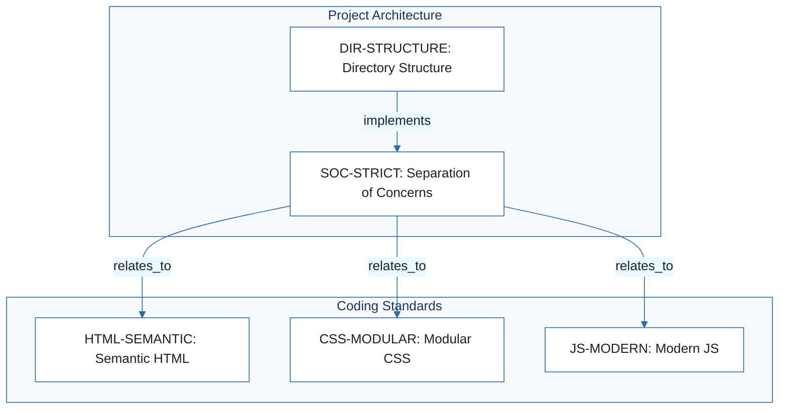
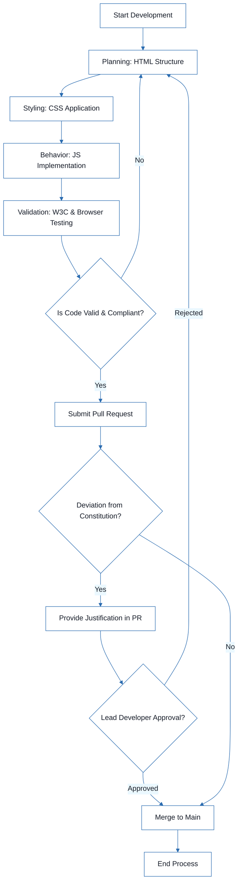
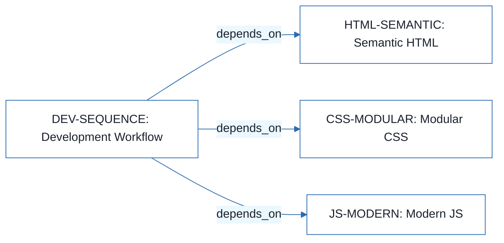

# Sales Item Management - Technical Specification & Architecture Document

## 1. Executive Summary & Architecture Overview

### 1.1 Executive Brief
The Sales Item Management project is a front-end application governed by a strict technical constitution. It implements a decoupled architecture based on a strict separation of concerns between semantic HTML, modular CSS, and ES6+ JavaScript. The project follows a mobile-first responsive pattern and a linear development workflow (HTML -> CSS -> JS -> Validation) to ensure accessibility and maintainability.

### 1.2 Maturity Assessment
The project specifications are structurally sound regarding coding standards but are currently in a state of REFINEMENT. While the core principles are well-defined, there is a high-severity gap concerning the absence of a formal Testing Discipline & Gates section, leaving the 'Validation' phase of the workflow without concrete technical thresholds or CI/CD requirements.

### 1.3 Technical Stack
* HTML
* CSS
* JavaScript ES6+

### 1.4 Architectural Constraints
* W3C semantic validity for HTML.
* Mandatory alt attributes for images and labels for forms.
* BEM naming convention for CSS.
* CSS Variables for colors, spacing, and typography.
* Flexbox and Grid for layout responsiveness.
* Mobile-first responsive design strategy.
* Strict prohibition of inline styles and inline event handlers.
* Async/await with try/catch for all asynchronous operations.
* Fixed directory structure: `/index.html`, `/css/`, `/js/` (with `/modules`), `/assets/`.
* Mandatory lead developer approval for any constitutional deviation in PRs.

### 1.5 Critical Dependencies
* W3C Validation tools for HTML/CSS compliance.
* Browser compatibility testing for JS functionality.
* Strict sequential dependency: HTML structure must be defined before CSS styling and JS behavior implementation.
* Lead developer sign-off as a non-negotiable workflow gate for PR merges.

## 2. Architecture Workflows





```mermaid
%%{init: {
  'theme': 'base',
  'themeVariables': {
    'primaryColor': '#1A365D',
    'primaryTextColor': '#1A202C',
    'primaryBorderColor': '#2B6CB0',
    'lineColor': '#2B6CB0',
    'secondaryColor': '#EBF8FF',
    'tertiaryColor': '#EBF8FF',
    'background': '#FFFFFF',
    'mainBkg': '#FFFFFF',
    'secondBkg': '#EBF8FF',
    'tertiaryBkg': '#F7FAFC',
    'secondaryTextColor': '#4A5568',
    'fontSize': '16px',
    'fontFamily': 'Inter, system-ui, sans-serif',
    'nodePadding': '15px',
    'borderRadius': '8px',
    'edgeLabelBackground': '#EBF8FF',
    'clusterBkg': '#F7FAFC',
    'clusterBorder': '#2B6CB0',
    'defaultLinkColor': '#2B6CB0',
    'titleColor': '#1A365D',
    'actorBorder': '#2B6CB0',
    'actorBkg': '#EBF8FF',
    'actorTextColor': '#1A365D',
    'actorLineColor': '#2B6CB0',
    'signalColor': '#2B6CB0',
    'signalTextColor': '#1A202C',
    'labelBoxBorderColor': '#2B6CB0',
    'labelBoxBkgColor': '#EBF8FF',
    'labelTextColor': '#1A202C',
    'loopTextColor': '#1A202C',
    'arrowHeadColor': '#2B6CB0',
    'sequenceNumberColor': '#1A365D',
    'sequenceActorBorder': '#2B6CB0',
    'sequenceActorBkg': '#EBF8FF',
    'sequenceArrowColor': '#2B6CB0',
    'noteBkgColor': '#FFF5EB',
    'noteBorderColor': '#DD6B20',
    'noteTextColor': '#1A202C'
  }
}}%%
flowchart LR
    DEV-SEQUENCE["DEV-SEQUENCE: Development Workflow"]
    DEV-SEQUENCE -->|"depends_on"| HTML-SEMANTIC["HTML-SEMANTIC: Semantic HTML"]
    DEV-SEQUENCE -->|"depends_on"| CSS-MODULAR["CSS-MODULAR: Modular CSS"]
    DEV-SEQUENCE -->|"depends_on"| JS-MODERN["JS-MODERN: Modern JS"]
``` & Visual Diagrams

### 2.1 Technical Standards Traceability Map
Maps the relationships between project structure, separation of concerns, and specific coding standards.

```mermaid
%%{init: {
  'theme': 'base',
  'themeVariables': {
    'primaryColor': '#1A365D',
    'primaryTextColor': '#1A202C',
    'primaryBorderColor': '#2B6CB0',
    'lineColor': '#2B6CB0',
    'secondaryColor': '#EBF8FF',
    'tertiaryColor': '#EBF8FF',
    'background': '#FFFFFF',
    'mainBkg': '#FFFFFF',
    'secondBkg': '#EBF8FF',
    'tertiaryBkg': '#F7FAFC',
    'secondaryTextColor': '#4A5568',
    'fontSize': '16px',
    'fontFamily': 'Inter, system-ui, sans-serif',
    'nodePadding': '15px',
    'borderRadius': '8px',
    'edgeLabelBackground': '#EBF8FF',
    'clusterBkg': '#F7FAFC',
    'clusterBorder': '#2B6CB0',
    'defaultLinkColor': '#2B6CB0',
    'titleColor': '#1A365D',
    'actorBorder': '#2B6CB0',
    'actorBkg': '#EBF8FF',
    'actorTextColor': '#1A365D',
    'actorLineColor': '#2B6CB0',
    'signalColor': '#2B6CB0',
    'signalTextColor': '#1A202C',
    'labelBoxBorderColor': '#2B6CB0',
    'labelBoxBkgColor': '#EBF8FF',
    'labelTextColor': '#1A202C',
    'loopTextColor': '#1A202C',
    'arrowHeadColor': '#2B6CB0',
    'sequenceNumberColor': '#1A365D',
    'sequenceActorBorder': '#2B6CB0',
    'sequenceActorBkg': '#EBF8FF',
    'sequenceArrowColor': '#2B6CB0',
    'noteBkgColor': '#FFF5EB',
    'noteBorderColor': '#DD6B20',
    'noteTextColor': '#1A202C'
  }
}}%%
flowchart TD
    subgraph "Project Architecture"
        DIR-STRUCTURE["DIR-STRUCTURE: Directory Structure"]
        SOC-STRICT["SOC-STRICT: Separation of Concerns"]
    end
    subgraph "Coding Standards"
        HTML-SEMANTIC["HTML-SEMANTIC: Semantic HTML"]
        CSS-MODULAR["CSS-MODULAR: Modular CSS"]
        JS-MODERN["JS-MODERN: Modern JS"]
    end
    DIR-STRUCTURE -->|"implements"| SOC-STRICT
    SOC-STRICT -->|"relates_to"| HTML-SEMANTIC
    SOC-STRICT -->|"relates_to"| CSS-MODULAR
    SOC-STRICT -->|"relates_to"| JS-MODERN
```

### 2.2 Development Workflow Process
Detailed development sequence including the mandatory validation and governance check loop.


### 2.3 Development Dependency Flow
Visualizes how the development sequence depends on the established technical standards.



## 3. Detailed Technical Specifications & Business Rules

### 3.1 Requirements Traceability

| Identifier | Type | Requirement Description | Source Section |
| :--- | :--- | :--- | :--- |
| HTML-SEMANTIC | coding_standard | HTML must be semantic, W3C valid, with mandatory alt attributes for images and labels for forms. | I. Semantic & Valid HTML |
| CSS-MODULAR | coding_standard | CSS must use a modular approach (BEM), CSS Variables for consistency, and Flexbox/Grid for layouts. | II. Modular & Maintainable CSS |
| JS-MODERN | coding_standard | JavaScript must use ES6+ syntax, be modular, and handle async operations via async/await with try/catch. | III. Clean & Modern JavaScript (ES6+) |
| SOC-STRICT | rule | Strict separation of HTML, CSS, and JS; no inline styles or inline event handlers permitted. | IV. Separation of Concerns |
| RESPONSIVE-FIRST | requirement | Application must be fully responsive using a mobile-first approach with media queries. | V. Responsive-First Design |
| DIR-STRUCTURE | tool_configuration | Directory structure: /index.html, /css/, /js/ (with /modules), and /assets/. | Project Structure |
| DEV-SEQUENCE | workflow_constraint | Development sequence: Planning (HTML) -> Styling (CSS) -> Behavior (JS) -> Validation. | Development Workflow |
| GOV-PR-APPROVAL | rule | Any deviation from the constitution must be justified in the PR and approved by the lead developer. | Governance |

### 3.2 Security Rules
* **Separation of Concerns (SOC-STRICT)**: Prohibition of inline event handlers (e.g., `onclick`) to mitigate XSS risks and maintain a clean security boundary between markup and logic.

### 3.3 Data Models
* **Directory Structure (DIR-STRUCTURE)**:
    * `/index.html`: Entry point.
    * `/css/`: Stylesheets (`style.css`, `variables.css`).
    * `/js/`: Logic (`main.js` and `/modules` for components).
    * `/assets/`: Static assets (images, icons, fonts).

## 4. Project Governance & Structural Gaps

### 4.1 Structural Gaps

| Gap | Priority | Remediation Advice |
| :--- | :--- | :--- |
| Testing Discipline & Gates | HIGH | The document mentions 'Validation' in the workflow but lacks specific testing gates (e.g., Unit tests, Integration tests, CI/CD pipeline requirements). |
| Open Questions & Uncertainties | LOW | No known uncertainties are listed; consider adding a section for future technical debt or architectural questions. |

### 4.2 Remediation & Workflow
Deviations from the established constitution must be documented within the Pull Request (PR) and require explicit approval from the Lead Developer. Any amendments to the constitution itself require a version bump and a documented rationale.

## 5. Technical & Domain Glossary (Terminology Reference)

| Term | Category | Context Anchor | Project Definition |
| :--- | :--- | :--- | :--- |
| BEM | TECHNICAL_STACK | CSS-MODULAR | A modular naming convention used to prevent specificity conflicts and improve maintainability. |
| Behavior | BUSINESS_DOMAIN | DEV-SEQUENCE | The third phase of the development sequence focusing on implementing functional logic. |
| CSS | TECHNICAL_STACK | CSS-MODULAR | The presentation layer governed by modularity, variables, and responsive layout engines. |
| HTML | TECHNICAL_STACK | HTML-SEMANTIC | The structural layer required to be semantic and compliant with W3C standards for accessibility. |
| JS | TECHNICAL_STACK | JS-MODERN | The logic layer utilizing ES6+ syntax and asynchronous patterns. |
| JavaScript | TECHNICAL_STACK | JS-MODERN | The logic layer utilizing ES6+ syntax and asynchronous patterns. |
| PR | TECHNICAL_STACK | GOV-PR-APPROVAL | The mechanism where deviations from the constitution must be justified and approved by the lead developer. |
| Planning | BUSINESS_DOMAIN | DEV-SEQUENCE | The initial phase of the development sequence dedicated to defining the structural markup. |
| SEO | TECHNICAL_STACK | HTML-SEMANTIC | The optimization goal achieved through the use of semantic tags and valid markup. |
| Styling | BUSINESS_DOMAIN | DEV-SEQUENCE | The second phase of the development sequence where design requirements are applied to the markup. |
| Validation | BUSINESS_DOMAIN | DEV-SEQUENCE | The final phase of the development sequence involving official checkers and cross-browser testing. |