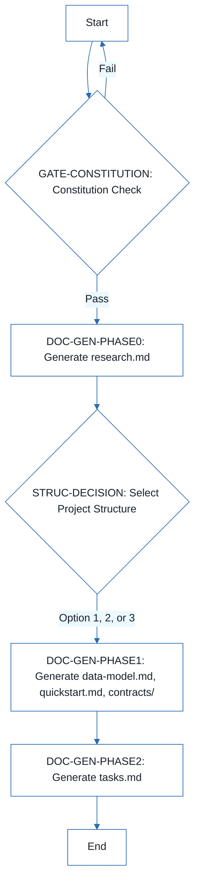
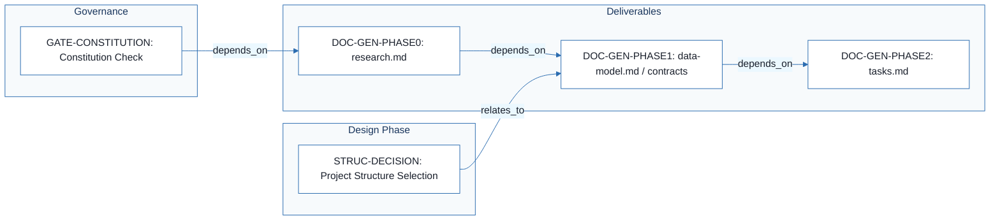

# sales-item-management - Technical Specification & Architecture Document

## 1. Executive Summary & Architecture Overview

### 1.1 Executive Brief
The `sales-item-management` project is currently in a pre-initialization state, represented by a structural implementation template. It aims to establish a feature-driven workflow for item management, but lacks a defined host platform, data pattern, or concrete technical identity. The current scope is limited to the definition of the execution pipeline and project structure options.

### 1.2 Maturity Assessment
The project is currently **BLOCKED**. While the structural template is complete, it contains zero actual technical specifications. The presence of high-severity structural gaps regarding Data Models and API Contracts, combined with the absence of a selected project structure, indicates that the project has not yet transitioned from a template to a functional specification.

### 1.3 Technical Stack
*   **Languages/Frameworks**: NEEDS CLARIFICATION
*   **Primary Dependencies**: NEEDS CLARIFICATION
*   **Storage**: NEEDS CLARIFICATION
*   **Testing**: NEEDS CLARIFICATION
*   **Target Platform**: NEEDS CLARIFICATION
*   **Project Type**: NEEDS CLARIFICATION

### 1.4 Architectural Constraints
*   **Governance Gate**: Mandatory Constitution Check gate must be passed before Phase 0 research.
*   **Documentation Pipeline**: Strict sequential dependency: `research.md` $\rightarrow$ `data-model.md`/`quickstart.md`/`contracts/` $\rightarrow$ `tasks.md`.

### 1.5 Critical Dependencies
*   **Constitution File**: Required for security and identity gate validation.
*   **Structure Selection**: Selection of project structure (Single project, Web app, or Mobile+API) is a prerequisite for Phase 1 documentation.
*   **Linear Workflow**: Strict linear dependency between Phase 0, Phase 1, and Phase 2 documentation deliverables.

## 2. Architecture Workflows



```mermaid
%%{init: {
  'theme': 'base',
  'themeVariables': {
    'primaryColor': '#1A365D',
    'primaryTextColor': '#1A202C',
    'primaryBorderColor': '#2B6CB0',
    'lineColor': '#2B6CB0',
    'secondaryColor': '#EBF8FF',
    'tertiaryColor': '#EBF8FF',
    'background': '#FFFFFF',
    'mainBkg': '#FFFFFF',
    'secondBkg': '#EBF8FF',
    'tertiaryBkg': '#F7FAFC',
    'secondaryTextColor': '#4A5568',
    'fontSize': '16px',
    'fontFamily': 'Inter, system-ui, sans-serif',
    'nodePadding': '15px',
    'borderRadius': '8px',
    'edgeLabelBackground': '#EBF8FF',
    'clusterBkg': '#F7FAFC',
    'clusterBorder': '#2B6CB0',
    'defaultLinkColor': '#2B6CB0',
    'titleColor': '#1A365D',
    'actorBorder': '#2B6CB0',
    'actorBkg': '#EBF8FF',
    'actorTextColor': '#1A365D',
    'actorLineColor': '#2B6CB0',
    'signalColor': '#2B6CB0',
    'signalTextColor': '#1A202C',
    'labelBoxBorderColor': '#2B6CB0',
    'labelBoxBkgColor': '#EBF8FF',
    'labelTextColor': '#1A202C',
    'loopTextColor': '#1A202C',
    'arrowHeadColor': '#2B6CB0',
    'sequenceNumberColor': '#1A365D',
    'sequenceActorBorder': '#2B6CB0',
    'sequenceActorBkg': '#EBF8FF',
    'sequenceArrowColor': '#2B6CB0',
    'noteBkgColor': '#FFF5EB',
    'noteBorderColor': '#DD6B20',
    'noteTextColor': '#1A202C'
  }
}}%%
flowchart LR
    subgraph "Governance"
        GATE-CONSTITUTION["GATE-CONSTITUTION: Constitution Check"]
    end
    subgraph "Design Phase"
        STRUC-DECISION["STRUC-DECISION: Project Structure Selection"]
    end
    subgraph "Deliverables"
        DOC-GEN-PHASE0["DOC-GEN-PHASE0: research.md"]
        DOC-GEN-PHASE1["DOC-GEN-PHASE1: data-model.md / contracts"]
        DOC-GEN-PHASE2["DOC-GEN-PHASE2: tasks.md"]
    end
    GATE-CONSTITUTION -->|"depends_on"| DOC-GEN-PHASE0
    DOC-GEN-PHASE0 -->|"depends_on"| DOC-GEN-PHASE1
    DOC-GEN-PHASE1 -->|"depends_on"| DOC-GEN-PHASE2
    STRUC-DECISION -->|"relates_to"| DOC-GEN-PHASE1
``` & Visual Diagrams

### 2.1 Implementation Workflow & Documentation Pipeline
Models the sequential generation of project documentation and the critical constitution gate, including the structural decision point.

```mermaid
%%{init: {
  'theme': 'base',
  'themeVariables': {
    'primaryColor': '#1A365D',
    'primaryTextColor': '#1A202C',
    'primaryBorderColor': '#2B6CB0',
    'lineColor': '#2B6CB0',
    'secondaryColor': '#EBF8FF',
    'tertiaryColor': '#EBF8FF',
    'background': '#FFFFFF',
    'mainBkg': '#FFFFFF',
    'secondBkg': '#EBF8FF',
    'tertiaryBkg': '#F7FAFC',
    'secondaryTextColor': '#4A5568',
    'fontSize': '16px',
    'fontFamily': 'Inter, system-ui, sans-serif',
    'nodePadding': '15px',
    'borderRadius': '8px',
    'edgeLabelBackground': '#EBF8FF',
    'clusterBkg': '#F7FAFC',
    'clusterBorder': '#2B6CB0',
    'defaultLinkColor': '#2B6CB0',
    'titleColor': '#1A365D',
    'actorBorder': '#2B6CB0',
    'actorBkg': '#EBF8FF',
    'actorTextColor': '#1A365D',
    'actorLineColor': '#2B6CB0',
    'signalColor': '#2B6CB0',
    'signalTextColor': '#1A202C',
    'labelBoxBorderColor': '#2B6CB0',
    'labelBoxBkgColor': '#EBF8FF',
    'labelTextColor': '#1A202C',
    'loopTextColor': '#1A202C',
    'arrowHeadColor': '#2B6CB0',
    'sequenceNumberColor': '#1A365D',
    'sequenceActorBorder': '#2B6CB0',
    'sequenceActorBkg': '#EBF8FF',
    'sequenceArrowColor': '#2B6CB0',
    'noteBkgColor': '#FFF5EB',
    'noteBorderColor': '#DD6B20',
    'noteTextColor': '#1A202C'
  }
}}%%
flowchart TD
    START["Start"]
    GATE-CONSTITUTION{"GATE-CONSTITUTION: Constitution Check"}
    DOC-GEN-PHASE0["DOC-GEN-PHASE0: Generate research.md"]
    STRUC-DECISION{"STRUC-DECISION: Select Project Structure"}
    DOC-GEN-PHASE1["DOC-GEN-PHASE1: Generate data-model.md, quickstart.md, contracts/"]
    DOC-GEN-PHASE2["DOC-GEN-PHASE2: Generate tasks.md"]
    END["End"]
    START --> GATE-CONSTITUTION
    GATE-CONSTITUTION -- "Pass" --> DOC-GEN-PHASE0
    GATE-CONSTITUTION -- "Fail" --> START
    DOC-GEN-PHASE0 --> STRUC-DECISION
    STRUC-DECISION -- "Option 1, 2, or 3" --> DOC-GEN-PHASE1
    DOC-GEN-PHASE1 --> DOC-GEN-PHASE2
    DOC-GEN-PHASE2 --> END
```

### 2.2 Requirements Traceability Map
Maps the relationship between the architectural decision and the documentation phases to ensure traceability.



## 3. Detailed Technical Specifications & Business Rules

### 3.1 Requirements Traceability

| Identifier | Requirement / Element | Source Section | Status |
| :--- | :--- | :--- | :--- |
| STRUC-DECISION | Selection of project structure (Single project, Web app, or Mobile+API) | [REMOVE IF UNUSED] Option 3: Mobile + API | Pending |
| GATE-CONSTITUTION | Constitution Check: Must pass before Phase 0 research | Constitution Check | High Criticality |
| DOC-GEN-PHASE0 | Generate research.md | Documentation (this feature) | Phase 0 |
| DOC-GEN-PHASE1 | Generate data-model.md, quickstart.md, and contracts/ | Documentation (this feature) | Phase 1 |
| DOC-GEN-PHASE2 | Generate tasks.md | Documentation (this feature) | Phase 2 |

### 3.2 Security Rules
*   **Identity Gate**: No research or design phase may commence without a successful `GATE-CONSTITUTION` validation.

### 3.3 Data Models
*   **Current State**: No data models defined. Data model generation is deferred to `DOC-GEN-PHASE1`.

## 4. Project Governance & Structural Gaps

### 4.1 Structural Gaps

| Missing Section | Priority | Remediation Advice |
| :--- | :--- | :--- |
| Data Models & Schemas | HIGH | The template mentions data-model.md as a Phase 1 output, but no actual schema is defined in this document. |
| API Contracts & Flow | HIGH | The template mentions a contracts/ folder as a Phase 1 output, but no endpoints or flows are defined. |

### 4.2 Remediation & Workflow
The project must follow the linear documentation pipeline defined in Section 2.1. The immediate next step is the resolution of the `GATE-CONSTITUTION` and the selection of the `STRUC-DECISION` to unlock the generation of technical deliverables.

## 5. Technical & Domain Glossary (Terminology Reference)

| Term | Category | Context Anchor | Project Definition |
| :--- | :--- | :--- | :--- |
| Branch | TECHNICAL_STACK | Implementation Plan: [FEATURE] | The specific version control pointer associated with the feature implementation. |
| CoreData | TECHNICAL_STACK | Technical Context | The object-graph management framework used for local persistence. |
| DATE | TECHNICAL_STACK | Implementation Plan: [FEATURE] | The temporal marker indicating when the plan was established. |
| DB | TECHNICAL_STACK | Complexity Tracking | The persistent relational or non-relational data store. |
| GATE | BUSINESS_DOMAIN | Constitution Check | A mandatory validation milestone that must be cleared before proceeding to subsequent phases. |
| LLVM | TECHNICAL_STACK | Technical Context | The compiler infrastructure used for low-level code optimization and generation. |
| LOC | TECHNICAL_STACK | Technical Context | The quantitative measure of source code volume. |
| Performance Goals | BUSINESS_DOMAIN | Technical Context | The target quantitative metrics for system efficiency and responsiveness. |
| Primary Dependencies | TECHNICAL_STACK | Technical Context | The essential external libraries or frameworks required for the system to function. |
| Project Type | TECHNICAL_STACK | Technical Context | The architectural classification of the software, such as a web-service or mobile-app. |
| Python 3.11 | TECHNICAL_STACK | Technical Context | The specific version of the high-level interpreted language used for implementation. |
| Spec | BUSINESS_DOMAIN | Implementation Plan: [FEATURE] | The formal documentation defining the requirements and expected behavior of a feature. |
| Storage | TECHNICAL_STACK | Technical Context | The mechanism and technology used for long-term data retention. |
| Structure Decision | TECHNICAL_STACK | STRUC-DECISION | The final selection of the directory layout and modular organization. |
| Target Platform | TECHNICAL_STACK | Technical Context | The intended operating environment where the software will be deployed. |
| Testing | TECHNICAL_STACK | Technical Context | The framework and methodology used to verify the correctness of the implementation. |
| UI | TECHNICAL_STACK | [REMOVE IF UNUSED] Option 3: Mobile + API | The visual layer and interaction components presented to the end user. |
| WASM | TECHNICAL_STACK | Technical Context | The binary instruction format for a stack-based virtual machine. |
| iOS | TECHNICAL_STACK | Technical Context | The mobile operating system provided by Apple. |