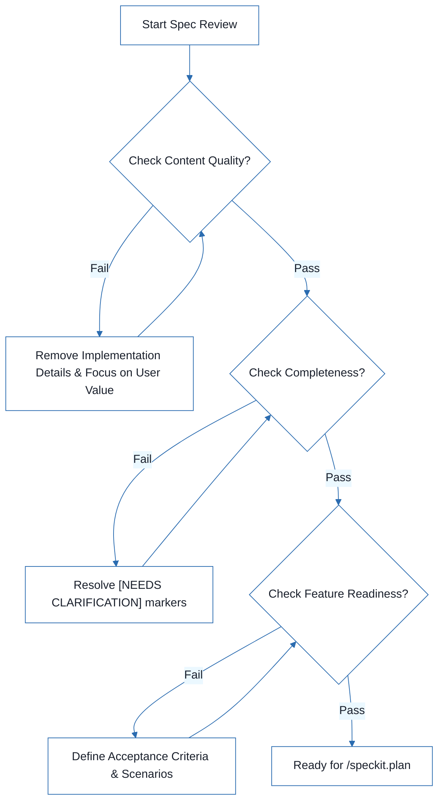

# Sales Item Management System - Technical Specification & Architecture Document

## 1. Executive Summary & Architecture Overview

### 1.1 Executive Brief
The project is currently in a pre-planning validation phase for a Sales Item Management System. The provided documentation is a quality assurance checklist designed to audit the completeness of a separate functional specification (spec.md). It establishes a governance framework to ensure business requirements are technology-agnostic, testable, and focused on user value before technical execution begins.

### 1.2 Maturity Assessment
The project is currently in a state of REFINEMENT. While the quality checklist itself is comprehensive, the actual business logic and functional specifications for the Sales Item Management system are entirely absent from the current graph. The presence of high-severity structural gaps regarding scope and unresolved uncertainties indicates that the project cannot proceed to the planning phase until the referenced spec.md is integrated.

### 1.3 Technical Stack
*   No technical stack defined (Project is currently technology-agnostic).

### 1.4 Architectural Constraints
*   Strict prohibition of implementation details (languages, frameworks, APIs) within the specification.
*   Mandatory removal of all [NEEDS CLARIFICATION] markers prior to planning.
*   Requirement for technology-agnostic success criteria.
*   Mandatory alignment of functional requirements with measurable acceptance criteria.

### 1.5 Critical Dependencies
*   Availability of the external spec.md functional specification.
*   Resolution of all [NEEDS CLARIFICATION] markers as a workflow gate for /speckit.plan.
*   Logical dependency between acceptance criteria (QUAL-ACCEPTANCE) and testability/measurability (QUAL-TESTABLE, QUAL-MEASURABLE).

## 2. Architecture Workflows

```mermaid
%%{init: {
  'theme': 'base',
  'themeVariables': {
    'primaryColor': '#1A365D',
    'primaryTextColor': '#1A202C',
    'primaryBorderColor': '#2B6CB0',
    'lineColor': '#2B6CB0',
    'secondaryColor': '#EBF8FF',
    'tertiaryColor': '#EBF8FF',
    'background': '#FFFFFF',
    'mainBkg': '#FFFFFF',
    'secondBkg': '#EBF8FF',
    'tertiaryBkg': '#F7FAFC',
    'secondaryTextColor': '#4A5568',
    'fontSize': '16px',
    'fontFamily': 'Inter, system-ui, sans-serif',
    'nodePadding': '15px',
    'borderRadius': '8px',
    'edgeLabelBackground': '#EBF8FF',
    'clusterBkg': '#F7FAFC',
    'clusterBorder': '#2B6CB0',
    'defaultLinkColor': '#2B6CB0',
    'titleColor': '#1A365D',
    'actorBorder': '#2B6CB0',
    'actorBkg': '#EBF8FF',
    'actorTextColor': '#1A365D',
    'actorLineColor': '#2B6CB0',
    'signalColor': '#2B6CB0',
    'signalTextColor': '#1A202C',
    'labelBoxBorderColor': '#2B6CB0',
    'labelBoxBkgColor': '#EBF8FF',
    'labelTextColor': '#1A202C',
    'loopTextColor': '#1A202C',
    'arrowHeadColor': '#2B6CB0',
    'sequenceNumberColor': '#1A365D',
    'sequenceActorBorder': '#2B6CB0',
    'sequenceActorBkg': '#EBF8FF',
    'sequenceArrowColor': '#2B6CB0',
    'noteBkgColor': '#FFF5EB',
    'noteBorderColor': '#DD6B20',
    'noteTextColor': '#1A202C'
  }
}}%%
flowchart TD
    subgraph "Content Quality Constraints"
        QUAL-NO-IMPL["QUAL-NO-IMPL: No Implementation Details"]
        QUAL-USER-VAL["QUAL-USER-VAL: User Value Focus"]
    end
    subgraph "Requirement Completeness"
        QUAL-CLARIFY["QUAL-CLARIFY: No Clarification Markers"]
        QUAL-SCOPE["QUAL-SCOPE: Bounded Scope"]
    end
    subgraph "Feature Readiness & Success Criteria"
        QUAL-ACCEPTANCE["QUAL-ACCEPTANCE: Acceptance Criteria & Scenarios"]
        QUAL-TESTABLE["QUAL-TESTABLE: Testable & Unambiguous"]
        QUAL-MEASURABLE["QUAL-MEASURABLE: Measurable & Agnostic"]
    end
    QUAL-ACCEPTANCE -->|"depends_on"| QUAL-TESTABLE
    QUAL-ACCEPTANCE -->|"depends_on"| QUAL-MEASURABLE
```



```mermaid
%%{init: {
  'theme': 'base',
  'themeVariables': {
    'primaryColor': '#1A365D',
    'primaryTextColor': '#1A202C',
    'primaryBorderColor': '#2B6CB0',
    'lineColor': '#2B6CB0',
    'secondaryColor': '#EBF8FF',
    'tertiaryColor': '#EBF8FF',
    'background': '#FFFFFF',
    'mainBkg': '#FFFFFF',
    'secondBkg': '#EBF8FF',
    'tertiaryBkg': '#F7FAFC',
    'secondaryTextColor': '#4A5568',
    'fontSize': '16px',
    'fontFamily': 'Inter, system-ui, sans-serif',
    'nodePadding': '15px',
    'borderRadius': '8px',
    'edgeLabelBackground': '#EBF8FF',
    'clusterBkg': '#F7FAFC',
    'clusterBorder': '#2B6CB0',
    'defaultLinkColor': '#2B6CB0',
    'titleColor': '#1A365D',
    'actorBorder': '#2B6CB0',
    'actorBkg': '#EBF8FF',
    'actorTextColor': '#1A365D',
    'actorLineColor': '#2B6CB0',
    'signalColor': '#2B6CB0',
    'signalTextColor': '#1A202C',
    'labelBoxBorderColor': '#2B6CB0',
    'labelBoxBkgColor': '#EBF8FF',
    'labelTextColor': '#1A202C',
    'loopTextColor': '#1A202C',
    'arrowHeadColor': '#2B6CB0',
    'sequenceNumberColor': '#1A365D',
    'sequenceActorBorder': '#2B6CB0',
    'sequenceActorBkg': '#EBF8FF',
    'sequenceArrowColor': '#2B6CB0',
    'noteBkgColor': '#FFF5EB',
    'noteBorderColor': '#DD6B20',
    'noteTextColor': '#1A202C'
  }
}}%%
flowchart TD
    START["Start Spec Review"] --> CHECK_CONTENT{"Check Content Quality?"}
    CHECK_CONTENT -->|"Fail"| FIX_CONTENT["Remove Implementation Details & Focus on User Value"]
    FIX_CONTENT --> CHECK_CONTENT
    CHECK_CONTENT -->|"Pass"| CHECK_COMPLETENESS{"Check Completeness?"}
    CHECK_COMPLETENESS -->|"Fail"| FIX_CLARIFY["Resolve [NEEDS CLARIFICATION] markers"]
    FIX_CLARIFY --> CHECK_COMPLETENESS
    CHECK_COMPLETENESS -->|"Pass"| CHECK_READINESS{"Check Feature Readiness?"}
    CHECK_READINESS -->|"Fail"| FIX_ACCEPTANCE["Define Acceptance Criteria & Scenarios"]
    FIX_ACCEPTANCE --> CHECK_READINESS
    CHECK_READINESS -->|"Pass"| END["Ready for /speckit.plan"]
``` & Visual Diagrams

### 2.1 Specification Quality Traceability Map
Models the traceability and dependencies between specification quality requirements and success criteria.

```mermaid
%%{init: {
  'theme': 'base',
  'themeVariables': {
    'primaryColor': '#1A365D',
    'primaryTextColor': '#1A202C',
    'primaryBorderColor': '#2B6CB0',
    'lineColor': '#2B6CB0',
    'secondaryColor': '#EBF8FF',
    'tertiaryColor': '#EBF8FF',
    'background': '#FFFFFF',
    'mainBkg': '#FFFFFF',
    'secondBkg': '#EBF8FF',
    'tertiaryBkg': '#F7FAFC',
    'secondaryTextColor': '#4A5568',
    'fontSize': '16px',
    'fontFamily': 'Inter, system-ui, sans-serif',
    'nodePadding': '15px',
    'borderRadius': '8px',
    'edgeLabelBackground': '#EBF8FF',
    'clusterBkg': '#F7FAFC',
    'clusterBorder': '#2B6CB0',
    'defaultLinkColor': '#2B6CB0',
    'titleColor': '#1A365D',
    'actorBorder': '#2B6CB0',
    'actorBkg': '#EBF8FF',
    'actorTextColor': '#1A365D',
    'actorLineColor': '#2B6CB0',
    'signalColor': '#2B6CB0',
    'signalTextColor': '#1A202C',
    'labelBoxBorderColor': '#2B6CB0',
    'labelBoxBkgColor': '#EBF8FF',
    'labelTextColor': '#1A202C',
    'loopTextColor': '#1A202C',
    'arrowHeadColor': '#2B6CB0',
    'sequenceNumberColor': '#1A365D',
    'sequenceActorBorder': '#2B6CB0',
    'sequenceActorBkg': '#EBF8FF',
    'sequenceArrowColor': '#2B6CB0',
    'noteBkgColor': '#FFF5EB',
    'noteBorderColor': '#DD6B20',
    'noteTextColor': '#1A202C'
  }
}}%%
flowchart TD
    subgraph "Content Quality Constraints"
        QUAL-NO-IMPL["QUAL-NO-IMPL: No Implementation Details"]
        QUAL-USER-VAL["QUAL-USER-VAL: User Value Focus"]
    end
    subgraph "Requirement Completeness"
        QUAL-CLARIFY["QUAL-CLARIFY: No Clarification Markers"]
        QUAL-SCOPE["QUAL-SCOPE: Bounded Scope"]
    end
    subgraph "Feature Readiness & Success Criteria"
        QUAL-ACCEPTANCE["QUAL-ACCEPTANCE: Acceptance Criteria & Scenarios"]
        QUAL-TESTABLE["QUAL-TESTABLE: Testable & Unambiguous"]
        QUAL-MEASURABLE["QUAL-MEASURABLE: Measurable & Agnostic"]
    end
    QUAL-ACCEPTANCE -->|"depends_on"| QUAL-TESTABLE
    QUAL-ACCEPTANCE -->|"depends_on"| QUAL-MEASURABLE
```

### 2.2 Specification Validation Workflow
The business process for validating a specification based on the quality checklist items.



## 3. Detailed Technical Specifications & Business Rules

### 3.1 Requirements Traceability

| Identifier | Type | Description | Source Section | Status |
| :--- | :--- | :--- | :--- | :--- |
| QUAL-NO-IMPL | Constraint | Specification must contain no implementation details (languages, frameworks, APIs). | Content Quality | validated |
| QUAL-USER-VAL | Constraint | Specification must be focused on user value and business needs. | Content Quality | validated |
| QUAL-CLARIFY | Requirement | No [NEEDS CLARIFICATION] markers must remain in the document. | Requirement Completeness | pending |
| QUAL-TESTABLE | Success Criterion | Requirements must be testable and unambiguous. | Requirement Completeness | validated |
| QUAL-MEASURABLE | Success Criterion | Success criteria must be measurable and technology-agnostic. | Requirement Completeness | validated |
| QUAL-SCOPE | Requirement | Scope must be clearly bounded. | Requirement Completeness | validated |
| QUAL-ACCEPTANCE | Requirement | All functional requirements must have clear acceptance criteria and user scenarios covering primary flows. | Feature Readiness | validated |

### 3.2 Security Rules
*   No security rules defined in the current source data.

### 3.3 Data Models
*   No data models defined in the current source data.

## 4. Project Governance & Structural Gaps

### 4.1 Structural Gaps

| Missing Section | Priority | Remediation Advice |
| :--- | :--- | :--- |
| Scope & Out-of-Scope | HIGH | The document is a checklist; the actual scope of the Sales Item Management system is missing. Please provide the spec.md file. |
| Open Questions & Uncertainties | MEDIUM | While the checklist mentions clarification markers, the actual open questions of the project are not listed. |

### 4.2 Remediation & Workflow
The project must integrate the `spec.md` functional specification to resolve the high-priority structural gaps. The workflow gate for proceeding to `/speckit.plan` is the total resolution of all `[NEEDS CLARIFICATION]` markers (QUAL-CLARIFY).

## 5. Technical & Domain Glossary (Terminology Reference)

| Term | Category | Context Anchor | Project Definition |
| :--- | :--- | :--- | :--- |
| Feature | BUSINESS_DOMAIN | Feature Readiness | A functional unit that must satisfy measurable outcomes and possess verified acceptance criteria and primary user flows. |