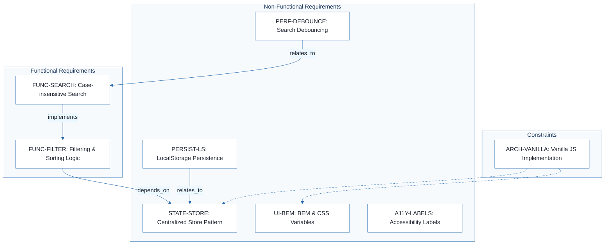
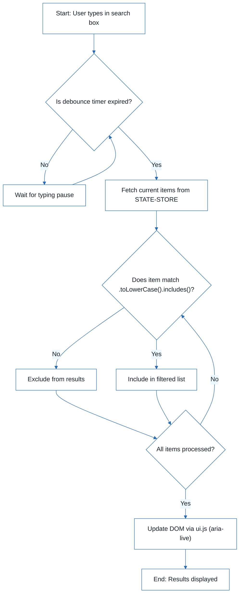
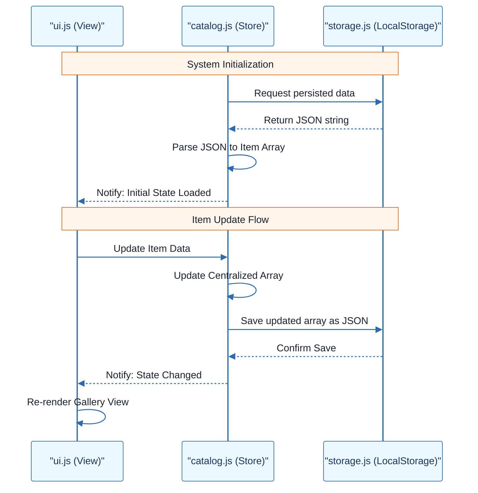
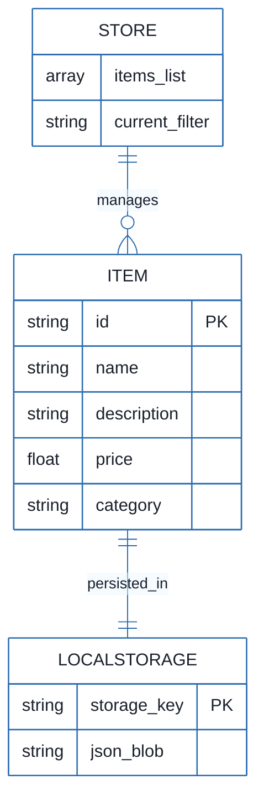

# Sales Item Management System - Technical Specification & Architecture Document

## 1. Executive Summary & Architecture Overview

### 1.1 Executive Brief
The Sales Item Management System is a client-side demonstration application designed for catalog management using a Vanilla JS architecture. It employs a centralized Store pattern for state management and leverages `window.localStorage` for synchronous data persistence, eliminating the need for a backend server. The system focuses on a decoupled architecture separating data, logic, and view layers to ensure a single source of truth for filtering and sorting operations.

### 1.2 Maturity Assessment
The project is currently in **REFINEMENT**. While the technical implementation decisions are well-defined and the health index is stable, there are critical structural gaps regarding the business context. Specifically, the absence of high-priority Goals & Objectives and a defined Scope for CRUD operations prevents a full transition to a production-ready specification.

### 1.3 Technical Stack
* Vanilla JS
* CSS Variables
* BEM (Block Element Modifier)

### 1.4 Architectural Constraints
* Strict prohibition of complex frameworks (React, Vue).
* Case-insensitive search implementation using `.toLowerCase().includes()` across name and description.
* Mandatory debouncing of search input to limit DOM re-renders.
* Accessibility compliance via `<label>` for all inputs and `aria-live` regions for search results.
* CSS naming must strictly follow BEM convention to prevent style leakage.

### 1.5 Critical Dependencies
* `window.localStorage` for item catalog persistence.
* Centralized Store module as the primary dependency for filtering and sorting logic.
* Logical coupling between the Store and the UI notification system for state synchronization.
* Separation of concerns between `storage.js` (Data), `catalog.js` (Logic), and `ui.js` (View).

## 2. Architecture Workflows







```mermaid
%%{init: {
  'theme': 'base',
  'themeVariables': {
    'primaryColor': '#1A365D',
    'primaryTextColor': '#1A202C',
    'primaryBorderColor': '#2B6CB0',
    'lineColor': '#2B6CB0',
    'secondaryColor': '#EBF8FF',
    'tertiaryColor': '#EBF8FF',
    'background': '#FFFFFF',
    'mainBkg': '#FFFFFF',
    'secondBkg': '#EBF8FF',
    'tertiaryBkg': '#F7FAFC',
    'secondaryTextColor': '#4A5568',
    'fontSize': '16px',
    'fontFamily': 'Inter, system-ui, sans-serif',
    'nodePadding': '15px',
    'borderRadius': '8px',
    'edgeLabelBackground': '#EBF8FF',
    'clusterBkg': '#F7FAFC',
    'clusterBorder': '#2B6CB0',
    'defaultLinkColor': '#2B6CB0',
    'titleColor': '#1A365D',
    'actorBorder': '#2B6CB0',
    'actorBkg': '#EBF8FF',
    'actorTextColor': '#1A365D',
    'actorLineColor': '#2B6CB0',
    'signalColor': '#2B6CB0',
    'signalTextColor': '#1A202C',
    'labelBoxBorderColor': '#2B6CB0',
    'labelBoxBkgColor': '#EBF8FF',
    'labelTextColor': '#1A202C',
    'loopTextColor': '#1A202C',
    'arrowHeadColor': '#2B6CB0',
    'sequenceNumberColor': '#1A365D',
    'sequenceActorBorder': '#2B6CB0',
    'sequenceActorBkg': '#EBF8FF',
    'sequenceArrowColor': '#2B6CB0',
    'noteBkgColor': '#FFF5EB',
    'noteBorderColor': '#DD6B20',
    'noteTextColor': '#1A202C'
  }
}}%%
erDiagram
    STORE ||--o{ ITEM : "manages"
    ITEM ||--|| LOCALSTORAGE : "persisted_in"
    STORE {
        array items_list
        string current_filter
    }
    ITEM {
        string id PK
        string name
        string description
        float price
        string category
    }
    LOCALSTORAGE {
        string storage_key PK
        string json_blob
    }
``` & Visual Diagrams

### 2.1 Requirements Traceability Map
```mermaid
%%{init: {
  'theme': 'base',
  'themeVariables': {
    'primaryColor': '#1A365D',
    'primaryTextColor': '#1A202C',
    'primaryBorderColor': '#2B6CB0',
    'lineColor': '#2B6CB0',
    'secondaryColor': '#EBF8FF',
    'tertiaryColor': '#EBF8FF',
    'background': '#FFFFFF',
    'mainBkg': '#FFFFFF',
    'secondBkg': '#EBF8FF',
    'tertiaryBkg': '#F7FAFC',
    'secondaryTextColor': '#4A5568',
    'fontSize': '16px',
    'fontFamily': 'Inter, system-ui, sans-serif',
    'nodePadding': '15px',
    'borderRadius': '8px',
    'edgeLabelBackground': '#EBF8FF',
    'clusterBkg': '#F7FAFC',
    'clusterBorder': '#2B6CB0',
    'defaultLinkColor': '#2B6CB0',
    'titleColor': '#1A365D',
    'actorBorder': '#2B6CB0',
    'actorBkg': '#EBF8FF',
    'actorTextColor': '#1A365D',
    'actorLineColor': '#2B6CB0',
    'signalColor': '#2B6CB0',
    'signalTextColor': '#1A202C',
    'labelBoxBorderColor': '#2B6CB0',
    'labelBoxBkgColor': '#EBF8FF',
    'labelTextColor': '#1A202C',
    'loopTextColor': '#1A202C',
    'arrowHeadColor': '#2B6CB0',
    'sequenceNumberColor': '#1A365D',
    'sequenceActorBorder': '#2B6CB0',
    'sequenceActorBkg': '#EBF8FF',
    'sequenceArrowColor': '#2B6CB0',
    'noteBkgColor': '#FFF5EB',
    'noteBorderColor': '#DD6B20',
    'noteTextColor': '#1A202C'
  }
}}%%
flowchart TD
    subgraph "Functional Requirements"
        FUNC-SEARCH["FUNC-SEARCH: Case-insensitive Search"]
        FUNC-FILTER["FUNC-FILTER: Filtering & Sorting Logic"]
    end
    subgraph "Non-Functional Requirements"
        STATE-STORE["STATE-STORE: Centralized Store Pattern"]
        PERSIST-LS["PERSIST-LS: LocalStorage Persistence"]
        PERF-DEBOUNCE["PERF-DEBOUNCE: Search Debouncing"]
        UI-BEM["UI-BEM: BEM & CSS Variables"]
        A11Y-LABELS["A11Y-LABELS: Accessibility Labels"]
    end
    subgraph "Constraints"
        ARCH-VANILLA["ARCH-VANILLA: Vanilla JS Implementation"]
    end
    FUNC-SEARCH -->|"implements"| FUNC-FILTER
    FUNC-FILTER -->|"depends_on"| STATE-STORE
    PERF-DEBOUNCE -->|"relates_to"| FUNC-SEARCH
    PERSIST-LS -->|"relates_to"| STATE-STORE
    ARCH-VANILLA -.-> STATE-STORE
    ARCH-VANILLA -.-> UI-BEM
```

### 2.2 Search & Filter Workflow


### 2.3 Data Persistence & State Sequence


### 2.4 System Data Model


## 3. Detailed Technical Specifications & Business Rules

### 3.1 Requirements Traceability
| Identifier | Type | Requirement Description | Source Section |
| :--- | :--- | :--- | :--- |
| PERSIST-LS | NFR | Use window.localStorage for persisting the item catalog to allow data persistence across page reloads without a backend. | 1. Data Persistence: LocalStorage |
| STATE-STORE | NFR | Implement a centralized Store module to manage the item array and notify the UI of changes to ensure a single source of truth. | 2. State Management: Centralized Store Pattern |
| UI-BEM | NFR | Use BEM (Block Element Modifier) for CSS naming and CSS Variables for theming to prevent style leakage. | 3. UI Components: BEM & CSS Variables |
| FUNC-FILTER | FR | Implement filtering and sorting using .filter() and .sort() methods on the item array. | 4. Filtering & Sorting Logic: Functional Approach |
| FUNC-SEARCH | FR | Search must be case-insensitive and match across both name and description using .toLowerCase().includes(). | 4. Filtering & Sorting Logic: Functional Approach |
| A11Y-LABELS | NFR | Use `<label>` for all form inputs and aria-live regions for search results to ensure accessibility. | Best Practices Applied |
| PERF-DEBOUNCE | NFR | Debounce the search input to prevent excessive DOM re-renders. | Best Practices Applied |
| ARCH-VANILLA | Constraint | The project must be implemented in Vanilla JS without complex frameworks like React or Vue. | 2. State Management: Centralized Store Pattern |

### 3.2 Security Rules
* No specific security rules defined in the source data. The system operates entirely on the client-side using `localStorage`.

### 3.3 Data Models
The system utilizes a flat JSON structure stored in `localStorage`.
* **Item Entity**:
    * `id` (String, PK): Unique identifier.
    * `name` (String): Display name of the item.
    * `description` (String): Detailed item description.
    * `price` (Float): Unit price.
    * `category` (String): Item classification.

## 4. Project Governance & Structural Gaps

### 4.1 Structural Gaps
| Missing Section | Priority | Remediation Advice |
| :--- | :--- | :--- |
| Goals & Objectives | HIGH | The document describes technical choices but not the business goals or the 'Why' behind the system's existence. |
| Scope & Out-of-Scope | MEDIUM | Define clearly what the 'Management' part entails (CRUD operations) and what is explicitly excluded. |
| Open Questions & Uncertainties | LOW | Although the status says 'resolved', a dedicated section for remaining risks would be beneficial. |

### 4.2 Remediation & Workflow
To move the project from **REFINEMENT** to **PRODUCTION-READY**, the project lead must provide a business requirements document (BRD) that defines the specific CRUD operations required for the "Management" view and the overarching business objectives.

## 5. Technical & Domain Glossary (Terminology Reference)

| Term | Category | Context Anchor | Project Definition |
| :--- | :--- | :--- | :--- |
| API | TECHNICAL_STACK | PERSIST-LS | A synchronous interface used to interact with browser-based key-value storage. |
| Accessibility | TECHNICAL_STACK | A11Y-LABELS | The implementation of semantic labels and live regions to support assistive technologies. |
| Alternatives considered | TECHNICAL_STACK | Technical Decisions | The evaluation of rejected architectural paths such as IndexedDB or external frameworks. |
| BEM | TECHNICAL_STACK | UI-BEM | A naming convention for stylesheets that prevents specificity conflicts and style leakage. |
| CSS | TECHNICAL_STACK | UI-BEM | The styling language used with variables for theme management. |
| DOM | TECHNICAL_STACK | PERF-DEBOUNCE | The browser document tree that is updated via re-renders during search operations. |
| Decision | TECHNICAL_STACK | Technical Decisions | The final architectural selection made for persistence, state, or styling. |
| Implementation Detail | TECHNICAL_STACK | FUNC-SEARCH | The specific logic using case-insensitive matching for string comparison. |
| JS | TECHNICAL_STACK | ARCH-VANILLA | The core programming language used in its plain form without external libraries. |
| JSON | TECHNICAL_STACK | PERSIST-LS | The data interchange format used to serialize the item catalog for storage. |
| LocalStorage | TECHNICAL_STACK | PERSIST-LS | The browser mechanism for persisting data across sessions without a server. |
| Maintainability | TECHNICAL_STACK | Best Practices Applied | The structural separation of data, logic, and view files. |
| Performance | TECHNICAL_STACK | PERF-DEBOUNCE | The optimization of input handling to limit the frequency of interface updates. |
| Rationale | TECHNICAL_STACK | Technical Decisions | The logical justification for choosing a specific technical path over others. |
| Store | TECHNICAL_STACK | STATE-STORE | A centralized module acting as the single source of truth for the item array. |
| UI | TECHNICAL_STACK | STATE-STORE | The visual layer that is notified when the underlying data changes. |
| window.localStorage | TECHNICAL_STACK | PERSIST-LS | The global browser object used for synchronous data persistence. |