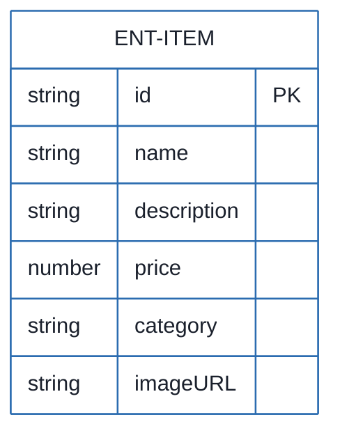
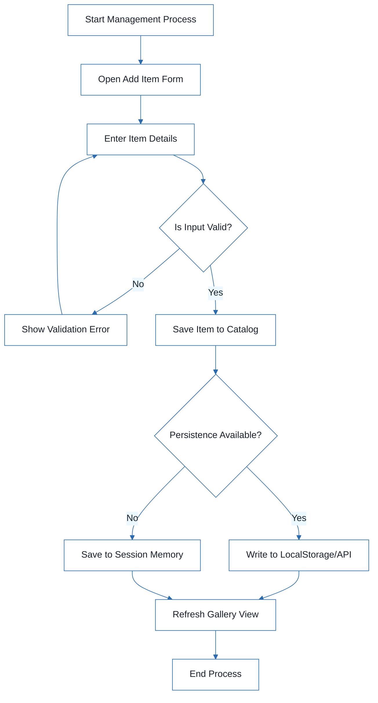
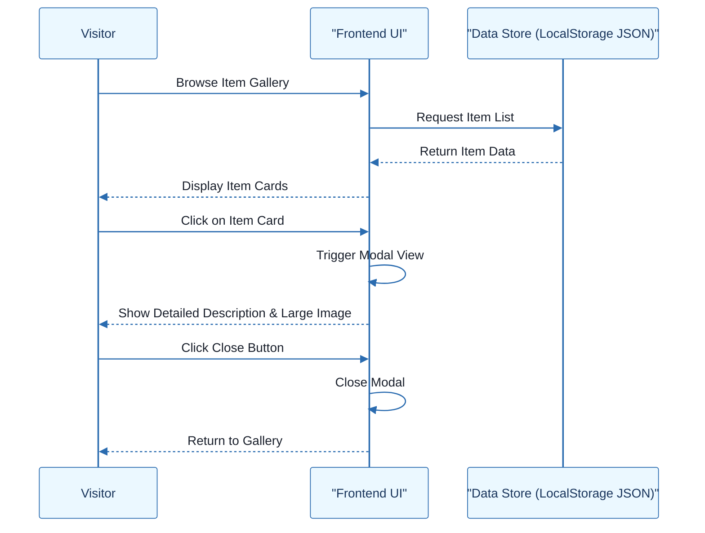

# Sales Item Management System - Technical Specification & Architecture Document

## 1. Executive Summary & Architecture Overview

### 1.1 Executive Brief
The Sales Item Management System is a client-side front-end application designed for browsing and managing a product catalog. It implements a full CRUD lifecycle for items, featuring a responsive gallery, dynamic filtering, and an administrative management interface. The system follows a client-side data pattern, focusing on interactive UI components like modals for detailed item views.

### 1.2 Maturity Assessment
The project is currently in **REFINEMENT**. While functional requirements and entity mappings are complete, there are critical structural gaps regarding high-level business goals and explicit scope boundaries. Most notably, the persistence strategy remains an unresolved uncertainty, which prevents the finalization of the data architecture.

### 1.3 Technical Stack
* HTML
* CSS
* JS

### 1.4 Architectural Constraints
* Responsive layout compatible with mobile, tablet, and desktop.
* Price validation: must be a positive number.
* Input validation: prevent submission of empty item names.
* UI Performance: Item addition must be completed in under 30 seconds.
* Visual Consistency: 100% of catalog items must follow a consistent layout.
* Empty State: Mandatory "No items found" message when catalog is empty.

### 1.5 Critical Dependencies
* **Persistence Layer**: Decision required between LocalStorage or Mock API/JSON for data durability across reloads.
* **Entity Integrity**: Item entity requires a Unique ID for CRUD operations (Update/Delete).
* **Client-side Runtime**: Browser environment supporting modern JS for dynamic DOM manipulation.
* **Asset Pipeline**: ImageURL dependency for product gallery rendering.

## 2. Architecture Workflows

```mermaid
%%{init: {
  'theme': 'base',
  'themeVariables': {
    'primaryColor': '#1A365D',
    'primaryTextColor': '#1A202C',
    'primaryBorderColor': '#2B6CB0',
    'lineColor': '#2B6CB0',
    'secondaryColor': '#EBF8FF',
    'tertiaryColor': '#EBF8FF',
    'background': '#FFFFFF',
    'mainBkg': '#FFFFFF',
    'secondBkg': '#EBF8FF',
    'tertiaryBkg': '#F7FAFC',
    'secondaryTextColor': '#4A5568',
    'fontSize': '16px',
    'fontFamily': 'Inter, system-ui, sans-serif',
    'nodePadding': '15px',
    'borderRadius': '8px',
    'edgeLabelBackground': '#EBF8FF',
    'clusterBkg': '#F7FAFC',
    'clusterBorder': '#2B6CB0',
    'defaultLinkColor': '#2B6CB0',
    'titleColor': '#1A365D',
    'actorBorder': '#2B6CB0',
    'actorBkg': '#EBF8FF',
    'actorTextColor': '#1A365D',
    'actorLineColor': '#2B6CB0',
    'signalColor': '#2B6CB0',
    'signalTextColor': '#1A202C',
    'labelBoxBorderColor': '#2B6CB0',
    'labelBoxBkgColor': '#EBF8FF',
    'labelTextColor': '#1A202C',
    'loopTextColor': '#1A202C',
    'arrowHeadColor': '#2B6CB0',
    'sequenceNumberColor': '#1A365D',
    'sequenceActorBorder': '#2B6CB0',
    'sequenceActorBkg': '#EBF8FF',
    'sequenceArrowColor': '#2B6CB0',
    'noteBkgColor': '#FFF5EB',
    'noteBorderColor': '#DD6B20',
    'noteTextColor': '#1A202C'
  }
}}%%
flowchart TD
    subgraph UserStories [User Stories]
        US-VIEW["US-VIEW: View and Browse Items"]
        US-MANAGE["US-MANAGE: Manage Items"]
        US-DETAILS["US-DETAILS: Interactive Item Details"]
    end
    subgraph FunctionalReqs [Functional Requirements]
        FR-001["FR-001: Display Gallery"]
        FR-002["FR-002: Filter/Search"]
        FR-003["FR-003: Add Item Form"]
        FR-004["FR-004: Edit Item"]
        FR-005["FR-005: Delete Item"]
        FR-006["FR-006: Interactive Modal"]
        FR-007["FR-007: Input Validation"]
        FR-008["FR-008: Data Persistence"]
    end
    subgraph DataLayer [Data Layer]
        ENT-ITEM["ENT-ITEM: Item Entity"]
        ASSUM-CLIENT["ASSUM-CLIENT: Client-side Implementation"]
    end
    US-VIEW -->|"implements"| FR-001
    US-VIEW -->|"implements"| FR-002
    US-MANAGE -->|"implements"| FR-003
    US-MANAGE -->|"implements"| FR-004
    US-MANAGE -->|"implements"| FR-005
    US-DETAILS -->|"implements"| FR-006
    FR-003 -->|"depends_on"| FR-007
    FR-001 -->|"depends_on"| ENT-ITEM
    FR-008 -->|"relates_to"| ASSUM-CLIENT
```







```mermaid
%%{init: {
  'theme': 'base',
  'themeVariables': {
    'primaryColor': '#1A365D',
    'primaryTextColor': '#1A202C',
    'primaryBorderColor': '#2B6CB0',
    'lineColor': '#2B6CB0',
    'secondaryColor': '#EBF8FF',
    'tertiaryColor': '#EBF8FF',
    'background': '#FFFFFF',
    'mainBkg': '#FFFFFF',
    'secondBkg': '#EBF8FF',
    'tertiaryBkg': '#F7FAFC',
    'secondaryTextColor': '#4A5568',
    'fontSize': '16px',
    'fontFamily': 'Inter, system-ui, sans-serif',
    'nodePadding': '15px',
    'borderRadius': '8px',
    'edgeLabelBackground': '#EBF8FF',
    'clusterBkg': '#F7FAFC',
    'clusterBorder': '#2B6CB0',
    'defaultLinkColor': '#2B6CB0',
    'titleColor': '#1A365D',
    'actorBorder': '#2B6CB0',
    'actorBkg': '#EBF8FF',
    'actorTextColor': '#1A365D',
    'actorLineColor': '#2B6CB0',
    'signalColor': '#2B6CB0',
    'signalTextColor': '#1A202C',
    'labelBoxBorderColor': '#2B6CB0',
    'labelBoxBkgColor': '#EBF8FF',
    'labelTextColor': '#1A202C',
    'loopTextColor': '#1A202C',
    'arrowHeadColor': '#2B6CB0',
    'sequenceNumberColor': '#1A365D',
    'sequenceActorBorder': '#2B6CB0',
    'sequenceActorBkg': '#EBF8FF',
    'sequenceArrowColor': '#2B6CB0',
    'noteBkgColor': '#FFF5EB',
    'noteBorderColor': '#DD6B20',
    'noteTextColor': '#1A202C'
  }
}}%%
sequenceDiagram
    participant Visitor
    participant UI as "Frontend UI"
    participant Store as "Data Store (LocalStorage/JSON)"
    Visitor ->> UI: Browse Item Gallery
    UI ->> Store: Request Item List
    Store -->> UI: Return Item Data
    UI -->> Visitor: Display Item Cards
    Visitor ->> UI: Click on Item Card
    UI ->> UI: Trigger Modal View
    UI -->> Visitor: Show Detailed Description & Large Image
    Visitor ->> UI: Click Close Button
    UI ->> UI: Close Modal
    UI -->> Visitor: Return to Gallery
``` & Visual Diagrams

### 2.1 Sales Item Management Data Model
```mermaid
%%{init: {
  'theme': 'base',
  'themeVariables': {
    'primaryColor': '#1A365D',
    'primaryTextColor': '#1A202C',
    'primaryBorderColor': '#2B6CB0',
    'lineColor': '#2B6CB0',
    'secondaryColor': '#EBF8FF',
    'tertiaryColor': '#EBF8FF',
    'background': '#FFFFFF',
    'mainBkg': '#FFFFFF',
    'secondBkg': '#EBF8FF',
    'tertiaryBkg': '#F7FAFC',
    'secondaryTextColor': '#4A5568',
    'fontSize': '16px',
    'fontFamily': 'Inter, system-ui, sans-serif',
    'nodePadding': '15px',
    'borderRadius': '8px',
    'edgeLabelBackground': '#EBF8FF',
    'clusterBkg': '#F7FAFC',
    'clusterBorder': '#2B6CB0',
    'defaultLinkColor': '#2B6CB0',
    'titleColor': '#1A365D',
    'actorBorder': '#2B6CB0',
    'actorBkg': '#EBF8FF',
    'actorTextColor': '#1A365D',
    'actorLineColor': '#2B6CB0',
    'signalColor': '#2B6CB0',
    'signalTextColor': '#1A202C',
    'labelBoxBorderColor': '#2B6CB0',
    'labelBoxBkgColor': '#EBF8FF',
    'labelTextColor': '#1A202C',
    'loopTextColor': '#1A202C',
    'arrowHeadColor': '#2B6CB0',
    'sequenceNumberColor': '#1A365D',
    'sequenceActorBorder': '#2B6CB0',
    'sequenceActorBkg': '#EBF8FF',
    'sequenceArrowColor': '#2B6CB0',
    'noteBkgColor': '#FFF5EB',
    'noteBorderColor': '#DD6B20',
    'noteTextColor': '#1A202C'
  }
}}%%
erDiagram
    ENT-ITEM {
        string id PK
        string name
        string description
        number price
        string category
        string imageURL
    }
```

### 2.2 Requirements Traceability Matrix


### 2.3 Item Management Workflow


### 2.4 Item Interaction Sequence


## 3. Detailed Technical Specifications & Business Rules

### 3.1 Requirements Traceability
| ID | Type | Description | Source / Relation |
| :--- | :--- | :--- | :--- |
| **US-VIEW** | User Story | As a visitor, I want to see a list of items available for sale so that I can find products that interest me. | P1 |
| **US-MANAGE** | User Story | As an administrator, I want to add, edit, and delete items from the catalog so that the inventory remains up-to-date. | P1 |
| **US-DETAILS** | User Story | As a visitor, I want to click on an item to see more details or a larger image so that I can make an informed purchase decision. | P2 |
| **FR-001** | Functional | System MUST display a gallery of items for sale. | US-VIEW |
| **FR-002** | Functional | System MUST allow users to filter items by category or search by name. | US-VIEW |
| **FR-003** | Functional | System MUST provide a form to add new items to the catalog. | US-MANAGE |
| **FR-004** | Functional | System MUST allow editing of existing item details. | US-MANAGE |
| **FR-005** | Functional | System MUST allow deletion of items from the catalog. | US-MANAGE |
| **FR-006** | Functional | System MUST display item details in an interactive modal. | US-DETAILS |
| **FR-007** | Functional | System MUST validate form inputs (e.g., price must be a positive number). | FR-003 |
| **FR-008** | Functional | System MUST persist item data across page reloads. | ASSUM-CLIENT |
| **REQ-EMPTY** | Functional | The system should display a 'No items found' message when no items are available. | Edge Cases |
| **NFR-RESPONSIVE** | Non-Func | The interface is fully responsive and usable on mobile, tablet, and desktop. | Success Criteria |
| **ENT-ITEM** | Entity | Item: ID, Name, Description, Price, Category, ImageURL | FR-001 |
| **ASSUM-CLIENT** | Assumption | The project is a client-side implementation (HTML/CSS/JS). | FR-008 |
| **CONSTR-DESIGN** | Constraint | Modern design implies a clean, minimalist aesthetic with a responsive layout. | Assumptions |

### 3.2 Security Rules
* **Input Validation**: All form submissions must be validated on the client side to prevent invalid data (e.g., negative prices) from entering the data store.
* **Administrative Access**: Management functions (Add/Edit/Delete) are handled via a simple admin interface on the same site (Note: No authentication layer specified in current scope).

### 3.3 Data Models
**Entity: Item (ENT-ITEM)**
* `id`: Unique identifier (String)
* `name`: Product name (String)
* `description`: Detailed product description (String)
* `price`: Unit price (Number)
* `category`: Product category (String)
* `imageURL`: Path or URL to the product image (String)

## 4. Project Governance & Structural Gaps

### 4.1 Structural Gaps
| Gap | Priority | Remediation Advice |
| :--- | :--- | :--- |
| **Goals & Objectives** | HIGH | Define the high-level business goals and the primary objective of the Sales Item Management system. |
| **Scope & Out-of-Scope** | MEDIUM | Explicitly state what the system will NOT do (e.g., no payment gateway, no user authentication). |
| **Open Questions & Uncertainties** | LOW | Create a dedicated section for the persistence strategy (LocalStorage vs API). |

### 4.2 Remediation & Workflow
The primary blocker for technical finalization is the **Persistence Strategy**. The development workflow must prioritize the decision between `LocalStorage` (for simple client-side persistence) and a `Mock API/JSON` (for simulated backend integration) before implementing the `FR-008` requirement.

## 5. Technical & Domain Glossary (Terminology Reference)

| Term | Category | Context Anchor | Project Definition |
| :--- | :--- | :--- | :--- |
| API | TECHNICAL_STACK | FR-008 | A potential external interface for data exchange and remote storage retrieval. |
| CRUD | TECHNICAL_STACK | US-MANAGE | The four foundational persistent storage mutation primitives. |
| CSS | TECHNICAL_STACK | ASSUM-CLIENT | The styling language used to implement the minimalist and responsive visual layout. |
| Empty Catalog | BUSINESS_DOMAIN | REQ-EMPTY | A state where no available products exist, triggering a specific notification message. |
| Fixed-Point Numeric Constraint | TECHNICAL_STACK | FR-007 | A validation rule ensuring monetary values are positive and formatted correctly. |
| HTML | TECHNICAL_STACK | ASSUM-CLIENT | The structural markup used to define the page content and gallery layout. |
| ID | BUSINESS_DOMAIN | ENT-ITEM | A unique alphanumeric token assigned to each product for precise tracking. |
| Invalid Input | BUSINESS_DOMAIN | Edge Cases | Data entries that violate system rules, such as negative pricing or missing names. |
| Item | BUSINESS_DOMAIN | ENT-ITEM | The primary entity containing a name, description, price, category, and image reference. |
| JS | TECHNICAL_STACK | ASSUM-CLIENT | The scripting language enabling dynamic updates and interactive modal behavior. |
| JSON | TECHNICAL_STACK | FR-008 | A lightweight data-interchange format used for mock data or storage serialization. |
| LocalStorage | TECHNICAL_STACK | FR-008 | The browser-based key-value storage mechanism for maintaining data across sessions. |
| Measurable | TECHNICAL_STACK | Success Criteria | A quality metric defined by a specific time threshold for completing a task. |
| Persistence | TECHNICAL_STACK | FR-008 | The capability to retain state and data after a browser refresh. |
| Technology-Agnostic | TECHNICAL_STACK | NFR-RESPONSIVE | A design approach ensuring accessibility across various device types and screen sizes. |
| User-Focused | BUSINESS_DOMAIN | Success Criteria | A requirement for visual consistency across all displayed product cards. |
| Verifiable | TECHNICAL_STACK | Success Criteria | The state where all core data mutation operations are confirmed as functional. |