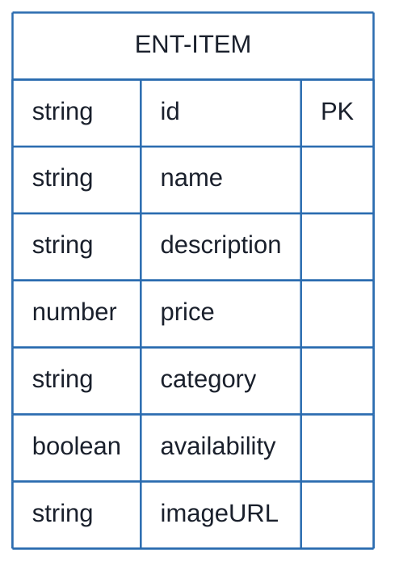
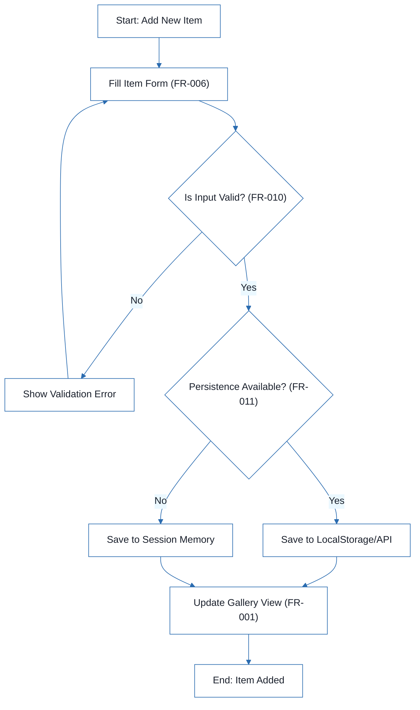
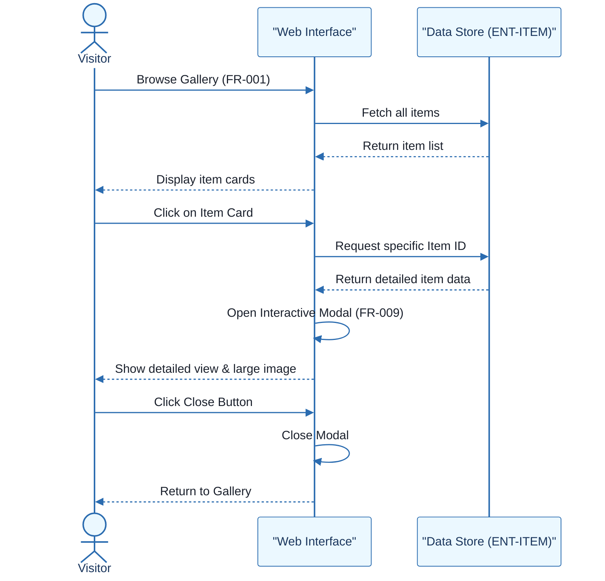

# Sales Item Management System - Technical Specification & Architecture Document

## 1. Executive Summary & Architecture Overview

### 1.1 Executive Brief
The Sales Item Management System is a client-side web application designed for browsing and managing a sales catalog. It implements a full CRUD pattern for 'Item' entities, featuring real-time search, category filtering, and dynamic sorting. The system operates as a single-page interactive interface focusing on a modern, responsive user experience for both visitors and administrators.

### 1.2 Maturity Assessment
The project is currently in REFINEMENT status. While functional requirements and entity mappings are complete, there is a high-severity structural gap regarding the data persistence strategy (LocalStorage vs. Mock API) and a medium-severity lack of defined project scope. These unresolved uncertainties prevent a final architectural freeze.

### 1.3 Technical Stack
* HTML
* CSS
* JavaScript

### 1.4 Architectural Constraints
* Client-side only implementation.
* Responsive layout for mobile, tablet, and desktop.
* Price validation: must be a positive number.
* Real-time search and filtering without page reload.
* Item addition performance: under 30 seconds.
* Consistent layout for 100% of catalog items.

### 1.5 Critical Dependencies
* Persistence layer (LocalStorage or Mock API) for cross-reload data retention.
* Item entity integrity: ID, Name, Description, Price, Category, Availability, ImageURL.
* Referential dependency between CRUD operations and the Item entity.
* Client-side DOM manipulation for real-time search and modal interactions.

## 2. Architecture Workflows

```mermaid
%%{init: {
  'theme': 'base',
  'themeVariables': {
    'primaryColor': '#1A365D',
    'primaryTextColor': '#1A202C',
    'primaryBorderColor': '#2B6CB0',
    'lineColor': '#2B6CB0',
    'secondaryColor': '#EBF8FF',
    'tertiaryColor': '#EBF8FF',
    'background': '#FFFFFF',
    'mainBkg': '#FFFFFF',
    'secondBkg': '#EBF8FF',
    'tertiaryBkg': '#F7FAFC',
    'secondaryTextColor': '#4A5568',
    'fontSize': '16px',
    'fontFamily': 'Inter, system-ui, sans-serif',
    'nodePadding': '15px',
    'borderRadius': '8px',
    'edgeLabelBackground': '#EBF8FF',
    'clusterBkg': '#F7FAFC',
    'clusterBorder': '#2B6CB0',
    'defaultLinkColor': '#2B6CB0',
    'titleColor': '#1A365D',
    'actorBorder': '#2B6CB0',
    'actorBkg': '#EBF8FF',
    'actorTextColor': '#1A365D',
    'actorLineColor': '#2B6CB0',
    'signalColor': '#2B6CB0',
    'signalTextColor': '#1A202C',
    'labelBoxBorderColor': '#2B6CB0',
    'labelBoxBkgColor': '#EBF8FF',
    'labelTextColor': '#1A202C',
    'loopTextColor': '#1A202C',
    'arrowHeadColor': '#2B6CB0',
    'sequenceNumberColor': '#1A365D',
    'sequenceActorBorder': '#2B6CB0',
    'sequenceActorBkg': '#EBF8FF',
    'sequenceArrowColor': '#2B6CB0',
    'noteBkgColor': '#FFF5EB',
    'noteBorderColor': '#DD6B20',
    'noteTextColor': '#1A202C'
  }
}}%%
flowchart TD
    subgraph US_VIEW_GROUP ["User Story: View & Browse"]
        US-VIEW["US-VIEW: View and Browse Items"]
    end
    subgraph US_MANAGE_GROUP ["User Story: Manage Items"]
        US-MANAGE["US-MANAGE: Manage Items (CRUD)"]
    end
    subgraph US_DETAILS_GROUP ["User Story: Item Details"]
        US-DETAILS["US-DETAILS: Interactive Item Details"]
    end
    FR-001["FR-001: Display Gallery"] -->|"implements"| US-VIEW
    FR-002["FR-002: Real-time Search"] -->|"implements"| US-VIEW
    FR-003["FR-003: Category Filter"] -->|"implements"| US-VIEW
    FR-004["FR-004: Availability Filter"] -->|"implements"| US-VIEW
    FR-005["FR-005: Dynamic Sorting"] -->|"implements"| US-VIEW
    FR-006["FR-006: Add Item Form"] -->|"implements"| US-MANAGE
    FR-007["FR-007: Edit Item Details"] -->|"implements"| US-MANAGE
    FR-008["FR-008: Delete Item"] -->|"implements"| US-MANAGE
    FR-010["FR-010: Input Validation"] -->|"implements"| US-MANAGE
    FR-009["FR-009: Interactive Modal"] -->|"implements"| US-DETAILS
```







```mermaid
%%{init: {
  'theme': 'base',
  'themeVariables': {
    'primaryColor': '#1A365D',
    'primaryTextColor': '#1A202C',
    'primaryBorderColor': '#2B6CB0',
    'lineColor': '#2B6CB0',
    'secondaryColor': '#EBF8FF',
    'tertiaryColor': '#EBF8FF',
    'background': '#FFFFFF',
    'mainBkg': '#FFFFFF',
    'secondBkg': '#EBF8FF',
    'tertiaryBkg': '#F7FAFC',
    'secondaryTextColor': '#4A5568',
    'fontSize': '16px',
    'fontFamily': 'Inter, system-ui, sans-serif',
    'nodePadding': '15px',
    'borderRadius': '8px',
    'edgeLabelBackground': '#EBF8FF',
    'clusterBkg': '#F7FAFC',
    'clusterBorder': '#2B6CB0',
    'defaultLinkColor': '#2B6CB0',
    'titleColor': '#1A365D',
    'actorBorder': '#2B6CB0',
    'actorBkg': '#EBF8FF',
    'actorTextColor': '#1A365D',
    'actorLineColor': '#2B6CB0',
    'signalColor': '#2B6CB0',
    'signalTextColor': '#1A202C',
    'labelBoxBorderColor': '#2B6CB0',
    'labelBoxBkgColor': '#EBF8FF',
    'labelTextColor': '#1A202C',
    'loopTextColor': '#1A202C',
    'arrowHeadColor': '#2B6CB0',
    'sequenceNumberColor': '#1A365D',
    'sequenceActorBorder': '#2B6CB0',
    'sequenceActorBkg': '#EBF8FF',
    'sequenceArrowColor': '#2B6CB0',
    'noteBkgColor': '#FFF5EB',
    'noteBorderColor': '#DD6B20',
    'noteTextColor': '#1A202C'
  }
}}%%
sequenceDiagram
    actor Visitor
    participant UI as "Web Interface"
    participant Store as "Data Store (ENT-ITEM)"
    Visitor ->> UI: Browse Gallery (FR-001)
    UI ->> Store: Fetch all items
    Store -->> UI: Return item list
    UI -->> Visitor: Display item cards
    Visitor ->> UI: Click on Item Card
    UI ->> Store: Request specific Item ID
    Store -->> UI: Return detailed item data
    UI ->> UI: Open Interactive Modal (FR-009)
    UI -->> Visitor: Show detailed view & large image
    Visitor ->> UI: Click Close Button
    UI ->> UI: Close Modal
    UI -->> Visitor: Return to Gallery
``` & Visual Diagrams

### 2.1 Sales Item Data Model
```mermaid
%%{init: {
  'theme': 'base',
  'themeVariables': {
    'primaryColor': '#1A365D',
    'primaryTextColor': '#1A202C',
    'primaryBorderColor': '#2B6CB0',
    'lineColor': '#2B6CB0',
    'secondaryColor': '#EBF8FF',
    'tertiaryColor': '#EBF8FF',
    'background': '#FFFFFF',
    'mainBkg': '#FFFFFF',
    'secondBkg': '#EBF8FF',
    'tertiaryBkg': '#F7FAFC',
    'secondaryTextColor': '#4A5568',
    'fontSize': '16px',
    'fontFamily': 'Inter, system-ui, sans-serif',
    'nodePadding': '15px',
    'borderRadius': '8px',
    'edgeLabelBackground': '#EBF8FF',
    'clusterBkg': '#F7FAFC',
    'clusterBorder': '#2B6CB0',
    'defaultLinkColor': '#2B6CB0',
    'titleColor': '#1A365D',
    'actorBorder': '#2B6CB0',
    'actorBkg': '#EBF8FF',
    'actorTextColor': '#1A365D',
    'actorLineColor': '#2B6CB0',
    'signalColor': '#2B6CB0',
    'signalTextColor': '#1A202C',
    'labelBoxBorderColor': '#2B6CB0',
    'labelBoxBkgColor': '#EBF8FF',
    'labelTextColor': '#1A202C',
    'loopTextColor': '#1A202C',
    'arrowHeadColor': '#2B6CB0',
    'sequenceNumberColor': '#1A365D',
    'sequenceActorBorder': '#2B6CB0',
    'sequenceActorBkg': '#EBF8FF',
    'sequenceArrowColor': '#2B6CB0',
    'noteBkgColor': '#FFF5EB',
    'noteBorderColor': '#DD6B20',
    'noteTextColor': '#1A202C'
  }
}}%%
erDiagram
    ENT-ITEM {
        string id PK
        string name
        string description
        number price
        string category
        boolean availability
        string imageURL
    }
```

### 2.2 Requirements Traceability Matrix


### 2.3 Item Management Workflow


### 2.4 Item Interaction Sequence


## 3. Detailed Technical Specifications & Business Rules

### 3.1 Requirements Traceability
| ID | Type | Description | Implements | Depends On |
| :--- | :--- | :--- | :--- | :--- |
| US-VIEW | User Story | As a visitor, I want to see a list of items available for sale so that I can find products that interest me. | - | - |
| US-MANAGE | User Story | As an administrator, I want to add, edit, and delete items from the catalog so that the inventory remains up-to-date. | - | - |
| US-DETAILS | User Story | As a visitor, I want to click on an item to see more details or a larger image so that I can make an informed purchase decision. | - | - |
| FR-001 | Functional | System MUST display a gallery of items for sale. | US-VIEW | ENT-ITEM |
| FR-002 | Functional | System MUST allow real-time search by item name or description. | US-VIEW | - |
| FR-003 | Functional | System MUST allow filtering items by category. | US-VIEW | - |
| FR-004 | Functional | System MUST allow filtering items by availability status. | US-VIEW | - |
| FR-005 | Functional | System MUST provide dynamic client-side sorting (e.g., by price, name, or date added). | US-VIEW | - |
| FR-006 | Functional | System MUST provide a form to add new items to the catalog. | US-MANAGE | ENT-ITEM |
| FR-007 | Functional | System MUST allow editing of existing item details. | US-MANAGE | - |
| FR-008 | Functional | System MUST allow deletion of items from the catalog. | US-MANAGE | - |
| FR-009 | Functional | System MUST display item details in an interactive modal. | US-DETAILS | - |
| FR-010 | Functional | System MUST validate form inputs (e.g., price must be a positive number). | US-MANAGE | - |
| FR-011 | Functional | System MUST persist item data across page reloads. | - | - |
| ENT-ITEM | Entity | Item: ID, Name, Description, Price, Category, Availability, ImageURL | - | - |
| NFR-RESPONSIVE | Non-Func | The interface is fully responsive and usable on mobile, tablet, and desktop. | - | - |
| ASSUMP-CLIENT | Assumption | The project is a client-side implementation (HTML/CSS/JS). | - | - |

### 3.2 Security Rules
* **Input Validation**: All form submissions (FR-010) must be validated on the client side to prevent negative pricing or empty mandatory fields.
* **Data Integrity**: The system must ensure that the `ID` of the `ENT-ITEM` remains unique during CRUD operations.

### 3.3 Data Models
**Entity: Item (ENT-ITEM)**
* `ID`: Unique identifier (String)
* `Name`: Product name (String)
* `Description`: Detailed product info (String)
* `Price`: Monetary value (Number)
* `Category`: Product classification (String)
* `Availability`: Stock status (Boolean)
* `ImageURL`: Path to product image (String)

## 4. Project Governance & Structural Gaps

### 4.1 Structural Gaps
| Gap | Priority | Remediation Advice |
| :--- | :--- | :--- |
| Scope & Out-of-Scope | MEDIUM | Define explicitly what the system will NOT do (e.g., no payment gateway, no user authentication). |
| Open Questions & Uncertainties | HIGH | The document mentions persistence needs clarification (LocalStorage vs API). This should be formalized in a dedicated section. |

### 4.2 Remediation & Workflow
1. **Persistence Decision**: Architect must decide between `LocalStorage` for simple persistence or a `Mock API/JSON` for simulated backend interaction.
2. **Scope Definition**: Define the boundaries of the "Management" interface to avoid scope creep (e.g., confirming no multi-user roles).
3. **Validation Logic**: Formalize the exact regex or validation rules for `FR-010`.

## 5. Technical & Domain Glossary (Terminology Reference)

| Term | Category | Context Anchor | Project Definition |
| :--- | :--- | :--- | :--- |
| API | TECHNICAL_STACK | FR-011 | A potential external interface for data exchange and remote storage of the catalog. |
| CRUD | TECHNICAL_STACK | Success Criteria | The four foundational persistent storage mutation primitives used for catalog maintenance. |
| CSS | TECHNICAL_STACK | ASSUMP-CLIENT | The styling language used to implement a clean, minimalist, and responsive visual layout. |
| Empty Catalog | BUSINESS_DOMAIN | Edge Cases | A state where no products are available, triggering a specific notification message to the visitor. |
| Fixed-Point Numeric Constraint | TECHNICAL_STACK | FR-010 | A validation rule ensuring that monetary values are positive numbers. |
| HTML | TECHNICAL_STACK | ASSUMP-CLIENT | The structural markup language used to define the web application pages. |
| ID | BUSINESS_DOMAIN | ENT-ITEM | A unique alphanumeric token assigned to each product for precise identification. |
| Invalid Input | BUSINESS_DOMAIN | Edge Cases | Data entries that violate system rules, such as negative pricing or missing names, which must be blocked. |
| Item | BUSINESS_DOMAIN | ENT-ITEM | The core entity containing a name, description, price, category, availability status, and image link. |
| JS | TECHNICAL_STACK | ASSUMP-CLIENT | The scripting language used to enable real-time filtering, sorting, and interactive modals. |
| JSON | TECHNICAL_STACK | FR-011 | A lightweight data-interchange format used for potential mock data storage. |
| LocalStorage | TECHNICAL_STACK | Edge Cases | A browser-based key-value storage mechanism used to maintain data across page reloads. |
| Measurable | TECHNICAL_STACK | Success Criteria | A quality metric requiring that a new product be added in under 30 seconds. |
| Persistence | TECHNICAL_STACK | FR-011 | The capability to save catalog state so it remains available after the session ends. |
| Technology-Agnostic | TECHNICAL_STACK | Success Criteria | A design requirement ensuring the interface remains usable regardless of the device or screen size. |
| User-Focused | BUSINESS_DOMAIN | Success Criteria | A requirement ensuring 100% of the catalog follows a consistent visual layout. |
| Verifiable | TECHNICAL_STACK | Success Criteria | A state where all data mutation operations are tested and confirmed as functional. |