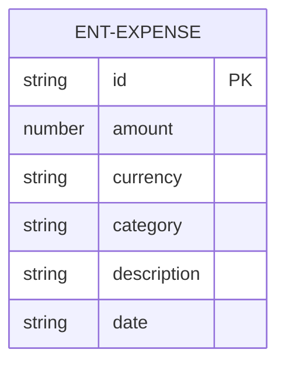
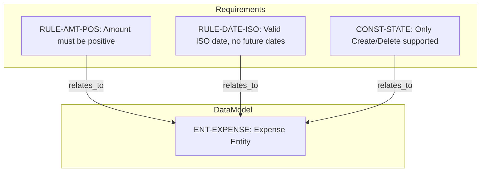
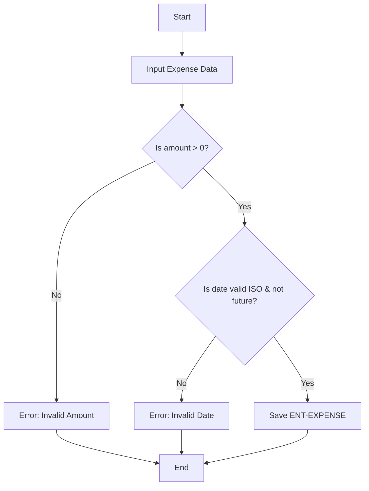

# Expense Tracker - Technical Specification & Architecture Document

## 1. Executive Summary & Architecture Overview

### 1.1 Executive Brief
The Expense Tracker is a specialized data-model implementation designed for recording financial expenditures. The system centers on a single Expense entity with strict validation for monetary amounts and temporal markers, utilizing a simplified state machine restricted to creation and deletion operations. The data pattern follows a flat entity structure with ISO-standardized attributes for currency and dating.

### 1.2 Maturity Assessment
The specification is currently in a state of REFINEMENT. While the data model is complete for the Expense entity, the project suffers from significant structural voids, specifically the total absence of high-priority business goals, non-functional requirements, and formal scope boundaries, which prevents full implementation readiness.

### 1.3 Technical Stack
*   **ID Generation**: `Date.now().toString()`
*   **Date Standard**: ISO 8601
*   **Currency Standard**: ISO Currency Codes

### 1.4 Architectural Constraints
*   **Amount Validation**: Must be a positive number strictly > 0.
*   **Date Validation**: Must adhere to ISO 8601 format and cannot be a future date.
*   **State Transition Restriction**: Only creation and deletion are permitted; edits and soft-deletes are explicitly excluded.

### 1.5 Critical Dependencies
*   ISO 8601 date standard compliance.
*   ISO currency code standard for the currency attribute.
*   Strict referential integrity between validation rules (`RULE-AMT-POS`, `RULE-DATE-ISO`) and the `ENT-EXPENSE` entity.

## 2. Architecture Workflows & Visual Diagrams

### 2.1 Expense Data Model

### 2.2 Expense Validation & Constraint Traceability

### 2.3 Expense Creation Workflow

## 3. Detailed Technical Specifications & Business Rules

### 3.1 Requirements Traceability
| Identifier | Type | Description | Source Section |
| :--- | :--- | :--- | :--- |
| `ENT-EXPENSE` | Entity | Expense entity consisting of id, amount, currency, category, description, and date. | data-model.md |
| `RULE-AMT-POS` | Functional Requirement | The amount must be a positive number (>0). | data-model.md |
| `RULE-DATE-ISO` | Functional Requirement | The date must be a valid ISO 8601 date and cannot be in the future. | data-model.md |
| `CONST-STATE` | Constraint | Only creation and deletion are supported; edits and soft-deletes are explicitly excluded in the initial version. | data-model.md |

### 3.2 Security Rules
*No specific security rules were defined in the source data.*

### 3.3 Data Models
**Entity: ENT-EXPENSE**
| Attribute | Type | Constraints |
| :--- | :--- | :--- |
| `id` | string | Generated via `Date.now().toString()` |
| `amount` | number | Required, > 0 (`RULE-AMT-POS`) |
| `currency` | string | ISO code, default `USD` |
| `category` | string | Optional |
| `description` | string | Optional |
| `date` | string | Required, ISO 8601, not in future (`RULE-DATE-ISO`) |

## 4. Project Governance & Structural Gaps

### 4.1 Structural Gaps
| Missing Section | Priority | Remediation Advice |
| :--- | :--- | :--- |
| Goals & Objectives | HIGH | Define the business purpose of the Expense Tracker. |
| Non-Functional Requirements | MEDIUM | Specify performance, security, or accessibility requirements. |
| Scope & Out-of-Scope | MEDIUM | Formally define the boundaries of the application. |
| Open Questions & Uncertainties | LOW | List any unresolved architectural or business decisions. |

### 4.2 Remediation & Workflow
The project must transition from the current "Refinement" state to "Implementation Ready" by addressing the high-priority gaps in business goals and scope definition.

## 5. Technical & Domain Glossary (Terminology Reference)

| Term | Category | Context Anchor | Project Definition |
| :--- | :--- | :--- | :--- |
| Fixed-Point Numeric Constraint | TECHNICAL_STACK | `RULE-AMT-POS` | A validation requirement ensuring the monetary value remains strictly greater than zero. |
| USD | BUSINESS_DOMAIN | `ENT-EXPENSE` | The default three-letter international standard code for the United States Dollar used as the baseline monetary unit. |