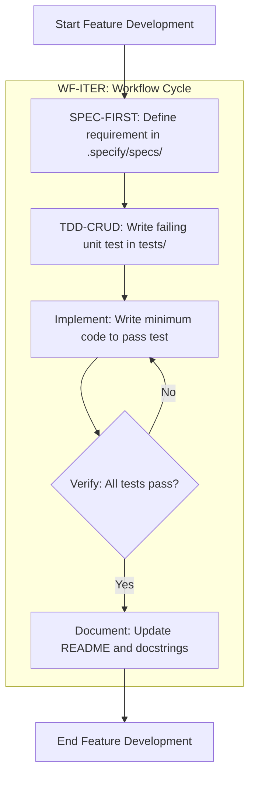
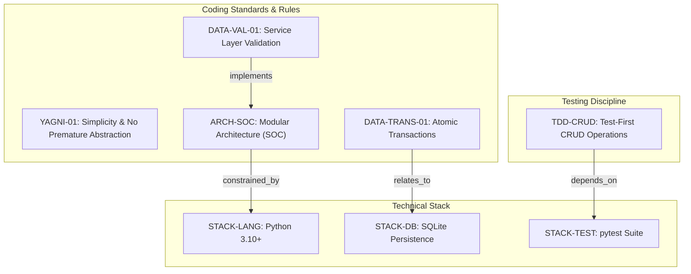

# Expense Tracker - Technical Specification & Architecture Document

## 1. Executive Summary & Architecture Overview

### 1.1 Executive Brief
The Expense Tracker is a local financial management application built on Python 3.10+ using a CLI interface. It leverages a strict modular architecture separating data access (Repository pattern) from business logic (Services), ensuring data atomicity through SQLite transactions and a TDD-driven development lifecycle.

### 1.2 Maturity Assessment
The specifications exhibit high structural integrity and alignment with the project's core principles. While a minor gap was identified regarding the absence of a dedicated 'Open Questions' section, the overall architectural definition is comprehensive and logically sound. Status: READY.

### 1.3 Technical Stack
* **Language**: Python 3.10+
* **Storage**: SQLite
* **Testing**: pytest
* **Interface**: Command Line Interface (CLI)

### 1.4 Architectural Constraints
* **Separation of Concerns**: Strict isolation between Repository pattern (data access), Services (business logic), and CLI/API (UI).
* **Data Atomicity**: Mandatory use of database transactions for all data modifications.
* **Validation**: Service-layer validation is required to prevent invalid data states.
* **TDD Mandate**: Unit tests for every CRUD operation must be written prior to implementation code.
* **Workflow Sequence**: Strict adherence to the cycle: Spec (.specify/specs/) $\rightarrow$ Test $\rightarrow$ Implement $\rightarrow$ Verify $\rightarrow$ Document.
* **YAGNI Principle**: Prohibition of abstract base classes or complex patterns unless explicitly required by logic.

### 1.5 Critical Dependencies
* SQLite for local data persistence.
* pytest for test suite execution and validation.
* Strict foreign-key/transactional integrity between Service and Repository layers.
* Pre-implementation documentation in `.specify/specs/` as a mandatory workflow gate.

## 2. Architecture Workflows & Visual Diagrams

### 2.1 Development Workflow Process
Visual representation of the TDD-driven development cycle for the Expense Tracker project, including the mandatory verification loop.

### 2.2 Architectural Governance Traceability
Mapping of technical constraints and coding standards to the overall project architecture and tools.

## 3. Detailed Technical Specifications & Business Rules

### 3.1 Requirements Traceability

| Identifier | Type | Requirement / Rule Description | Source Section |
| :--- | :--- | :--- | :--- |
| YAGNI-01 | coding_standard | Features MUST be implemented only when there is a direct requirement; avoid premature abstraction. | Simplicity and YAGNI |
| DATA-TRANS-01 | rule | All data modifications MUST be performed using transactions to ensure atomicity. | Data Integrity and Persistence |
| DATA-VAL-01 | rule | Invalid data state MUST be prevented via validation at the service layer. | Data Integrity and Persistence |
| ARCH-SOC | coding_standard | Separation of concerns: Repository pattern for data access, Services for business logic, CLI/API for UI. | Modular Architecture |
| TDD-CRUD | testing_gate | Every CRUD operation MUST have a unit test written before the implementation code. | TDD for CRUD Operations |
| SPEC-FIRST | requirement | Every feature MUST be documented in .specify/specs/ before implementation. | Exhaustive Specification |
| STACK-LANG | tool_config | Language: Python 3.10+ | Technical Constraints |
| STACK-DB | tool_config | Storage: SQLite for local persistence. | Technical Constraints |
| STACK-TEST | tool_config | Testing: pytest for all test suites. | Technical Constraints |
| WF-ITER | workflow | Workflow cycle: Spec $\rightarrow$ Test $\rightarrow$ Implement $\rightarrow$ Verify $\rightarrow$ Document. | Development Workflow |

### 3.2 Security Rules
* **Data Integrity**: All state changes must be wrapped in transactions (`DATA-TRANS-01`) to prevent partial updates.
* **Input Validation**: The service layer acts as the primary security gate to prevent invalid data from reaching the persistence layer (`DATA-VAL-01`).

### 3.3 Data Models
* **Persistence**: Local structured storage using SQLite (`STACK-DB`).
* **Access Pattern**: Repository Pattern used to abstract the data source from the business logic (`ARCH-SOC`).

## 4. Project Governance & Structural Gaps

### 4.1 Structural Gaps
| Gap | Priority | Remediation Advice |
| :--- | :--- | :--- |
| Open Questions & Uncertainties | LOW | Create a section to track technical unknowns or future architectural decisions. |

### 4.2 Remediation & Workflow
The project follows a "Constitution" model where this document is the Single Source of Truth. Any modification requires:
1. A version bump.
2. Documentation of changes.
3. Validation by the project lead.

## 5. Technical & Domain Glossary (Terminology Reference)

| Term | Category | Context Anchor | Project Definition |
| :--- | :--- | :--- | :--- |
| API | TECHNICAL_STACK | ARCH-SOC | An external communication layer used for the user interface, strictly separated from business and data layers. |
| CRUD | TECHNICAL_STACK | TDD-CRUD | The four foundational persistent storage mutation primitives requiring preceding unit tests. |
| Document | TECHNICAL_STACK | WF-ITER | The final workflow phase ensuring function docstrings and the main project overview are current. |
| Implement | TECHNICAL_STACK | WF-ITER | The act of writing the minimum necessary source code to satisfy a failing test. |
| Interface | TECHNICAL_STACK | Technical Constraints | A simple command line interaction point for the end user. |
| Language | TECHNICAL_STACK | STACK-LANG | The primary coding syntax required, specifically version 3.10 or higher. |
| MediReserve | BUSINESS_DOMAIN | Header du document | A legacy domain completely replaced by the current financial tracking system. |
| Python 3.10 | TECHNICAL_STACK | STACK-LANG | The mandated runtime environment for all application logic. |
| README | TECHNICAL_STACK | WF-ITER | The top-level project documentation file requiring updates at the end of the development cycle. |
| Spec First | TECHNICAL_STACK | SPEC-FIRST | The mandatory requirement to define design and functional criteria in .specify/specs/ before any coding. |
| Storage | TECHNICAL_STACK | STACK-DB | Local persistence managed via SQLite to ensure data durability. |
| TDD | TECHNICAL_STACK | TDD-CRUD | A development cycle where unit tests are authored prior to the functional code. |
| Test First | TECHNICAL_STACK | WF-ITER | The specific workflow step of writing a failing test for a particular data operation. |
| Testing | TECHNICAL_STACK | STACK-TEST | The quality assurance process executed using pytest for all suites. |
| UI | TECHNICAL_STACK | ARCH-SOC | The presentation layer consisting of CLI or API, forbidden from interacting directly with data layers. |
| Verify | TECHNICAL_STACK | WF-ITER | The execution of the complete test suite to prevent regressions. |
| YAGNI | TECHNICAL_STACK | YAGNI-01 | A design principle forbidding premature abstraction and features without direct requirements. |