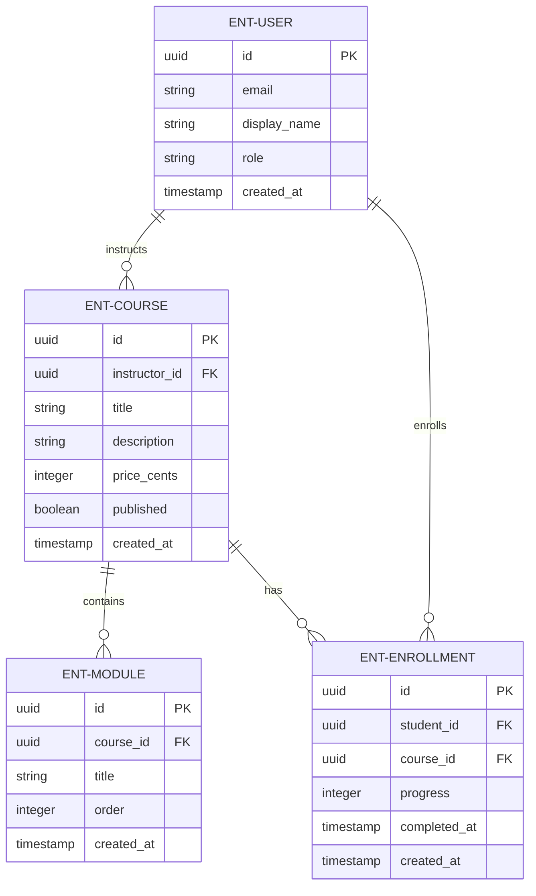
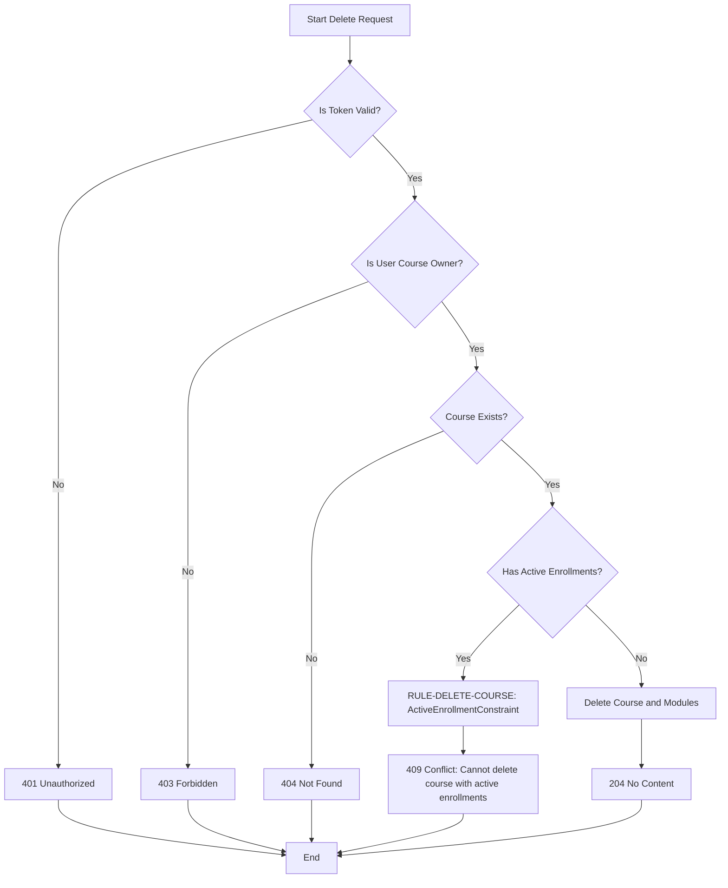
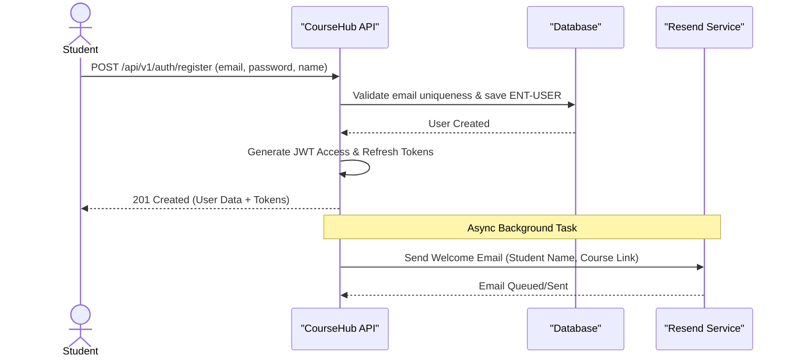
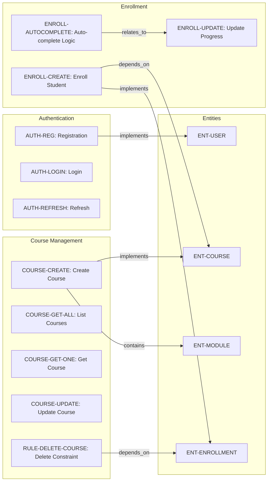

# CourseHub - Technical Specification & Architecture Document

## 1. Executive Summary & Architecture Overview

### 1.1 Executive Brief
CourseHub is a RESTful API designed for course management and student enrollment workflows. Hosted on a local environment at port 8000, the system implements a JWT-based authentication pattern to secure role-based access for Students and Instructors, managing the lifecycle of courses, modules, and enrollment progress.

### 1.2 Maturity Assessment
The specification is technically detailed regarding API contracts and data shapes, but it lacks strategic alignment and boundary definitions. Specifically, the absence of high-level business goals and a defined project scope represents a significant structural gap. Consequently, the project status is REFINEMENT, as the technical implementation is clear but the overarching objectives are not anchored.

### 1.3 Technical Stack
* **Authentication**: JWT
* **Email Service**: Resend
* **Data Format**: JSON
* **ID Standard**: UUID
* **Password Security**: bcrypt

### 1.4 Architectural Constraints
* **Base URL**: `http://localhost:8000/api/v1`
* **Content-Type**: `application/json`
* **Authentication**: JWT Bearer tokens required in `Authorization` header.
* **Enrollment Validation**: Progress must be strictly between 0 and 100 inclusive.
* **Course Deletion**: Rejected with `409 Conflict` if active enrollments exist (`ActiveEnrollmentConstraint`).
* **Cascade Logic**: Associated modules are deleted only if no enrollments exist for the course.
* **Access Control**: Instructor access is restricted to owned courses; Student access is restricted to owned enrollments.
* **Auto-completion**: `completed_at` timestamp is automatically set when `progress == 100` and `completed_at` is null.

### 1.5 Critical Dependencies
* **Resend**: Async BackgroundTask for welcome emails.
* **JWT**: Token issuance and validation for protected routes.
* **Relational Integrity**: Enrollment strict foreign key dependence on User and Course entities.
* **Ownership Gates**: Verification logic for PUT/DELETE operations on Course and Enrollment entities.

## 2. Architecture Workflows & Visual Diagrams

### 2.1 CourseHub Data Model


### 2.2 Course Deletion Workflow


### 2.3 Student Registration & Auth Sequence


### 2.4 Requirements Traceability Matrix


## 3. Detailed Technical Specifications & Business Rules

### 3.1 Requirements Traceability
| Identifier | Type | Description | Source Section |
| :--- | :--- | :--- | :--- |
| **API-BASE-URL** | NFR | Base URL: http://localhost:8000/api/v1, Content-Type: application/json | API Overview |
| **API-AUTH-JWT** | NFR | Authentication via JWT Bearer tokens in Authorization header | API Overview |
| **API-ENVELOPE** | NFR | All responses follow a consistent envelope shape with data, meta, and errors fields | Response Envelope |
| **AUTH-REG** | FR | Student self-registration allowing creation of user and issuance of JWT tokens | POST `/api/v1/auth/register` |
| **AUTH-LOGIN** | FR | Public login for students and instructors returning JWT tokens | POST `/api/v1/auth/login` |
| **AUTH-REFRESH** | FR | Refresh access token using a valid refresh token | POST `/api/v1/auth/refresh` |
| **COURSE-CREATE** | FR | Instructor-only creation of courses including modules | POST `/api/v1/courses` |
| **COURSE-GET-ALL** | FR | Instructor-only retrieval of their own courses with pagination | GET `/api/v1/courses` |
| **COURSE-GET-ONE** | FR | Public access to published courses; instructor access to their own courses | GET `/api/v1/courses/{course_id}` |
| **COURSE-UPDATE** | FR | Instructor-only update of their own courses | PUT `/api/v1/courses/{course_id}` |
| **RULE-DELETE-COURSE** | Constraint | ActiveEnrollmentConstraint: Course cannot be deleted if it has active enrollments | DELETE `/api/v1/courses/{course_id}` |
| **ENROLL-CREATE** | FR | Student enrollment in a published course; prevents duplicate enrollments | POST `/api/v1/enrollments` |
| **ENROLL-UPDATE** | FR | Student update of enrollment progress (0-100) | PUT `/api/v1/enrollments/{enrollment_id}` |
| **ENROLL-AUTOCOMPLETE** | FR | If progress is 100 and completed_at is null, system automatically sets completed_at | PUT `/api/v1/enrollments/{enrollment_id}` |
| **ENT-USER** | Entity | User entity: id, email, display_name, role, created_at, hashed_password | User |
| **ENT-COURSE** | Entity | Course entity: id, instructor_id, title, description, price_cents, published, timestamps, modules | Course |
| **ENT-MODULE** | Entity | Module entity: id, course_id, title, order, created_at | Module |
| **ENT-ENROLLMENT** | Entity | Enrollment entity: id, student_id, course_id, progress, completed_at, timestamps | Enrollment |

### 3.2 Security Rules
* **Authentication**: All protected endpoints require a `Bearer <token>` in the `Authorization` header.
* **Role-Based Access Control (RBAC)**:
    * `Student`: Can register, enroll in courses, and update their own enrollment progress.
    * `Instructor`: Can create, update, and delete courses they own.
    * `Public`: Can access published courses and the login/refresh endpoints.
* **Ownership Verification**: PUT and DELETE operations on courses and enrollments must verify that the requesting user is the owner of the resource.

### 3.3 Data Models

#### ENT-USER
```typescript
{
  "id": "uuid",
  "email": "string (unique, valid email)",
  "display_name": "string",
  "role": "student" | "instructor",
  "created_at": "ISO 8601 timestamp",
  "hashed_password": "bcrypt hash (not returned in responses)"
}
```

#### ENT-COURSE
```typescript
{
  "id": "uuid",
  "instructor_id": "uuid (FK → User)",
  "title": "string",
  "description": "string",
  "price_cents": "integer (>= 0)",
  "published": "boolean",
  "created_at": "ISO 8601 timestamp",
  "updated_at": "ISO 8601 timestamp",
  "modules": "array of Module"
}
```

#### ENT-MODULE
```typescript
{
  "id": "uuid",
  "course_id": "uuid (FK → Course)",
  "title": "string",
  "order": "integer (>= 1)",
  "created_at": "ISO 8601 timestamp"
}
```

#### ENT-ENROLLMENT
```typescript
{
  "id": "uuid",
  "student_id": "uuid (FK → User)",
  "course_id": "uuid (FK → Course)",
  "progress": "integer (0-100)",
  "completed_at": "ISO 8601 timestamp | null",
  "created_at": "ISO 8601 timestamp",
  "updated_at": "ISO 8601 timestamp"
}
```

## 4. Project Governance & Structural Gaps

### 4.1 Structural Gaps
| Gap | Priority | Remediation Advice |
| :--- | :--- | :--- |
| Goals & Objectives | HIGH | The document is purely technical. Need a higher-level spec to define the business goals and value proposition. |
| Scope & Out-of-Scope | MEDIUM | Define what the API does NOT handle (e.g., payment processing details, content delivery mechanism). |
| Open Questions & Uncertainties | LOW | Identify any undecided API behaviors or edge cases. |

### 4.2 Remediation & Workflow
The project is currently in the **REFINEMENT** phase. To move to a "Ready for Implementation" state, the architectural team must produce a Business Requirements Document (BRD) to fill the high-priority gaps identified in section 4.1.

## 5. Technical & Domain Glossary (Terminology Reference)

| Term | Category | Context Anchor | Project Definition |
| :--- | :--- | :--- | :--- |
| API | TECHNICAL_STACK | API Overview | The structured set of endpoints operating under the v1 namespace to facilitate communication between clients and the server. |
| ActiveEnrollmentConstraint | BUSINESS_DOMAIN | RULE-DELETE-COURSE | A validation rule that prohibits the removal of an educational offering if it currently contains registered participants. |
| Authentication | TECHNICAL_STACK | API-AUTH-JWT | The security process of verifying identity via bearer tokens passed in the request header. |
| BackgroundTask | TECHNICAL_STACK | POST `/api/v1/auth/register` | An asynchronous operation executed independently of the main request-response cycle, such as triggering transactional emails. |
| Business Rule | BUSINESS_DOMAIN | RULE-DELETE-COURSE | A formal constraint governing the allowable state transitions or operations within the system logic. |
| CORS Standard | TECHNICAL_STACK | API-BASE-URL | The protocol governing cross-origin resource sharing to allow secure access from diverse browser domains. |
| Cryptographic Hashing | TECHNICAL_STACK | ENT-USER | The application of bcrypt to transform plaintext passwords into irreversible fixed-length strings for secure storage. |
| Error Response | TECHNICAL_STACK | API-ENVELOPE | A standardized payload containing an array of failure details, codes, and messages when an operation cannot be completed. |
| FK | TECHNICAL_STACK | ENT-COURSE | A relational pointer that enforces referential integrity between two data entities. |
| JSON | TECHNICAL_STACK | API-BASE-URL | The lightweight data-interchange format used for all request and response bodies. |
| JWT | TECHNICAL_STACK | API-AUTH-JWT | A compact, URL-safe means of representing claims to be transferred between two parties as a bearer token. |
| NOT | BUSINESS_DOMAIN | POST `/api/v1/auth/register` | A logical negation operator indicating that a specific side effect must not impede the delivery of the primary response. |
| Reference | TECHNICAL_STACK | Data Type Reference | The technical documentation mapping defining the structural properties and types of the system entities. |
| Request | TECHNICAL_STACK | POST `/api/v1/auth/register` | The incoming data payload and headers sent by a client to initiate a specific server-side operation. |
| Response | TECHNICAL_STACK | API-ENVELOPE | The outgoing payload sent from the server, wrapped in a consistent envelope containing data and metadata. |
| Role | BUSINESS_DOMAIN | ENT-USER | A classification assigned to a user, such as student or instructor, which determines access permissions and available actions. |
| UUID | TECHNICAL_STACK | ENT-USER | The 128-bit universally unique identifier used as the primary key for all system entities. |