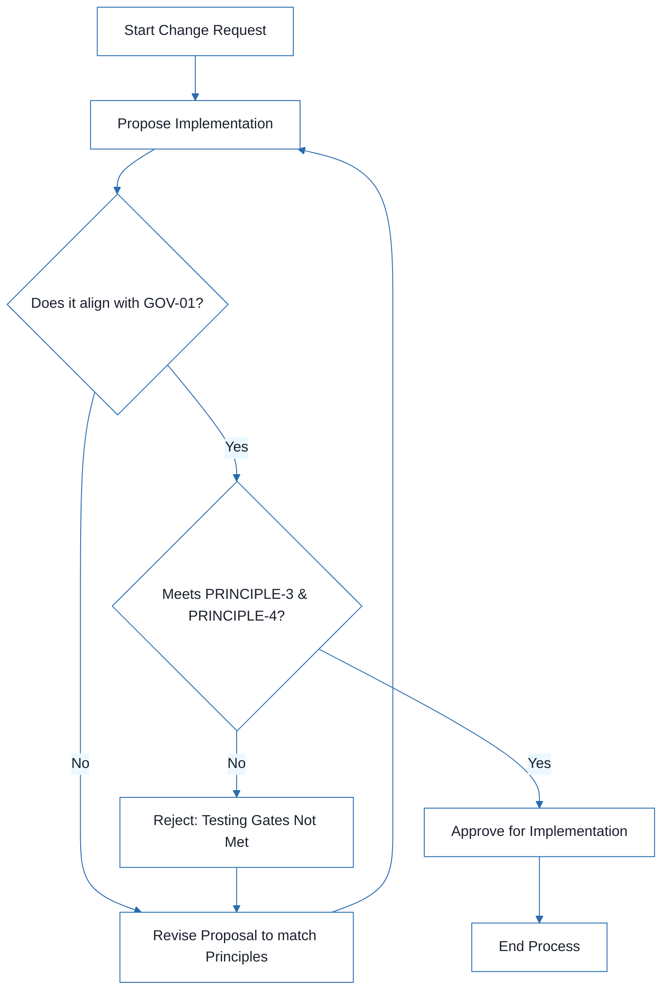

# [PROJECT_NAME] - Technical Specification & Architecture Document

## 1. Executive Summary & Architecture Overview

### 1.1 Executive Brief
This project is currently a skeletal architectural template for a project constitution. It defines a structural framework for governance, coding standards, and testing gates but contains no concrete technical implementation, host platform, or data patterns. It serves as a blueprint for establishing a 'Library-First' and 'Test-First' development culture.

### 1.2 Maturity Assessment
The project is in a pre-initialization state. While the structural mapping is complete, the content consists entirely of placeholders and examples. Due to the high-severity gap regarding the total absence of project-specific decisions and the lack of a defined uncertainty log, the status is **REFINEMENT**.

### 1.3 Technical Stack
*   **Languages & Frameworks**: None defined (Template state)
*   **Databases**: None defined
*   **SDKs/Tools**: None defined

### 1.4 Architectural Constraints
*   **TDD Mandatory**: Red-Green-Refactor cycle strictly enforced.
*   **Library-First**: Features must be standalone, self-contained, and independently testable.
*   **CLI Interface**: Text in/out protocol (stdin/args to stdout, errors to stderr).
*   **Output Formats**: Support for both JSON and human-readable formats.
*   **Integration Testing**: Mandatory for new library contracts, contract changes, and inter-service communication.

### 1.5 Critical Dependencies
*   **Governance Authority**: Governance rules (`GOV-01`) serve as the primary authority over all technical principles.
*   **Testing Gate**: Strict dependency between feature implementation and prior test approval (Test-First gate).
*   **Contract Integrity**: Referential integrity between library contracts and integration test suites.

## 2. Architecture Workflows

```mermaid
%%{init: {
  'theme': 'base',
  'themeVariables': {
    'primaryColor': '#1A365D',
    'primaryTextColor': '#1A202C',
    'primaryBorderColor': '#2B6CB0',
    'lineColor': '#2B6CB0',
    'secondaryColor': '#EBF8FF',
    'tertiaryColor': '#EBF8FF',
    'background': '#FFFFFF',
    'mainBkg': '#FFFFFF',
    'secondBkg': '#EBF8FF',
    'tertiaryBkg': '#F7FAFC',
    'secondaryTextColor': '#4A5568',
    'fontSize': '16px',
    'fontFamily': 'Inter, system-ui, sans-serif',
    'nodePadding': '15px',
    'borderRadius': '8px',
    'edgeLabelBackground': '#EBF8FF',
    'clusterBkg': '#F7FAFC',
    'clusterBorder': '#2B6CB0',
    'defaultLinkColor': '#2B6CB0',
    'titleColor': '#1A365D',
    'actorBorder': '#2B6CB0',
    'actorBkg': '#EBF8FF',
    'actorTextColor': '#1A365D',
    'actorLineColor': '#2B6CB0',
    'signalColor': '#2B6CB0',
    'signalTextColor': '#1A202C',
    'labelBoxBorderColor': '#2B6CB0',
    'labelBoxBkgColor': '#EBF8FF',
    'labelTextColor': '#1A202C',
    'loopTextColor': '#1A202C',
    'arrowHeadColor': '#2B6CB0',
    'sequenceNumberColor': '#1A365D',
    'sequenceActorBorder': '#2B6CB0',
    'sequenceActorBkg': '#EBF8FF',
    'sequenceArrowColor': '#2B6CB0',
    'noteBkgColor': '#FFF5EB',
    'noteBorderColor': '#DD6B20',
    'noteTextColor': '#1A202C'
  }
}}%%
flowchart TD
    subgraph GOVERNANCE_LAYER ["Governance Layer"]
        GOV-01["GOV-01: Governance Rules"]
    end
    subgraph PRINCIPLES_LAYER ["Core Principles Layer"]
        PRINCIPLE-1["PRINCIPLE-1: Core Principle 1"]
        PRINCIPLE-2["PRINCIPLE-2: Core Principle 2"]
        PRINCIPLE-3["PRINCIPLE-3: Test-First Approach"]
        PRINCIPLE-4["PRINCIPLE-4: Integration Testing"]
        PRINCIPLE-5["PRINCIPLE-5: Observability/Versioning/Simplicity"]
    end
    GOV-01 -->|"contains"| PRINCIPLE-1
    GOV-01 -->|"contains"| PRINCIPLE-2
    GOV-01 -->|"contains"| PRINCIPLE-3
    GOV-01 -->|"contains"| PRINCIPLE-4
    GOV-01 -->|"contains"| PRINCIPLE-5
```



```mermaid
%%{init: {
  'theme': 'base',
  'themeVariables': {
    'primaryColor': '#1A365D',
    'primaryTextColor': '#1A202C',
    'primaryBorderColor': '#2B6CB0',
    'lineColor': '#2B6CB0',
    'secondaryColor': '#EBF8FF',
    'tertiaryColor': '#EBF8FF',
    'background': '#FFFFFF',
    'mainBkg': '#FFFFFF',
    'secondBkg': '#EBF8FF',
    'tertiaryBkg': '#F7FAFC',
    'secondaryTextColor': '#4A5568',
    'fontSize': '16px',
    'fontFamily': 'Inter, system-ui, sans-serif',
    'nodePadding': '15px',
    'borderRadius': '8px',
    'edgeLabelBackground': '#EBF8FF',
    'clusterBkg': '#F7FAFC',
    'clusterBorder': '#2B6CB0',
    'defaultLinkColor': '#2B6CB0',
    'titleColor': '#1A365D',
    'actorBorder': '#2B6CB0',
    'actorBkg': '#EBF8FF',
    'actorTextColor': '#1A365D',
    'actorLineColor': '#2B6CB0',
    'signalColor': '#2B6CB0',
    'signalTextColor': '#1A202C',
    'labelBoxBorderColor': '#2B6CB0',
    'labelBoxBkgColor': '#EBF8FF',
    'labelTextColor': '#1A202C',
    'loopTextColor': '#1A202C',
    'arrowHeadColor': '#2B6CB0',
    'sequenceNumberColor': '#1A365D',
    'sequenceActorBorder': '#2B6CB0',
    'sequenceActorBkg': '#EBF8FF',
    'sequenceArrowColor': '#2B6CB0',
    'noteBkgColor': '#FFF5EB',
    'noteBorderColor': '#DD6B20',
    'noteTextColor': '#1A202C'
  }
}}%%
flowchart TD
    START["Start Change Request"] --> PROPOSE["Propose Implementation"]
    PROPOSE --> CHECK_GOV{"Does it align with GOV-01?"}
    CHECK_GOV -- "No" --> REVISE["Revise Proposal to match Principles"]
    REVISE --> PROPOSE
    CHECK_GOV -- "Yes" --> VERIFY_TESTS{"Meets PRINCIPLE-3 & PRINCIPLE-4?"}
    VERIFY_TESTS -- "No" --> FAIL["Reject: Testing Gates Not Met"]
    FAIL --> REVISE
    VERIFY_TESTS -- "Yes" --> APPROVE["Approve for Implementation"]
    APPROVE --> END["End Process"]
``` & Visual Diagrams

### 2.1 Project Constitution Traceability Map
Visualizes the governance structure and the relationship between the overarching governance rules and the core project principles.

```mermaid
%%{init: {
  'theme': 'base',
  'themeVariables': {
    'primaryColor': '#1A365D',
    'primaryTextColor': '#1A202C',
    'primaryBorderColor': '#2B6CB0',
    'lineColor': '#2B6CB0',
    'secondaryColor': '#EBF8FF',
    'tertiaryColor': '#EBF8FF',
    'background': '#FFFFFF',
    'mainBkg': '#FFFFFF',
    'secondBkg': '#EBF8FF',
    'tertiaryBkg': '#F7FAFC',
    'secondaryTextColor': '#4A5568',
    'fontSize': '16px',
    'fontFamily': 'Inter, system-ui, sans-serif',
    'nodePadding': '15px',
    'borderRadius': '8px',
    'edgeLabelBackground': '#EBF8FF',
    'clusterBkg': '#F7FAFC',
    'clusterBorder': '#2B6CB0',
    'defaultLinkColor': '#2B6CB0',
    'titleColor': '#1A365D',
    'actorBorder': '#2B6CB0',
    'actorBkg': '#EBF8FF',
    'actorTextColor': '#1A365D',
    'actorLineColor': '#2B6CB0',
    'signalColor': '#2B6CB0',
    'signalTextColor': '#1A202C',
    'labelBoxBorderColor': '#2B6CB0',
    'labelBoxBkgColor': '#EBF8FF',
    'labelTextColor': '#1A202C',
    'loopTextColor': '#1A202C',
    'arrowHeadColor': '#2B6CB0',
    'sequenceNumberColor': '#1A365D',
    'sequenceActorBorder': '#2B6CB0',
    'sequenceActorBkg': '#EBF8FF',
    'sequenceArrowColor': '#2B6CB0',
    'noteBkgColor': '#FFF5EB',
    'noteBorderColor': '#DD6B20',
    'noteTextColor': '#1A202C'
  }
}}%%
flowchart TD
    subgraph GOVERNANCE_LAYER ["Governance Layer"]
        GOV-01["GOV-01: Governance Rules"]
    end
    subgraph PRINCIPLES_LAYER ["Core Principles Layer"]
        PRINCIPLE-1["PRINCIPLE-1: Core Principle 1"]
        PRINCIPLE-2["PRINCIPLE-2: Core Principle 2"]
        PRINCIPLE-3["PRINCIPLE-3: Test-First Approach"]
        PRINCIPLE-4["PRINCIPLE-4: Integration Testing"]
        PRINCIPLE-5["PRINCIPLE-5: Observability/Versioning/Simplicity"]
    end
    GOV-01 -->|"contains"| PRINCIPLE-1
    GOV-01 -->|"contains"| PRINCIPLE-2
    GOV-01 -->|"contains"| PRINCIPLE-3
    GOV-01 -->|"contains"| PRINCIPLE-4
    GOV-01 -->|"contains"| PRINCIPLE-5
```

### 2.2 Governance Compliance Workflow
Models the conceptual process of verifying a project change against the Constitution principles, including a decision gate for compliance.



## 3. Detailed Technical Specifications & Business Rules

### 3.1 Requirements Traceability

| Identifier | Requirement / Rule Description | Source Section | Type |
| :--- | :--- | :--- | :--- |
| PRINCIPLE-1 | [PRINCIPLE_1_DESCRIPTION] (Placeholder for Core Principle 1) | [PRINCIPLE_1_NAME] | Requirement |
| PRINCIPLE-2 | [PRINCIPLE_2_DESCRIPTION] (Placeholder for Core Principle 2) | [PRINCIPLE_2_NAME] | Requirement |
| PRINCIPLE-3 | [PRINCIPLE_3_DESCRIPTION] (Placeholder for Test-First approach) | [PRINCIPLE_3_NAME] | Testing Gate |
| PRINCIPLE-4 | [PRINCIPLE_4_DESCRIPTION] (Placeholder for Integration Testing) | [PRINCIPLE_4_NAME] | Testing Gate |
| PRINCIPLE-5 | [PRINCIPLE_5_DESCRIPTION] (Placeholder for Observability/Versioning/Simplicity) | [PRINCIPLE_5_NAME] | Requirement |
| GOV-01 | [GOVERNANCE_RULES] (Placeholder for governance and amendment rules) | Governance | Rule |

### 3.2 Security Rules
No specific security rules defined in the current template.

### 3.3 Data Models
No data models defined in the current template.

## 4. Project Governance & Structural Gaps

### 4.1 Structural Gaps

| Missing Section | Priority | Remediation Advice |
| :--- | :--- | :--- |
| Open Questions & Uncertainties | HIGH | The document is a template and contains no actual project-specific decisions or open questions. A dedicated section for uncertainties must be created. |

### 4.2 Remediation & Workflow
The project must transition from a template to a populated constitution by replacing all `[PLACEHOLDERS]` with concrete technical decisions and establishing a formal uncertainty log to track architectural pivots.

## 5. Technical & Domain Glossary (Terminology Reference)

| Term | Category | Context Anchor | Project Definition |
| :--- | :--- | :--- | :--- |
| BUILD | TECHNICAL_STACK | PRINCIPLE-5 | The third segment of the semantic versioning triplet used to track incremental compilation iterations. |
| JSON | TECHNICAL_STACK | PRINCIPLE-2 | The structured data interchange format required for machine-readable output in command-line interfaces. |
| MAJOR | TECHNICAL_STACK | PRINCIPLE-5 | The primary versioning digit indicating incompatible API changes. |
| MINOR | TECHNICAL_STACK | PRINCIPLE-5 | The secondary versioning digit indicating backward-compatible functionality additions. |
| NON | BUSINESS_DOMAIN | PRINCIPLE-3 | A strict modifier indicating that a specific requirement is mandatory and cannot be bypassed. |
| Principle | BUSINESS_DOMAIN | Core Principles | A fundamental governing rule that dictates the architectural and coding direction of the system. |
| TDD | TECHNICAL_STACK | PRINCIPLE-3 | A development cycle where verification scripts are authored before the actual logic implementation. |
| YAGNI | TECHNICAL_STACK | PRINCIPLE-5 | An architectural constraint forbidding the implementation of features until they are actually required. |