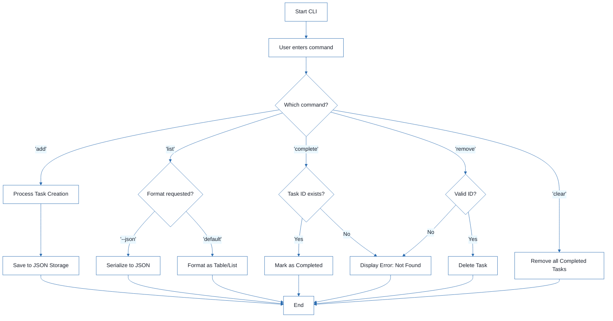

# CLI To-Do List Manager - Technical Specification & Architecture Document

## 1. Executive Summary & Architecture Overview

### 1.1 Executive Brief
The project is a Python-based CLI To-Do List Manager utilizing a local JSON file system for persistence. It implements a service-oriented architecture separating CLI dispatch, business logic (service layer), and data persistence (storage layer). The system enables task lifecycle management including creation, sequential ID assignment, completion tracking, and bulk clearing of finished tasks.

### 1.2 Maturity Assessment
The specification is logically sound and highly structured, achieving a high readiness state. However, the lack of formal acceptance criteria and the absence of defined security/performance constraints for file I/O require minor attention. Overall, the project is READY for execution as the implementation roadmap is comprehensive.

### 1.3 Technical Stack
* Python
* pyproject.toml

### 1.4 Architectural Constraints
* Sequential ID assignment for all created tasks.
* Storage persistence strictly via JSON file at `~/.todos.json`.
* Strict execution order: Setup $\rightarrow$ Foundational $\rightarrow$ User Stories $\rightarrow$ Polish.
* JSON output must remain parseable for the `--json` flag.
* Foundational phase is a blocking prerequisite for all user story implementation.

### 1.5 Critical Dependencies
* JSON storage path resolution and file I/O helpers in `src/todo_manager/storage.py`.
* Task entity serialization helpers in `src/todo_manager/models.py`.
* `~/.todos.json` filesystem access for data persistence.
* Dependency chain: Phase 1 (Setup) $\rightarrow$ Phase 2 (Foundational) $\rightarrow$ Phases 3, 4, 5 (User Stories).
* Manual smoke test gate for add, list, complete, remove, and clear commands.

## 2. Architecture Workflows

```mermaid
%%{init: {
  'theme': 'base',
  'themeVariables': {
    'primaryColor': '#1A365D',
    'primaryTextColor': '#1A202C',
    'primaryBorderColor': '#2B6CB0',
    'lineColor': '#2B6CB0',
    'secondaryColor': '#EBF8FF',
    'tertiaryColor': '#EBF8FF',
    'background': '#FFFFFF',
    'mainBkg': '#FFFFFF',
    'secondBkg': '#EBF8FF',
    'tertiaryBkg': '#F7FAFC',
    'secondaryTextColor': '#4A5568',
    'fontSize': '16px',
    'fontFamily': 'Inter, system-ui, sans-serif',
    'nodePadding': '15px',
    'borderRadius': '8px',
    'edgeLabelBackground': '#EBF8FF',
    'clusterBkg': '#F7FAFC',
    'clusterBorder': '#2B6CB0',
    'defaultLinkColor': '#2B6CB0',
    'titleColor': '#1A365D',
    'actorBorder': '#2B6CB0',
    'actorBkg': '#EBF8FF',
    'actorTextColor': '#1A365D',
    'actorLineColor': '#2B6CB0',
    'signalColor': '#2B6CB0',
    'signalTextColor': '#1A202C',
    'labelBoxBorderColor': '#2B6CB0',
    'labelBoxBkgColor': '#EBF8FF',
    'labelTextColor': '#1A202C',
    'loopTextColor': '#1A202C',
    'arrowHeadColor': '#2B6CB0',
    'sequenceNumberColor': '#1A365D',
    'sequenceActorBorder': '#2B6CB0',
    'sequenceActorBkg': '#EBF8FF',
    'sequenceArrowColor': '#2B6CB0',
    'noteBkgColor': '#FFF5EB',
    'noteBorderColor': '#DD6B20',
    'noteTextColor': '#1A202C'
  }
}}%%
flowchart TD
    subgraph S1 ["Phase 1: Setup"]
        PHASE-1["PHASE-1: Setup (Shared Infrastructure)"]
        T001["T001: Package Skeleton"]
        T002["T002: Test Structure"]
        T003["T003: Project Metadata"]
        PHASE-1 --> T001
        PHASE-1 --> T002
        PHASE-1 --> T003
    end
    subgraph S2 ["Phase 2: Foundational"]
        PHASE-2["PHASE-2: Foundational (Blocking Prerequisites)"]
        T004["T004: Entity Definitions"]
        T005["T005: JSON Storage I/O"]
        T006["T006: CLI Parsing"]
        T007["T007: Service Error Handling"]
        T008["T008: Module Entry Behavior"]
        PHASE-2 --> T004
        PHASE-2 --> T005
        PHASE-2 --> T006
        PHASE-2 --> T007
        PHASE-2 --> T008
    end
    subgraph S3 ["Phase 3: User Story 1 (MVP)"]
        PHASE-3["PHASE-3: US1 - Add and Manage Tasks"]
        T009["T009: Add Command Flow"]
        T010["T010: Task Creation Logic"]
        T011["T011: Completion Updates"]
        T012["T012: User Messages"]
        PHASE-3 --> T009
        PHASE-3 --> T010
        PHASE-3 --> T011
        PHASE-3 --> T012
    end
    subgraph S4 ["Phase 4: User Story 2"]
        PHASE-4["PHASE-4: US2 - View and Filter Tasks"]
        T013["T013: Human-readable List"]
        T014["T014: JSON Output Formatting"]
        T015["T015: Listing Logic"]
        T016["T016: Empty-list Handling"]
        PHASE-4 --> T013
        PHASE-4 --> T014
        PHASE-4 --> T015
        PHASE-4 --> T016
    end
    subgraph S5 ["Phase 5: User Story 3"]
        PHASE-5["PHASE-5: US3 - Remove and Clear Tasks"]
        T017["T017: Remove Command Flow"]
        T018["T018: Clear Completed Flow"]
        T019["T019: Not-found Handling"]
        T020["T020: Storage Persistence"]
        PHASE-5 --> T017
        PHASE-5 --> T018
        PHASE-5 --> T019
        PHASE-5 --> T020
    end
    subgraph S6 ["Phase 6: Polish"]
        PHASE-6["PHASE-6: Polish & Cross-Cutting"]
        T021["T021: Documentation"]
        T022["T022: Quickstart Notes"]
        T023["T023: Smoke Tests"]
        T024["T024: Linting Verification"]
        T025["T025: JSON Parse Validation"]
        PHASE-6 --> T021
        PHASE-6 --> T022
        PHASE-6 --> T023
        PHASE-6 --> T024
        PHASE-6 --> T025
    end
    PHASE-2 -->|"depends_on"| PHASE-1
    PHASE-3 -->|"depends_on"| PHASE-2
    PHASE-4 -->|"depends_on"| PHASE-2
    PHASE-5 -->|"depends_on"| PHASE-2
    PHASE-6 -->|"depends_on"| PHASE-3
    PHASE-6 -->|"depends_on"| PHASE-4
    PHASE-6 -->|"depends_on"| PHASE-5
```



```mermaid
%%{init: {
  'theme': 'base',
  'themeVariables': {
    'primaryColor': '#1A365D',
    'primaryTextColor': '#1A202C',
    'primaryBorderColor': '#2B6CB0',
    'lineColor': '#2B6CB0',
    'secondaryColor': '#EBF8FF',
    'tertiaryColor': '#EBF8FF',
    'background': '#FFFFFF',
    'mainBkg': '#FFFFFF',
    'secondBkg': '#EBF8FF',
    'tertiaryBkg': '#F7FAFC',
    'secondaryTextColor': '#4A5568',
    'fontSize': '16px',
    'fontFamily': 'Inter, system-ui, sans-serif',
    'nodePadding': '15px',
    'borderRadius': '8px',
    'edgeLabelBackground': '#EBF8FF',
    'clusterBkg': '#F7FAFC',
    'clusterBorder': '#2B6CB0',
    'defaultLinkColor': '#2B6CB0',
    'titleColor': '#1A365D',
    'actorBorder': '#2B6CB0',
    'actorBkg': '#EBF8FF',
    'actorTextColor': '#1A365D',
    'actorLineColor': '#2B6CB0',
    'signalColor': '#2B6CB0',
    'signalTextColor': '#1A202C',
    'labelBoxBorderColor': '#2B6CB0',
    'labelBoxBkgColor': '#EBF8FF',
    'labelTextColor': '#1A202C',
    'loopTextColor': '#1A202C',
    'arrowHeadColor': '#2B6CB0',
    'sequenceNumberColor': '#1A365D',
    'sequenceActorBorder': '#2B6CB0',
    'sequenceActorBkg': '#EBF8FF',
    'sequenceArrowColor': '#2B6CB0',
    'noteBkgColor': '#FFF5EB',
    'noteBorderColor': '#DD6B20',
    'noteTextColor': '#1A202C'
  }
}}%%
flowchart TD
    START["Start CLI"] --> CMD_INPUT["User enters command"]
    CMD_INPUT --> DEC_CMD{"Which command?"}
    DEC_CMD -->|"'add'"| ADD_FLOW["Process Task Creation"]
    ADD_FLOW --> ADD_SAVE["Save to JSON Storage"]
    ADD_SAVE --> END["End"]
    DEC_CMD -->|"'list'"| DEC_FORMAT{"Format requested?"}
    DEC_FORMAT -->|"'--json'"| JSON_OUT["Serialize to JSON"]
    DEC_FORMAT -->|"'default'"| HUMAN_OUT["Format as Table/List"]
    JSON_OUT --> END
    HUMAN_OUT --> END
    DEC_CMD -->|"'complete'"| DEC_EXISTS{"Task ID exists?"}
    DEC_EXISTS -->|"Yes"| COMP_UPDATE["Mark as Completed"]
    DEC_EXISTS -->|"No"| ERR_NOTFOUND["Display Error: Not Found"]
    COMP_UPDATE --> END
    ERR_NOTFOUND --> END
    DEC_CMD -->|"'remove'"| DEC_REM{"Valid ID?"}
    DEC_REM -->|"Yes"| REM_EXEC["Delete Task"]
    DEC_REM -->|"No"| ERR_NOTFOUND
    REM_EXEC --> END
    DEC_CMD -->|"'clear'"| CLEAR_EXEC["Remove all Completed Tasks"]
    CLEAR_EXEC --> END
``` & Visual Diagrams

### 2.1 Project Implementation Roadmap & Traceability
Visualizes the phase dependencies and the mapping of specific tasks to their respective project phases.

```mermaid
%%{init: {
  'theme': 'base',
  'themeVariables': {
    'primaryColor': '#1A365D',
    'primaryTextColor': '#1A202C',
    'primaryBorderColor': '#2B6CB0',
    'lineColor': '#2B6CB0',
    'secondaryColor': '#EBF8FF',
    'tertiaryColor': '#EBF8FF',
    'background': '#FFFFFF',
    'mainBkg': '#FFFFFF',
    'secondBkg': '#EBF8FF',
    'tertiaryBkg': '#F7FAFC',
    'secondaryTextColor': '#4A5568',
    'fontSize': '16px',
    'fontFamily': 'Inter, system-ui, sans-serif',
    'nodePadding': '15px',
    'borderRadius': '8px',
    'edgeLabelBackground': '#EBF8FF',
    'clusterBkg': '#F7FAFC',
    'clusterBorder': '#2B6CB0',
    'defaultLinkColor': '#2B6CB0',
    'titleColor': '#1A365D',
    'actorBorder': '#2B6CB0',
    'actorBkg': '#EBF8FF',
    'actorTextColor': '#1A365D',
    'actorLineColor': '#2B6CB0',
    'signalColor': '#2B6CB0',
    'signalTextColor': '#1A202C',
    'labelBoxBorderColor': '#2B6CB0',
    'labelBoxBkgColor': '#EBF8FF',
    'labelTextColor': '#1A202C',
    'loopTextColor': '#1A202C',
    'arrowHeadColor': '#2B6CB0',
    'sequenceNumberColor': '#1A365D',
    'sequenceActorBorder': '#2B6CB0',
    'sequenceActorBkg': '#EBF8FF',
    'sequenceArrowColor': '#2B6CB0',
    'noteBkgColor': '#FFF5EB',
    'noteBorderColor': '#DD6B20',
    'noteTextColor': '#1A202C'
  }
}}%%
flowchart TD
    subgraph S1 ["Phase 1: Setup"]
        PHASE-1["PHASE-1: Setup (Shared Infrastructure)"]
        T001["T001: Package Skeleton"]
        T002["T002: Test Structure"]
        T003["T003: Project Metadata"]
        PHASE-1 --> T001
        PHASE-1 --> T002
        PHASE-1 --> T003
    end
    subgraph S2 ["Phase 2: Foundational"]
        PHASE-2["PHASE-2: Foundational (Blocking Prerequisites)"]
        T004["T004: Entity Definitions"]
        T005["T005: JSON Storage I/O"]
        T006["T006: CLI Parsing"]
        T007["T007: Service Error Handling"]
        T008["T008: Module Entry Behavior"]
        PHASE-2 --> T004
        PHASE-2 --> T005
        PHASE-2 --> T006
        PHASE-2 --> T007
        PHASE-2 --> T008
    end
    subgraph S3 ["Phase 3: User Story 1 (MVP)"]
        PHASE-3["PHASE-3: US1 - Add and Manage Tasks"]
        T009["T009: Add Command Flow"]
        T010["T010: Task Creation Logic"]
        T011["T011: Completion Updates"]
        T012["T012: User Messages"]
        PHASE-3 --> T009
        PHASE-3 --> T010
        PHASE-3 --> T011
        PHASE-3 --> T012
    end
    subgraph S4 ["Phase 4: User Story 2"]
        PHASE-4["PHASE-4: US2 - View and Filter Tasks"]
        T013["T013: Human-readable List"]
        T014["T014: JSON Output Formatting"]
        T015["T015: Listing Logic"]
        T016["T016: Empty-list Handling"]
        PHASE-4 --> T013
        PHASE-4 --> T014
        PHASE-4 --> T015
        PHASE-4 --> T016
    end
    subgraph S5 ["Phase 5: User Story 3"]
        PHASE-5["PHASE-5: US3 - Remove and Clear Tasks"]
        T017["T017: Remove Command Flow"]
        T018["T018: Clear Completed Flow"]
        T019["T019: Not-found Handling"]
        T020["T020: Storage Persistence"]
        PHASE-5 --> T017
        PHASE-5 --> T018
        PHASE-5 --> T019
        PHASE-5 --> T020
    end
    subgraph S6 ["Phase 6: Polish"]
        PHASE-6["PHASE-6: Polish & Cross-Cutting"]
        T021["T021: Documentation"]
        T022["T022: Quickstart Notes"]
        T023["T023: Smoke Tests"]
        T024["T024: Linting Verification"]
        T025["T025: JSON Parse Validation"]
        PHASE-6 --> T021
        PHASE-6 --> T022
        PHASE-6 --> T023
        PHASE-6 --> T024
        PHASE-6 --> T025
    end
    PHASE-2 -->|"depends_on"| PHASE-1
    PHASE-3 -->|"depends_on"| PHASE-2
    PHASE-4 -->|"depends_on"| PHASE-2
    PHASE-5 -->|"depends_on"| PHASE-2
    PHASE-6 -->|"depends_on"| PHASE-3
    PHASE-6 -->|"depends_on"| PHASE-4
    PHASE-6 -->|"depends_on"| PHASE-5
```

### 2.2 CLI Command Execution Workflow
Models the business logic flow for the CLI manager, including decision points for different command types.



## 3. Detailed Technical Specifications & Business Rules

### 3.1 Requirements Traceability

| ID | Phase/Story | Description | Source File/Context |
| :--- | :--- | :--- | :--- |
| T001 | PHASE-1 | Create the Python package skeleton | `src/todo_manager/` |
| T002 | PHASE-1 | Create the test directory structure | `tests/unit/`, `tests/integration/` |
| T003 | PHASE-1 | Add project metadata and tooling entry points | `pyproject.toml` |
| T004 | PHASE-2 | Implement task entity definitions and serialization helpers | `src/todo_manager/models.py` |
| T005 | PHASE-2 | Implement JSON storage path resolution and file I/O helpers | `src/todo_manager/storage.py` |
| T006 | PHASE-2 | Implement shared command-line parsing and top-level dispatch | `src/todo_manager/cli.py` |
| T007 | PHASE-2 | Implement shared service-layer error handling and task collection utilities | `src/todo_manager/service.py` |
| T008 | PHASE-2 | Define module entry behavior for `python -m todo_manager` | `src/todo_manager/__main__.py` |
| T009 | US1 | Implement the `add` command flow | `cli.py`, `service.py` |
| T010 | US1 | Implement task creation, sequential ID assignment, and `created_at` population | `src/todo_manager/models.py` |
| T011 | US1 | Implement completion updates for existing tasks | `src/todo_manager/service.py` |
| T012 | US1 | Add user-facing success and error messages for add and complete operations | `src/todo_manager/cli.py` |
| T013 | US2 | Implement human-readable task listing output | `src/todo_manager/cli.py` |
| T014 | US2 | Implement `--json` output formatting | `src/todo_manager/cli.py` |
| T015 | US2 | Add listing logic that preserves task order and status fields | `src/todo_manager/service.py` |
| T016 | US2 | Handle the empty-list case with a clear message | `src/todo_manager/cli.py` |
| T017 | US3 | Implement the `remove` command flow | `cli.py`, `service.py` |
| T018 | US3 | Implement the `clear` command flow for removing completed tasks | `src/todo_manager/service.py` |
| T019 | US3 | Add not-found handling for invalid task IDs | `src/todo_manager/cli.py` |
| T020 | US3 | Ensure storage writes persist removals and clears safely | `src/todo_manager/storage.py` |
| T021 | PHASE-6 | Document the CLI usage and storage behavior | `README.md` |
| T022 | PHASE-6 | Add quickstart verification notes and examples | `specs/001-cli-todo-manager/quickstart.md` |
| T023 | PHASE-6 | Manual smoke test of add, list, complete, remove, and clear | `~/.todos.json` |
| T024 | PHASE-6 | Verify linting and formatting expectations | `src/todo_manager/` |
| T025 | PHASE-6 | Confirm the generated JSON output remains parseable | `todo list --json` |

### 3.2 Security Rules
* **File Access**: The application must have read/write permissions for the home directory to manage `~/.todos.json`.
* **Data Integrity**: Storage writes must be atomic or safely handled to prevent JSON corruption during `remove` or `clear` operations (T020).

### 3.3 Data Models
* **Task Entity**: Defined in `src/todo_manager/models.py`.
* **Attributes**: Includes sequential unique ID, task description, completion status, and `created_at` timestamp.
* **Persistence**: Serialized to JSON format.

## 4. Project Governance & Structural Gaps

### 4.1 Structural Gaps
| Gap | Priority | Remediation Advice |
| :--- | :--- | :--- |
| Acceptance Criteria | MEDIUM | Add a formal list of acceptance criteria for each user story instead of relying only on 'Independent Test' descriptions. |
| Security & Performance Constraints | LOW | Define constraints for file access permissions and JSON file size limits. |
| Open Questions & Uncertainties | LOW | No open questions were identified in the source; ensure none exist before implementation. |

### 4.2 Remediation & Workflow
The project follows an incremental delivery model:
1. **Setup $\rightarrow$ Foundational**: Establish the core architecture.
2. **US1 (MVP)**: Validate basic add/complete behavior.
3. **US2 $\rightarrow$ US3**: Iteratively add viewing and deletion capabilities.
4. **Polish**: Finalize documentation and smoke tests.

## 5. Technical & Domain Glossary (Terminology Reference)

| Term | Category | Context Anchor | Project Definition |
| :--- | :--- | :--- | :--- |
| Checkpoint | TECHNICAL_STACK | PHASE-2 | A validation gate ensuring specific infrastructure is operational before dependent user stories commence. |
| Foundational | TECHNICAL_STACK | PHASE-2 | The core architectural layer providing blocking shared utilities and base logic for all subsequent features. |
| Goal | BUSINESS_DOMAIN | PHASE-3 | The primary objective defining the success criteria for a specific user-facing feature set. |
| ID | TECHNICAL_STACK | T010 | A sequential unique alphanumeric token used to target specific entries within the persistent store. |
| JSON | TECHNICAL_STACK | T005 | The standardized lightweight data-interchange format used for local persistent storage and programmatic output. |
| MVP | BUSINESS_DOMAIN | PHASE-3 | The minimal set of functional capabilities required to demonstrate a viable working product. |
| Organization | BUSINESS_DOMAIN | Tasks: CLI To-Do List Manager | The structural grouping of development efforts based on independent user requirements. |
| Prerequisites | TECHNICAL_STACK | Tasks: CLI To-Do List Manager | External specification documents required to be finalized before execution of the implementation roadmap. |
| README | TECHNICAL_STACK | T021 | The primary documentation file detailing usage instructions and architectural behavior. |
| Setup | TECHNICAL_STACK | PHASE-1 | The initial phase encompassing package skeleton creation and environment configuration. |
| T016 | TECHNICAL_STACK | T016 | The specific implementation task for managing empty-state feedback in the interface. |
| Tests | TECHNICAL_STACK | T002 | The verification suite composed of unit and integration directory structures to ensure logic correctness. |
| population in | TECHNICAL_STACK | T010 | The process of assigning an initial timestamp value to the creation metadata of an entity. |
| todo clear | BUSINESS_DOMAIN | T018 | The operational logic used to purge all entries marked as finished from the system. |
| todo list | BUSINESS_DOMAIN | T013 | The retrieval and display operation for the entire collection of stored entities. |
| ⚠️ CRITICAL | TECHNICAL_STACK | PHASE-2 | A high-severity constraint marking a phase that must be fully completed before any other work can proceed. |