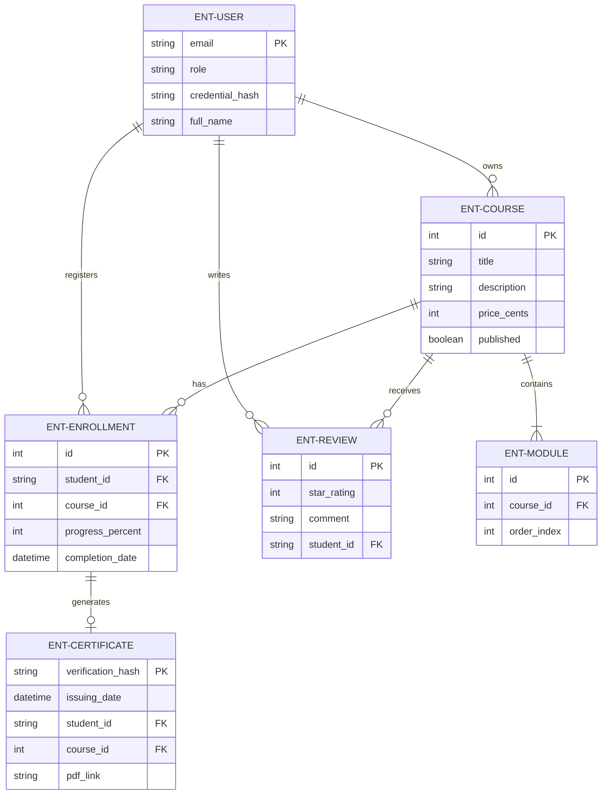
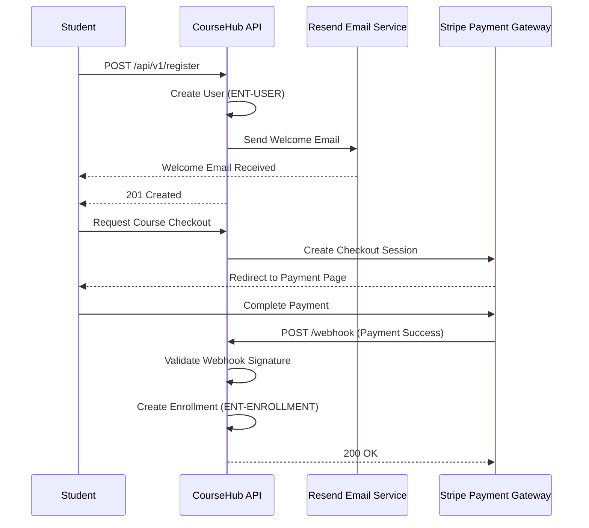
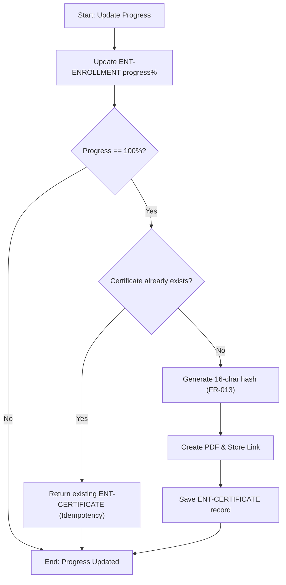
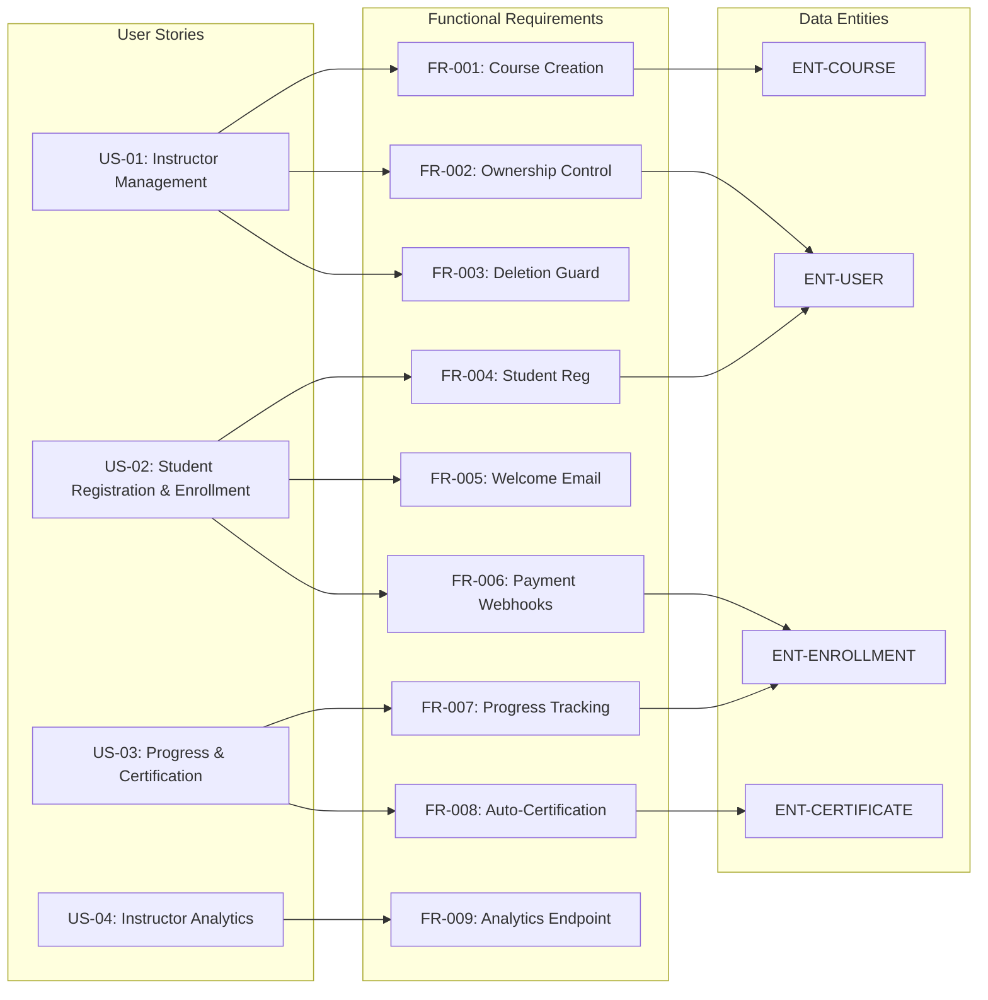

# CourseHub API & Certification Platform - Technical Specification & Architecture Document

## 1. Executive Summary & Architecture Overview

### 1.1 Executive Brief
CourseHub v2 is a REST API for an online learning platform centered on course management, payment-gated enrollments, and automated certification. The system enables instructors to publish ordered course modules and track revenue, while students progress from payment via Stripe to the automated generation of verifiable PDF certificates upon 100% completion. The architecture follows a strict ownership and role-based access pattern to isolate instructor and student data.

### 1.2 Maturity Assessment
The specification is structurally sound and highly detailed regarding functional behavior, reaching a status of READY. While the parser identified gaps in explicit Non-Functional Requirements and Scope boundaries, the inclusion of specific performance SLAs (500ms/2s) and a strict 95% test coverage gate provides sufficient engineering guardrails to proceed with execution.

### 1.3 Technical Stack
* **API Style**: REST API
* **Payment Gateway**: Stripe
* **Email Service**: Resend
* **Document Format**: PDF
* **Response Format**: Standardized JSON envelopes (`{"data": ..., "meta": ..., "errors": []}`)

### 1.4 Architectural Constraints
* **Monetary Precision**: Course prices must be strictly defined in cents (integers) to avoid floating-point errors.
* **Progress Bounds**: Enrolment progress values must be between 0 and 100 inclusive.
* **Rating Scale**: Course ratings must be between 1 and 5 stars.
* **Credential Security**: Certificate verification hashes must be 16-character alphanumeric.
* **Performance SLAs**: 
    * Payment webhooks must process in under 500ms end-to-end.
    * Certificates must be generated within 2 seconds of course completion.
* **Quality Gate**: API integration tests must achieve >= 95% line coverage for auth, payment, and certification.
* **Access Control**: 
    * Instructors can only manage/delete courses they own.
    * Students can only access/update their own enrollments and certificates.
* **Data Integrity**: 
    * Course deletion is rejected if active enrollments exist.
    * Fixed sequence ordering for course modules must be maintained.

### 1.5 Critical Dependencies
* **External Services**: Stripe API keys and webhook secrets; Resend API keys for welcome email delivery.
* **Infrastructure**: Blob storage for PDF certificate persistence.
* **Data Integrity**: Strict foreign key dependence: Enrollment requires valid User and Course entities.
* **Logic Gates**: 
    * Idempotency gate: Multiple certification requests for the same completion must yield the same serial number.
    * Cascading restriction: Course deletion blocked by existing Enrollment records.

## 2. Architecture Workflows & Visual Diagrams

### 2.1 CourseHub v2 Data Model

### 2.2 Student Registration & Enrollment Flow

### 2.3 Certification Logic Workflow

### 2.4 Requirements Traceability Matrix

## 3. Detailed Technical Specifications & Business Rules

### 3.1 Requirements Traceability
| ID | Type | Description | Related Entity | Source |
| :--- | :--- | :--- | :--- | :--- |
| **US-01** | User Story | Instructor manages courses: creation, publishing and ownership control. | ENT-COURSE | User Story 1 |
| **US-02** | User Story | Student registers and enrols via payment process and receives welcome email. | ENT-USER | User Story 2 |
| **US-03** | User Story | Student tracks progress and receives automated PDF certification at 100%. | ENT-CERTIFICATE | User Story 3 |
| **US-04** | User Story | Instructor views financial and performance dashboard analytics. | ENT-COURSE | User Story 4 |
| **FR-001** | Requirement | Allow instructors to create courses with title, description, price in cents, published status, and ordered modules. | ENT-COURSE, ENT-MODULE | Functional Requirements |
| **FR-002** | Requirement | Associate each course with a single instructor owner and enforce strict role-based access. | ENT-USER | Functional Requirements |
| **FR-003** | Requirement | Reject course deletion requests if active enrolments exist. | ENT-ENROLLMENT | Functional Requirements |
| **FR-004** | Requirement | Allow student registration with email credentials and default role assignment. | ENT-USER | Functional Requirements |
| **FR-005** | Requirement | Send a welcome email via Resend upon registration. | ENT-USER | Functional Requirements |
| **FR-006** | Requirement | Process enrolment creation via validated payment webhooks. | ENT-ENROLLMENT | Functional Requirements |
| **FR-007** | Requirement | Track enrolment progress between 0% and 100%. | ENT-ENROLLMENT | Functional Requirements |
| **FR-008** | Requirement | Automatically issue a downloadable certificate record when enrolment progress reaches 100%. | ENT-CERTIFICATE | Functional Requirements |
| **FR-009** | Requirement | Provide an analytics endpoint for instructors to review total revenue and completion rates. | ENT-COURSE | Functional Requirements |
| **FR-010** | Requirement | Expose standardized REST response envelopes under /api/v1/. | N/A | Functional Requirements |
| **FR-011** | Requirement | Maintain strict module ordering per course. | ENT-MODULE | Functional Requirements |
| **FR-012** | Requirement | Support course ratings (1 to 5 stars) and student review comments. | ENT-REVIEW | Functional Requirements |
| **FR-013** | Requirement | Generate unique 16-character alphanumeric verification hashes for certificates. | ENT-CERTIFICATE | Functional Requirements |
| **CON-DEL-ENROL** | Constraint | Deleting a course with active enrolments must fail with a validation error. | ENT-ENROLLMENT | Edge Cases |
| **CON-IDEM-CERT** | Constraint | Certificate generation must be idempotent. | ENT-CERTIFICATE | Edge Cases |
| **ASM-STRIPE** | Assumption | Stripe API keys and webhooks secrets are provided in environment configuration. | N/A | Assumptions |

### 3.2 Security Rules
* **Role-Based Access Control (RBAC)**: Strict separation between `student` and `instructor` roles.
* **Ownership Enforcement**: Instructors are restricted to managing only the courses they created.
* **Data Isolation**: Students are restricted to accessing only their own enrollment and certificate records.
* **Webhook Validation**: All incoming Stripe webhooks must have their signatures verified; unverified requests must be rejected with HTTP 400.

### 3.3 Data Models
* **ENT-USER**: Identity management (email, role, credential hash, full name).
* **ENT-COURSE**: Course metadata (title, description, price in cents, published state).
* **ENT-MODULE**: Sequential units linked to a course via `order_index`.
* **ENT-ENROLLMENT**: Junction entity tracking student progress (0-100%) and payment status.
* **ENT-CERTIFICATE**: Immutable record of completion containing a 16-char verification hash and PDF link.
* **ENT-REVIEW**: Feedback entity (1-5 star rating and comment).

## 4. Project Governance & Structural Gaps

### 4.1 Structural Gaps
| Gap | Priority | Remediation Advice |
| :--- | :--- | :--- |
| Non-Functional Requirements | MEDIUM | Add specific performance SLAs, security standards, and scalability requirements. |
| Scope & Out-of-Scope | MEDIUM | Clearly define what the API will NOT do (e.g., content delivery/video streaming). |
| Open Questions & Uncertainties | LOW | Document any unknown details regarding Stripe's specific webhook events to be used. |

### 4.2 Remediation & Workflow
The identified gaps should be addressed during the technical design phase. Specifically, the "Out-of-Scope" definition is critical to prevent scope creep regarding video hosting. The performance SLAs already mentioned in the summary (500ms/2s) should be formalized into a dedicated NFR section in the next iteration.

## 5. Technical & Domain Glossary (Terminology Reference)

| Term | Category | Context Anchor | Project Definition |
| :--- | :--- | :--- | :--- |
| API | TECHNICAL_STACK | FR-010 | The programmatic interface exposing versioned endpoints under /api/v1/ using standardized response envelopes. |
| Certificate | BUSINESS_DOMAIN | ENT-CERTIFICATE | A verified credential record issued upon 100% completion, containing a unique hash and a download link. |
| Course | BUSINESS_DOMAIN | ENT-COURSE | A learning content entity consisting of a title, description, price in cents, and a published state. |
| CourseHub | TECHNICAL_STACK | Feature Specification: CourseHub API & Certification Platform | The specific online learning platform implementation currently being developed under version 2.0. |
| Cryptographic Hashing | TECHNICAL_STACK | FR-013 | The process of generating 16-character alphanumeric verification strings to secure issued credentials. |
| Enrollment | BUSINESS_DOMAIN | ENT-ENROLLMENT | A relationship between a student and learning content that tracks payment state and progress percentage. |
| Fixed-Point Numeric Constraint | TECHNICAL_STACK | FR-001 | The requirement to handle monetary values as integers expressed in cents to avoid floating-point errors. |
| ID | TECHNICAL_STACK | ENT-CERTIFICATE | A unique system identifier used to link records, such as students and courses, within the database. |
| Module | BUSINESS_DOMAIN | ENT-MODULE | A sequential learning unit that must maintain a strict ordering within its parent content entity. |
| PDF | TECHNICAL_STACK | FR-008 | The document format used for the downloadable completion records, stored in blob storage. |
| REST | TECHNICAL_STACK | FR-010 | The architectural style governing the communication between the client and the server via HTTP. |
| Review | BUSINESS_DOMAIN | ENT-REVIEW | A feedback record consisting of a 1-5 star rating and a textual comment provided by a student. |
| UUID | TECHNICAL_STACK | User Story 3 - Progress tracking & Automated PDF Certification (Priority: P2) | A universally unique identifier used as a verification token for issued credentials. |
| User | BUSINESS_DOMAIN | ENT-USER | A system identity characterized by a role, email, and credential hash. |
| Webhook | TECHNICAL_STACK | FR-006 | An automated HTTP callback used to trigger enrolment creation upon verified payment notification. |