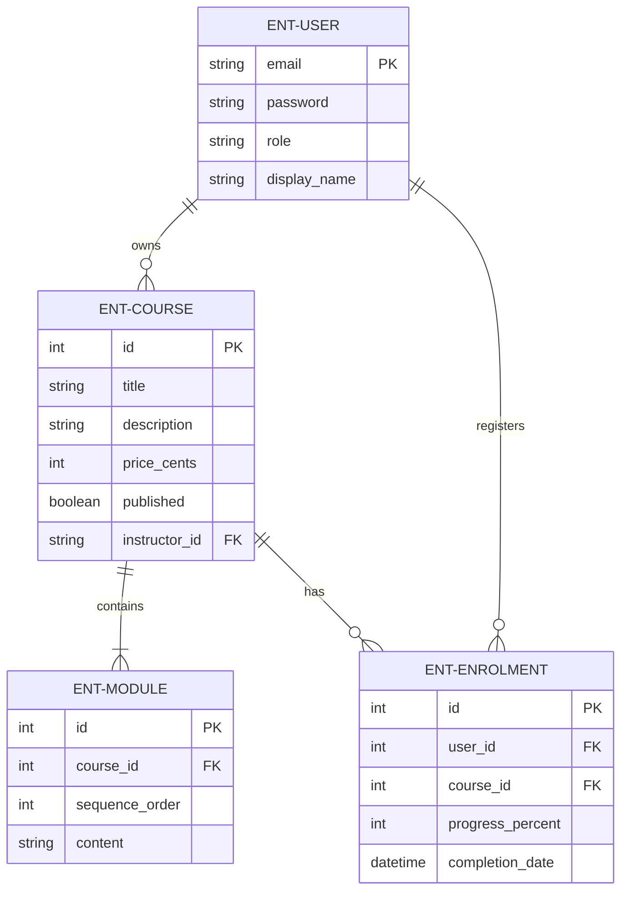
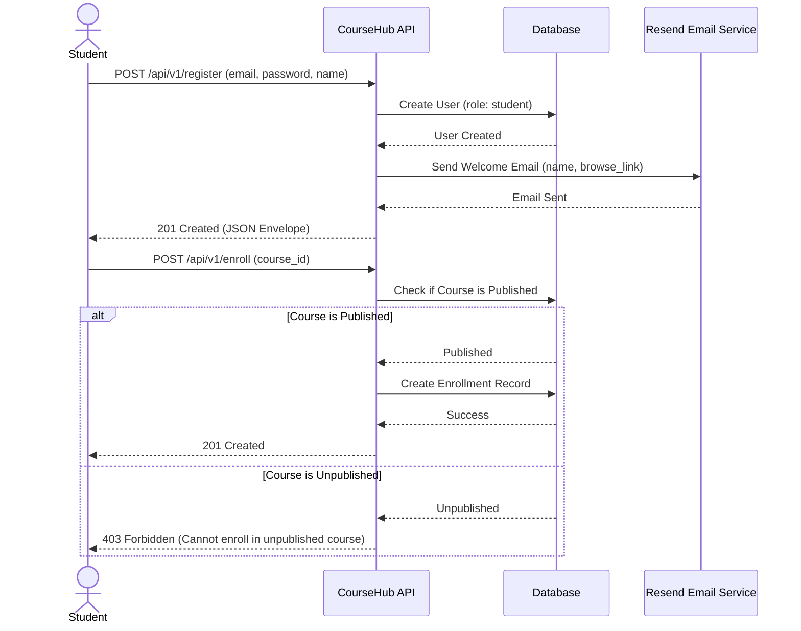
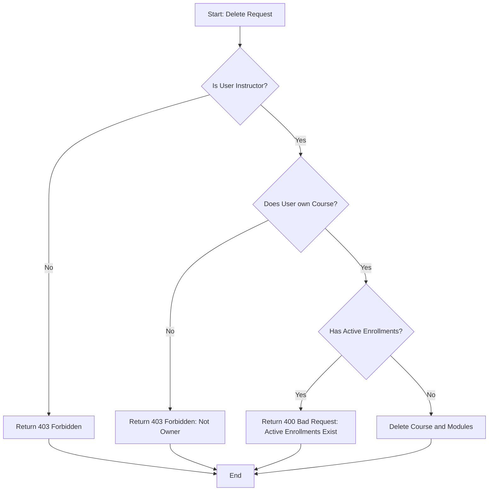
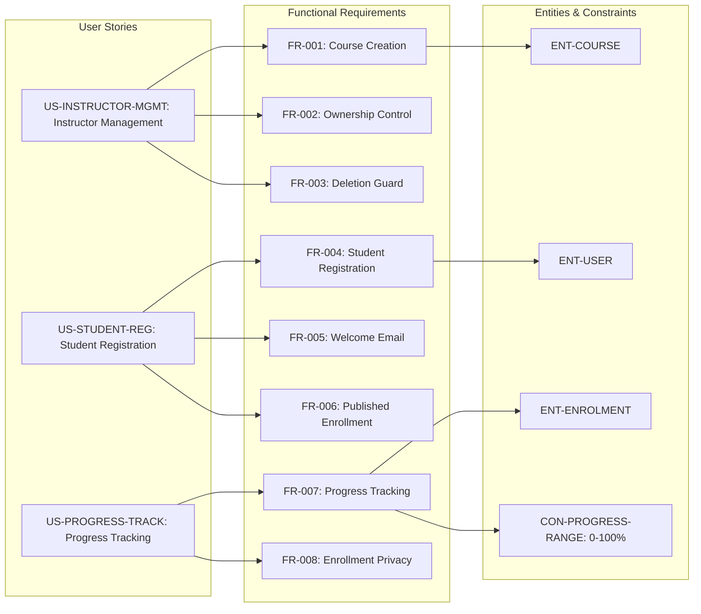

# CourseHub API - Technical Specification & Architecture Document

## 1. Executive Summary & Architecture Overview

### 1.1 Executive Brief
CourseHub is a REST API for an online learning platform facilitating course management by instructors and progress tracking for students. Hosted as a versioned API (`/api/v1/`), it utilizes a shared user identity model with role-based access control to isolate ownership and enrollment data. The core data pattern centers on a hierarchical relationship between Instructors, Courses, Modules, and Student Enrollments.

### 1.2 Maturity Assessment
The specification is logically sound and detailed regarding functional flows and business rules. However, the absence of Non-Functional Requirements and a defined Scope/Out-of-Scope section introduces minor ambiguity regarding performance targets and system boundaries. Despite these missing sections, the functional mapping is complete and precise, making the project READY for execution.

### 1.3 Technical Stack
* REST
* JSON
* Resend

### 1.4 Architectural Constraints
* API endpoints must be under `/api/v1/` with a standard JSON envelope `{data, meta, errors}`.
* Course price must be strictly defined in cents.
* Course modules must follow a fixed sequence ordering.
* Enrollment progress values must be inclusive between 0 and 100 percent.
* Course deletion is strictly forbidden if active enrollments exist.
* Course enrollment is permitted only for courses with `published` flag = true.
* Automated E2E tests must cover >= 90% of core course, enrollment, and authorization behaviors.
* Instructors can only manage/delete courses they own.
* Students can only access and update their own enrollments.

### 1.5 Critical Dependencies
* `RESEND_API_KEY` environment variable for welcome email dispatch.
* Resend external service for email delivery.
* Strict foreign key dependence of Enrollment on User and Course entities.
* Role-based access control (RBAC) utilizing the role field in the shared User table.
* Relational dependency between Course and Modules for fixed ordering.

## 2. Architecture Workflows & Visual Diagrams

### 2.1 CourseHub Data Model
Entity Relationship Diagram showing the shared user table, course ownership, module sequencing, and student enrollments.

### 2.2 Student Registration & Enrollment Flow
Sequence of interactions for a student registering and enrolling in a published course, including the Resend email integration.

### 2.3 Course Deletion Logic
Workflow for instructors attempting to delete a course, incorporating the mandatory check for active enrollments.

### 2.4 Requirements Traceability Matrix
Mapping of User Stories to Functional Requirements and their associated Entities/Constraints.

## 3. Detailed Technical Specifications & Business Rules

### 3.1 Requirements Traceability
| ID | Type | Description | Related Entity/Constraint |
| :--- | :--- | :--- | :--- |
| US-INSTRUCTOR-MGMT | User Story | Instructor can create, publish, and manage courses without affecting others. | - |
| US-STUDENT-REG | User Story | Student can register, receive welcome email, and enroll in published courses. | - |
| US-PROGRESS-TRACK | User Story | Students can update their own progress and completion status safely. | - |
| FR-001 | Requirement | Allow instructors to create courses (title, description, price in cents, published flag, ordered modules). | ENT-COURSE |
| FR-002 | Requirement | Associate each course with a single instructor and restrict management to that owner. | - |
| FR-003 | Requirement | Reject course deletion if active enrollments exist with a clear error message. | SC-004 |
| FR-004 | Requirement | Allow students to register with email/password and assign student role. | ENT-USER |
| FR-005 | Requirement | Send welcome email via Resend after registration (name, browse link). | - |
| FR-006 | Requirement | Allow students to enroll only in published courses. | - |
| FR-007 | Requirement | Track progress (0-100%) and record completion date at 100%. | ENT-ENROLMENT / CON-PROGRESS-RANGE |
| FR-008 | Requirement | Ensure students view and update only their own enrollments. | - |
| FR-009 | Requirement | Expose REST endpoints under `/api/v1/` with JSON envelope `{data, meta, errors}`. | - |
| FR-010 | Requirement | Use a shared user table with a role field to distinguish roles. | ENT-USER |
| FR-011 | Requirement | Preserve defined ordering of modules within each course. | ENT-MODULE |
| ENT-USER | Entity | Shared account identity with role, email, password, and display name. | - |
| ENT-COURSE | Entity | Learning offering owned by instructor (title, description, price, status, modules). | - |
| ENT-MODULE | Entity | Child record of a course representing a lesson in a fixed sequence. | - |
| ENT-ENROLMENT | Entity | Student-course relationship recording progress and completion date. | - |
| SC-001 | Success Criterion | Instructor can publish a course and make it available in a single workflow. | - |
| SC-002 | Success Criterion | Student can register, enroll, and update progress without accessing others' data. | - |
| SC-003 | Success Criterion | >= 90% of core behaviors covered by automated E2E tests. | - |
| SC-004 | Success Criterion | System returns consistent error when deleting course with active enrollments. | - |
| CON-PROGRESS-RANGE | Constraint | Progress values outside the 0–100% range must be rejected. | - |
| ASM-OWNERSHIP | Assumption | Each course has one instructor owner; an instructor may own multiple courses. | - |
| ASM-RESEND | Assumption | Resend integration available via `RESEND_API_KEY` environment variable. | - |

### 3.2 Security Rules
* **Role-Based Access Control (RBAC)**: Access is governed by the `role` field in the `ENT-USER` table.
* **Ownership Isolation**: Instructors are strictly forbidden from managing or deleting courses they do not own (`FR-002`).
* **Data Privacy**: Students are restricted to viewing and updating only their own enrollment records (`FR-008`).
* **Authorization Errors**: Any attempt to bypass ownership or role boundaries must return a `403 Forbidden` response.

### 3.3 Data Models
* **User (`ENT-USER`)**: Central identity table. Key fields: `email` (PK), `password`, `role`, `display_name`.
* **Course (`ENT-COURSE`)**: Content container. Key fields: `id` (PK), `title`, `description`, `price_cents`, `published`, `instructor_id` (FK).
* **Module (`ENT-MODULE`)**: Sequential content. Key fields: `id` (PK), `course_id` (FK), `sequence_order`, `content`.
* **Enrollment (`ENT-ENROLMENT`)**: Progress tracker. Key fields: `id` (PK), `user_id` (FK), `course_id` (FK), `progress_percent`, `completion_date`.

## 4. Project Governance & Structural Gaps

### 4.1 Structural Gaps
| Missing Section | Priority | Remediation Advice |
| :--- | :--- | :--- |
| Non-Functional Requirements | MEDIUM | Define performance, security, and availability targets (e.g., API response time, Auth token expiration). |
| Scope & Out-of-Scope | MEDIUM | Explicitly list what the API will NOT do (e.g., handle payment processing, user profile images). |
| Open Questions & Uncertainties | LOW | Identify any unknowns regarding the Resend integration or specific business rules for course pricing. |

### 4.2 Remediation & Workflow
To move from "Ready" to "Implementation", the development team should first define the Non-Functional Requirements (NFRs) to establish the infrastructure baseline. A Scope document should be appended to prevent feature creep regarding payment gateways, as the current spec only defines `price_cents` without a payment processing workflow.

## 5. Technical & Domain Glossary (Terminology Reference)

| Term | Category | Context Anchor | Project Definition |
| :--- | :--- | :--- | :--- |
| API | TECHNICAL_STACK | FR-009 | The primary interface exposing v1 endpoints to handle requests and deliver structured responses. |
| Course | BUSINESS_DOMAIN | ENT-COURSE | A learning offering owned by an instructor, containing price in cents, visibility status, and sequential lessons. |
| Cryptographic Hashing | TECHNICAL_STACK | ENT-USER | The required mechanism for securing password credentials within the identity table. |
| Enrollment | BUSINESS_DOMAIN | ENT-ENROLMENT | A relationship between a student and a learning offering that tracks completion dates and percentage of progress. |
| Fixed-Point Numeric Constraint | TECHNICAL_STACK | FR-001 | The architectural decision to represent monetary values in cents to avoid floating-point precision errors. |
| JSON | TECHNICAL_STACK | FR-009 | The standardized lightweight data-interchange format used for all system responses via a specific envelope structure. |
| Module | BUSINESS_DOMAIN | ENT-MODULE | A child record representing a specific lesson or section maintained in a strict sequence. |
| REST | TECHNICAL_STACK | FR-009 | The architectural style utilized for the network endpoints to ensure stateless communication. |
| User | BUSINESS_DOMAIN | ENT-USER | A shared account identity incorporating a role field to differentiate between learners and content creators. |