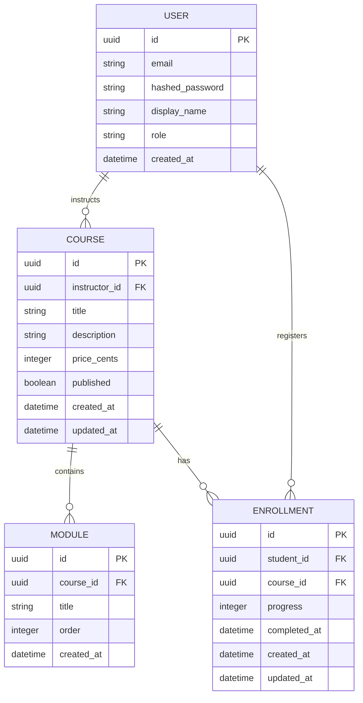
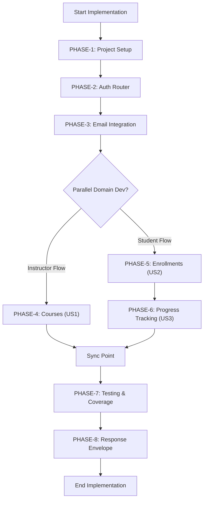
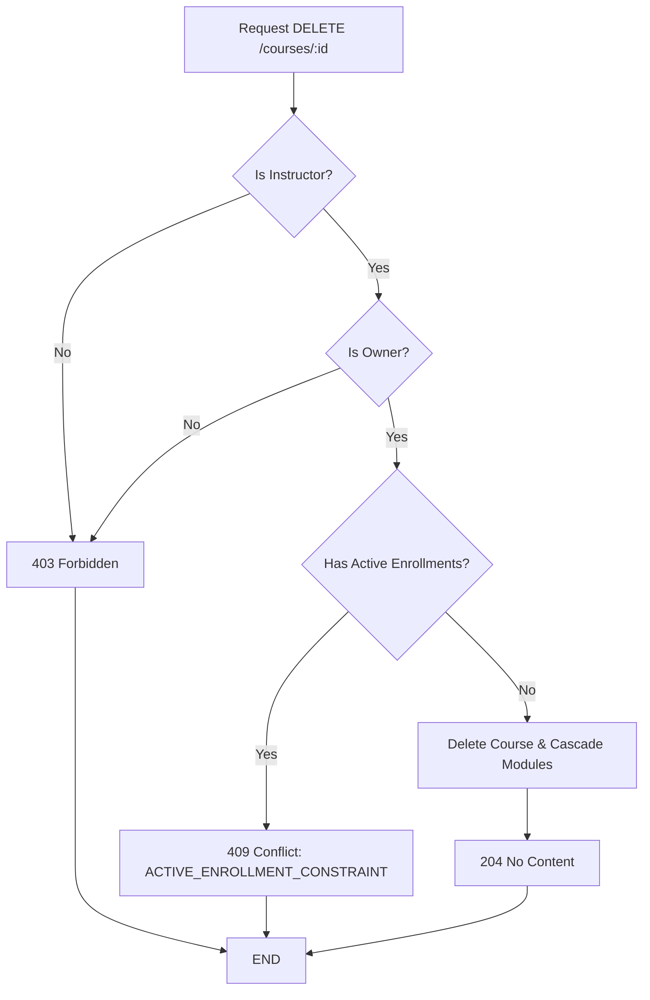
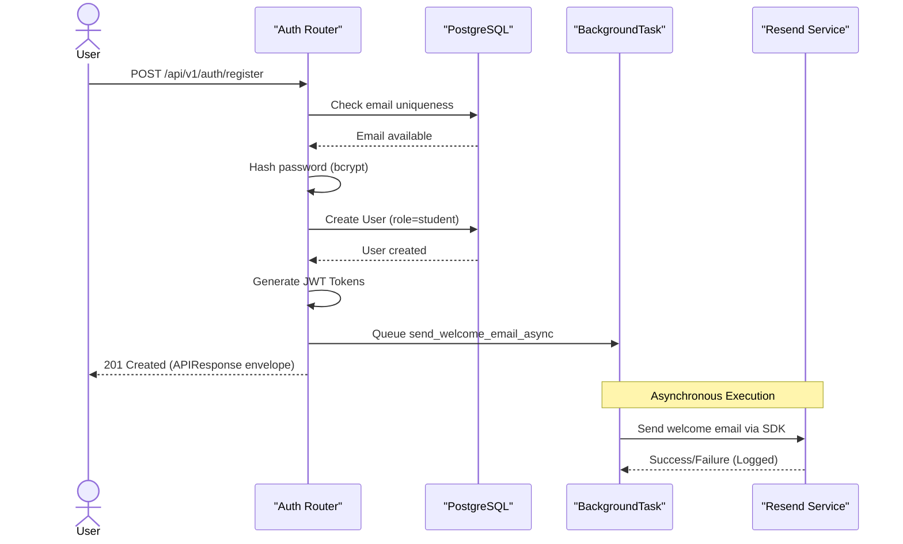

# CourseHub API - Technical Specification & Architecture Document

## 1. Executive Summary & Architecture Overview

### 1.1 Executive Brief
CourseHub API is a backend system designed for course management, featuring an asynchronous PostgreSQL architecture. It implements a tiered access model for Instructors and Students, integrating JWT-based authentication and an automated email notification system via Resend. The system ensures strict data isolation and business rule enforcement regarding course ownership and enrollment status.

### 1.2 Maturity Assessment
The specifications are highly detailed and prescriptive, providing clear task mapping from initialization to polish. With a comprehensive set of test criteria for every phase and explicitly defined business constraints, the project is READY for execution. Only a low-severity gap regarding 'Known Limitations' was noted, which does not impede implementation.

### 1.3 Technical Stack
* **Languages & Frameworks**: FastAPI, SQLAlchemy 2.0 async, asyncpg, Pydantic v2, Alembic, pytest, httpx, python-jose, passlib, resend.

### 1.4 Architectural Constraints
* **Coverage**: Target 80%+ coverage on business logic.
* **Data Validation**: Progress values strictly between 0 and 100 inclusive.
* **Auth**: Access token expiration 15 minutes; Refresh token expiration 7 days.
* **Security**: Instructors can only manage/update/delete courses they own.
* **Security**: Students can only access and update their own enrollments.
* **Business Rule**: Course deletion rejected if active enrollments exist (409 Conflict, `ACTIVE_ENROLLMENT_CONSTRAINT`).
* **Data Integrity**: Unique constraint on `(course_id, order)` for Modules.
* **Data Integrity**: Unique constraint on `(student_id, course_id)` for Enrollments.
* **Routing**: All responses must be wrapped in a consistent `APIResponse` envelope.

### 1.5 Critical Dependencies
* `RESEND_API_KEY` environment variable (mandatory for email service).
* PostgreSQL instance with asyncpg support.
* JWT for session management (Access/Refresh flow).
* Cascading deletion of modules upon course deletion.
* Enrollment strict foreign key dependence on User and Course entities.
* Dependency on Phase 1 (Schema) for all subsequent domain routers.

## 2. Architecture Workflows & Visual Diagrams

### 2.1 CourseHub API Data Model

```mermaid
erDiagram
    USER ||--o{ COURSE : "instructs"
    USER ||--o{ ENROLLMENT : "registers"
    COURSE ||--o{ MODULE : "contains"
    COURSE ||--o{ ENROLLMENT : "has"

    USER {
        uuid id PK
        string email
        string hashed_password
        string display_name
        string role
        datetime created_at
    }
    COURSE {
        uuid id PK
        uuid instructor_id FK
        string title
        string description
        integer price_cents
        boolean published
        datetime created_at
        datetime updated_at
    }
    MODULE {
        uuid id PK
        uuid course_id FK
        string title
        integer order
        datetime created_at
    }
    ENROLLMENT {
        uuid id PK
        uuid student_id FK
        uuid course_id FK
        integer progress
        datetime completed_at
        datetime created_at
        datetime updated_at
    }
```

### 2.2 Implementation Workflow & Dependencies

```mermaid
flowchart TD
    START[Start Implementation] --> PHASE-1["PHASE-1: Project Setup"]
    PHASE-1 --> PHASE-2["PHASE-2: Auth Router"]
    PHASE-2 --> PHASE-3["PHASE-3: Email Integration"]
    
    PHASE-3 --> DEC1{"Parallel Domain Dev?"}
    
    DEC1 -- "Instructor Flow" --> PHASE-4["PHASE-4: Courses (US1)"]
    DEC1 -- "Student Flow" --> PHASE-5["PHASE-5: Enrollments (US2)"]
    
    PHASE-4 --> PHASE-6_SYNC
    PHASE-5 --> PHASE-6["PHASE-6: Progress Tracking (US3)"]
    PHASE-6 --> PHASE-6_SYNC[Sync Point]
    
    PHASE-6_SYNC --> PHASE-7["PHASE-7: Testing & Coverage"]
    PHASE-7 --> PHASE-8["PHASE-8: Response Envelope"]
    PHASE-8 --> END[End Implementation]
```

### 2.3 Course Deletion Logic Flow

```mermaid
flowchart TD
    START[Request DELETE /courses/:id] --> AUTH{"Is Instructor?"}
    AUTH -- "No" --> ERR403["403 Forbidden"]
    AUTH -- "Yes" --> OWN{"Is Owner?"}
    
    OWN -- "No" --> ERR403
    OWN -- "Yes" --> CHECK_ENR{"Has Active Enrollments?"}
    
    CHECK_ENR -- "Yes" --> ERR409["409 Conflict: ACTIVE_ENROLLMENT_CONSTRAINT"]
    CHECK_ENR -- "No" --> DEL_ACT[Delete Course & Cascade Modules]
    
    DEL_ACT --> SUCCESS[204 No Content]
    ERR403 --> END
    ERR409 --> END
    SUCCESS --> END
```

### 2.4 User Registration Sequence

```mermaid
sequenceDiagram
    actor User
    participant API as "Auth Router"
    participant DB as "PostgreSQL"
    participant BG as "BackgroundTask"
    participant Email as "Resend Service"

    User->>API: POST /api/v1/auth/register
    API->>DB: Check email uniqueness
    DB-->>API: Email available
    API->>API: Hash password (bcrypt)
    API->>DB: Create User (role=student)
    DB-->>API: User created
    API->>API: Generate JWT Tokens
    API->>BG: Queue send_welcome_email_async
    API-->>User: 201 Created (APIResponse envelope)
    
    Note over BG, Email: Asynchronous Execution
    BG->>Email: Send welcome email via SDK
    Email-->>BG: Success/Failure (Logged)
```

## 3. Detailed Technical Specifications & Business Rules

### 3.1 Requirements Traceability
| Identifier | Requirement / Task Description | Source Phase | Status |
| :--- | :--- | :--- | :--- |
| T001 | Create project structure: `app/`, `app/core/`, `app/models/`, `app/schemas/`, `app/routers/`, `app/services/`, `tests/` | PHASE-1 | Pending |
| T002 | Initialize Python project with FastAPI, SQLAlchemy 2.0 async, asyncpg, Pydantic v2, Alembic, pytest, httpx, python-jose, passlib, resend | PHASE-1 | Pending |
| T003 | Configure database connection in `app/core/config.py` | PHASE-1 | Pending |
| T004 | Initialize Alembic with async template | PHASE-1 | Pending |
| T005 | Define ORM models: User, Course, Module, Enrollment | PHASE-1 | Pending |
| T006 | Create initial Alembic migration for all four tables | PHASE-1 | Pending |
| T007 | Set up async database session factory in `app/core/database.py` | PHASE-1 | Pending |
| T008 | Verify schema on test PostgreSQL instance | PHASE-1 | Pending |
| T009 | Create `app/core/security.py` (token creation, verification, hashing) | PHASE-2 | Pending |
| T010 | Create `app/core/dependencies.py` (get_db, get_current_user, role-based checks) | PHASE-2 | Pending |
| T011 | Create `app/schemas/envelope.py` (`APIResponse[T]`) | PHASE-2 | Pending |
| T012 | Create `app/schemas/auth.py` (UserRegister, UserLogin, TokenResponse, UserResponse) | PHASE-2 | Pending |
| T013 | Create `app/routers/auth.py` (register, login, refresh) | PHASE-2 | Pending |
| T014 | Create `app/main.py` (FastAPI init, router registration) | PHASE-2 | Pending |
| T015 | Create `app/services/email.py` with Resend SDK | PHASE-3 | Pending |
| T016 | Integrate email into auth register endpoint via BackgroundTask | PHASE-3 | Pending |
| T017 | Create test mock fixture for Resend in `tests/conftest.py` | PHASE-3 | Pending |
| T018 | Create `app/schemas/courses.py` (ModuleCreate, CourseCreate, CourseResponse, etc.) | PHASE-4 | Pending |
| T019 | Create `app/services/courses.py` (ownership and enrollment checks) | PHASE-4 | Pending |
| T020 | Create `app/routers/courses.py` (CRUD with ownership checks) | PHASE-4 | Pending |
| T021 | Create `app/schemas/enrolments.py` (EnrollmentCreate, EnrollmentResponse, etc.) | PHASE-5 | Pending |
| T022 | Create `app/services/enrolments.py` (ownership, publish status, progress validation) | PHASE-5 | Pending |
| T023 | Create `app/routers/enrolments.py` (POST, GET, PUT with ownership checks) | PHASE-5 | Pending |
| T024 | Implement progress validation (0-100) in enrolments service | PHASE-6 | Pending |
| T025 | Implement student data isolation in enrollments router | PHASE-6 | Pending |
| T026 | Test end-to-end: Student enrolls $\rightarrow$ updates progress $\rightarrow$ completion | PHASE-6 | Pending |
| T027 | Create `tests/conftest.py` (async fixtures, test DB, Resend mock) | PHASE-7 | Pending |
| T028 | Create `tests/test_auth.py` (register, login, refresh flows) | PHASE-7 | Pending |
| T029 | Create `tests/test_courses.py` (CRUD, ownership, deletion constraints) | PHASE-7 | Pending |
| T030 | Create `tests/test_enrolments.py` (enrollment, progress, isolation) | PHASE-7 | Pending |
| T031 | Create `tests/test_integration.py` (End-to-end workflow) | PHASE-7 | Pending |
| T032 | Run pytest with coverage (Target 80%+) | PHASE-7 | Pending |
| T033 | Create global exception handler in `app/main.py` | PHASE-8 | Pending |
| T034 | Create response middleware for `APIResponse` wrapping | PHASE-8 | Pending |
| T035 | Verify HTTP status code consistency | PHASE-8 | Pending |
| T036 | Verify all responses follow envelope format | PHASE-8 | Pending |
| ACTIVE_ENROLLMENT_CONSTRAINT | Cannot delete course if active enrollments exist (409 Conflict) | PHASE-4 | Active |

### 3.2 Security Rules
* **Authentication**: Stateless JWT with Access (15m) and Refresh (7d) tokens.
* **Authorization**: Role-Based Access Control (RBAC) via `get_current_instructor` and `get_current_student` dependencies.
* **Data Isolation**: 
    * Instructors are restricted to managing courses where `instructor_id == current_user.id`.
    * Students are restricted to accessing enrollments where `student_id == current_user.id`.
* **Password Security**: Passwords must be hashed using bcrypt via `passlib`.

### 3.3 Data Models
* **User**: UUID PK, email (unique), hashed_password, display_name, role (Enum: student, instructor).
* **Course**: UUID PK, instructor_id (FK $\rightarrow$ User), title, description, price_cents, published (bool).
* **Module**: UUID PK, course_id (FK $\rightarrow$ Course), title, order (Unique: course_id + order).
* **Enrollment**: UUID PK, student_id (FK $\rightarrow$ User), course_id (FK $\rightarrow$ Course), progress (0-100), completed_at (nullable).

## 4. Project Governance & Structural Gaps

### 4.1 Structural Gaps
| Gap Identifier | Description | Priority | Remediation Advice |
| :--- | :--- | :--- | :--- |
| GAP-01 | Missing "Open Questions & Uncertainties" section | LOW | The document is highly prescriptive; add a "Known Limitations" section to track future constraints. |

### 4.2 Remediation & Workflow
The project follows a strict phase-based dependency graph. Implementation must proceed from Phase 1 through Phase 8. Parallelization is permitted for Phases 4, 5, and 6 once the foundation (Phases 1-3) is stable.

## 5. Technical & Domain Glossary (Terminology Reference)

| Term | Category | Context Anchor | Project Definition |
| :--- | :--- | :--- | :--- |
| API | TECHNICAL_STACK | Tasks: CourseHub API Implementation | The primary interface providing endpoints for course management and student enrollment. |
| ActiveEnrollmentConstraint | BUSINESS_DOMAIN | ACTIVE_ENROLLMENT_CONSTRAINT | A restriction preventing the removal of an educational offering if students are currently registered. |
| AsyncClient | TECHNICAL_STACK | PHASE-7 | The non-blocking HTTP tool used within test fixtures to simulate requests to the application. |
| AsyncSession | TECHNICAL_STACK | PHASE-1 | The asynchronous database connection object managed via dependency injection. |
| BackgroundTask | TECHNICAL_STACK | PHASE-3 | The mechanism for executing deferred operations, such as sending emails, after a response is delivered. |
| BusinessRuleViolation | TECHNICAL_STACK | T033 | A specific exception type triggering a 409 Conflict status when domain logic is breached. |
| CRUD | TECHNICAL_STACK | PHASE-4 | The four foundational persistent storage mutation primitives. |
| ConfigError | TECHNICAL_STACK | T015 | An exception raised during startup if required environment variables are missing. |
| CourseCreate | TECHNICAL_STACK | PHASE-4 | The Pydantic input model for initiating a new educational offering including its initial modules. |
| CourseResponse | TECHNICAL_STACK | PHASE-4 | The Pydantic output model containing detailed information about an educational offering and its components. |
| CourseUpdate | TECHNICAL_STACK | PHASE-4 | The Pydantic model used to modify existing attributes of an educational offering. |
| Cryptographic Hashing | TECHNICAL_STACK | T009 | The process of transforming passwords into bcrypt strings for secure storage. |
| DB | TECHNICAL_STACK | PHASE-1 | The PostgreSQL instance storing the system state. |
| EnrollmentCreate | TECHNICAL_STACK | PHASE-5 | The Pydantic input model required to link a student to a specific educational offering. |
| EnrollmentResponse | TECHNICAL_STACK | PHASE-5 | The Pydantic output model describing a student's progress and registration date. |
| EnrollmentUpdate | TECHNICAL_STACK | PHASE-5 | The Pydantic model for modifying the completion percentage of a student's registration. |
| FK | TECHNICAL_STACK | T005 | A database constraint ensuring referential integrity between related tables. |
| HTTPException | TECHNICAL_STACK | T033 | A standard framework exception used to return specific status codes to the client. |
| JWT | TECHNICAL_STACK | PHASE-2 | The token standard used for stateless authentication and authorization. |
| Middleware | TECHNICAL_STACK | PHASE-8 | The software layer that intercepts requests and responses to wrap them in a standard envelope. |
| ModuleCreate | TECHNICAL_STACK | PHASE-4 | The Pydantic model for defining a single component of an educational offering. |
| ModuleResponse | TECHNICAL_STACK | PHASE-4 | The Pydantic output model for a specific unit within a larger educational offering. |
| ORM | TECHNICAL_STACK | T005 | The mapping layer used to interact with the database via Python objects. |
| PermissionError | TECHNICAL_STACK | T033 | An exception raised when an authenticated user lacks the necessary role to access a resource. |
| SDK | TECHNICAL_STACK | T015 | The provided Python library for interacting with the Resend email platform. |
| SQLAlchemy 2.0 | TECHNICAL_STACK | PHASE-1 | The asynchronous toolkit used for database abstraction and query building. |
| TokenResponse | TECHNICAL_STACK | T012 | The Pydantic model containing the access and refresh credentials. |
| UUID | TECHNICAL_STACK | T005 | The globally unique identifier used as the primary key for all system entities. |
| UserLogin | TECHNICAL_STACK | T012 | The Pydantic model containing credentials for authentication. |
| UserRegister | TECHNICAL_STACK | T012 | The Pydantic model for creating a new account in the system. |
| UserResponse | TECHNICAL_STACK | T012 | The Pydantic output model representing a user's public profile and role. |
| ValidationError | TECHNICAL_STACK | T033 | The Pydantic exception raised when input data fails schema constraints. |
| ValueError | TECHNICAL_STACK | T022 | An exception raised when a numeric value, such as progress, is outside the 0-100 range. |
| alembic init | TECHNICAL_STACK | T004 | The command used to bootstrap the database migration environment. |