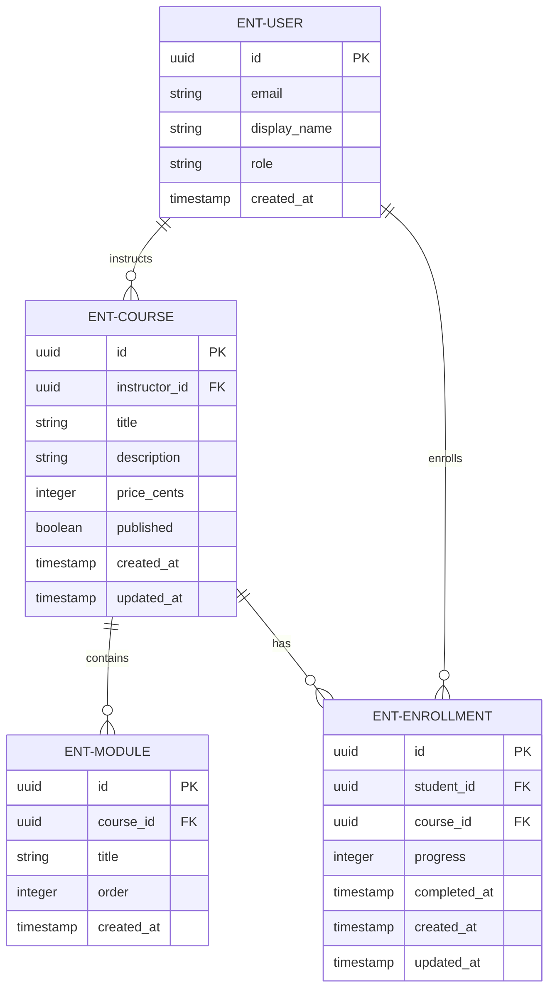
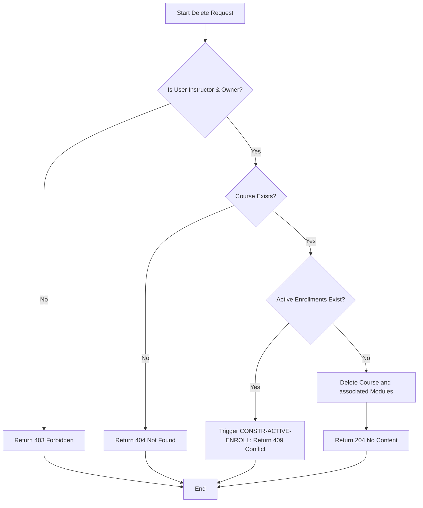
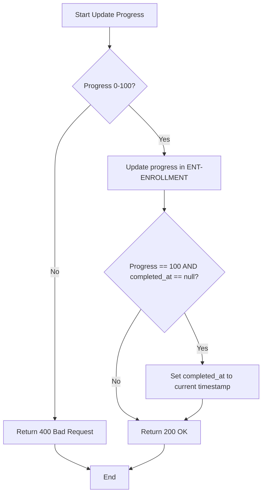
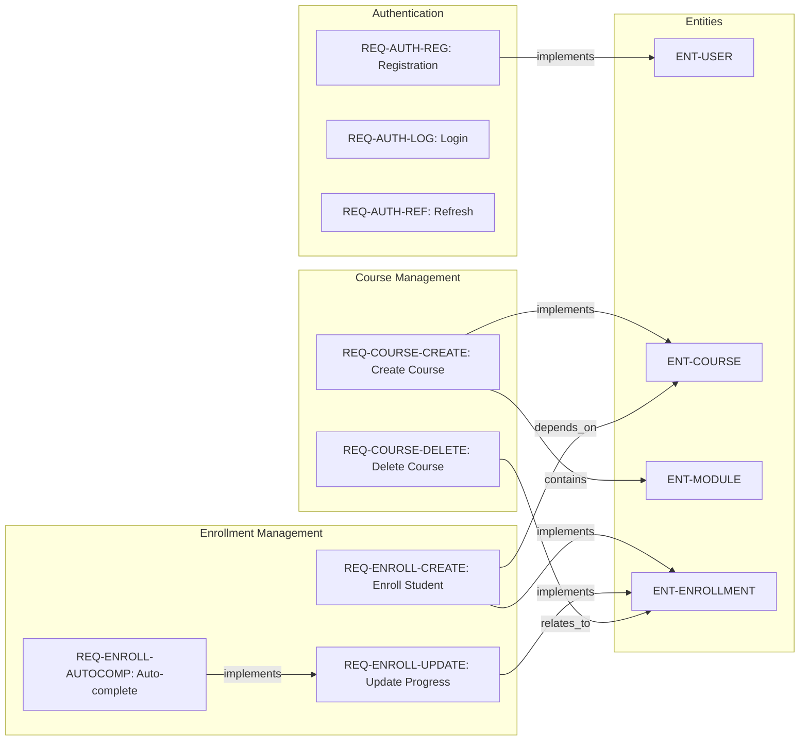

# CourseHub - Technical Specification & Architecture Document

## 1. Executive Summary & Architecture Overview

### 1.1 Executive Brief
CourseHub is a RESTful API platform enabling course lifecycle management and student enrollment workflows. It utilizes a JWT-based authentication system to isolate roles between Instructors and Students, managing a relational data pattern where Courses, Modules, and Enrollments are linked via strict ownership and publication guards.

### 1.2 Maturity Assessment
The specification provides a high level of operational detail regarding API contracts, yet it is currently in REFINEMENT status. While the functional mapping is complete, the architecture lacks strategic framing, specifically missing the overarching business goals and a defined project scope to bound the implementation.

### 1.3 Technical Stack
* **Authentication**: JWT (JSON Web Tokens)
* **Email Service**: Resend
* **Data Format**: JSON
* **ID Standard**: UUID
* **Password Hashing**: bcrypt

### 1.4 Architectural Constraints
* **Base URL**: `http://localhost:8000/api/v1`
* **Content-Type**: `application/json`
* **Token Expiry**: Access tokens expire in 15 minutes; Refresh tokens expire in 7 days.
* **Enrollment Progress**: Must be an integer between 0 and 100 inclusive.
* **Course Deletion**: Rejected with 409 Conflict if active enrollments exist (`CONSTR-ACTIVE-ENROLL`).
* **Course Visibility**: Resources are only returned to unauthenticated users or students if `published == true`.
* **Student Enrollment**: Unique constraint enforced per student per course.
* **Access Control**: Instructors are restricted to their own courses for GET and PUT operations; Students are restricted to their own enrollments for GET and PUT operations.

### 1.5 Critical Dependencies
* **Resend**: Required for asynchronous BackgroundTasks to dispatch welcome emails.
* **JWT Bearer Token**: Mandatory for all protected endpoints via the Authorization header.
* **Cascading Deletion**: Modules must be deleted automatically upon successful Course deletion.
* **Integrity Guards**: Enrollments strictly depend on the existence of a published Course and a valid User (Student).

## 2. Architecture Workflows & Visual Diagrams

### 2.1 CourseHub Data Model


### 2.2 Course Deletion Workflow


### 2.3 Enrollment Progress & Auto-completion


### 2.4 Requirements Traceability Map


## 3. Detailed Technical Specifications & Business Rules

### 3.1 Requirements Traceability
| Identifier | Type | Description | Source Section |
| :--- | :--- | :--- | :--- |
| **REQ-AUTH-REG** | Functional | Student self-registration via POST /api/v1/auth/register. | POST `/api/v1/auth/register` |
| **REQ-AUTH-LOG** | Functional | User login via POST /api/v1/auth/login. | POST `/api/v1/auth/login` |
| **REQ-AUTH-REF** | Functional | Token refresh via POST /api/v1/auth/refresh. | POST `/api/v1/auth/refresh` |
| **REQ-COURSE-CREATE** | Functional | Instructor-only creation of courses via POST /api/v1/courses. | POST `/api/v1/courses` |
| **REQ-COURSE-DELETE** | Functional | Instructor-only deletion of courses via DELETE /api/v1/courses/{course_id}. | DELETE `/api/v1/courses/{course_id}` |
| **CONSTR-ACTIVE-ENROLL** | Constraint | ActiveEnrollmentConstraint: Course deletion is rejected (409 Conflict) if active enrollments exist. | DELETE `/api/v1/courses/{course_id}` |
| **REQ-ENROLL-CREATE** | Functional | Student-only enrollment in published courses via POST /api/v1/enrollments. | POST `/api/v1/enrollments` |
| **REQ-ENROLL-UPDATE** | Functional | Student-only update of enrollment progress via PUT /api/v1/enrollments/{enrollment_id}. | PUT `/api/v1/enrollments/{enrollment_id}` |
| **REQ-ENROLL-AUTOCOMP** | Functional | If progress reaches 100 and completed_at is null, the system automatically sets completed_at to current timestamp. | PUT `/api/v1/enrollments/{enrollment_id}` |
| **NFR-API-ENVELOPE** | Non-Functional | All API responses must follow a consistent envelope shape containing 'data', 'meta', and 'errors'. | Response Envelope |
| **NFR-AUTH-JWT** | Non-Functional | Authentication must be handled via JWT Bearer tokens in the Authorization header. | API Overview |
| **ENT-USER** | Entity | User entity containing id, email, display_name, role, and created_at. | User |
| **ENT-COURSE** | Entity | Course entity containing title, description, price, publishing status and modules. | Course |
| **ENT-MODULE** | Entity | Module entity linked to a course with a specific order. | Module |
| **ENT-ENROLLMENT** | Entity | Enrollment entity linking student to course with progress and completion date. | Enrollment |

### 3.2 Security Rules
* **Authentication**: All protected endpoints require a `Authorization: Bearer <token>` header.
* **Role-Based Access Control (RBAC)**:
    * **Instructor**: Can create, update, and delete their own courses.
    * **Student**: Can enroll in published courses and update their own enrollment progress.
* **Ownership Verification**: The system must verify that the `user_id` from the JWT matches the `instructor_id` (for courses) or `student_id` (for enrollments) before allowing PUT/DELETE operations.
* **Credential Security**: Passwords must be stored using bcrypt cryptographic hashing and never returned in API responses.

### 3.3 Data Models

#### User (ENT-USER)
```typescript
{
  "id": "uuid",
  "email": "string (unique, valid email)",
  "display_name": "string",
  "role": "student" | "instructor",
  "created_at": "ISO 8601 timestamp",
  "hashed_password": "bcrypt hash (not returned in responses)"
}
```

#### Course (ENT-COURSE)
```typescript
{
  "id": "uuid",
  "instructor_id": "uuid (FK → User)",
  "title": "string",
  "description": "string",
  "price_cents": "integer (>= 0)",
  "published": "boolean",
  "created_at": "ISO 8601 timestamp",
  "updated_at": "ISO 8601 timestamp",
  "modules": "array of Module"
}
```

#### Module (ENT-MODULE)
```typescript
{
  "id": "uuid",
  "course_id": "uuid (FK → Course)",
  "title": "string",
  "order": "integer (>= 1)",
  "created_at": "ISO 8601 timestamp"
}
```

#### Enrollment (ENT-ENROLLMENT)
```typescript
{
  "id": "uuid",
  "student_id": "uuid (FK → User)",
  "course_id": "uuid (FK → Course)",
  "progress": "integer (0-100)",
  "completed_at": "ISO 8601 timestamp | null",
  "created_at": "ISO 8601 timestamp",
  "updated_at": "ISO 8601 timestamp"
}
```

## 4. Project Governance & Structural Gaps

### 4.1 Structural Gaps
| Gap | Priority | Remediation Advice |
| :--- | :--- | :--- |
| **Goals & Objectives** | HIGH | The document defines the 'How' (API contracts) but not the 'Why'. A section detailing the business goals of CourseHub is needed. |
| **Scope & Out-of-Scope** | MEDIUM | Define what the API does NOT handle (e.g., payment processing, content delivery/video streaming). |
| **Open Questions & Uncertainties** | LOW | List any undecided behaviors, such as the exact content of the welcome email or specific JWT claims. |

### 4.2 Remediation & Workflow
To move from REFINEMENT to FINAL status, the project lead must provide a Business Requirements Document (BRD) to fill the "Goals & Objectives" gap and a Scope Statement to bound the technical implementation.

## 5. Technical & Domain Glossary (Terminology Reference)

| Term | Category | Context Anchor | Project Definition |
| :--- | :--- | :--- | :--- |
| API | TECHNICAL_STACK | API Overview | The set of versioned v1 endpoints providing structured network access to the system resources. |
| ActiveEnrollmentConstraint | BUSINESS_DOMAIN | CONSTR-ACTIVE-ENROLL | A validation logic that blocks the removal of a learning resource when associated student associations are present. |
| Authentication | TECHNICAL_STACK | NFR-AUTH-JWT | The security mechanism verifying identity via bearer tokens passed in the request header. |
| BackgroundTask | TECHNICAL_STACK | REQ-AUTH-REG | An asynchronous execution unit used for non-blocking side effects such as dispatching welcome notifications. |
| Behavior | BUSINESS_DOMAIN | GET `/api/v1/courses` | The operational logic determining resource visibility based on ownership or publication status. |
| Business Rule | BUSINESS_DOMAIN | DELETE `/api/v1/courses/{course_id}` | A specific organizational constraint that dictates the validity of a state transition. |
| CORS Standard | TECHNICAL_STACK | API Overview | The cross-origin resource sharing protocol implicitly required for the defined localhost base URL to be accessible via web clients. |
| Cryptographic Hashing | TECHNICAL_STACK | ENT-USER | The one-way transformation process using the bcrypt algorithm to secure stored credentials. |
| Error Response | TECHNICAL_STACK | Response Envelope | A structured payload containing a null data field and a populated list of failure objects with codes and messages. |
| FK | TECHNICAL_STACK | ENT-COURSE | A relational link mapping a child entity to a parent unique identifier. |
| Fixed-Point Numeric Constraint | TECHNICAL_STACK | ENT-COURSE | The use of integer cents to represent monetary values and avoid floating-point precision errors. |
| JSON | TECHNICAL_STACK | API Overview | The primary lightweight data-interchange format used for all request and response bodies. |
| JWT | TECHNICAL_STACK | NFR-AUTH-JWT | The compact, URL-safe means of representing claims to be transferred between two parties. |
| Module | BUSINESS_DOMAIN | ENT-MODULE | A sequenced structural unit within a learning resource containing a title and numerical order. |
| NOT | BUSINESS_DOMAIN | REQ-AUTH-REG | A logical inversion used to define non-blocking asynchronous triggers. |
| OR | BUSINESS_DOMAIN | GET `/api/v1/courses/{course_id}` | A logical disjunction determining resource access if either ownership or public status is true. |
| Python | BUSINESS_DOMAIN | POST `/api/v1/courses` | The primary subject matter of the learning resources created within the system. |
| Query Parameters | TECHNICAL_STACK | GET `/api/v1/courses` | Optional URI components used for controlling result set pagination via skip and limit values. |
| Reference | TECHNICAL_STACK | API Contracts: CourseHub | The external documentation links mapping the current specification to the global plan. |
| Request | TECHNICAL_STACK | POST `/api/v1/auth/register` | The client-initiated data payload containing the necessary inputs for a specific operation. |
| Response | TECHNICAL_STACK | Response Envelope | The server-generated output containing the requested data, metadata, and potential error lists. |
| Role | BUSINESS_DOMAIN | ENT-USER | A categorical attribute assigned to a user to differentiate between student and instructor permissions. |
| UUID | TECHNICAL_STACK | ENT-USER | The universally unique identifier format used for primary keys across all entities. |