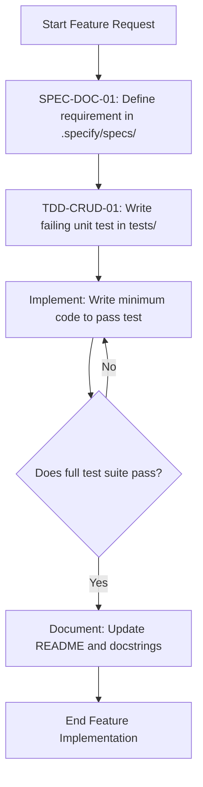
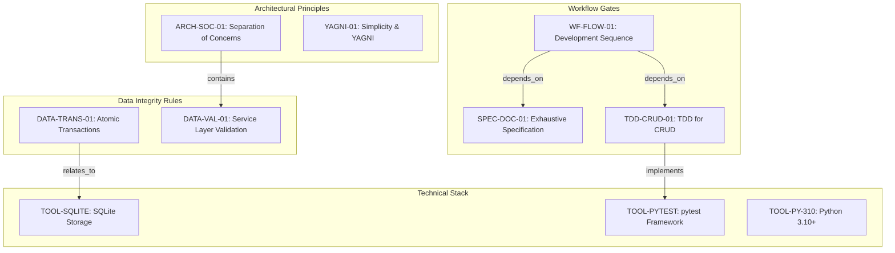

# Expense Tracker - Technical Specification & Architecture Document

## 1. Executive Summary & Architecture Overview

### 1.1 Executive Brief
The Expense Tracker is a local financial management application utilizing a CLI interface. It follows a strict modular architecture separating Repository, Service, and UI layers, with data persistence handled by SQLite. The project is governed by a rigorous TDD and Spec-First development lifecycle to ensure data atomicity and structural integrity.

### 1.2 Maturity Assessment
The specifications are highly stable and structurally sound, showing a disciplined approach to the development lifecycle. Despite a minor absence of a dedicated section for tracking uncertainties, the framework is complete and the project is READY for execution.

### 1.3 Technical Stack
* **Language**: Python 3.10+
* **Storage**: SQLite
* **Testing**: pytest
* **Interface**: Command Line Interface (CLI)

### 1.4 Architectural Constraints
* **Strict Separation of Concerns**: Mandatory isolation between the Repository layer, Service layer, and UI layer.
* **Atomic Transactions**: All data modifications must be performed using transactions to ensure atomicity.
* **Service-Layer Validation**: All data states must be validated at the service layer to prevent invalidity.
* **Sequential Workflow**: Strict adherence to the execution sequence: Spec First $\rightarrow$ Test First $\rightarrow$ Implement $\rightarrow$ Verify $\rightarrow$ Document.
* **TDD Mandate**: Unit tests for every CRUD operation must be written prior to the implementation of the functional code.

### 1.5 Critical Dependencies
* Local SQLite engine for structured data persistence.
* Pytest framework for mandatory TDD gates.
* Strict sequential dependence of implementation on `.specify/specs/` documentation.
* Transactional integrity dependency between data modifications and the SQLite storage layer.

## 2. Architecture Workflows & Visual Diagrams

### 2.1 Development Workflow Process
Detailed operational flow of the development lifecycle based on the 'Development Workflow' section, including validation gates.

### 2.2 Technical Governance Traceability
Mapping of architectural principles and coding standards to their respective technical constraints and tools.

## 3. Detailed Technical Specifications & Business Rules

### 3.1 Requirements Traceability

| Identifier | Type | Requirement / Rule Description | Source Section |
| :--- | :--- | :--- | :--- |
| **YAGNI-01** | Coding Standard | Features implemented only upon direct requirement; avoid premature complexity. | Simplicity and YAGNI |
| **DATA-TRANS-01** | Rule | All data modifications must use transactions for atomicity. | Data Integrity and Persistence |
| **DATA-VAL-01** | Rule | Invalid data state must be prevented via validation at the service layer. | Data Integrity and Persistence |
| **ARCH-SOC-01** | Coding Standard | Strict separation of Repository, Service, and UI layers. | Modular Architecture |
| **TDD-CRUD-01** | Testing Gate | Every CRUD operation must have unit tests written before implementation. | TDD for CRUD Operations |
| **SPEC-DOC-01** | Requirement | Every feature must be documented in .specify/specs/ before implementation. | Exhaustive Specification |
| **TOOL-PY-310** | Tool Config | Language: Python 3.10+ | Technical Constraints |
| **TOOL-SQLITE** | Tool Config | Storage: SQLite for local persistence. | Technical Constraints |
| **TOOL-PYTEST** | Tool Config | Testing: pytest for all test suites. | Technical Constraints |
| **WF-FLOW-01** | Workflow | Sequence: Spec First $\rightarrow$ Test First $\rightarrow$ Implement $\rightarrow$ Verify $\rightarrow$ Document. | Development Workflow |

### 3.2 Security Rules
* **Data Integrity**: All persistence mutations must be wrapped in transactions (`DATA-TRANS-01`) to prevent partial data writes.
* **Input Validation**: The Service layer acts as the primary security gate to prevent invalid data states from reaching the persistence layer (`DATA-VAL-01`).

### 3.3 Data Models
* **Persistence**: Structured local storage using SQLite (`TOOL-SQLITE`).
* **Access Pattern**: Repository Pattern is mandatory to decouple the database schema from business logic (`ARCH-SOC-01`).

## 4. Project Governance & Structural Gaps

### 4.1 Structural Gaps
| Gap | Priority | Remediation Advice |
| :--- | :--- | :--- |
| Missing "Open Questions & Uncertainties" section | LOW | Add a section to track undecided technical choices or future architecture pivots. |

### 4.2 Remediation & Workflow
The project follows a "Constitution" model where this document is the Single Source of Truth. Any modification to the principles requires:
1. A version bump.
2. Full documentation of changes.
3. Validation and ratification by the project lead.

## 5. Technical & Domain Glossary (Terminology Reference)

| Term | Category | Context Anchor | Project Definition |
| :--- | :--- | :--- | :--- |
| API | TECHNICAL_STACK | ARCH-SOC-01 | A presentation layer interface used to expose business logic externally, kept strictly isolated from data access and core services. |
| CRUD | TECHNICAL_STACK | TDD-CRUD-01 | The four foundational persistent storage mutation primitives that require mandatory prior unit testing. |
| Document | TECHNICAL_STACK | WF-FLOW-01 | The final step of the development sequence ensuring the root markdown file and function metadata are current. |
| Implement | TECHNICAL_STACK | WF-FLOW-01 | The phase of writing the absolute minimum source code necessary to satisfy a failing test case. |
| Interface | TECHNICAL_STACK | TOOL-PY-310 | The interaction layer restricted to a command-line environment for this system. |
| Language | TECHNICAL_STACK | TOOL-PY-310 | The primary programming tool specified as version 3.10 or higher. |
| MediReserve | BUSINESS_DOMAIN | Header du document | A deprecated legacy system whose principles were entirely replaced during the version 1.0.0 transition. |
| Python 3.10 | TECHNICAL_STACK | TOOL-PY-310 | The required runtime environment for all source code execution. |
| README | TECHNICAL_STACK | WF-FLOW-01 | The primary technical project documentation file that must be updated before a task is considered complete. |
| Spec First | TECHNICAL_STACK | WF-FLOW-01 | The mandatory initial phase where functional requirements and design contracts are defined in the specified folder. |
| Storage | TECHNICAL_STACK | TOOL-SQLITE | The local persistence mechanism utilizing a structured file-based database. |
| TDD | TECHNICAL_STACK | TDD-CRUD-01 | A software development methodology where tests are authored before the functional logic to drive the design. |
| Test First | TECHNICAL_STACK | WF-FLOW-01 | The development step of creating a failing test case specifically for a mutation operation before writing logic. |
| Testing | TECHNICAL_STACK | TOOL-PYTEST | The quality assurance process utilizing the pytest framework for all suites. |
| UI | TECHNICAL_STACK | ARCH-SOC-01 | The presentation layer that must remain strictly isolated from the service and repository layers. |
| Verify | TECHNICAL_STACK | WF-FLOW-01 | The process of executing the entire suite of tests to ensure no regressions were introduced. |
| YAGNI | TECHNICAL_STACK | YAGNI-01 | A design principle prohibiting the addition of features or complexity until a direct requirement is proven. |