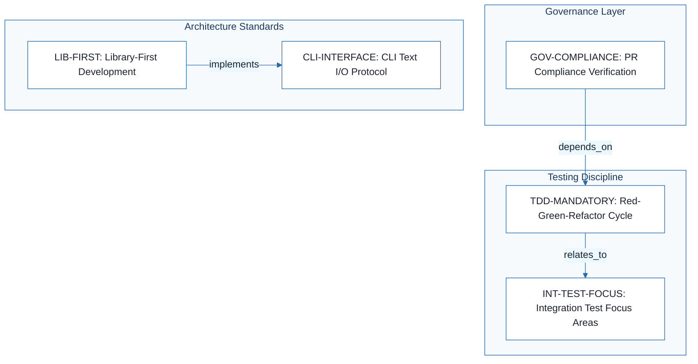
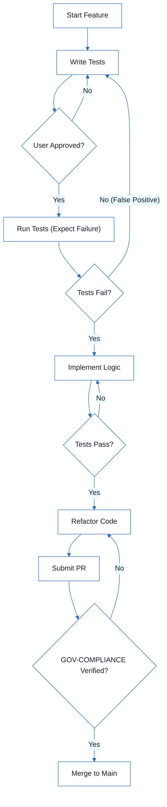

# extension-github-spec-kit - Technical Specification & Architecture Document

## 1. Executive Summary & Architecture Overview

### 1.1 Executive Brief
The extension-github-spec-kit is a foundational governance framework designed as a project constitution. It establishes a library-first architectural pattern where every feature is encapsulated as a self-contained library exposing a CLI interface via a strict text-in/text-out protocol. The project enforces a non-negotiable TDD workflow and rigorous integration testing for contract changes and inter-service communication to ensure systemic stability.

### 1.2 Maturity Assessment
The project is currently in a template state, serving as a structural blueprint rather than a populated specification. While the core principles are logically mapped, the absence of a mechanism to track technical uncertainties and the presence of high-severity structural gaps indicate that the documentation is not yet actionable for implementation. Status: REFINEMENT.

### 1.3 Technical Stack
*   **Data Formats**: JSON
*   **Versioning Scheme**: MAJOR.MINOR.BUILD

### 1.4 Architectural Constraints
*   **Library-First**: All features must be standalone, self-contained, and independently testable.
*   **CLI Interface**: Mandatory stdin/args to stdout protocol with JSON and human-readable support.
*   **Error Handling**: Strict separation of stdout for data and stderr for errors.
*   **TDD Cycle**: Mandatory Red-Green-Refactor sequence (Tests written -> User approved -> Tests fail -> Implementation).
*   **Integration Scope**: Mandatory testing for library contracts, contract modifications, inter-service communication, and shared schemas.
*   **Governance**: PR-level verification of constitution compliance is mandatory.

### 1.5 Critical Dependencies
*   `GOV-COMPLIANCE` depends on `TDD-MANDATORY` for PR verification.
*   `CLI-INTERFACE` implements the `LIB-FIRST` architectural pattern.
*   `INT-TEST-FOCUS` relates to `TDD-MANDATORY` for validation of contract changes.

## 2. Architecture Workflows



```mermaid
%%{init: {
  'theme': 'base',
  'themeVariables': {
    'primaryColor': '#1A365D',
    'primaryTextColor': '#1A202C',
    'primaryBorderColor': '#2B6CB0',
    'lineColor': '#2B6CB0',
    'secondaryColor': '#EBF8FF',
    'tertiaryColor': '#EBF8FF',
    'background': '#FFFFFF',
    'mainBkg': '#FFFFFF',
    'secondBkg': '#EBF8FF',
    'tertiaryBkg': '#F7FAFC',
    'secondaryTextColor': '#4A5568',
    'fontSize': '16px',
    'fontFamily': 'Inter, system-ui, sans-serif',
    'nodePadding': '15px',
    'borderRadius': '8px',
    'edgeLabelBackground': '#EBF8FF',
    'clusterBkg': '#F7FAFC',
    'clusterBorder': '#2B6CB0',
    'defaultLinkColor': '#2B6CB0',
    'titleColor': '#1A365D',
    'actorBorder': '#2B6CB0',
    'actorBkg': '#EBF8FF',
    'actorTextColor': '#1A365D',
    'actorLineColor': '#2B6CB0',
    'signalColor': '#2B6CB0',
    'signalTextColor': '#1A202C',
    'labelBoxBorderColor': '#2B6CB0',
    'labelBoxBkgColor': '#EBF8FF',
    'labelTextColor': '#1A202C',
    'loopTextColor': '#1A202C',
    'arrowHeadColor': '#2B6CB0',
    'sequenceNumberColor': '#1A365D',
    'sequenceActorBorder': '#2B6CB0',
    'sequenceActorBkg': '#EBF8FF',
    'sequenceArrowColor': '#2B6CB0',
    'noteBkgColor': '#FFF5EB',
    'noteBorderColor': '#DD6B20',
    'noteTextColor': '#1A202C'
  }
}}%%
flowchart TD
    START["Start Feature"] --> WRITE_TESTS["Write Tests"]
    WRITE_TESTS --> USER_APP{"User Approved?"}
    USER_APP -- "No" --> WRITE_TESTS
    USER_APP -- "Yes" --> RUN_TESTS["Run Tests (Expect Failure)"]
    RUN_TESTS --> FAIL_CHECK{"Tests Fail?"}
    FAIL_CHECK -- "No (False Positive)" --> WRITE_TESTS
    FAIL_CHECK -- "Yes" --> IMPLEMENT["Implement Logic"]
    IMPLEMENT --> GREEN_CHECK{"Tests Pass?"}
    GREEN_CHECK -- "No" --> IMPLEMENT
    GREEN_CHECK -- "Yes" --> REFACTOR["Refactor Code"]
    REFACTOR --> PR_SUBMIT["Submit PR"]
    PR_SUBMIT --> GOV_CHECK{"GOV-COMPLIANCE Verified?"}
    GOV_CHECK -- "No" --> REFACTOR
    GOV_CHECK -- "Yes" --> END["Merge to Main"]
``` & Visual Diagrams

### 2.1 Requirements Traceability Flowchart
Maps the traceability between core principles, coding standards, and governance rules using exact identifiers.

```mermaid
%%{init: {
  'theme': 'base',
  'themeVariables': {
    'primaryColor': '#1A365D',
    'primaryTextColor': '#1A202C',
    'primaryBorderColor': '#2B6CB0',
    'lineColor': '#2B6CB0',
    'secondaryColor': '#EBF8FF',
    'tertiaryColor': '#EBF8FF',
    'background': '#FFFFFF',
    'mainBkg': '#FFFFFF',
    'secondBkg': '#EBF8FF',
    'tertiaryBkg': '#F7FAFC',
    'secondaryTextColor': '#4A5568',
    'fontSize': '16px',
    'fontFamily': 'Inter, system-ui, sans-serif',
    'nodePadding': '15px',
    'borderRadius': '8px',
    'edgeLabelBackground': '#EBF8FF',
    'clusterBkg': '#F7FAFC',
    'clusterBorder': '#2B6CB0',
    'defaultLinkColor': '#2B6CB0',
    'titleColor': '#1A365D',
    'actorBorder': '#2B6CB0',
    'actorBkg': '#EBF8FF',
    'actorTextColor': '#1A365D',
    'actorLineColor': '#2B6CB0',
    'signalColor': '#2B6CB0',
    'signalTextColor': '#1A202C',
    'labelBoxBorderColor': '#2B6CB0',
    'labelBoxBkgColor': '#EBF8FF',
    'labelTextColor': '#1A202C',
    'loopTextColor': '#1A202C',
    'arrowHeadColor': '#2B6CB0',
    'sequenceNumberColor': '#1A365D',
    'sequenceActorBorder': '#2B6CB0',
    'sequenceActorBkg': '#EBF8FF',
    'sequenceArrowColor': '#2B6CB0',
    'noteBkgColor': '#FFF5EB',
    'noteBorderColor': '#DD6B20',
    'noteTextColor': '#1A202C'
  }
}}%%
flowchart TD
    subgraph "Governance Layer"
        GOV-COMPLIANCE["GOV-COMPLIANCE: PR Compliance Verification"]
    end
    subgraph "Testing Discipline"
        TDD-MANDATORY["TDD-MANDATORY: Red-Green-Refactor Cycle"]
        INT-TEST-FOCUS["INT-TEST-FOCUS: Integration Test Focus Areas"]
    end
    subgraph "Architecture Standards"
        LIB-FIRST["LIB-FIRST: Library-First Development"]
        CLI-INTERFACE["CLI-INTERFACE: CLI Text I/O Protocol"]
    end
    GOV-COMPLIANCE -->|"depends_on"| TDD-MANDATORY
    TDD-MANDATORY -->|"relates_to"| INT-TEST-FOCUS
    LIB-FIRST -->|"implements"| CLI-INTERFACE
```

### 2.2 TDD & Quality Gate Workflow
Models the mandatory TDD cycle and the governance check required for PR approval.



## 3. Detailed Technical Specifications & Business Rules

### 3.1 Requirements Traceability
| Identifier | Type | Requirement Description | Source Section |
| :--- | :--- | :--- | :--- |
| `LIB-FIRST` | coding_standard | Every feature starts as a standalone library; Libraries must be self-contained, independently testable, and documented. | [PRINCIPLE_1_NAME] |
| `CLI-INTERFACE` | coding_standard | Every library exposes functionality via CLI using text in/out protocol (stdin/args -> stdout, errors -> stderr) supporting JSON and human-readable formats. | [PRINCIPLE_2_NAME] |
| `TDD-MANDATORY` | testing_gate | TDD mandatory: Tests written -> User approved -> Tests fail -> Then implement; Red-Green-Refactor cycle strictly enforced. | [PRINCIPLE_3_NAME] |
| `INT-TEST-FOCUS` | testing_gate | Integration tests required for: New library contract tests, Contract changes, Inter-service communication, and Shared schemas. | [PRINCIPLE_4_NAME] |
| `GOV-COMPLIANCE` | rule | All PRs and reviews must verify compliance with the constitution. | Governance |

### 3.2 Security Rules
*No explicit security rules defined in the current source data.*

### 3.3 Data Models
*No explicit data models defined in the current source data.*

## 4. Project Governance & Structural Gaps

### 4.1 Structural Gaps
| Missing Section | Priority | Remediation Advice |
| :--- | :--- | :--- |
| Open Questions & Uncertainties | HIGH | The document is a template and contains no section for tracking open technical questions or uncertainties. |

### 4.2 Remediation & Workflow
The project must transition from a template state to a populated specification by defining the missing "Open Questions" section and filling the placeholder sections (`[SECTION_2_NAME]`, `[SECTION_3_NAME]`) with concrete technical requirements and deployment policies.

## 5. Technical & Domain Glossary (Terminology Reference)

| Term | Category | Context Anchor | Project Definition |
| :--- | :--- | :--- | :--- |
| BUILD | TECHNICAL_STACK | [PRINCIPLE_5_NAME] | The third segment of the versioning triplet used to track incremental compilation iterations. |
| JSON | TECHNICAL_STACK | CLI-INTERFACE | A structured data interchange format supported for machine-readable output in the command line interface. |
| MAJOR | TECHNICAL_STACK | [PRINCIPLE_5_NAME] | The primary versioning digit indicating incompatible API changes. |
| MINOR | TECHNICAL_STACK | [PRINCIPLE_5_NAME] | The secondary versioning digit indicating backward-compatible functionality additions. |
| NON | BUSINESS_DOMAIN | TDD-MANDATORY | A strict qualifier indicating that a specific requirement is mandatory and cannot be bypassed. |
| TDD | TECHNICAL_STACK | TDD-MANDATORY | A development methodology where verification scripts are authored before the actual logic implementation. |
| YAGNI | TECHNICAL_STACK | [PRINCIPLE_5_NAME] | An architectural constraint prohibiting the implementation of features until they are actually required. |