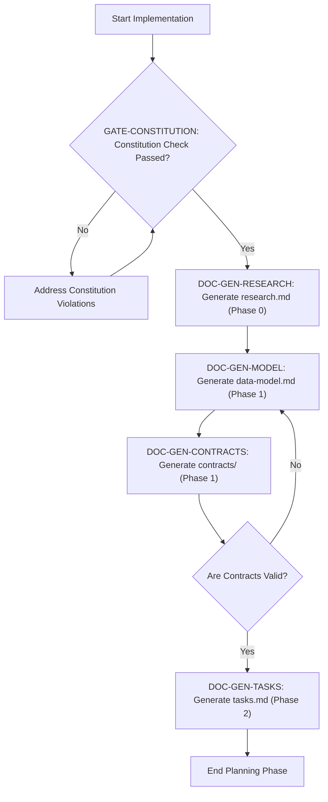
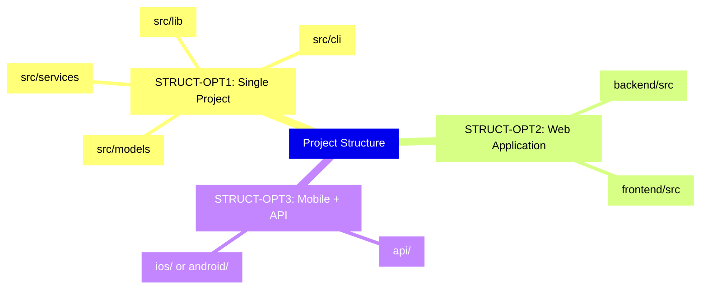

# football-match-manager - Technical Specification & Architecture Document

## 1. Executive Summary & Architecture Overview

### 1.1 Executive Brief
The `football-match-manager` project is currently in a skeletal phase, utilizing a standardized implementation plan template to define a future feature. It establishes a structured execution workflow transitioning from research to data modeling and contract definition. The project identity is currently a placeholder, awaiting the definition of a specific feature specification to drive the technical implementation.

### 1.2 Maturity Assessment
The project is in a preliminary state and is categorized as **NEEDS REFINEMENT**. While the structural completeness of the template is high, it lacks all concrete technical substance. High-severity gaps in Data Models and API Contracts indicate that no actual engineering specifications have been populated, rendering the current state a procedural shell rather than a technical blueprint.

### 1.3 Technical Stack
*   **Languages/Frameworks**: Not yet specified (Template placeholders present)
*   **Primary Dependencies**: Not yet specified (Template placeholders present)
*   **Storage**: Not yet specified (Template placeholders present)
*   **Testing**: Not yet specified (Template placeholders present)
*   **Target Platform**: Not yet specified (Template placeholders present)

### 1.4 Architectural Constraints
*   **Strict sequential execution gate**: Constitution Check must be passed before Phase 0 research.
*   **Mandatory documentation pipeline**: `research.md` $\rightarrow$ `data-model.md` $\rightarrow$ `contracts/` $\rightarrow$ `tasks.md`.
*   **Structural requirement**: Selection of one specific project layout (Single project, Web app, or Mobile + API) must be documented.

### 1.5 Critical Dependencies
*   **Sequential dependency**: Phase 0 Research is required for Data Model generation.
*   **Sequential dependency**: Data Model is required for API Contract definition.
*   **Sequential dependency**: API Contracts are required for Task generation.
*   **Workflow gate**: Constitution Check validation is a non-negotiable prerequisite for project commencement.

## 2. Architecture Workflows & Visual Diagrams

### 2.1 Feature Implementation Workflow
Models the sequential phase-based execution workflow for feature implementation, including the mandatory Constitution Check gate.

### 2.2 Project Structure Options
Visualizes the available architectural structure options provided in the implementation template.

## 3. Detailed Technical Specifications & Business Rules

### 3.1 Requirements Traceability
| Identifier | Requirement / Element Description | Source Section | Status |
| :--- | :--- | :--- | :--- |
| `STRUCT-OPT1` | Single project structure (src/models, src/services, src/cli, src/lib) | [REMOVE IF UNUSED] Option 1 | template_option |
| `STRUCT-OPT2` | Web application structure (backend/src, frontend/src) | [REMOVE IF UNUSED] Option 2 | template_option |
| `STRUCT-OPT3` | Mobile + API structure (api/, ios/ or android/) | [REMOVE IF UNUSED] Option 3 | template_option |
| `GATE-CONSTITUTION` | Constitution Check Gate: Must pass before Phase 0 research | Constitution Check | Pre-Research |
| `DOC-GEN-RESEARCH` | Generate research.md (Phase 0 output) | Documentation (this feature) | Phase 0 |
| `DOC-GEN-MODEL` | Generate data-model.md (Phase 1 output) | Documentation (this feature) | Phase 1 |
| `DOC-GEN-CONTRACTS` | Generate contracts/ (Phase 1 output) | Documentation (this feature) | Phase 1 |
| `DOC-GEN-TASKS` | Generate tasks.md (Phase 2 output) | Documentation (this feature) | Phase 2 |

### 3.2 Security Rules
*No security rules defined in the current template phase.*

### 3.3 Data Models
*No data models defined in the current template phase.*

## 4. Project Governance & Structural Gaps

### 4.1 Structural Gaps
| Gap | Priority | Remediation Advice |
| :--- | :--- | :--- |
| Data Models & Schemas | HIGH | This is a template; actual data models should be defined in the 'data-model.md' as referenced in the documentation section. |
| API Contracts & Flow | HIGH | The 'contracts/' directory is mentioned, but no specific endpoints or flows are defined yet. |
| Security & Identity | MEDIUM | No security constraints or identity providers are specified in the current technical context template. |
| Open Questions & Uncertainties | LOW | Add a section to capture technical unknowns before implementation starts. |

### 4.2 Remediation & Workflow
The project must transition from the current "Template" state to a "Specified" state by:
1. Defining the specific feature in `spec.md`.
2. Executing the `GATE-CONSTITUTION` check.
3. Populating the documentation pipeline (`research` $\rightarrow$ `model` $\rightarrow$ `contracts` $\rightarrow$ `tasks`).

## 5. Technical & Domain Glossary (Terminology Reference)

| Term | Category | Context Anchor | Project Definition |
| :--- | :--- | :--- | :--- |
| ACTION | TECHNICAL_STACK | Technical Context | Required operational modifications to replace template placeholders with actual project details. |
| API | TECHNICAL_STACK | STRUCT-OPT2 | The backend interface layer residing within the server-side source directory. |
| Branch | TECHNICAL_STACK | Implementation Plan: [FEATURE] | The specific version control lineage identifier for a given feature development. |
| CORS Standard | TECHNICAL_STACK | STRUCT-OPT2 | The protocol governing cross-origin resource sharing between the frontend and backend layers. |
| Constraints | TECHNICAL_STACK | Technical Context | Domain-specific limitations such as response time thresholds or memory ceilings. |
| CoreData | TECHNICAL_STACK | Technical Context | A potential persistent framework for object graph management. |
| DATE | TECHNICAL_STACK | Implementation Plan: [FEATURE] | The temporal marker indicating when the plan was generated. |
| DB | TECHNICAL_STACK | Complexity Tracking | The persistent relational or non-relational data store. |
| GATE | TECHNICAL_STACK | GATE-CONSTITUTION | A mandatory validation milestone that must be cleared before progressing to research phases. |
| IF | TECHNICAL_STACK | Complexity Tracking | The conditional logic used to justify architectural violations. |
| LLVM | TECHNICAL_STACK | Technical Context | A low-level compiler infrastructure potential dependency. |
| LOC | TECHNICAL_STACK | Technical Context | The numeric measure of the total amount of written source code. |
| NOT | TECHNICAL_STACK | DOC-GEN-TASKS | A negative constraint indicating that certain files are not generated by the plan command. |
| Note | TECHNICAL_STACK | Implementation Plan: [FEATURE] | Informational metadata regarding the workflow of the plan generator. |
| ONLY | TECHNICAL_STACK | Complexity Tracking | A restrictive constraint limiting the population of the violation table. |
| Option | TECHNICAL_STACK | Source Code (repository root) | Alternative structural layouts available for selection. |
| Performance Goals | TECHNICAL_STACK | Technical Context | Target quantitative metrics such as request per second or frame rate. |
| Primary Dependencies | TECHNICAL_STACK | Technical Context | The core external libraries or frameworks required for system execution. |
| Project Type | TECHNICAL_STACK | Technical Context | The classification of the software, such as a web-service or mobile-app. |
| Python 3.11 | TECHNICAL_STACK | Technical Context | The specific runtime environment version specified as an example. |
| REMOVE | TECHNICAL_STACK | STRUCT-OPT1 | The operation of deleting unused structural templates from the final document. |
| Spec | TECHNICAL_STACK | Implementation Plan: [FEATURE] | The link to the formal functional requirements document. |
| Storage | TECHNICAL_STACK | Technical Context | The chosen mechanism for data persistence, whether file-based or database-driven. |
| Structure Decision | TECHNICAL_STACK | STRUCT-OPT3 | The final selection and documentation of the chosen directory hierarchy. |
| Target Platform | TECHNICAL_STACK | Technical Context | The intended operating environment such as a cloud server or mobile OS. |
| Testing | TECHNICAL_STACK | Technical Context | The framework used for verifying code correctness, such as pytest or XCTest. |
| UI | TECHNICAL_STACK | STRUCT-OPT3 | The visual interaction layer and its associated flows within a mobile context. |
| UNUSED | TECHNICAL_STACK | STRUCT-OPT1 | Components or template options that do not apply to the selected architecture and must be purged. |
| WASM | TECHNICAL_STACK | Technical Context | The binary instruction format for a stack-based virtual machine. |
| iOS | TECHNICAL_STACK | STRUCT-OPT3 | The specific Apple mobile operating system target. |