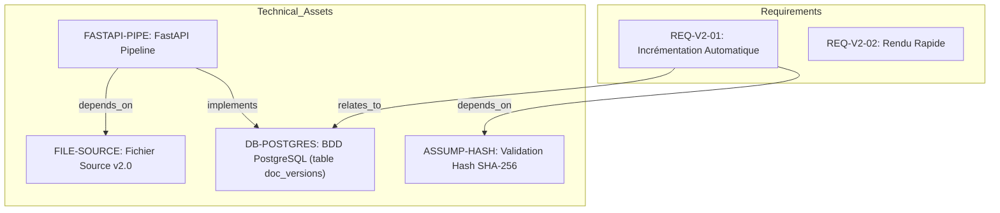
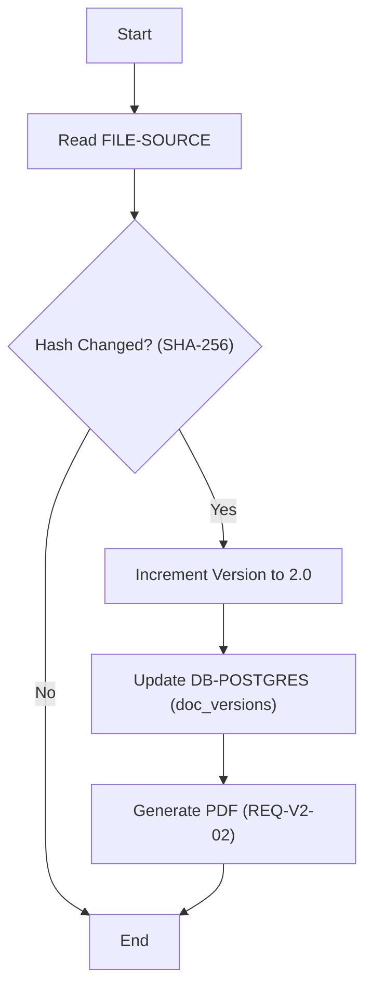
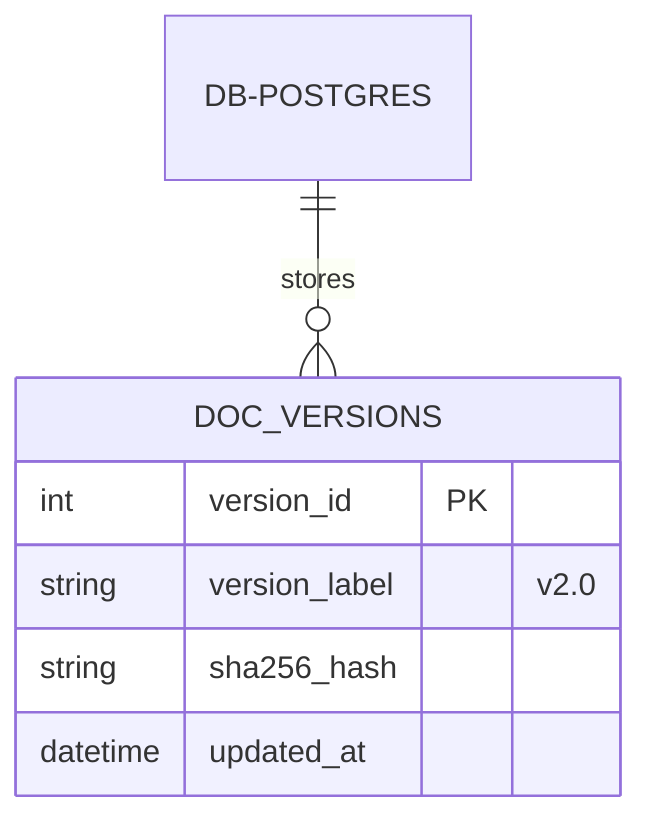
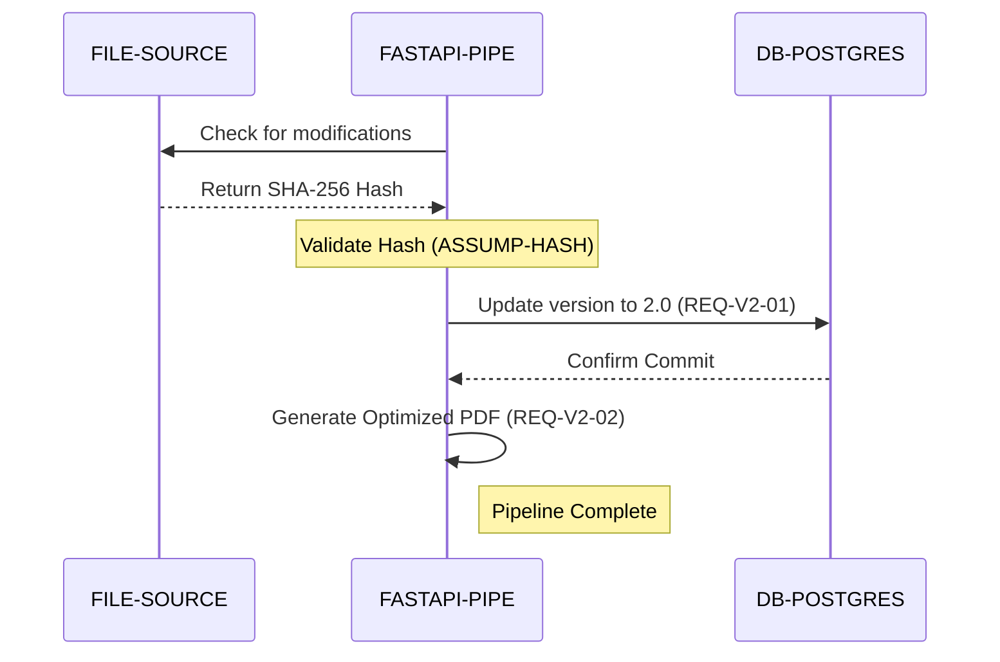

# Système de Versionnage de Documents - Technical Specification & Architecture Document

## 1. Executive Summary & Architecture Overview

### 1.1 Executive Brief
This project implements a document versioning system designed to automate the transition from v1.0 to v2.0. It utilizes a FastAPI pipeline to detect source file modifications via SHA-256 hash validation, subsequently persisting version metadata in a PostgreSQL database and generating a corresponding PDF output.

### 1.2 Maturity Assessment
The project is currently in a state of REFINEMENT. While the core pipeline flow is defined, there are critical structural gaps regarding the system scope—specifically the absence of conflict management and rollback strategies—and a lack of quantified SLAs for the 'fast rendering' requirement, which prevents a full production readiness sign-off.

### 1.3 Technical Stack
* FastAPI
* PostgreSQL

### 1.4 Architectural Constraints
* Version incrementation must be automatically recorded in the `doc_versions` table upon source modification.
* Document generation must be optimized for zero latency across enrichment agents.
* Trigger mechanism strictly based on SHA-256 hash verification.

### 1.5 Critical Dependencies
* SHA-256 hash validation for version trigger.
* PostgreSQL `doc_versions` table for state persistence.
* FastAPI pipeline dependency on the v2.0 source file.
* PDF generation engine for `spec(1)_v2.0.pdf` output.

## 2. Architecture Workflows & Visual Diagrams

### 2.1 Requirements Traceability Matrix

### 2.2 Document Versioning Workflow

### 2.3 Data Model - Document Versioning

### 2.4 Pipeline Execution Sequence

## 3. Detailed Technical Specifications & Business Rules

### 3.1 Requirements Traceability
| ID | Requirement / Entity | Description | Source Section |
| :--- | :--- | :--- | :--- |
| **REQ-V2-01** | Incrémentation Automatique | Le système doit détecter la modification du fichier source et enregistrer la version 2.0 dans la table doc_versions. | 2. Exigences Fonctionnelles |
| **REQ-V2-02** | Rendu Rapide | Génération optimisée du document sans latence sur les agents d'enrichissement. | 2. Exigences Fonctionnelles |
| **FILE-SOURCE** | Fichier Source v2.0 | Source file used for versioning trigger. | 3. Architecture Simplifiée |
| **FASTAPI-PIPE** | FastAPI Pipeline | Orchestration layer for ingestion and versioning. | 3. Architecture Simplifiée |
| **DB-POSTGRES** | BDD PostgreSQL | Relational storage for the `doc_versions` table. | 3. Architecture Simplifiée |
| **ASSUMP-HASH** | Validation Hash | Assumption that modification is triggered by SHA-256 verification. | 4. Glossaire Léger |

### 3.2 Security Rules
* **Integrity Verification**: Use of SHA-256 cryptographic hashing to ensure that version increments are only triggered by actual content changes.

### 3.3 Data Models
* **Table `doc_versions`**: Stores the versioning state, including `version_id` (PK), `version_label` (e.g., "v2.0"), `sha256_hash`, and `updated_at` timestamp.

## 4. Project Governance & Structural Gaps

### 4.1 Structural Gaps
| Missing Section | Priority | Remediation Advice |
| :--- | :--- | :--- |
| Non-Functional Requirements | MEDIUM | Définir les SLAs de performance pour le 'Rendu Rapide' mentionné en REQ-V2-02. |
| Scope & Out-of-Scope | HIGH | Préciser les limites du système de versionnage (ex: gestion des conflits, rollback). |
| Open Questions & Uncertainties | LOW | Lister les incertitudes liées à la montée en charge du pipeline FastAPI. |

### 4.2 Remediation & Workflow
The identified gaps must be addressed by defining quantitative performance metrics (SLAs) and a formal scope document to prevent scope creep and ensure system reliability during high-load scenarios.

## 5. Technical & Domain Glossary (Terminology Reference)

| Term | Category | Context Anchor | Project Definition |
| :--- | :--- | :--- | :--- |
| 2.0 | BUSINESS_DOMAIN | REQ-V2-01 | The specific numerical iteration identifier to be persisted within the doc_versions table upon detection of source changes. |
| BDD | TECHNICAL_STACK | DB-POSTGRES | The relational storage engine utilized for maintaining document state and iteration history. |
| Cryptographic Hashing | TECHNICAL_STACK | ASSUMP-HASH | The mathematical process used to generate a unique fixed-size signature to detect content alterations. |
| PDF | TECHNICAL_STACK | 1. Présentation Générale | The final portable document format generated as the output of the enrichment pipeline. |
| REQ | TECHNICAL_STACK | 2. Exigences Fonctionnelles | The prefix used to identify formal functional constraints within the system specification. |
| SHA | TECHNICAL_STACK | ASSUMP-HASH | The specific 256-bit secure algorithm employed to verify file integrity and trigger updates. |
| Validation Hash | TECHNICAL_STACK | 4. Glossaire Léger | The mechanism of comparing digital signatures to determine if a source file requires a new iteration. |
| Version 2.0 | BUSINESS_DOMAIN | 📄 Spécification Technique du Système — Version 2.0 (Test Léger) | The current target state of the system being validated during the pipeline ingestion test. |