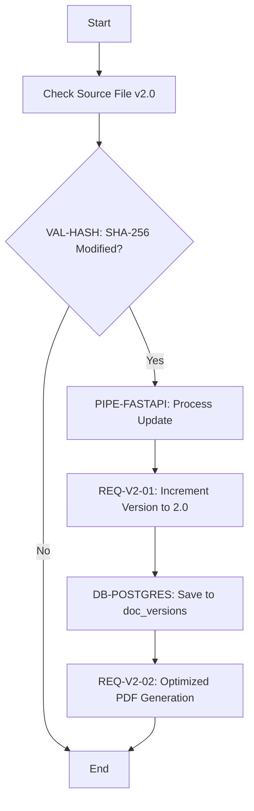
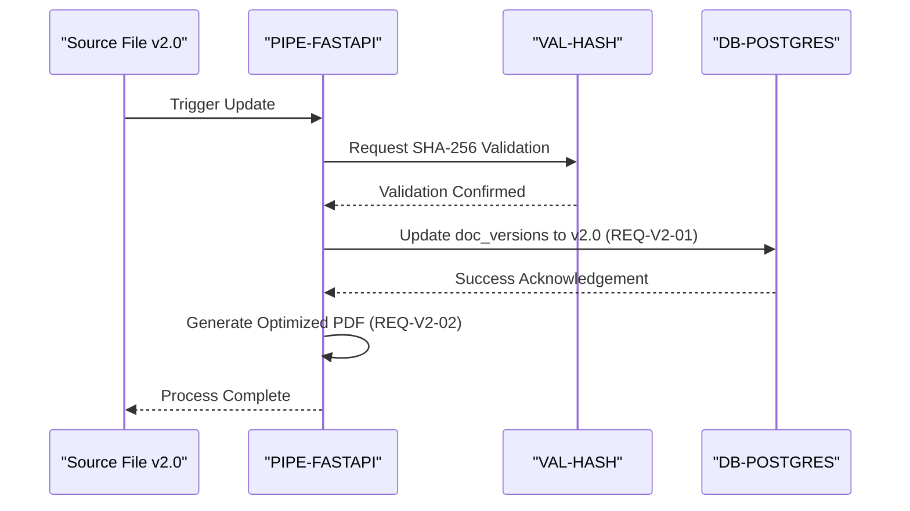
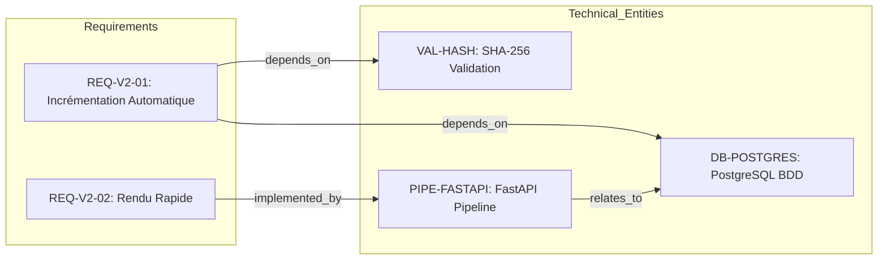
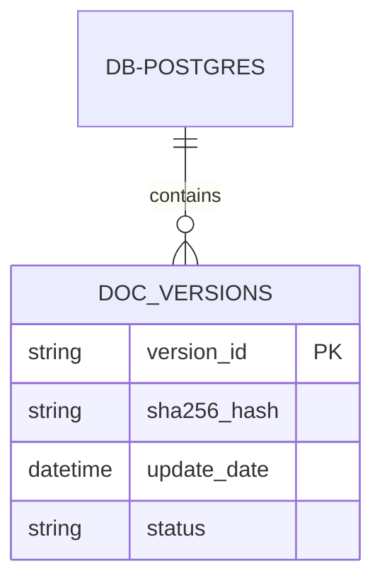

# Système de Versionnage de Spécifications - Technical Specification & Architecture Document

## 1. Executive Summary & Architecture Overview

### 1.1 Executive Brief
This project implements a technical versioning system designed to validate the upgrade pipeline from v1.0 to v2.0. It utilizes a FastAPI-driven data flow to detect source modifications via SHA-256 hash validation and persists version state updates within a PostgreSQL database, culminating in the generation of optimized PDF specifications.

### 1.2 Maturity Assessment
The specification is currently in a light test state and requires REFINEMENT. While the core functional flow is mapped, there are critical structural gaps including the absence of a defined project scope and a lack of quantified non-functional requirements (SLAs) for the rapid rendering requirement, which prevents a full production-ready assessment.

### 1.3 Technical Stack
* FastAPI
* PostgreSQL

### 1.4 Architectural Constraints
* Version incrementation strictly tied to source file modification detection.
* Data persistence limited to the `doc_versions` table.
* Zero-latency requirement for enrichment agents during document generation.
* Trigger mechanism based on SHA-256 validation hash.

### 1.5 Critical Dependencies
* SHA-256 hash verification for version trigger.
* PostgreSQL `doc_versions` table for state recording.
* FastAPI pipeline for data orchestration.
* Correct release of BDD locks prior to versioning cycle.

## 2. Architecture Workflows & Visual Diagrams

### 2.1 Version Update Workflow
Models the technical process of detecting file changes and updating the version in the database, incorporating the SHA-256 validation logic.

### 2.2 System Interaction Sequence
Sequence of interactions between the source file, the FastAPI pipeline, and the PostgreSQL database for the versioning process.

### 2.3 Requirements Traceability Map
Maps functional requirements to the technical entities they depend on for implementation.

### 2.4 Data Model Entity Relationship
Conceptual data model for the versioning system focusing on the `doc_versions` table.

## 3. Detailed Technical Specifications & Business Rules

### 3.1 Requirements Traceability
| Identifier | Requirement Description | Technical Entity / Dependency | Feature |
| :--- | :--- | :--- | :--- |
| REQ-V2-01 | Le système doit détecter la modification du fichier source et enregistrer la version 2.0 dans la table doc_versions. | DB-POSTGRES, VAL-HASH | Incrémentation Automatique |
| REQ-V2-02 | Génération optimisée du document sans latence sur les agents d'enrichissement. | PIPE-FASTAPI | Rendu Rapide |

### 3.2 Security Rules
* **Integrity Validation**: Use of SHA-256 cryptographic hashing (`VAL-HASH`) to ensure that version increments are only triggered by actual content modifications.

### 3.3 Data Models
| Entity ID | Description | Context |
| :--- | :--- | :--- |
| DB-POSTGRES | Base de données PostgreSQL contenant la table doc_versions | Persistence Layer |
| PIPE-FASTAPI | Pipeline FastAPI responsable du flux de données | Orchestration Layer |
| VAL-HASH | Vérification de la modification SHA-256 pour déclencher la mise à jour | Validation Layer |

## 4. Project Governance & Structural Gaps

### 4.1 Structural Gaps
| Missing Section | Priority | Remediation Advice |
| :--- | :--- | :--- |
| Non-Functional Requirements | MEDIUM | Préciser les SLAs de performance pour le 'Rendu Rapide' mentionné dans REQ-V2-02. |
| Scope & Out-of-Scope | HIGH | Définir les limites du test de versionnage pour éviter tout débordement sur la production. |
| Open Questions & Uncertainties | LOW | Lister les points de blocage potentiels lors de la réinitialisation des verrous BDD. |

### 4.2 Remediation & Workflow
The project is currently in a "Light Test" phase. To move toward a production-ready specification, the identified gaps in Section 4.1 must be addressed by defining quantitative performance metrics and explicit boundary conditions for the versioning pipeline.

## 5. Technical & Domain Glossary (Terminology Reference)

| Term | Category | Context Anchor | Project Definition |
| :--- | :--- | :--- | :--- |
| 2.0 | BUSINESS_DOMAIN | REQ-V2-01 | The specific numerical target state for the current update cycle to be persisted in the tracking table. |
| BDD | TECHNICAL_STACK | 📄 Spécification Technique du Système — Version 2.0 (Test Léger) | The relational persistence layer where lock resets are performed to allow new record insertions. |
| Cryptographic Hashing | TECHNICAL_STACK | VAL-HASH | The algorithmic process used to generate a unique fingerprint of the source file to detect modifications. |
| PDF | TECHNICAL_STACK | 1. Présentation Générale | The final read-only document format generated by the enrichment agents for archival purposes. |
| REQ | BUSINESS_DOMAIN | 2. Exigences Fonctionnelles | The standardized prefix used to identify a formal functional constraint within the system topology. |
| SHA | TECHNICAL_STACK | VAL-HASH | The specific 256-bit secure digest standard employed to trigger the update pipeline. |
| Validation Hash | TECHNICAL_STACK | VAL-HASH | The process of comparing current and previous file signatures to determine if the update sequence must execute. |
| version 2.0 | BUSINESS_DOMAIN | 1. Présentation Générale | The designated milestone representing the transition from the initial release to the current validated state. |