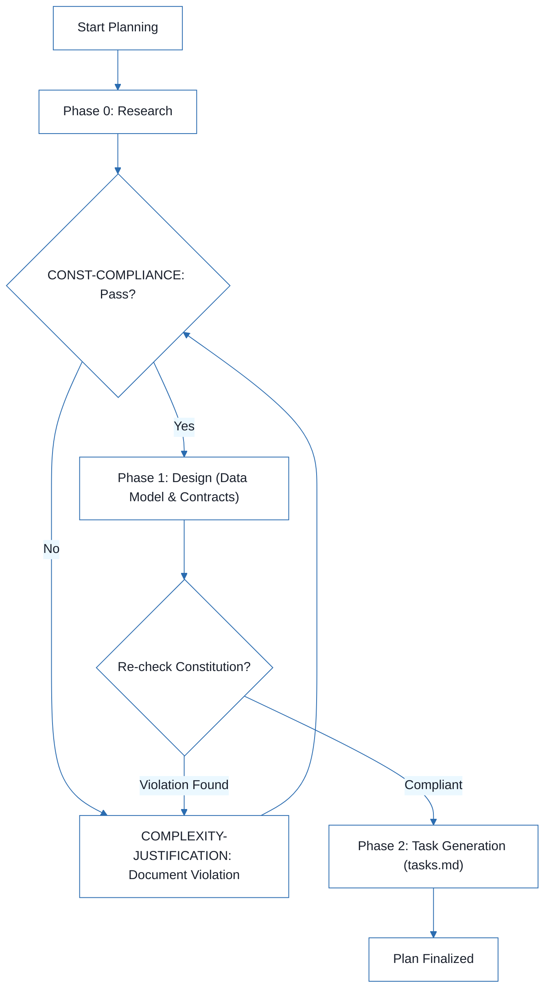

# to-do-list-manager - Technical Specification & Architecture Document

## 1. Executive Summary & Architecture Overview

### 1.1 Executive Brief
The `to-do-list-manager` project is currently in its initial planning phase. It utilizes a standardized implementation plan template to define its architectural footprint, including language selection, storage strategy, and repository structure. The system is designed to be flexible, supporting multiple deployment targets (CLI, Web, or Mobile) depending on the final architectural decisions.

### 1.2 Maturity Assessment
The project is in a **skeletal state**, consisting of an instructional template rather than a concrete specification. With high-severity gaps in Data Models and API Contracts, the architecture is completely undefined. The current status is **REFINEMENT**, as the project lacks the minimal viable technical data required for execution.

### 1.3 Technical Stack
*   **Languages & Frameworks**: TBD (Placeholders: Python 3.11, Swift 5.9, Rust 1.75)
*   **Primary Dependencies**: TBD (Placeholders: FastAPI, UIKit, LLVM)
*   **Storage**: TBD (Placeholders: PostgreSQL, CoreData, Files)
*   **Testing**: TBD (Placeholders: pytest, XCTest, cargo test)
*   **Target Platform**: TBD (Placeholders: Linux server, iOS 15+, WASM)

### 1.4 Architectural Constraints
*   **Governance Gate**: Must pass Constitution Check gates before Phase 0 research.
*   **Design Verification**: Mandatory re-verification of gates after Phase 1 design.
*   **Complexity Management**: Architectural violations must be documented via a complexity justification matrix specifying the rejected simpler alternative.

### 1.5 Critical Dependencies
*   **Structural Dependency**: Repository structure selection depends on the finalized Technical Stack decision.
*   **Compliance Dependency**: Complexity justifications depend on the results of the Constitution compliance check.
*   **Execution Dependency**: Implementation execution is gated by the availability of a feature specification in `/specs/[feature-name]/spec.md`.

## 2. Architecture Workflows

```mermaid
%%{init: {
  'theme': 'base',
  'themeVariables': {
    'primaryColor': '#1A365D',
    'primaryTextColor': '#1A202C',
    'primaryBorderColor': '#2B6CB0',
    'lineColor': '#2B6CB0',
    'secondaryColor': '#EBF8FF',
    'tertiaryColor': '#EBF8FF',
    'background': '#FFFFFF',
    'mainBkg': '#FFFFFF',
    'secondBkg': '#EBF8FF',
    'tertiaryBkg': '#F7FAFC',
    'secondaryTextColor': '#4A5568',
    'fontSize': '16px',
    'fontFamily': 'Inter, system-ui, sans-serif',
    'nodePadding': '15px',
    'borderRadius': '8px',
    'edgeLabelBackground': '#EBF8FF',
    'clusterBkg': '#F7FAFC',
    'clusterBorder': '#2B6CB0',
    'defaultLinkColor': '#2B6CB0',
    'titleColor': '#1A365D',
    'actorBorder': '#2B6CB0',
    'actorBkg': '#EBF8FF',
    'actorTextColor': '#1A365D',
    'actorLineColor': '#2B6CB0',
    'signalColor': '#2B6CB0',
    'signalTextColor': '#1A202C',
    'labelBoxBorderColor': '#2B6CB0',
    'labelBoxBkgColor': '#EBF8FF',
    'labelTextColor': '#1A202C',
    'loopTextColor': '#1A202C',
    'arrowHeadColor': '#2B6CB0',
    'sequenceNumberColor': '#1A365D',
    'sequenceActorBorder': '#2B6CB0',
    'sequenceActorBkg': '#EBF8FF',
    'sequenceArrowColor': '#2B6CB0',
    'noteBkgColor': '#FFF5EB',
    'noteBorderColor': '#DD6B20',
    'noteTextColor': '#1A202C'
  }
}}%%
flowchart TD
    subgraph "Technical Planning Phase"
        REPO-STRUCTURE["REPO-STRUCTURE: Project Layout Selection"]
        TECH-STACK-DECISION["TECH-STACK-DECISION: Language & Dependencies"]
        STORAGE-STRATEGY["STORAGE-STRATEGY: Storage Mechanism"]
    end
    subgraph "Governance & Compliance"
        CONST-COMPLIANCE["CONST-COMPLIANCE: Constitution Gate Verification"]
        COMPLEXITY-JUSTIFICATION["COMPLEXITY-JUSTIFICATION: Complexity Justification"]
    end
    REPO-STRUCTURE -->|"depends_on"| TECH-STACK-DECISION
    CONST-COMPLIANCE -->|"relates_to"| COMPLEXITY-JUSTIFICATION
    TECH-STACK-DECISION --- STORAGE-STRATEGY
```



```mermaid
%%{init: {
  'theme': 'base',
  'themeVariables': {
    'primaryColor': '#1A365D',
    'primaryTextColor': '#1A202C',
    'primaryBorderColor': '#2B6CB0',
    'lineColor': '#2B6CB0',
    'secondaryColor': '#EBF8FF',
    'tertiaryColor': '#EBF8FF',
    'background': '#FFFFFF',
    'mainBkg': '#FFFFFF',
    'secondBkg': '#EBF8FF',
    'tertiaryBkg': '#F7FAFC',
    'secondaryTextColor': '#4A5568',
    'fontSize': '16px',
    'fontFamily': 'Inter, system-ui, sans-serif',
    'nodePadding': '15px',
    'borderRadius': '8px',
    'edgeLabelBackground': '#EBF8FF',
    'clusterBkg': '#F7FAFC',
    'clusterBorder': '#2B6CB0',
    'defaultLinkColor': '#2B6CB0',
    'titleColor': '#1A365D',
    'actorBorder': '#2B6CB0',
    'actorBkg': '#EBF8FF',
    'actorTextColor': '#1A365D',
    'actorLineColor': '#2B6CB0',
    'signalColor': '#2B6CB0',
    'signalTextColor': '#1A202C',
    'labelBoxBorderColor': '#2B6CB0',
    'labelBoxBkgColor': '#EBF8FF',
    'labelTextColor': '#1A202C',
    'loopTextColor': '#1A202C',
    'arrowHeadColor': '#2B6CB0',
    'sequenceNumberColor': '#1A365D',
    'sequenceActorBorder': '#2B6CB0',
    'sequenceActorBkg': '#EBF8FF',
    'sequenceArrowColor': '#2B6CB0',
    'noteBkgColor': '#FFF5EB',
    'noteBorderColor': '#DD6B20',
    'noteTextColor': '#1A202C'
  }
}}%%
flowchart TD
    START["Start Planning"] --> PHASE0["Phase 0: Research"]
    PHASE0 --> GATE1{"CONST-COMPLIANCE: Pass?"}
    GATE1 -- "No" --> JUSTIFY["COMPLEXITY-JUSTIFICATION: Document Violation"]
    JUSTIFY --> GATE1
    GATE1 -- "Yes" --> PHASE1["Phase 1: Design (Data Model & Contracts)"]
    PHASE1 --> GATE2{"Re-check Constitution?"}
    GATE2 -- "Violation Found" --> JUSTIFY
    GATE2 -- "Compliant" --> PHASE2["Phase 2: Task Generation (tasks.md)"]
    PHASE2 --> END["Plan Finalized"]
``` & Visual Diagrams

### 2.1 Architectural Decision Traceability
This diagram models the dependencies and relationships between technical decisions and compliance checks as defined in the implementation plan template.

```mermaid
%%{init: {
  'theme': 'base',
  'themeVariables': {
    'primaryColor': '#1A365D',
    'primaryTextColor': '#1A202C',
    'primaryBorderColor': '#2B6CB0',
    'lineColor': '#2B6CB0',
    'secondaryColor': '#EBF8FF',
    'tertiaryColor': '#EBF8FF',
    'background': '#FFFFFF',
    'mainBkg': '#FFFFFF',
    'secondBkg': '#EBF8FF',
    'tertiaryBkg': '#F7FAFC',
    'secondaryTextColor': '#4A5568',
    'fontSize': '16px',
    'fontFamily': 'Inter, system-ui, sans-serif',
    'nodePadding': '15px',
    'borderRadius': '8px',
    'edgeLabelBackground': '#EBF8FF',
    'clusterBkg': '#F7FAFC',
    'clusterBorder': '#2B6CB0',
    'defaultLinkColor': '#2B6CB0',
    'titleColor': '#1A365D',
    'actorBorder': '#2B6CB0',
    'actorBkg': '#EBF8FF',
    'actorTextColor': '#1A365D',
    'actorLineColor': '#2B6CB0',
    'signalColor': '#2B6CB0',
    'signalTextColor': '#1A202C',
    'labelBoxBorderColor': '#2B6CB0',
    'labelBoxBkgColor': '#EBF8FF',
    'labelTextColor': '#1A202C',
    'loopTextColor': '#1A202C',
    'arrowHeadColor': '#2B6CB0',
    'sequenceNumberColor': '#1A365D',
    'sequenceActorBorder': '#2B6CB0',
    'sequenceActorBkg': '#EBF8FF',
    'sequenceArrowColor': '#2B6CB0',
    'noteBkgColor': '#FFF5EB',
    'noteBorderColor': '#DD6B20',
    'noteTextColor': '#1A202C'
  }
}}%%
flowchart TD
    subgraph "Technical Planning Phase"
        REPO-STRUCTURE["REPO-STRUCTURE: Project Layout Selection"]
        TECH-STACK-DECISION["TECH-STACK-DECISION: Language & Dependencies"]
        STORAGE-STRATEGY["STORAGE-STRATEGY: Storage Mechanism"]
    end
    subgraph "Governance & Compliance"
        CONST-COMPLIANCE["CONST-COMPLIANCE: Constitution Gate Verification"]
        COMPLEXITY-JUSTIFICATION["COMPLEXITY-JUSTIFICATION: Complexity Justification"]
    end
    REPO-STRUCTURE -->|"depends_on"| TECH-STACK-DECISION
    CONST-COMPLIANCE -->|"relates_to"| COMPLEXITY-JUSTIFICATION
    TECH-STACK-DECISION --- STORAGE-STRATEGY
```

### 2.2 Implementation Workflow Process
This diagram represents the operational workflow for filling the implementation plan, including the mandatory constitution gate and complexity loop.



## 3. Detailed Technical Specifications & Business Rules

### 3.1 Requirements Traceability
| Identifier | Requirement / Decision | Source Section | Description |
| :--- | :--- | :--- | :--- |
| `TECH-STACK-DECISION` | Architecture Choice | Technical Context | Selection of Language, Version, and Primary Dependencies |
| `STORAGE-STRATEGY` | Architecture Choice | Technical Context | Definition of storage mechanism (PostgreSQL, CoreData, files, etc.) |
| `REPO-STRUCTURE` | Architecture Choice | Option 3: Mobile + API | Selection of project layout (Single project, Web App, or Mobile+API) |
| `CONST-COMPLIANCE` | Decision | Constitution Check | Verification against the constitution gates |
| `COMPLEXITY-JUSTIFICATION` | Decision | Complexity Tracking | Justification for architectural violations or complexity |

### 3.2 Security Rules
*   **Compliance Gating**: No research or design phase may proceed without passing the `CONST-COMPLIANCE` gate.
*   **Violation Transparency**: Any deviation from the project constitution must be explicitly justified in the Complexity Tracking matrix.

### 3.3 Data Models
*   *No concrete data models defined in the current source data.* (Refer to Section 4.1).

## 4. Project Governance & Structural Gaps

### 4.1 Structural Gaps
| Gap | Priority | Remediation Advice |
| :--- | :--- | :--- |
| Data Models & Schemas | HIGH | The document mentions 'data-model.md' as an output but does not define the schema within the plan. Need to integrate the specific entity relationship diagram or schema definition. |
| API Contracts & Flow | HIGH | The document mentions 'contracts/' as an output but no endpoints or flow sequences are defined in the plan. |

### 4.2 Remediation & Workflow
The project must transition from the current template-based state to a concrete specification by:
1.  Finalizing the `TECH-STACK-DECISION`.
2.  Selecting a `REPO-STRUCTURE` based on the stack.
3.  Defining the data models in `data-model.md`.
4.  Defining API contracts in the `contracts/` directory.

## 5. Technical & Domain Glossary (Terminology Reference)

| Term | Category | Context Anchor | Project Definition |
| :--- | :--- | :--- | :--- |
| ACTION | TECHNICAL_STACK | Technical Context | a mandatory modification step requiring replacement of template placeholders with concrete system details |
| API | TECHNICAL_STACK | [REMOVE IF UNUSED] Option 2: Web application | the communication layer situated within the backend directory for handling external requests |
| Branch | TECHNICAL_STACK | Implementation Plan: [FEATURE] | the isolated version control stream identified by a specific feature name pattern |
| CORS Standard | TECHNICAL_STACK | [REMOVE IF UNUSED] Option 2: Web application | the security protocol governing cross-origin resource sharing between the frontend and backend layers |
| Constraints | BUSINESS_DOMAIN | Technical Context | domain-specific operational limits such as maximum latency or memory ceilings |
| CoreData | TECHNICAL_STACK | STORAGE-STRATEGY | the apple-native object-graph and persistence framework |
| DATE | TECHNICAL_STACK | Implementation Plan: [FEATURE] | the temporal marker indicating when the execution workflow was initiated |
| DB | TECHNICAL_STACK | Complexity Tracking | the persistent relational or non-relational storage engine |
| GATE | BUSINESS_DOMAIN | Constitution Check | a mandatory compliance checkpoint that must be cleared before progressing to subsequent research or design phases |
| IF | TECHNICAL_STACK | Technical Context | the conditional logic determining the applicability of a storage mechanism |
| LLVM | TECHNICAL_STACK | TECH-STACK-DECISION | the compiler infrastructure utilized as a primary dependency for low-level code generation |
| LOC | BUSINESS_DOMAIN | Technical Context | the quantitative measure of source code volume used to define scale |
| NOT | TECHNICAL_STACK | Documentation (this feature) | the logical negation indicating that a specific file is excluded from the output of the planning command |
| Note | TECHNICAL_STACK | Implementation Plan: [FEATURE] | an advisory remark describing the automated generation of the workflow definition |
| ONLY | BUSINESS_DOMAIN | Complexity Tracking | the restrictive condition limiting the use of a section to cases of constitution violations |
| Option | TECHNICAL_STACK | Source Code (repository root) | a candidate architectural layout that must be selected and then cleaned of labels |
| Performance Goals | BUSINESS_DOMAIN | Technical Context | the quantitative benchmarks for system efficiency such as requests per second or frame rates |
| Primary Dependencies | TECHNICAL_STACK | TECH-STACK-DECISION | the essential third-party libraries or frameworks required for core functionality |
| Project Type | TECHNICAL_STACK | Technical Context | the structural classification of the software such as a web-service or mobile-app |
| Python 3.11 | TECHNICAL_STACK | TECH-STACK-DECISION | the specific version of the high-level interpreted language selected for implementation |
| REMOVE | TECHNICAL_STACK | [REMOVE IF UNUSED] Option 1: Single project | the directive to delete irrelevant structural templates from the final plan |
| Spec | BUSINESS_DOMAIN | Implementation Plan: [FEATURE] | the formal requirement document serving as the primary input for the implementation phase |
| Storage | TECHNICAL_STACK | STORAGE-STRATEGY | the chosen persistence mechanism for maintaining system state |
| Structure Decision | TECHNICAL_STACK | REPO-STRUCTURE | the final determination of the directory layout and its mapping to real paths |
| Target Platform | TECHNICAL_STACK | Technical Context | the intended operating environment such as a Linux server or specific mobile OS version |
| Testing | TECHNICAL_STACK | Technical Context | the framework and strategy used for verifying code correctness |
| UI | TECHNICAL_STACK | [REMOVE IF UNUSED] Option 3: Mobile + API | the visual interaction flows and components of the mobile interface |
| UNUSED | TECHNICAL_STACK | [REMOVE IF UNUSED] Option 1: Single project | the status of a template section that does not apply to the selected architecture |
| WASM | TECHNICAL_STACK | Technical Context | the binary instruction format for a stack-based virtual machine targeting web browsers |
| iOS | TECHNICAL_STACK | REPO-STRUCTURE | the specific mobile operating system platform for which a dedicated directory structure is provided |