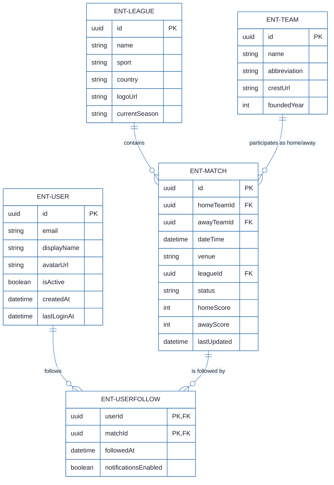
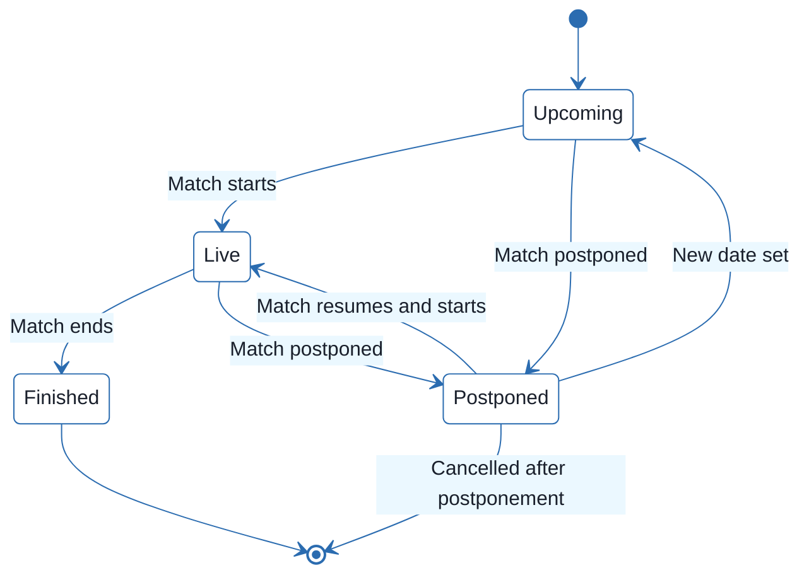
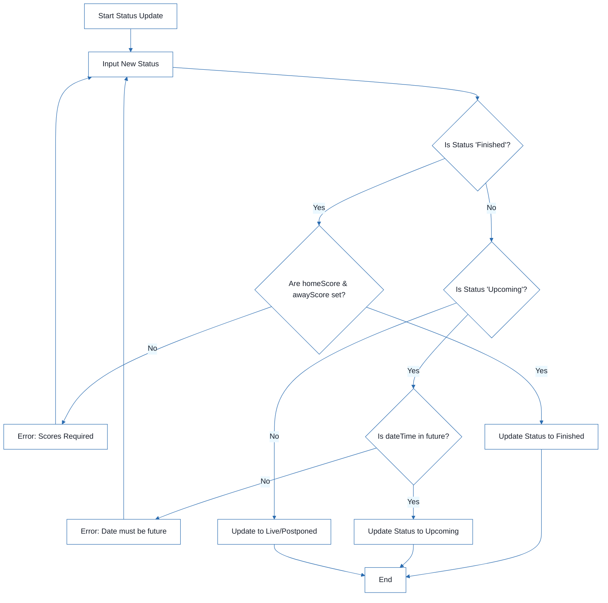

# Football Match Manager - Technical Specification & Architecture Document

## 1. Executive Summary & Architecture Overview

### 1.1 Executive Brief
The Football Match Manager is a data-centric system designed to orchestrate the lifecycle of football matches, managing the relational mapping between teams, leagues, and users. It implements a strict validation layer for match states and scoring, utilizing a many-to-many relationship for user match-following. The system focuses on data integrity and query performance via targeted indexing on high-traffic filter fields.

### 1.2 Maturity Assessment
The project is in a state of **REFINEMENT**. While the data model and validation rules are exhaustively defined, the specifications suffer from high-severity structural gaps, specifically the complete absence of business goals, objectives, and scope definitions. Furthermore, a technical uncertainty regarding the scope of team name uniqueness remains unresolved.

### 1.3 Technical Stack
*   **Primary Keys**: UUID (128-bit universally unique identifiers)
*   **Temporal Standard**: UTC (Coordinated Universal Time)
*   **Data Types**: DateTime, Enum, Boolean, Integer, String, URL

### 1.4 Architectural Constraints
*   **Match Integrity**: `homeTeamId` must not equal `awayTeamId`.
*   **Temporal Logic**: `dateTime` must be in the future for matches with 'upcoming' status.
*   **State-Based Validation**: `homeScore` and `awayScore` must be non-null when status is 'finished'.
*   **Value Constraints**: `homeScore` and `awayScore` minimum value: 0.
*   **Uniqueness**: Team names must be globally unique; User emails must be unique.
*   **Relational Constraints**: `UserFollow` requires a composite unique constraint on (`userId`, `matchId`).
*   **Field Limits**: 
    *   Team abbreviation: max 5 characters.
    *   Venue: max 200 characters.
    *   Team/League name: max 100 characters.
    *   User display name: max 50 characters.
    *   Team foundedYear: range 1800 to current year.

### 1.5 Critical Dependencies
*   **Foreign Key Dependencies**: `ENT-MATCH` depends on `ENT-LEAGUE` and `ENT-TEAM`.
*   **Relational Dependencies**: `ENT-USERFOLLOW` depends on `ENT-USER` and `ENT-MATCH`.
*   **Performance Dependencies**: 
    *   Index on (`leagueId`, `dateTime`) for match filtering.
    *   Index on (`email`) for User authentication.
    *   Index on (`userId`) and (`matchId`) for `UserFollow` relational queries.

## 2. Architecture Workflows

```mermaid
%%{init: {
  'theme': 'base',
  'themeVariables': {
    'primaryColor': '#1A365D',
    'primaryTextColor': '#1A202C',
    'primaryBorderColor': '#2B6CB0',
    'lineColor': '#2B6CB0',
    'secondaryColor': '#EBF8FF',
    'tertiaryColor': '#EBF8FF',
    'background': '#FFFFFF',
    'mainBkg': '#FFFFFF',
    'secondBkg': '#EBF8FF',
    'tertiaryBkg': '#F7FAFC',
    'secondaryTextColor': '#4A5568',
    'fontSize': '16px',
    'fontFamily': 'Inter, system-ui, sans-serif',
    'nodePadding': '15px',
    'borderRadius': '8px',
    'edgeLabelBackground': '#EBF8FF',
    'clusterBkg': '#F7FAFC',
    'clusterBorder': '#2B6CB0',
    'defaultLinkColor': '#2B6CB0',
    'titleColor': '#1A365D',
    'actorBorder': '#2B6CB0',
    'actorBkg': '#EBF8FF',
    'actorTextColor': '#1A365D',
    'actorLineColor': '#2B6CB0',
    'signalColor': '#2B6CB0',
    'signalTextColor': '#1A202C',
    'labelBoxBorderColor': '#2B6CB0',
    'labelBoxBkgColor': '#EBF8FF',
    'labelTextColor': '#1A202C',
    'loopTextColor': '#1A202C',
    'arrowHeadColor': '#2B6CB0',
    'sequenceNumberColor': '#1A365D',
    'sequenceActorBorder': '#2B6CB0',
    'sequenceActorBkg': '#EBF8FF',
    'sequenceArrowColor': '#2B6CB0',
    'noteBkgColor': '#FFF5EB',
    'noteBorderColor': '#DD6B20',
    'noteTextColor': '#1A202C'
  }
}}%%
flowchart TD
    subgraph "Validation Rules"
        RULE-MATCH-SAME-TEAM["RULE-MATCH-SAME-TEAM: No same team home/away"]
        RULE-MATCH-DATE-FUTURE["RULE-MATCH-DATE-FUTURE: Date must be future for upcoming"]
        RULE-MATCH-FINISH-SCORE["RULE-MATCH-FINISH-SCORE: Scores required for finished status"]
        RULE-TEAM-UNIQUE-NAME["RULE-TEAM-UNIQUE-NAME: Global unique team name"]
        RULE-USER-UNIQUE-EMAIL["RULE-USER-UNIQUE-EMAIL: Unique user email"]
        RULE-USERFOLLOW-UNIQUE["RULE-USERFOLLOW-UNIQUE: User follows match once"]
    end
    subgraph "Performance Indexes"
        PERF-IDX-MATCH-LEAGUE["PERF-IDX-MATCH-LEAGUE: leagueId + dateTime index"]
        PERF-IDX-USER-EMAIL["PERF-IDX-USER-EMAIL: email index"]
    end
    subgraph "Entities"
        ENT-MATCH["ENT-MATCH: Match Entity"]
        ENT-TEAM["ENT-TEAM: Team Entity"]
        ENT-USER["ENT-USER: User Entity"]
        ENT-USERFOLLOW["ENT-USERFOLLOW: UserFollow Entity"]
    end
    RULE-MATCH-SAME-TEAM --> ENT-MATCH
    RULE-MATCH-DATE-FUTURE --> ENT-MATCH
    RULE-MATCH-FINISH-SCORE --> ENT-MATCH
    PERF-IDX-MATCH-LEAGUE --> ENT-MATCH
    RULE-TEAM-UNIQUE-NAME --> ENT-TEAM
    RULE-USER-UNIQUE-EMAIL --> ENT-USER
    PERF-IDX-USER-EMAIL --> ENT-USER
    RULE-USERFOLLOW-UNIQUE --> ENT-USERFOLLOW
```







```mermaid
%%{init: {
  'theme': 'base',
  'themeVariables': {
    'primaryColor': '#1A365D',
    'primaryTextColor': '#1A202C',
    'primaryBorderColor': '#2B6CB0',
    'lineColor': '#2B6CB0',
    'secondaryColor': '#EBF8FF',
    'tertiaryColor': '#EBF8FF',
    'background': '#FFFFFF',
    'mainBkg': '#FFFFFF',
    'secondBkg': '#EBF8FF',
    'tertiaryBkg': '#F7FAFC',
    'secondaryTextColor': '#4A5568',
    'fontSize': '16px',
    'fontFamily': 'Inter, system-ui, sans-serif',
    'nodePadding': '15px',
    'borderRadius': '8px',
    'edgeLabelBackground': '#EBF8FF',
    'clusterBkg': '#F7FAFC',
    'clusterBorder': '#2B6CB0',
    'defaultLinkColor': '#2B6CB0',
    'titleColor': '#1A365D',
    'actorBorder': '#2B6CB0',
    'actorBkg': '#EBF8FF',
    'actorTextColor': '#1A365D',
    'actorLineColor': '#2B6CB0',
    'signalColor': '#2B6CB0',
    'signalTextColor': '#1A202C',
    'labelBoxBorderColor': '#2B6CB0',
    'labelBoxBkgColor': '#EBF8FF',
    'labelTextColor': '#1A202C',
    'loopTextColor': '#1A202C',
    'arrowHeadColor': '#2B6CB0',
    'sequenceNumberColor': '#1A365D',
    'sequenceActorBorder': '#2B6CB0',
    'sequenceActorBkg': '#EBF8FF',
    'sequenceArrowColor': '#2B6CB0',
    'noteBkgColor': '#FFF5EB',
    'noteBorderColor': '#DD6B20',
    'noteTextColor': '#1A202C'
  }
}}%%
flowchart TD
    START["Start Status Update"] --> INPUT["Input New Status"]
    INPUT --> DEC_STATUS{"Is Status 'Finished'?"}
    DEC_STATUS -- "Yes" --> VAL_SCORE{"Are homeScore & awayScore set?"}
    VAL_SCORE -- "No" --> ERR_SCORE["Error: Scores Required"]
    ERR_SCORE --> INPUT
    VAL_SCORE -- "Yes" --> UPDATE_FINISH["Update Status to Finished"]
    DEC_STATUS -- "No" --> DEC_UPCOMING{"Is Status 'Upcoming'?"}
    DEC_UPCOMING -- "Yes" --> VAL_DATE{"Is dateTime in future?"}
    VAL_DATE -- "No" --> ERR_DATE["Error: Date must be future"]
    ERR_DATE --> INPUT
    VAL_DATE -- "Yes" --> UPDATE_UPCOMING["Update Status to Upcoming"]
    DEC_UPCOMING -- "No" --> UPDATE_OTHER["Update to Live/Postponed"]
    UPDATE_FINISH --> END["End"]
    UPDATE_UPCOMING --> END
    UPDATE_OTHER --> END
``` & Visual Diagrams

### 2.1 Entity Relationship Diagram
```mermaid
%%{init: {
  'theme': 'base',
  'themeVariables': {
    'primaryColor': '#1A365D',
    'primaryTextColor': '#1A202C',
    'primaryBorderColor': '#2B6CB0',
    'lineColor': '#2B6CB0',
    'secondaryColor': '#EBF8FF',
    'tertiaryColor': '#EBF8FF',
    'background': '#FFFFFF',
    'mainBkg': '#FFFFFF',
    'secondBkg': '#EBF8FF',
    'tertiaryBkg': '#F7FAFC',
    'secondaryTextColor': '#4A5568',
    'fontSize': '16px',
    'fontFamily': 'Inter, system-ui, sans-serif',
    'nodePadding': '15px',
    'borderRadius': '8px',
    'edgeLabelBackground': '#EBF8FF',
    'clusterBkg': '#F7FAFC',
    'clusterBorder': '#2B6CB0',
    'defaultLinkColor': '#2B6CB0',
    'titleColor': '#1A365D',
    'actorBorder': '#2B6CB0',
    'actorBkg': '#EBF8FF',
    'actorTextColor': '#1A365D',
    'actorLineColor': '#2B6CB0',
    'signalColor': '#2B6CB0',
    'signalTextColor': '#1A202C',
    'labelBoxBorderColor': '#2B6CB0',
    'labelBoxBkgColor': '#EBF8FF',
    'labelTextColor': '#1A202C',
    'loopTextColor': '#1A202C',
    'arrowHeadColor': '#2B6CB0',
    'sequenceNumberColor': '#1A365D',
    'sequenceActorBorder': '#2B6CB0',
    'sequenceActorBkg': '#EBF8FF',
    'sequenceArrowColor': '#2B6CB0',
    'noteBkgColor': '#FFF5EB',
    'noteBorderColor': '#DD6B20',
    'noteTextColor': '#1A202C'
  }
}}%%
erDiagram
    ENT-LEAGUE ||--o{ ENT-MATCH : "contains"
    ENT-TEAM ||--o{ ENT-MATCH : "participates as home/away"
    ENT-USER ||--o{ ENT-USERFOLLOW : "follows"
    ENT-MATCH ||--o{ ENT-USERFOLLOW : "is followed by"
    ENT-LEAGUE {
        uuid id PK
        string name
        string sport
        string country
        string logoUrl
        string currentSeason
    }
    ENT-MATCH {
        uuid id PK
        uuid homeTeamId FK
        uuid awayTeamId FK
        datetime dateTime
        string venue
        uuid leagueId FK
        string status
        int homeScore
        int awayScore
        datetime lastUpdated
    }
    ENT-TEAM {
        uuid id PK
        string name
        string abbreviation
        string crestUrl
        int foundedYear
    }
    ENT-USER {
        uuid id PK
        string email
        string displayName
        string avatarUrl
        boolean isActive
        datetime createdAt
        datetime lastLoginAt
    }
    ENT-USERFOLLOW {
        uuid userId PK,FK
        uuid matchId PK,FK
        datetime followedAt
        boolean notificationsEnabled
    }
```

### 2.2 Match State Lifecycle


### 2.3 Data Validation & Performance Traceability


### 2.4 Match Status Update Workflow


## 3. Detailed Technical Specifications & Business Rules

### 3.1 Requirements Traceability
| ID | Type | Description | Source Section |
| :--- | :--- | :--- | :--- |
| **ENT-MATCH** | Entity | Football match entity containing details like teams, league, date, and score. | Match |
| **ENT-TEAM** | Entity | Football team entity including name, abbreviation, and crest. | Team |
| **ENT-LEAGUE** | Entity | League or tournament entity. | League |
| **ENT-USER** | Entity | Application user entity. | User |
| **ENT-USERFOLLOW** | Entity | Join entity representing the relationship between a User and a Match. | UserFollow |
| **RULE-MATCH-SAME-TEAM** | Constraint | A match cannot have the same team as both home and away. | Validation Rules |
| **RULE-MATCH-DATE-FUTURE** | Constraint | Match dateTime must be in the future for status 'upcoming'. | Validation Rules |
| **RULE-MATCH-FINISH-SCORE** | Constraint | When status changes to 'finished', both homeScore and awayScore must be set (non-null). | Validation Rules |
| **RULE-SCORE-NON-NEGATIVE** | Constraint | Scores cannot be negative. | Validation Rules |
| **RULE-TEAM-UNIQUE-NAME** | Constraint | Team name must be unique across all teams globally. | Validation Rules |
| **RULE-USER-UNIQUE-EMAIL** | Constraint | User email must be unique. | Validation Rules |
| **RULE-USERFOLLOW-UNIQUE** | Constraint | A user can only follow a match once (Composite unique constraint on userId, matchId). | Validation Rules |
| **PERF-IDX-MATCH-LEAGUE** | NFR | Index on (leagueId, dateTime) for filtering by league and date. | Indexes (for performance) |
| **PERF-IDX-USER-EMAIL** | NFR | Index on (email) for authentication. | Indexes (for performance) |

### 3.2 Security Rules
*   **Authentication**: User email must be unique (`RULE-USER-UNIQUE-EMAIL`).
*   **Credential Integrity**: Password complexity requirements (min 8 chars) must be enforced.
*   **Access Control**: User account status is managed via the `isActive` boolean flag.

### 3.3 Data Models

#### ENT-MATCH
| Field | Type | Description | Validation |
| :--- | :--- | :--- | :--- |
| id | UUID | Unique identifier | Required, unique |
| homeTeamId | UUID | Reference to Team | Required, exists |
| awayTeamId | UUID | Reference to Team | Required, exists, != homeTeamId |
| dateTime | DateTime | Match date and time (UTC) | Required, future if 'upcoming' |
| venue | String (200) | Stadium or location name | Optional |
| leagueId | UUID | Reference to League | Required, exists |
| status | Enum | upcoming, live, finished, postponed, cancelled | Required, default: upcoming |
| homeScore | Integer | Goals scored by home team | Optional, min 0, default null |
| awayScore | Integer | Goals scored by away team | Optional, min 0, default null |
| lastUpdated | DateTime | Timestamp of last update | Auto-set on update |

#### ENT-TEAM
| Field | Type | Description | Validation |
| :--- | :--- | :--- | :--- |
| id | UUID | Unique identifier | Required, unique |
| name | String (100) | Team name | Required, globally unique |
| abbreviation | String (5) | Team abbreviation | Optional, unique per league |
| crestUrl | URL | URL to team crest/logo | Optional, valid URL |
| foundedYear | Integer | Year the club was founded | Optional, 1800 <= year <= current |

#### ENT-LEAGUE
| Field | Type | Description | Validation |
| :--- | :--- | :--- | :--- |
| id | UUID | Unique identifier | Required, unique |
| name | String (100) | League name | Required |
| sport | String | Sport type | Required, default: "football" |
| country | String (100) | Country where league is based | Optional |
| logoUrl | URL | URL to league logo | Optional, valid URL |
| currentSeason | String | Current season identifier | Optional |

#### ENT-USER
| Field | Type | Description | Validation |
| :--- | :--- | :--- | :--- |
| id | UUID | Unique identifier | Required, unique |
| email | String (email) | User email address | Required, unique, valid format |
| displayName | String (50) | Display name for the user | Required |
| avatarUrl | URL | URL to user avatar/image | Optional, valid URL |
| isActive | Boolean | Whether the user account is active | Required, default: true |
| createdAt | DateTime | Account creation timestamp | Auto-set on create |
| lastLoginAt | DateTime | Last login timestamp | Updated on login |

#### ENT-USERFOLLOW
| Field | Type | Description | Validation |
| :--- | :--- | :--- | :--- |
| userId | UUID | Reference to User | Required, exists |
| matchId | UUID | Reference to Match | Required, exists |
| followedAt | DateTime | Timestamp of follow action | Required, auto-set on create |
| notificationsEnabled | Boolean | Notification preference | Optional, default: false |

## 4. Project Governance & Structural Gaps

### 4.1 Structural Gaps
| Gap | Priority | Remediation Advice |
| :--- | :--- | :--- |
| **Goals & Objectives** | HIGH | The document describes 'How' the data is structured but not 'Why' or what the business objectives are. |
| **Scope & Out-of-Scope** | MEDIUM | Define what the football manager system will and will not handle (e.g., player stats, transfers). |
| **Open Questions** | LOW | Clarify the uncertainty mentioned in 'Team Validation' regarding global vs league uniqueness. |

### 4.2 Remediation & Workflow
1.  **Business Alignment**: Conduct a stakeholder interview to define the "Why" (Goals & Objectives).
2.  **Scope Definition**: Explicitly list excluded features (e.g., "No player-level statistics") to prevent scope creep.
3.  **Technical Decision**: Resolve the `RULE-TEAM-UNIQUE-NAME` ambiguity (Global vs League scope) and update the data model accordingly.

## 5. Technical & Domain Glossary (Terminology Reference)

| Term | Category | Context Anchor | Project Definition |
| :--- | :--- | :--- | :--- |
| Constraints | TECHNICAL_STACK | RULE-USERFOLLOW-UNIQUE | The set of composite uniqueness requirements and logical limitations applied to data persistence to ensure integrity. |
| Cryptographic Hashing | TECHNICAL_STACK | RULE-USER-UNIQUE-EMAIL | The implied security mechanism for storing sensitive credentials to meet the mentioned complexity requirements. |
| DateTime | TECHNICAL_STACK | ENT-MATCH | A temporal data type used for scheduling events and tracking system audit stamps. |
| MUN | BUSINESS_DOMAIN | ENT-TEAM | A specific example of a short-form identifier assigned to a sports club. |
| Match Validation | BUSINESS_DOMAIN | Validation Rules | The logical checks ensuring teams are distinct, dates are future-dated for upcoming states, and scores are present upon completion. |
| Relationships | TECHNICAL_STACK | ENT-MATCH | The associative links between entities, such as the foreign key dependencies between competitions, teams, and schedules. |
| Team Validation | BUSINESS_DOMAIN | RULE-TEAM-UNIQUE-NAME | The requirement that club names must remain globally distinct within the database. |
| UTC | TECHNICAL_STACK | ENT-MATCH | The standardized time reference used to eliminate offset ambiguity for global event scheduling. |
| UUID | TECHNICAL_STACK | ENT-MATCH | A 128-bit universally unique identifier used as the primary key for all main entities. |
| User Validation | BUSINESS_DOMAIN | RULE-USER-UNIQUE-EMAIL | The verification process ensuring electronic mail addresses are unique and credentials meet minimum character lengths. |
| UserFollow | BUSINESS_DOMAIN | ENT-USERFOLLOW | A join entity linking a person to a specific sporting event they wish to monitor. |
| UserFollow Validation | BUSINESS_DOMAIN | RULE-USERFOLLOW-UNIQUE | The logic preventing a single person from creating multiple subscriptions to the same sporting event. |