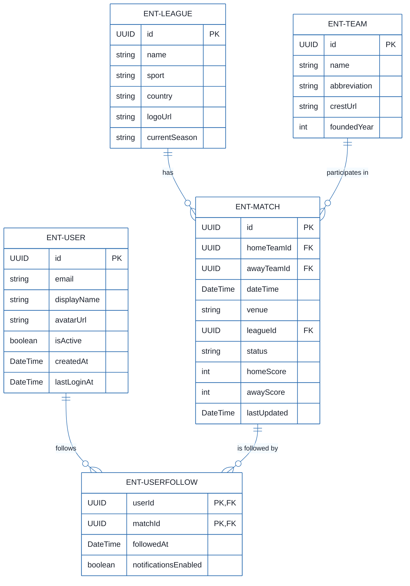
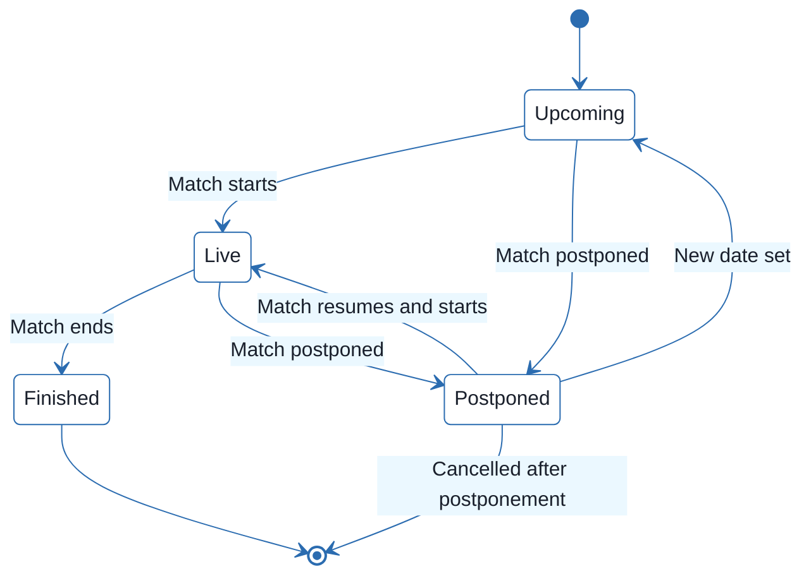
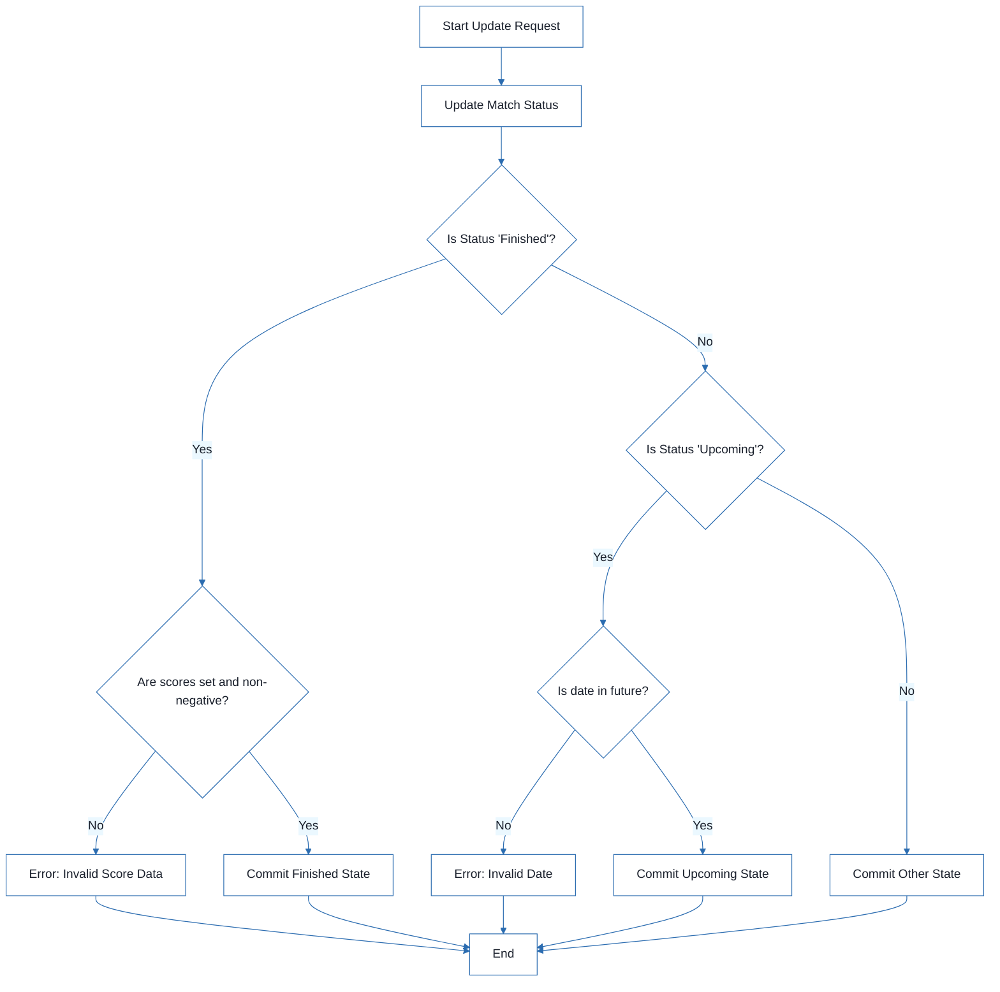

# Football Match Manager - Technical Specification & Architecture Document

## 1. Executive Summary & Architecture Overview

### 1.1 Executive Brief
The Football Match Manager is a structured data model designed to orchestrate the lifecycle of football matches, team management, and user tracking. It implements a relational pattern managing entities from Leagues down to User-Match follow relationships, ensuring strict data integrity through state-dependent validation rules for match statuses and scoring.

### 1.2 Maturity Assessment
The specification provides a high-fidelity data schema with exhaustive validation rules, yet it remains in REFINEMENT status. While the technical completeness score is high, critical structural gaps exist: the lack of defined high-level Goals & Objectives and a clear Scope boundary creates ambiguity regarding the system's business purpose and the exclusion of player/referee statistics.

### 1.3 Technical Stack
*   **Identifiers**: UUID (128-bit unique identifiers)
*   **Temporal Standard**: UTC (Coordinated Universal Time)
*   **Data Types**: DateTime, Enum, String, Integer, Boolean

### 1.4 Architectural Constraints
*   **Entity Integrity**: Match `homeTeamId` must not equal `awayTeamId`.
*   **Temporal Logic**: Match `dateTime` must be in the future when status is 'upcoming'.
*   **State-Based Validation**: `homeScore` and `awayScore` must be non-null and >= 0 when status is 'finished'.
*   **Uniqueness**: Team names must be globally unique; User emails must be unique.
*   **Relational Constraints**: `UserFollow` must satisfy a composite unique constraint on (`userId`, `matchId`).
*   **Domain Limits**: Team `foundedYear` must be between 1800 and the current year.
*   **Field Constraints**: 
    *   Venue: max 200 chars.
    *   Team name: max 100 chars.
    *   Team abbreviation: max 5 chars.
    *   Display name: max 50 chars.
*   **State Machine**: Match status is restricted to the Enum: `upcoming`, `live`, `finished`, `postponed`, `cancelled`.

### 1.5 Critical Dependencies
*   **Foreign Key Dependencies**: 
    *   `ENT-MATCH` depends on `ENT-LEAGUE` (`leagueId`) and `ENT-TEAM` (`homeTeamId`, `awayTeamId`).
    *   `ENT-USERFOLLOW` depends on `ENT-USER` (`userId`) and `ENT-MATCH` (`matchId`).
*   **Performance Index Requirements**:
    *   `ENT-MATCH`: Index on (`leagueId`, `dateTime`) and (`status`).
    *   `ENT-TEAM`: Index on (`name`).
    *   `ENT-USER`: Index on (`email`).
    *   `ENT-USERFOLLOW`: Index on (`userId`) and (`matchId`).

## 2. Architecture Workflows

```mermaid
%%{init: {
  'theme': 'base',
  'themeVariables': {
    'primaryColor': '#1A365D',
    'primaryTextColor': '#1A202C',
    'primaryBorderColor': '#2B6CB0',
    'lineColor': '#2B6CB0',
    'secondaryColor': '#EBF8FF',
    'tertiaryColor': '#EBF8FF',
    'background': '#FFFFFF',
    'mainBkg': '#FFFFFF',
    'secondBkg': '#EBF8FF',
    'tertiaryBkg': '#F7FAFC',
    'secondaryTextColor': '#4A5568',
    'fontSize': '16px',
    'fontFamily': 'Inter, system-ui, sans-serif',
    'nodePadding': '15px',
    'borderRadius': '8px',
    'edgeLabelBackground': '#EBF8FF',
    'clusterBkg': '#F7FAFC',
    'clusterBorder': '#2B6CB0',
    'defaultLinkColor': '#2B6CB0',
    'titleColor': '#1A365D',
    'actorBorder': '#2B6CB0',
    'actorBkg': '#EBF8FF',
    'actorTextColor': '#1A365D',
    'actorLineColor': '#2B6CB0',
    'signalColor': '#2B6CB0',
    'signalTextColor': '#1A202C',
    'labelBoxBorderColor': '#2B6CB0',
    'labelBoxBkgColor': '#EBF8FF',
    'labelTextColor': '#1A202C',
    'loopTextColor': '#1A202C',
    'arrowHeadColor': '#2B6CB0',
    'sequenceNumberColor': '#1A365D',
    'sequenceActorBorder': '#2B6CB0',
    'sequenceActorBkg': '#EBF8FF',
    'sequenceArrowColor': '#2B6CB0',
    'noteBkgColor': '#FFF5EB',
    'noteBorderColor': '#DD6B20',
    'noteTextColor': '#1A202C'
  }
}}%%
flowchart TD
    subgraph "Validation & Constraints"
        CON-MATCH-TEAMS["CON-MATCH-TEAMS: No same team home/away"]
        REQ-MATCH-DATE["REQ-MATCH-DATE: Future date for upcoming"]
        REQ-MATCH-SCORE["REQ-MATCH-SCORE: Scores required for finished"]
        CON-TEAM-UNIQUE["CON-TEAM-UNIQUE: Global unique team name"]
        CON-USER-EMAIL["CON-USER-EMAIL: Unique user email"]
        CON-FOLLOW-UNIQUE["CON-FOLLOW-UNIQUE: Unique user-match pair"]
        NFR-INDEX-MATCH["NFR-INDEX-MATCH: Match filtering performance"]
    end
    subgraph "Core Entities"
        ENT-MATCH["ENT-MATCH: Match Entity"]
        ENT-TEAM["ENT-TEAM: Team Entity"]
        ENT-USER["ENT-USER: User Entity"]
        ENT-USERFOLLOW["ENT-USERFOLLOW: UserFollow Entity"]
    end
    CON-MATCH-TEAMS -->|"relates_to"| ENT-MATCH
    REQ-MATCH-DATE -->|"relates_to"| ENT-MATCH
    REQ-MATCH-SCORE -->|"relates_to"| ENT-MATCH
    NFR-INDEX-MATCH -->|"relates_to"| ENT-MATCH
    CON-TEAM-UNIQUE -->|"relates_to"| ENT-TEAM
    CON-USER-EMAIL -->|"relates_to"| ENT-USER
    CON-FOLLOW-UNIQUE -->|"relates_to"| ENT-USERFOLLOW
```







```mermaid
%%{init: {
  'theme': 'base',
  'themeVariables': {
    'primaryColor': '#1A365D',
    'primaryTextColor': '#1A202C',
    'primaryBorderColor': '#2B6CB0',
    'lineColor': '#2B6CB0',
    'secondaryColor': '#EBF8FF',
    'tertiaryColor': '#EBF8FF',
    'background': '#FFFFFF',
    'mainBkg': '#FFFFFF',
    'secondBkg': '#EBF8FF',
    'tertiaryBkg': '#F7FAFC',
    'secondaryTextColor': '#4A5568',
    'fontSize': '16px',
    'fontFamily': 'Inter, system-ui, sans-serif',
    'nodePadding': '15px',
    'borderRadius': '8px',
    'edgeLabelBackground': '#EBF8FF',
    'clusterBkg': '#F7FAFC',
    'clusterBorder': '#2B6CB0',
    'defaultLinkColor': '#2B6CB0',
    'titleColor': '#1A365D',
    'actorBorder': '#2B6CB0',
    'actorBkg': '#EBF8FF',
    'actorTextColor': '#1A365D',
    'actorLineColor': '#2B6CB0',
    'signalColor': '#2B6CB0',
    'signalTextColor': '#1A202C',
    'labelBoxBorderColor': '#2B6CB0',
    'labelBoxBkgColor': '#EBF8FF',
    'labelTextColor': '#1A202C',
    'loopTextColor': '#1A202C',
    'arrowHeadColor': '#2B6CB0',
    'sequenceNumberColor': '#1A365D',
    'sequenceActorBorder': '#2B6CB0',
    'sequenceActorBkg': '#EBF8FF',
    'sequenceArrowColor': '#2B6CB0',
    'noteBkgColor': '#FFF5EB',
    'noteBorderColor': '#DD6B20',
    'noteTextColor': '#1A202C'
  }
}}%%
flowchart TD
    START["Start Update Request"] --> ACT1["Update Match Status"]
    ACT1 --> DEC1{"Is Status 'Finished'?"}
    DEC1 -- "Yes" --> DEC2{"Are scores set and non-negative?"}
    DEC2 -- "No" --> ERR1["Error: Invalid Score Data"]
    ERR1 --> END["End"]
    DEC2 -- "Yes" --> ACT2["Commit Finished State"]
    DEC1 -- "No" --> DEC3{"Is Status 'Upcoming'?"}
    DEC3 -- "Yes" --> DEC4{"Is date in future?"}
    DEC4 -- "No" --> ERR2["Error: Invalid Date"]
    ERR2 --> END
    DEC4 -- "Yes" --> ACT3["Commit Upcoming State"]
    DEC3 -- "No" --> ACT4["Commit Other State"]
    ACT2 --> END
    ACT3 --> END
    ACT4 --> END
``` & Visual Diagrams

### 2.1 Entity Relationship Diagram
```mermaid
%%{init: {
  'theme': 'base',
  'themeVariables': {
    'primaryColor': '#1A365D',
    'primaryTextColor': '#1A202C',
    'primaryBorderColor': '#2B6CB0',
    'lineColor': '#2B6CB0',
    'secondaryColor': '#EBF8FF',
    'tertiaryColor': '#EBF8FF',
    'background': '#FFFFFF',
    'mainBkg': '#FFFFFF',
    'secondBkg': '#EBF8FF',
    'tertiaryBkg': '#F7FAFC',
    'secondaryTextColor': '#4A5568',
    'fontSize': '16px',
    'fontFamily': 'Inter, system-ui, sans-serif',
    'nodePadding': '15px',
    'borderRadius': '8px',
    'edgeLabelBackground': '#EBF8FF',
    'clusterBkg': '#F7FAFC',
    'clusterBorder': '#2B6CB0',
    'defaultLinkColor': '#2B6CB0',
    'titleColor': '#1A365D',
    'actorBorder': '#2B6CB0',
    'actorBkg': '#EBF8FF',
    'actorTextColor': '#1A365D',
    'actorLineColor': '#2B6CB0',
    'signalColor': '#2B6CB0',
    'signalTextColor': '#1A202C',
    'labelBoxBorderColor': '#2B6CB0',
    'labelBoxBkgColor': '#EBF8FF',
    'labelTextColor': '#1A202C',
    'loopTextColor': '#1A202C',
    'arrowHeadColor': '#2B6CB0',
    'sequenceNumberColor': '#1A365D',
    'sequenceActorBorder': '#2B6CB0',
    'sequenceActorBkg': '#EBF8FF',
    'sequenceArrowColor': '#2B6CB0',
    'noteBkgColor': '#FFF5EB',
    'noteBorderColor': '#DD6B20',
    'noteTextColor': '#1A202C'
  }
}}%%
erDiagram
    ENT-LEAGUE ||--o{ ENT-MATCH : "has"
    ENT-TEAM ||--o{ ENT-MATCH : "participates in"
    ENT-USER ||--o{ ENT-USERFOLLOW : "follows"
    ENT-MATCH ||--o{ ENT-USERFOLLOW : "is followed by"
    ENT-LEAGUE {
        UUID id PK
        string name
        string sport
        string country
        string logoUrl
        string currentSeason
    }
    ENT-MATCH {
        UUID id PK
        UUID homeTeamId FK
        UUID awayTeamId FK
        DateTime dateTime
        string venue
        UUID leagueId FK
        string status
        int homeScore
        int awayScore
        DateTime lastUpdated
    }
    ENT-TEAM {
        UUID id PK
        string name
        string abbreviation
        string crestUrl
        int foundedYear
    }
    ENT-USER {
        UUID id PK
        string email
        string displayName
        string avatarUrl
        boolean isActive
        DateTime createdAt
        DateTime lastLoginAt
    }
    ENT-USERFOLLOW {
        UUID userId PK, FK
        UUID matchId PK, FK
        DateTime followedAt
        boolean notificationsEnabled
    }
```

### 2.2 Match State Lifecycle


### 2.3 Match Update Workflow


## 3. Detailed Technical Specifications & Business Rules

### 3.1 Requirements Traceability
| Identifier | Type | Description | Target Entity |
| :--- | :--- | :--- | :--- |
| ENT-MATCH | Entity | Match entity: represents a football match with teams, league, date, and score. | N/A |
| ENT-TEAM | Entity | Team entity: represents a football team with name, abbreviation, and crest. | N/A |
| ENT-LEAGUE | Entity | League entity: represents a football league or tournament. | N/A |
| ENT-USER | Entity | User entity: represents an application user. | N/A |
| ENT-USERFOLLOW | Entity | UserFollow entity: junction entity between User and Match. | N/A |
| CON-MATCH-TEAMS | Constraint | A match cannot have the same team as both home and away. | ENT-MATCH |
| REQ-MATCH-DATE | Functional | Match dateTime must be in the future for status 'upcoming'. | ENT-MATCH |
| REQ-MATCH-SCORE | Functional | When status changes to 'finished', both homeScore and awayScore must be set (non-null) and cannot be negative. | ENT-MATCH |
| CON-TEAM-UNIQUE | Constraint | Team name must be unique globally. | ENT-TEAM |
| CON-USER-EMAIL | Constraint | User email must be unique. | ENT-USER |
| CON-FOLLOW-UNIQUE | Constraint | Composite unique constraint on (userId, matchId) - a user can follow a match only once. | ENT-USERFOLLOW |
| NFR-INDEX-MATCH | Non-Functional | Index on (leagueId, dateTime) and (status) for Match filtering performance. | ENT-MATCH |

### 3.2 Security Rules
*   **Account Integrity**: User email must be unique (`CON-USER-EMAIL`).
*   **Credential Security**: Password complexity requirements (min 8 chars) are mandated for authentication.
*   **Data Access**: User account status is managed via the `isActive` boolean flag.

### 3.3 Data Models

#### ENT-MATCH
| Field | Type | Description | Validation |
| :--- | :--- | :--- | :--- |
| id | UUID | Unique identifier | Required, unique |
| homeTeamId | UUID | Reference to Team | Required, exists |
| awayTeamId | UUID | Reference to Team | Required, exists, != homeTeamId |
| dateTime | DateTime | Match date and time (UTC) | Required, future if 'upcoming' |
| venue | String (200) | Stadium or location name | Optional |
| leagueId | UUID | Reference to League | Required, exists |
| status | Enum | Match status | Required, default: upcoming |
| homeScore | Integer | Goals scored by home team | Optional, min 0, default null |
| awayScore | Integer | Goals scored by away team | Optional, min 0, default null |
| lastUpdated | DateTime | Timestamp of last update | Auto-set on update |

#### ENT-TEAM
| Field | Type | Description | Validation |
| :--- | :--- | :--- | :--- |
| id | UUID | Unique identifier | Required, unique |
| name | String (100) | Team name | Required, globally unique |
| abbreviation | String (5) | Team abbreviation | Optional, unique per league |
| crestUrl | URL | URL to team crest/logo | Optional, valid URL |
| foundedYear | Integer | Year the club was founded | Optional, 1800 <= year <= current |

#### ENT-LEAGUE
| Field | Type | Description | Validation |
| :--- | :--- | :--- | :--- |
| id | UUID | Unique identifier | Required, unique |
| name | String (100) | League name | Required |
| sport | String | Sport type | Required, default: "football" |
| country | String (100) | Country where league is based | Optional |
| logoUrl | URL | URL to league logo | Optional, valid URL |
| currentSeason | String | Current season identifier | Optional |

#### ENT-USER
| Field | Type | Description | Validation |
| :--- | :--- | :--- | :--- |
| id | UUID | Unique identifier | Required, unique |
| email | String (email) | User email address | Required, unique, valid format |
| displayName | String (50) | Display name for the user | Required |
| avatarUrl | URL | URL to user avatar/image | Optional, valid URL |
| isActive | Boolean | Whether the user account is active | Required, default: true |
| createdAt | DateTime | Account creation timestamp | Auto-set on create |
| lastLoginAt | DateTime | Last login timestamp | Updated on login |

#### ENT-USERFOLLOW
| Field | Type | Description | Validation |
| :--- | :--- | :--- | :--- |
| userId | UUID | Reference to User | Required, exists |
| matchId | UUID | Reference to Match | Required, exists |
| followedAt | DateTime | Timestamp of follow | Required, auto-set on create |
| notificationsEnabled | Boolean | Notification preference | Optional, default: false |

## 4. Project Governance & Structural Gaps

### 4.1 Structural Gaps
| Missing Section | Priority | Remediation Advice |
| :--- | :--- | :--- |
| Goals & Objectives | HIGH | Define the high-level purpose of the data model and what business goals it serves. |
| Scope & Out-of-Scope | MEDIUM | Clarify which football-related data is explicitly excluded (e.g., player stats, referee data). |
| Open Questions & Uncertainties | LOW | List unknowns, such as the exact password complexity requirements mentioned in the text. |

### 4.2 Remediation & Workflow
The project is currently in the **REFINEMENT** phase. To move to a "Ready for Implementation" state, the project lead must address the high-priority gaps by defining the business objectives and establishing a clear boundary of scope to prevent feature creep (specifically regarding player/referee statistics).

## 5. Technical & Domain Glossary (Terminology Reference)

| Term | Category | Context Anchor | Project Definition |
| :--- | :--- | :--- | :--- |
| Constraints | TECHNICAL_STACK | CON-FOLLOW-UNIQUE | Logical invariants enforced at the persistence layer to maintain data integrity, such as composite uniqueness requirements. |
| Cryptographic Hashing | TECHNICAL_STACK | CON-USER-EMAIL | The required transformation process for securing sensitive credentials before storage, implied by the complexity requirements for account access. |
| DateTime | TECHNICAL_STACK | ENT-MATCH | Temporal data type used to capture specific chronological points, including event schedules and system audit timestamps. |
| MUN | BUSINESS_DOMAIN | ENT-TEAM | An example of a short-form alphabetic representation of a professional club's identity. |
| Match Validation | BUSINESS_DOMAIN | Validation Rules | The set of operational checks ensuring a sporting event has distinct opposing sides and logically consistent timing and scoring states. |
| Relationships | TECHNICAL_STACK | ENT-MATCH | The structural associations and dependencies between different data entities, such as foreign key linkages. |
| Team Validation | BUSINESS_DOMAIN | CON-TEAM-UNIQUE | The verification process ensuring that professional club identifiers remain globally distinct within the registry. |
| UTC | TECHNICAL_STACK | ENT-MATCH | The standardized time offset used to ensure temporal consistency across different geographical zones. |
| UUID | TECHNICAL_STACK | ENT-MATCH | A 128-bit numerically unique identifier used as a primary key for entity disambiguation. |
| User Validation | BUSINESS_DOMAIN | CON-USER-EMAIL | The integrity checks applied to account data, including the verification of unique electronic mail addresses and secret credential strength. |
| UserFollow | BUSINESS_DOMAIN | ENT-USERFOLLOW | The association entity representing a subscription link between an account holder and a specific sporting event. |
| UserFollow Validation | BUSINESS_DOMAIN | CON-FOLLOW-UNIQUE | The rule preventing duplicate subscription entries for the same account and event pair. |