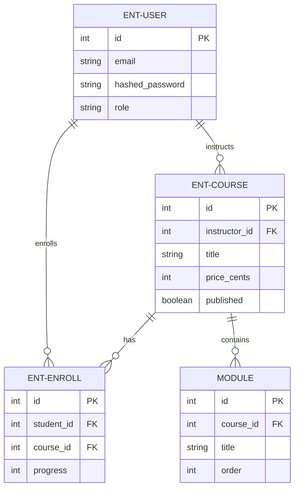
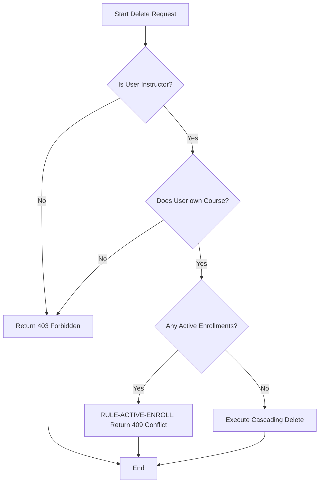
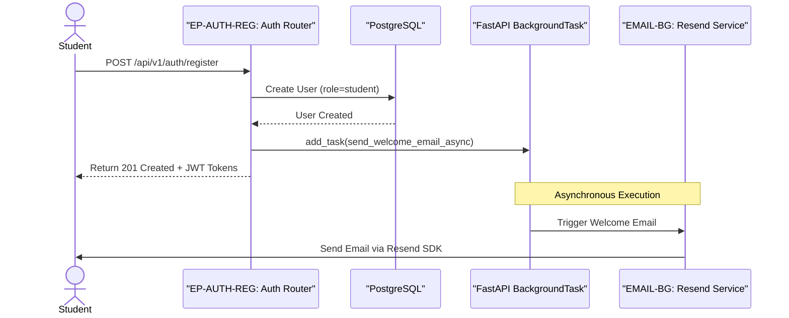
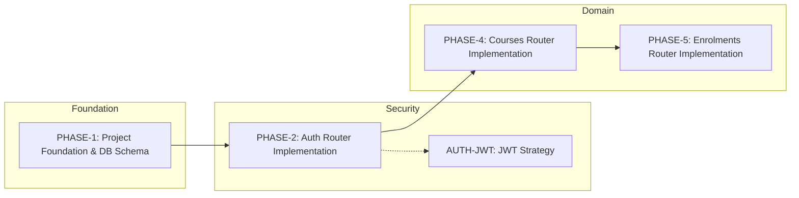

# CourseHub API - Technical Specification & Architecture Document

## 1. Executive Summary & Architecture Overview

### 1.1 Executive Brief
CourseHub API is a RESTful course management system built with FastAPI and PostgreSQL. It implements a strict Role-Based Access Control (RBAC) model distinguishing between Students and Instructors, utilizing a stateless JWT and Refresh Token authentication flow. The architecture leverages an asynchronous data pattern via SQLAlchemy 2.0 to handle course lifecycles, student enrollments, and asynchronous email notifications via Resend.

### 1.2 Maturity Assessment
The specifications are comprehensive and logically sequenced, with a clear dependency chain from infrastructure to verification. While the structure is highly complete, the presence of unresolved uncertainties regarding refresh token revocation and module reordering indicates that the project is in a REFINEMENT state. The overall architectural integrity is strong, provided these two edge cases are addressed before final production hardening.

### 1.3 Technical Stack
* **Languages & Frameworks**: FastAPI, SQLAlchemy 2.0, Pydantic v2
* **Database & Drivers**: PostgreSQL, asyncpg
* **Migration Tool**: Alembic
* **Testing**: pytest, pytest-asyncio, pytest-cov, httpx
* **Security**: python-jose, passlib, python-multipart
* **External Services**: Resend SDK

### 1.4 Architectural Constraints
* **Concurrency**: All database interactions must use `AsyncSession` to prevent blocking.
* **Email Delivery**: Resend calls must be executed via FastAPI `BackgroundTask` to avoid blocking registration responses.
* **Course Deletion**: Return 409 Conflict if active enrollments exist (`RULE-ACTIVE-ENROLL`).
* **Enrollment Validation**: Progress must be an integer strictly between 0 and 100 inclusive.
* **Data Isolation**: Students can only access and update their own enrollments.
* **Ownership Control**: Instructors can only manage/update courses they own.
* **Test Coverage**: Target >= 80% on business logic via `pytest-cov`.

### 1.5 Critical Dependencies
* `RESEND_API_KEY` environment variable for email service integration.
* PostgreSQL instance with `asyncpg` driver support.
* Strict foreign key dependence: `ENT-ENROLL` depends on `ENT-USER` and `ENT-COURSE`.
* Cascading deletion: Modules are automatically deleted upon Course deletion.
* Unique composite constraint: `(student_id, course_id)` within the Enrollment table.
* Role-based dependency: `get_current_instructor` and `get_current_student` gates for endpoint access.

## 2. Architecture Workflows & Visual Diagrams

### 2.1 CourseHub Data Model

### 2.2 Course Deletion Workflow

### 2.3 User Registration & Email Sequence

### 2.4 Implementation Phase Traceability

## 3. Detailed Technical Specifications & Business Rules

### 3.1 Requirements Traceability
| Identifier | Component | Description | Source/Phase |
| :--- | :--- | :--- | :--- |
| **ASYNC-SQLA** | Architecture | Use async SQLAlchemy 2.0 and asyncpg for all database interactions. | Decisions |
| **ENT-USER** | Data Model | User entity: email, hashed_password, role (student\|instructor). | PHASE-1 |
| **ENT-COURSE** | Data Model | Course entity: instructor_id (FK), title, price_cents, published. | PHASE-1 |
| **ENT-ENROLL** | Data Model | Enrollment entity: student_id (FK), course_id (FK), progress (0-100). | PHASE-1 |
| **AUTH-JWT** | Security | JWT + Refresh Token flow for RBAC (Role-Based Access Control). | Decisions |
| **EP-AUTH-REG** | Endpoint | `POST /api/v1/auth/register`: Register student and issue tokens. | PHASE-2 |
| **EP-COURSE-DEL** | Endpoint | `DELETE /api/v1/courses/{course_id}`: Delete course with ownership check. | PHASE-4 |
| **RULE-ACTIVE-ENROLL** | Business Rule | ActiveEnrollmentConstraint: Prevent course deletion (409 Conflict) if active enrollments exist. | PHASE-4 |
| **EMAIL-BG** | Architecture | Resend email integration via FastAPI BackgroundTask to avoid blocking. | PHASE-3 |
| **PHASE-1** | Milestone | Project Foundation & Database Schema. | PHASE-1 |
| **PHASE-2** | Milestone | Auth Router Implementation. | PHASE-2 |
| **PHASE-4** | Milestone | Courses Router Implementation. | PHASE-4 |
| **PHASE-5** | Milestone | Enrolments Router Implementation. | PHASE-5 |

### 3.2 Security Rules
* **RBAC Implementation**: Access is gated by `get_current_instructor` and `get_current_student` dependencies.
* **Token Strategy**: Stateless JWT for access tokens (15 min expiry) and Refresh Tokens (7 days expiry).
* **Password Safety**: One-way cryptographic hashing using `passlib` before storage.
* **Ownership Verification**: `verify_course_ownership` service ensures instructors can only modify their own courses.

### 3.3 Data Models
* **User**: `id`, `email`, `hashed_password`, `display_name`, `role` ("student" | "instructor"), `created_at`.
* **Course**: `id`, `instructor_id` (FK $\rightarrow$ User), `title`, `description`, `price_cents`, `published`, `created_at`, `updated_at`.
* **Module**: `id`, `course_id` (FK $\rightarrow$ Course), `title`, `order`, `created_at`.
* **Enrollment**: `id`, `student_id` (FK $\rightarrow$ User), `course_id` (FK $\rightarrow$ Course), `progress` (0-100), `completed_at`, `created_at`, `updated_at`.
  * *Constraint*: Unique composite key on `(student_id, course_id)`.

## 4. Project Governance & Structural Gaps

### 4.1 Structural Gaps
* **Refresh Token Revocation**: Current design stores refresh tokens in JWT; no server-side revocation mechanism is implemented.
* **Module Reordering**: Module ordering is enforced at creation, but no endpoint exists for bulk reordering post-creation.

### 4.2 Remediation & Workflow
* **Revocation**: Consider persisting refresh tokens in a dedicated `RefreshToken` table to allow administrative or user-driven revocation.
* **Reordering**: Implement a bulk update endpoint in the Courses router to modify the `order` column of multiple modules in a single transaction.

## 5. Technical & Domain Glossary (Terminology Reference)

| Term | Category | Context Anchor | Project Definition |
| :--- | :--- | :--- | :--- |
| API | TECHNICAL_STACK | TL;DR | The primary interface utilizing a representational state transfer architecture to expose course management functionality. |
| ActiveEnrollmentConstraint | BUSINESS_DOMAIN | RULE-ACTIVE-ENROLL | A validation rule that prevents the removal of an educational entity if students are currently linked to it, triggering a 409 conflict. |
| Async throughout | TECHNICAL_STACK | ASYNC-SQLA | The architectural requirement that all database interactions utilize non-blocking I/O operations. |
| AsyncClient | TECHNICAL_STACK | Phase 6: Testing & Verification | The non-blocking HTTP client used within the test suite to simulate requests. |
| AsyncSession | TECHNICAL_STACK | PHASE-1 | The non-blocking database transaction context managed via dependency injection. |
| Auth first | TECHNICAL_STACK | AUTH-JWT | The development strategy of establishing identity and access boundaries prior to implementing domain logic. |
| Auth layer | TECHNICAL_STACK | PHASE-2 | The security boundary implementing token issuance, validation, and role verification. |
| Background email | TECHNICAL_STACK | EMAIL-BG | Asynchronous dispatch of notifications via an external provider to prevent blocking the main request thread. |
| BackgroundTask | TECHNICAL_STACK | EMAIL-BG | The framework utility used to execute the welcome notification process after the response is returned. |
| BusinessRuleViolation | TECHNICAL_STACK | Phase 7: Response Envelope & Error Handling | A specific exception raised when a domain-level constraint, such as the active student check, is breached. |
| CORS Standard | TECHNICAL_STACK | TL;DR | The protocol for managing cross-origin resource sharing to allow browser-based client interactions. |
| CRUD | TECHNICAL_STACK | Phase 4: Courses Router — CRUD with Ownership | The four foundational persistent storage mutation primitives implemented for the educational entities. |
| Config | TECHNICAL_STACK | Relevant Files | The centralized management of environment variables including database URLs and provider keys. |
| ConfigError | TECHNICAL_STACK | Phase 3: Resend Email Integration as Service | An exception triggered when a required environment variable is missing during system initialization. |
| Course | BUSINESS_DOMAIN | ENT-COURSE | The primary educational entity containing a title, pricing in cents, and a publication status. |
| Course ordering | BUSINESS_DOMAIN | Further Considerations | The sequential arrangement of instructional segments enforced by a numerical column. |
| CourseCreate | TECHNICAL_STACK | PHASE-4 | The data transfer object used to validate input for the creation of a new educational entity and its segments. |
| CourseResponse | TECHNICAL_STACK | PHASE-4 | The data transfer object returned after a successful retrieval or mutation of an educational entity. |
| CourseUpdate | TECHNICAL_STACK | PHASE-4 | The data transfer object used for modifying the attributes of an existing educational entity. |
| Cryptographic Hashing | TECHNICAL_STACK | PHASE-2 | The one-way transformation applied to passwords using passlib before storage. |
| DB | TECHNICAL_STACK | PHASE-1 | The relational PostgreSQL instance used for persistent data storage. |
| DR | TECHNICAL_STACK | Relevant Files | The designated routing layer responsible for mapping endpoints to service logic. |
| Dependencies | TECHNICAL_STACK | PHASE-1 | The collection of third-party libraries such as FastAPI and Pydantic required for system operation. |
| Email template | TECHNICAL_STACK | Further Considerations | The structured text format used for the welcome notification sent to new students. |
| Enrollment | BUSINESS_DOMAIN | ENT-ENROLL | The relationship entity linking a student to a course, tracking a percentage-based completion value. |
| EnrollmentCreate | TECHNICAL_STACK | PHASE-5 | The data transfer object used to request the association between a student and an educational entity. |
| EnrollmentResponse | TECHNICAL_STACK | PHASE-5 | The data transfer object returning the status and progress of a student's association with a course. |
| EnrollmentUpdate | TECHNICAL_STACK | PHASE-5 | The data transfer object used to modify progress and completion timestamps. |
| FK | TECHNICAL_STACK | PHASE-1 | The database constraint ensuring referential integrity between related tables. |
| JWT | TECHNICAL_STACK | AUTH-JWT | The stateless token format used to maintain user identity and role across requests. |
| Middleware | TECHNICAL_STACK | Phase 7: Response Envelope & Error Handling | The processing layer that intercepts all outgoing responses to wrap them in a consistent envelope. |
| Migrations | TECHNICAL_STACK | PHASE-1 | The versioned schema changes managed by Alembic to evolve the database structure. |
| Module | BUSINESS_DOMAIN | PHASE-1 | A constituent segment of a course with a defined sequence order. |
| ModuleCreate | TECHNICAL_STACK | PHASE-4 | The data transfer object used to define a new instructional segment during course creation. |
| ModuleResponse | TECHNICAL_STACK | PHASE-4 | The data transfer object returning the details of a specific instructional segment. |
| NAMED | TECHNICAL_STACK | RULE-ACTIVE-ENROLL | The practice of explicitly labeling a business constraint for clear traceability in the logic layer. |
| NOT | TECHNICAL_STACK | EP-AUTH-REG | A logical negation used to defer email dispatch during the registration process. |
| ORM | TECHNICAL_STACK | ASYNC-SQLA | The mapping layer used to interact with the database using object-oriented patterns instead of raw queries. |
| PermissionError | TECHNICAL_STACK | Phase 4: Courses Router — CRUD with Ownership | An exception raised when a user attempts to modify a resource they do not own. |
| RBAC | TECHNICAL_STACK | AUTH-JWT | The access control mechanism based on the assigned roles of student or instructor. |
| REST | TECHNICAL_STACK | TL;DR | The architectural style governing the communication between the client and server via standard HTTP methods. |
| RULE | BUSINESS_DOMAIN | RULE-ACTIVE-ENROLL | A deterministic domain constraint that must be satisfied before a specific operation is permitted. |
| RefreshToken | TECHNICAL_STACK | PHASE-2 | A long-lived credential used to obtain a new access token without re-authenticating. |
| Routers | TECHNICAL_STACK | Relevant Files | The modular components of the API that group related endpoints such as authentication and courses. |
| SDK | TECHNICAL_STACK | Phase 3: Resend Email Integration as Service | The provided software development kit for interacting with the Resend notification service. |
| SQL | TECHNICAL_STACK | ASYNC-SQLA | The query language used by the underlying relational database, though accessed via an object mapper. |
| SQLAlchemy 2.0 | TECHNICAL_STACK | ASYNC-SQLA | The specific version of the toolkit used for asynchronous database communication. |
| Schemas | TECHNICAL_STACK | Relevant Files | The Pydantic-based models that define the structure and validation of request and response payloads. |
| Services | TECHNICAL_STACK | Relevant Files | The logic layer containing the actual implementation of business rules and external integrations. |
| TL | TECHNICAL_STACK | TL;DR | The high-level summary of the system's technical and functional goals. |
| Target | TECHNICAL_STACK | Phase 6: Testing & Verification | The goal of achieving 80% or more code coverage for the business logic. |
| Tests | TECHNICAL_STACK | Phase 6: Testing & Verification | The suite of automated verification scripts using pytest to ensure correctness. |
| TokenResponse | TECHNICAL_STACK | PHASE-2 | The data transfer object returning the pair of access and refresh credentials. |
| User | BUSINESS_DOMAIN | ENT-USER | The account entity that can be either a student or an instructor. |
| UserLogin | TECHNICAL_STACK | PHASE-2 | The data transfer object containing credentials for session authentication. |
| UserRegister | TECHNICAL_STACK | PHASE-2 | The data transfer object used to create a new account with a student role. |
| UserResponse | TECHNICAL_STACK | PHASE-2 | The data transfer object returning a user's identity and role. |
| ValueError | TECHNICAL_STACK | PHASE-5 | An exception raised when the completion progress is outside the 0-100 range. |