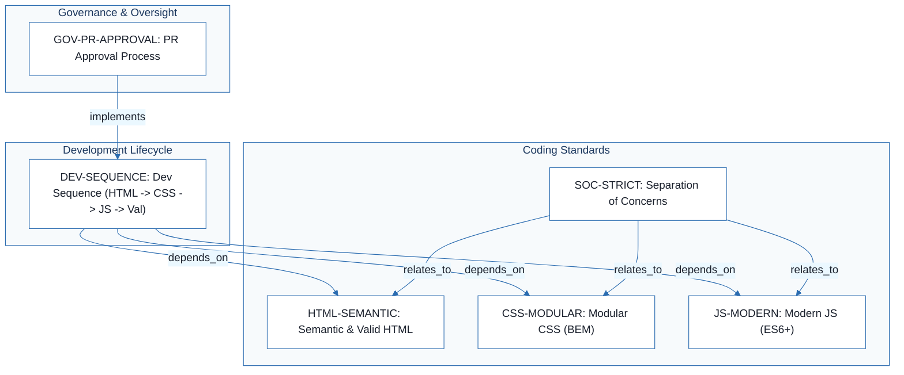
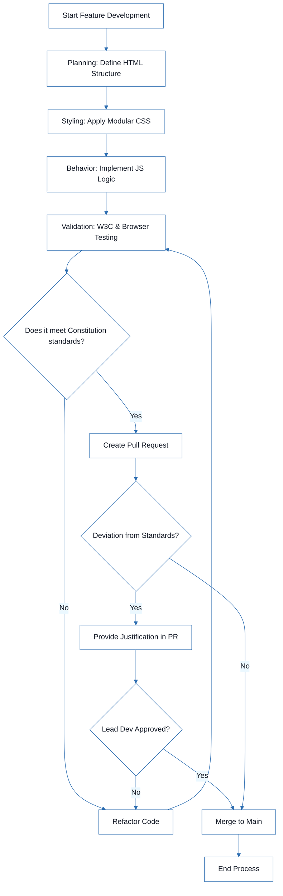

# Sales Item Management - Technical Specification & Architecture Document

## 1. Executive Summary & Architecture Overview

### 1.1 Executive Brief
The Sales Item Management project is a front-end application governed by a strict technical constitution. It implements a decoupled architecture based on a mobile-first responsive design, utilizing a modular directory structure to separate structure, presentation, and behavior. The project focuses on W3C compliance, BEM naming conventions, and modern ES6+ asynchronous patterns to ensure maintainability and accessibility.

### 1.2 Maturity Assessment
The project specifications are structurally sound regarding coding standards but are currently in a state of REFINEMENT. While the core principles are well-defined, there is a high-severity gap concerning the Testing Discipline & Gates; the 'Validation' phase is mentioned as a workflow step but lacks concrete technical implementation details, such as CI/CD pipelines or specific test suites.

### 1.3 Technical Stack
* HTML
* CSS
* JavaScript ES6+

### 1.4 Architectural Constraints
* Strict separation of concerns: No inline styles or inline event handlers permitted.
* CSS naming convention: BEM.
* Layout strategy: Mobile-first approach using Flexbox and Grid.
* JS Pattern: Modular code with async/await and try/catch error handling.
* HTML Standard: W3C valid with mandatory alt attributes and form labels.
* Development Sequence: Planning (HTML) -> Styling (CSS) -> Behavior (JS) -> Validation.
* Governance: PR deviations require lead developer approval.

### 1.5 Critical Dependencies
* W3C Validation tools for HTML/CSS compliance.
* Browser compatibility matrix for JS validation.
* Lead developer approval gate for any constitutional deviations.
* Strict directory mapping: `/index.html`, `/css/`, `/js/modules`, `/assets/`.

## 2. Architecture Workflows



```mermaid
%%{init: {
  'theme': 'base',
  'themeVariables': {
    'primaryColor': '#1A365D',
    'primaryTextColor': '#1A202C',
    'primaryBorderColor': '#2B6CB0',
    'lineColor': '#2B6CB0',
    'secondaryColor': '#EBF8FF',
    'tertiaryColor': '#EBF8FF',
    'background': '#FFFFFF',
    'mainBkg': '#FFFFFF',
    'secondBkg': '#EBF8FF',
    'tertiaryBkg': '#F7FAFC',
    'secondaryTextColor': '#4A5568',
    'fontSize': '16px',
    'fontFamily': 'Inter, system-ui, sans-serif',
    'nodePadding': '15px',
    'borderRadius': '8px',
    'edgeLabelBackground': '#EBF8FF',
    'clusterBkg': '#F7FAFC',
    'clusterBorder': '#2B6CB0',
    'defaultLinkColor': '#2B6CB0',
    'titleColor': '#1A365D',
    'actorBorder': '#2B6CB0',
    'actorBkg': '#EBF8FF',
    'actorTextColor': '#1A365D',
    'actorLineColor': '#2B6CB0',
    'signalColor': '#2B6CB0',
    'signalTextColor': '#1A202C',
    'labelBoxBorderColor': '#2B6CB0',
    'labelBoxBkgColor': '#EBF8FF',
    'labelTextColor': '#1A202C',
    'loopTextColor': '#1A202C',
    'arrowHeadColor': '#2B6CB0',
    'sequenceNumberColor': '#1A365D',
    'sequenceActorBorder': '#2B6CB0',
    'sequenceActorBkg': '#EBF8FF',
    'sequenceArrowColor': '#2B6CB0',
    'noteBkgColor': '#FFF5EB',
    'noteBorderColor': '#DD6B20',
    'noteTextColor': '#1A202C'
  }
}}%%
flowchart TD
    START["Start Feature Development"] --> PLAN["Planning: Define HTML Structure"]
    PLAN --> STYLE["Styling: Apply Modular CSS"]
    STYLE --> BEHAVIOR["Behavior: Implement JS Logic"]
    BEHAVIOR --> VALIDATE["Validation: W3C & Browser Testing"]
    VALIDATE --> DEC1{"Does it meet Constitution standards?"}
    DEC1 -- "No" --> FIX["Refactor Code"]
    FIX --> VALIDATE
    DEC1 -- "Yes" --> PR["Create Pull Request"]
    PR --> DEC2{"Deviation from Standards?"}
    DEC2 -- "Yes" --> JUSTIFY["Provide Justification in PR"]
    JUSTIFY --> APPROVAL{"Lead Dev Approved?"}
    APPROVAL -- "No" --> FIX
    APPROVAL -- "Yes" --> MERGE["Merge to Main"]
    DEC2 -- "No" --> MERGE
    MERGE --> END["End Process"]
``` & Visual Diagrams

### 2.1 Technical Standards Traceability Map
Maps the relationship between governance rules, development sequences, and the specific coding standards they enforce.

```mermaid
%%{init: {
  'theme': 'base',
  'themeVariables': {
    'primaryColor': '#1A365D',
    'primaryTextColor': '#1A202C',
    'primaryBorderColor': '#2B6CB0',
    'lineColor': '#2B6CB0',
    'secondaryColor': '#EBF8FF',
    'tertiaryColor': '#EBF8FF',
    'background': '#FFFFFF',
    'mainBkg': '#FFFFFF',
    'secondBkg': '#EBF8FF',
    'tertiaryBkg': '#F7FAFC',
    'secondaryTextColor': '#4A5568',
    'fontSize': '16px',
    'fontFamily': 'Inter, system-ui, sans-serif',
    'nodePadding': '15px',
    'borderRadius': '8px',
    'edgeLabelBackground': '#EBF8FF',
    'clusterBkg': '#F7FAFC',
    'clusterBorder': '#2B6CB0',
    'defaultLinkColor': '#2B6CB0',
    'titleColor': '#1A365D',
    'actorBorder': '#2B6CB0',
    'actorBkg': '#EBF8FF',
    'actorTextColor': '#1A365D',
    'actorLineColor': '#2B6CB0',
    'signalColor': '#2B6CB0',
    'signalTextColor': '#1A202C',
    'labelBoxBorderColor': '#2B6CB0',
    'labelBoxBkgColor': '#EBF8FF',
    'labelTextColor': '#1A202C',
    'loopTextColor': '#1A202C',
    'arrowHeadColor': '#2B6CB0',
    'sequenceNumberColor': '#1A365D',
    'sequenceActorBorder': '#2B6CB0',
    'sequenceActorBkg': '#EBF8FF',
    'sequenceArrowColor': '#2B6CB0',
    'noteBkgColor': '#FFF5EB',
    'noteBorderColor': '#DD6B20',
    'noteTextColor': '#1A202C'
  }
}}%%
flowchart TD
    subgraph GOVERNANCE [Governance & Oversight]
        GOV-PR-APPROVAL["GOV-PR-APPROVAL: PR Approval Process"]
    end
    subgraph WORKFLOW [Development Lifecycle]
        DEV-SEQUENCE["DEV-SEQUENCE: Dev Sequence (HTML -> CSS -> JS -> Val)"]
    end
    subgraph STANDARDS [Coding Standards]
        HTML-SEMANTIC["HTML-SEMANTIC: Semantic & Valid HTML"]
        CSS-MODULAR["CSS-MODULAR: Modular CSS (BEM)"]
        JS-MODERN["JS-MODERN: Modern JS (ES6+)"]
        SOC-STRICT["SOC-STRICT: Separation of Concerns"]
    end
    GOV-PR-APPROVAL -->|"implements"| DEV-SEQUENCE
    DEV-SEQUENCE -->|"depends_on"| HTML-SEMANTIC
    DEV-SEQUENCE -->|"depends_on"| CSS-MODULAR
    DEV-SEQUENCE -->|"depends_on"| JS-MODERN
    SOC-STRICT -->|"relates_to"| HTML-SEMANTIC
    SOC-STRICT -->|"relates_to"| CSS-MODULAR
    SOC-STRICT -->|"relates_to"| JS-MODERN
```

### 2.2 Development Workflow Process
Detailed operational flow of the development sequence including validation gates and governance loops.



## 3. Detailed Technical Specifications & Business Rules

### 3.1 Requirements Traceability

| Identifier | Type | Requirement Description | Source Section |
| :--- | :--- | :--- | :--- |
| HTML-SEMANTIC | coding_standard | HTML must be semantic, W3C valid, with mandatory alt attributes for images and labels for forms. | I. Semantic & Valid HTML |
| CSS-MODULAR | coding_standard | CSS must use a modular approach (BEM), CSS Variables for consistency, and prioritize Flexbox/Grid. | II. Modular & Maintainable CSS |
| JS-MODERN | coding_standard | JavaScript must use ES6+ syntax, be modular, and handle async operations via async/await with try/catch. | III. Clean & Modern JavaScript (ES6+) |
| SOC-STRICT | rule | Strict separation of HTML, CSS, and JS. No inline styles or inline event handlers permitted. | IV. Separation of Concerns |
| RESPONSIVE-FIRST | requirement | Application must be fully responsive using a mobile-first approach with media queries. | V. Responsive-First Design |
| DIR-STRUCTURE | tool_configuration | Directory structure: /index.html, /css/, /js/ (with /modules), and /assets/. | Project Structure |
| DEV-SEQUENCE | workflow_constraint | Development sequence: Planning (HTML) -> Styling (CSS) -> Behavior (JS) -> Validation. | Development Workflow |
| GOV-PR-APPROVAL | rule | Any deviation from the constitution must be justified in the PR and approved by the lead developer. | Governance |

### 3.2 Security Rules
* No inline event handlers (e.g., `onclick`) are permitted to prevent XSS vulnerabilities and maintain SOC-STRICT.
* All JavaScript must be modular to avoid global scope pollution.

### 3.3 Data Models
* **Directory Model**:
    * `/index.html`: Entry point.
    * `/css/`: Stylesheets (e.g., `style.css`, `variables.css`).
    * `/js/`: Logic, including `/modules` for reusable components and `main.js` for orchestration.
    * `/assets/`: Static assets (images, icons, fonts).

## 4. Project Governance & Structural Gaps

### 4.1 Structural Gaps

| Gap | Priority | Remediation Advice |
| :--- | :--- | :--- |
| Testing Discipline & Gates | HIGH | The document mentions 'Validation' in the workflow but lacks specific testing gates (e.g., Unit tests, Integration tests, CI/CD pipeline requirements). |
| Open Questions & Uncertainties | LOW | No known uncertainties are listed; consider adding a section for future technical debt or architectural questions. |

### 4.2 Remediation & Workflow
Deviations from the established constitution must be documented within the Pull Request (PR) and require explicit approval from the Lead Developer. Any amendments to the constitution itself require a version bump and a documented rationale.

## 5. Technical & Domain Glossary (Terminology Reference)

| Term | Category | Context Anchor | Project Definition |
| :--- | :--- | :--- | :--- |
| BEM | TECHNICAL_STACK | CSS-MODULAR | A modular naming convention used to prevent specificity conflicts and improve maintainability of stylesheets. |
| Behavior | BUSINESS_DOMAIN | DEV-SEQUENCE | The third phase of the development sequence focusing on the implementation of functional logic. |
| CSS | TECHNICAL_STACK | CSS-MODULAR | The presentation layer governed by modularity, variables for consistency, and a mobile-first responsive strategy. |
| HTML | TECHNICAL_STACK | HTML-SEMANTIC | The structural layer which must be semantic and compliant with W3C standards to ensure accessibility. |
| JS | TECHNICAL_STACK | JS-MODERN | The logic layer utilizing ES6+ syntax and asynchronous patterns to handle application functionality. |
| JavaScript | TECHNICAL_STACK | JS-MODERN | The logic layer utilizing ES6+ syntax and asynchronous patterns to handle application functionality. |
| PR | TECHNICAL_STACK | GOV-PR-APPROVAL | The formal mechanism where deviations from the constitution are justified and reviewed by the lead developer. |
| Planning | BUSINESS_DOMAIN | DEV-SEQUENCE | The initial phase of the development sequence dedicated to defining the structural markup. |
| SEO | TECHNICAL_STACK | HTML-SEMANTIC | The optimization goal achieved through the use of semantic tags and valid markup. |
| Styling | BUSINESS_DOMAIN | DEV-SEQUENCE | The second phase of the development sequence where visual requirements are applied to the structure. |
| Validation | BUSINESS_DOMAIN | DEV-SEQUENCE | The final phase of the development sequence involving official checkers and cross-browser testing. |