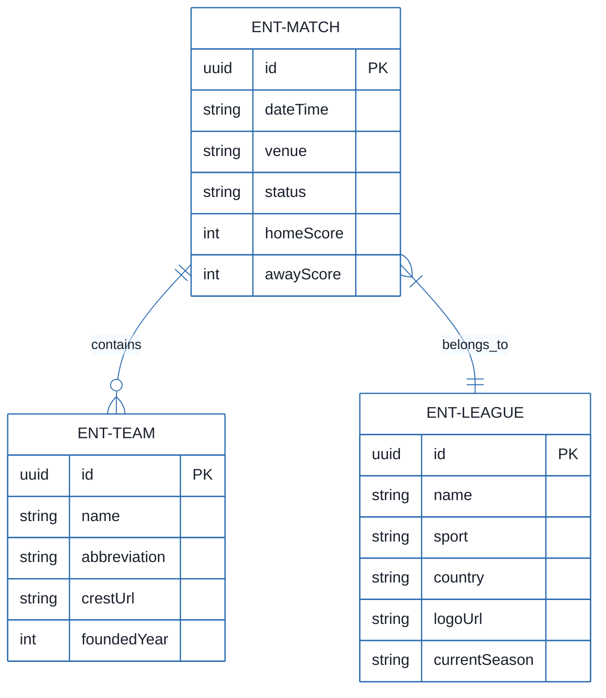
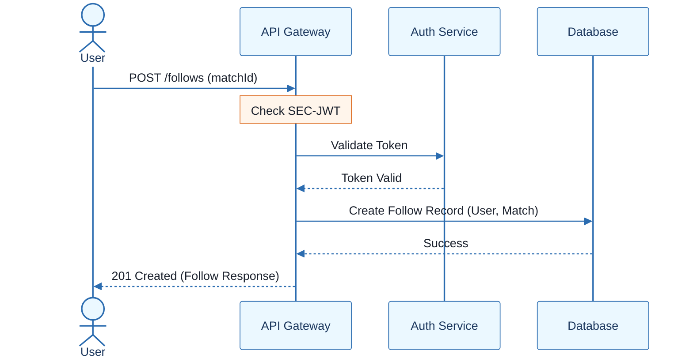
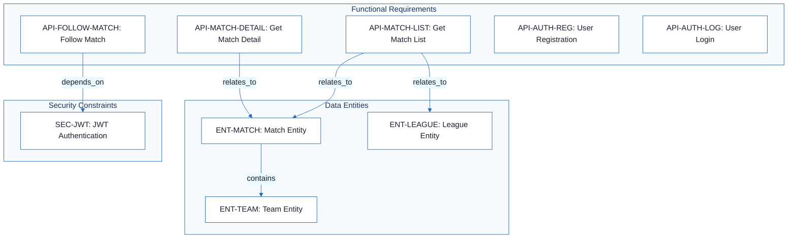
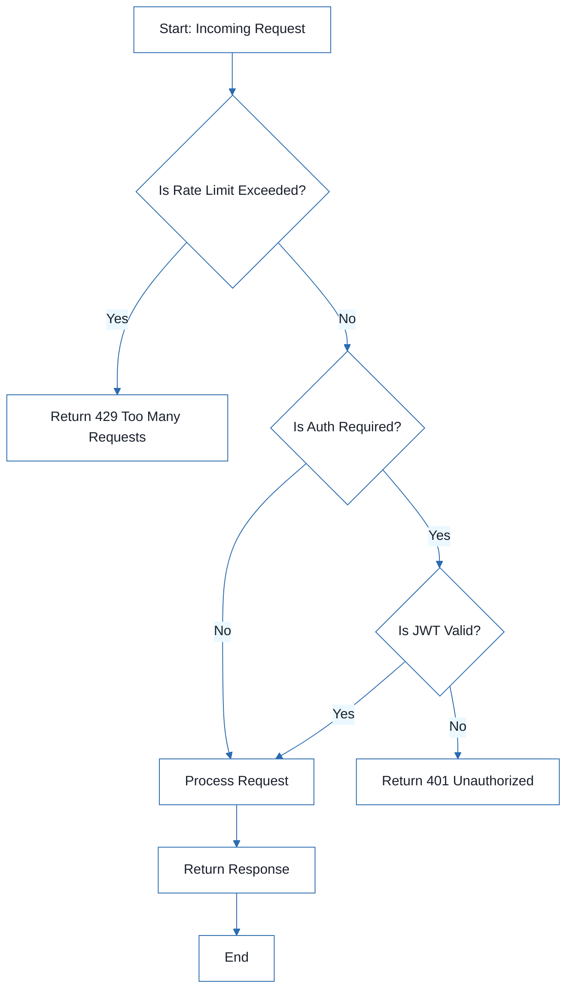

# Football Match Manager - Technical Specification & Architecture Document

## 1. Executive Summary & Architecture Overview

### 1.1 Executive Brief
The Football Match Manager is a RESTful API designed to manage football matches, leagues, and teams, featuring a user-following mechanism for match tracking. The system utilizes a JWT-based authentication pattern to protect user-specific data and implements strict rate-limiting to ensure service stability. It serves as a structured data gateway for sports-related entities and user interactions.

### 1.2 Maturity Assessment
The specifications are technically robust regarding the API contract, evidenced by a high health index and complete functional mapping of endpoints. While the project is READY for execution, a minor REFINEMENT is suggested to explicitly define the system boundaries (Scope & Out-of-Scope) and resolve low-priority structural gaps to prevent scope creep during development.

### 1.3 Technical Stack
* **API Architecture**: RESTful API
* **API Versioning**: v1
* **Authentication**: JWT (JSON Web Token)
* **Data Format**: JSON
* **Identifier Standard**: UUID

### 1.4 Architectural Constraints
* **API Versioning**: Hard-coded path prefix `/api/v1/`.
* **Authentication**: Bearer JWT token required for all non-auth endpoints.
* **Rate Limit (Auth)**: Maximum 5 requests per minute per IP.
* **Rate Limit (General)**: Maximum 60 requests per minute per user.
* **Pagination**: Default page 1, default limit 20 for match lists; default limit 50 for team searches.
* **Data Validation**: `matchId` must be a UUID; `dateFrom` and `dateTo` must be ISO 8601 strings.

### 1.5 Critical Dependencies
* **JWT (JSON Web Token)**: Essential for session management and endpoint authorization.
* **Entity Relationships**: Match entity depends on Team and League entities for data integrity.
* **User Identity**: Follows mechanism depends on User identity and Match UUID.
* **Network Tracking**: IP-based tracking required for authentication rate-limiting gates.

## 2. Architecture Workflows







```mermaid
%%{init: {
  'theme': 'base',
  'themeVariables': {
    'primaryColor': '#1A365D',
    'primaryTextColor': '#1A202C',
    'primaryBorderColor': '#2B6CB0',
    'lineColor': '#2B6CB0',
    'secondaryColor': '#EBF8FF',
    'tertiaryColor': '#EBF8FF',
    'background': '#FFFFFF',
    'mainBkg': '#FFFFFF',
    'secondBkg': '#EBF8FF',
    'tertiaryBkg': '#F7FAFC',
    'secondaryTextColor': '#4A5568',
    'fontSize': '16px',
    'fontFamily': 'Inter, system-ui, sans-serif',
    'nodePadding': '15px',
    'borderRadius': '8px',
    'edgeLabelBackground': '#EBF8FF',
    'clusterBkg': '#F7FAFC',
    'clusterBorder': '#2B6CB0',
    'defaultLinkColor': '#2B6CB0',
    'titleColor': '#1A365D',
    'actorBorder': '#2B6CB0',
    'actorBkg': '#EBF8FF',
    'actorTextColor': '#1A365D',
    'actorLineColor': '#2B6CB0',
    'signalColor': '#2B6CB0',
    'signalTextColor': '#1A202C',
    'labelBoxBorderColor': '#2B6CB0',
    'labelBoxBkgColor': '#EBF8FF',
    'labelTextColor': '#1A202C',
    'loopTextColor': '#1A202C',
    'arrowHeadColor': '#2B6CB0',
    'sequenceNumberColor': '#1A365D',
    'sequenceActorBorder': '#2B6CB0',
    'sequenceActorBkg': '#EBF8FF',
    'sequenceArrowColor': '#2B6CB0',
    'noteBkgColor': '#FFF5EB',
    'noteBorderColor': '#DD6B20',
    'noteTextColor': '#1A202C'
  }
}}%%
flowchart TD
    START["Start: Incoming Request"] --> RATE_CHECK{"Is Rate Limit Exceeded?"}
    RATE_CHECK -- Yes --> ERR_429["Return 429 Too Many Requests"]
    RATE_CHECK -- No --> AUTH_CHECK{"Is Auth Required?"}
    AUTH_CHECK -- No --> PROCESS["Process Request"]
    AUTH_CHECK -- Yes --> JWT_VAL{"Is JWT Valid?"}
    JWT_VAL -- No --> ERR_401["Return 401 Unauthorized"]
    JWT_VAL -- Yes --> PROCESS
    PROCESS --> RESP["Return Response"]
    RESP --> END["End"]
``` & Visual Diagrams

### 2.1 Data Model (ER Diagram)
```mermaid
%%{init: {
  'theme': 'base',
  'themeVariables': {
    'primaryColor': '#1A365D',
    'primaryTextColor': '#1A202C',
    'primaryBorderColor': '#2B6CB0',
    'lineColor': '#2B6CB0',
    'secondaryColor': '#EBF8FF',
    'tertiaryColor': '#EBF8FF',
    'background': '#FFFFFF',
    'mainBkg': '#FFFFFF',
    'secondBkg': '#EBF8FF',
    'tertiaryBkg': '#F7FAFC',
    'secondaryTextColor': '#4A5568',
    'fontSize': '16px',
    'fontFamily': 'Inter, system-ui, sans-serif',
    'nodePadding': '15px',
    'borderRadius': '8px',
    'edgeLabelBackground': '#EBF8FF',
    'clusterBkg': '#F7FAFC',
    'clusterBorder': '#2B6CB0',
    'defaultLinkColor': '#2B6CB0',
    'titleColor': '#1A365D',
    'actorBorder': '#2B6CB0',
    'actorBkg': '#EBF8FF',
    'actorTextColor': '#1A365D',
    'actorLineColor': '#2B6CB0',
    'signalColor': '#2B6CB0',
    'signalTextColor': '#1A202C',
    'labelBoxBorderColor': '#2B6CB0',
    'labelBoxBkgColor': '#EBF8FF',
    'labelTextColor': '#1A202C',
    'loopTextColor': '#1A202C',
    'arrowHeadColor': '#2B6CB0',
    'sequenceNumberColor': '#1A365D',
    'sequenceActorBorder': '#2B6CB0',
    'sequenceActorBkg': '#EBF8FF',
    'sequenceArrowColor': '#2B6CB0',
    'noteBkgColor': '#FFF5EB',
    'noteBorderColor': '#DD6B20',
    'noteTextColor': '#1A202C'
  }
}}%%
erDiagram
    ENT-MATCH ||--o{ ENT-TEAM : "contains"
    ENT-MATCH }|--|| ENT-LEAGUE : "belongs_to"
    ENT-MATCH {
        uuid id PK
        string dateTime
        string venue
        string status
        int homeScore
        int awayScore
    }
    ENT-TEAM {
        uuid id PK
        string name
        string abbreviation
        string crestUrl
        int foundedYear
    }
    ENT-LEAGUE {
        uuid id PK
        string name
        string sport
        string country
        string logoUrl
        string currentSeason
    }
```

### 2.2 Match Following Sequence


### 2.3 Requirements Traceability Map


### 2.4 API Request Processing Workflow


## 3. Detailed Technical Specifications & Business Rules

### 3.1 Requirements Traceability
| ID | Requirement Type | Description | Source Section |
| :--- | :--- | :--- | :--- |
| API-AUTH-REG | Functional | Allow user registration via POST /auth/register | Authentication |
| API-AUTH-LOG | Functional | Allow user login to receive JWT token via POST /auth/login | Authentication |
| API-MATCH-LIST | Functional | Retrieve a list of matches with filtering by leagueId, date, status, and team name via GET /matches | Matches |
| API-MATCH-DETAIL | Functional | Retrieve a specific match by its unique ID via GET /matches/:id | Matches |
| API-FOLLOW-MATCH | Functional | Allow a user to follow a match via POST /follows | User Follows |
| API-UNFOLLOW-MATCH | Functional | Allow a user to unfollow a match via DELETE /follows/:matchId | User Follows |
| SEC-JWT | Non-Functional | All endpoints (except auth) require a valid JWT token in the Authorization header. | Authentication |
| NFR-RATE-LIMIT | Non-Functional | Auth endpoints limited to 5 req/min/IP; others 60 req/min/user. | Rate Limiting |

### 3.2 Security Rules
* **Authentication Mechanism**: Bearer Token (JWT).
* **Authorization Scope**: All endpoints except `/auth/*` require a valid token.
* **Rate Limiting**:
    * Authentication endpoints: 5 requests per minute per IP.
    * General endpoints: 60 requests per minute per authenticated user.

### 3.3 Data Models
#### ENT-MATCH (Match)
```json
{
  "id": "uuid",
  "homeTeam": { "..." },
  "awayTeam": { "..." },
  "dateTime": "ISO string",
  "venue": "string",
  "league": { "..." },
  "status": "upcoming|live|finished|postponed|cancelled",
  "homeScore": "integer (nullable)",
  "awayScore": "integer (nullable)",
  "lastUpdated": "ISO string"
}
```

#### ENT-TEAM (Team)
```json
{
  "id": "uuid",
  "name": "string",
  "abbreviation": "string",
  "crestUrl": "url",
  "foundedYear": "integer"
}
```

#### ENT-LEAGUE (League)
```json
{
  "id": "uuid",
  "name": "string",
  "sport": "string",
  "country": "string",
  "logoUrl": "url",
  "currentSeason": "string"
}
```

#### User (Authenticated)
```json
{
  "id": "uuid",
  "email": "string",
  "displayName": "string",
  "avatarUrl": "url"
}
```

#### Follow Response
```json
{
  "userId": "uuid",
  "matchId": "uuid",
  "followedAt": "ISO string",
  "notificationsEnabled": "boolean"
}
```

## 4. Project Governance & Structural Gaps

### 4.1 Structural Gaps
| Missing Section | Priority | Remediation Advice |
| :--- | :--- | :--- |
| Scope & Out-of-Scope | MEDIUM | Define what the API will NOT handle (e.g., payment for tickets, real-time player stats). |
| Open Questions & Uncertainties | LOW | Identify any undecided endpoints or data model fields. |

### 4.2 Remediation & Workflow
To ensure the project remains within scope and avoids creep, the development team must first document the "Out-of-Scope" boundaries. Following this, a final review of the data models should be conducted to identify any missing fields before the implementation phase begins.

## 5. Technical & Domain Glossary (Terminology Reference)

| Term | Category | Context Anchor | Project Definition |
| :--- | :--- | :--- | :--- |
| API | TECHNICAL_STACK | API Contract: Football Match Manager | The set of RESTful endpoints versioned as v1 for managing sports data and user interactions. |
| CORS Standard | TECHNICAL_STACK | Base URL | The cross-origin resource sharing policy implicitly required to allow browser-based clients to interact with the specified backend endpoints. |
| ID | BUSINESS_DOMAIN | API-MATCH-DETAIL | The unique identifier used to retrieve a specific sports event record. |
| IP | TECHNICAL_STACK | NFR-RATE-LIMIT | The network address used as a key to apply a maximum of 5 requests per minute for authentication endpoints. |
| JSON | TECHNICAL_STACK | Data Models | The lightweight data-interchange format used for all request bodies and response payloads. |
| JWT | TECHNICAL_STACK | SEC-JWT | The signed token passed in the Authorization header as a Bearer credential to secure non-auth endpoints. |
| UUID | TECHNICAL_STACK | ENT-MATCH | The 128-bit universally unique format used for primary keys across all entities including matches, teams, and leagues. |
| dateFrom | BUSINESS_DOMAIN | API-MATCH-LIST | The ISO string parameter serving as the lower temporal boundary for filtering sports events. |
| dateTo | BUSINESS_DOMAIN | API-MATCH-LIST | The ISO string parameter serving as the upper temporal boundary for filtering sports events. |
| leagueId | BUSINESS_DOMAIN | API-MATCH-LIST | The unique reference to a specific sports competition used to filter the list of events. |