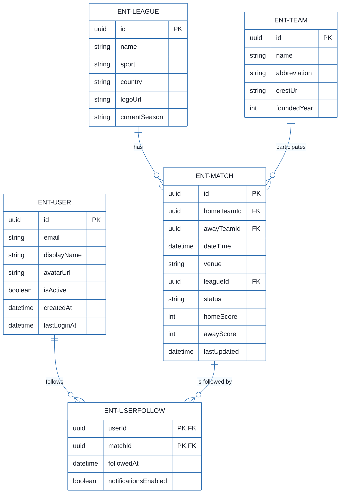
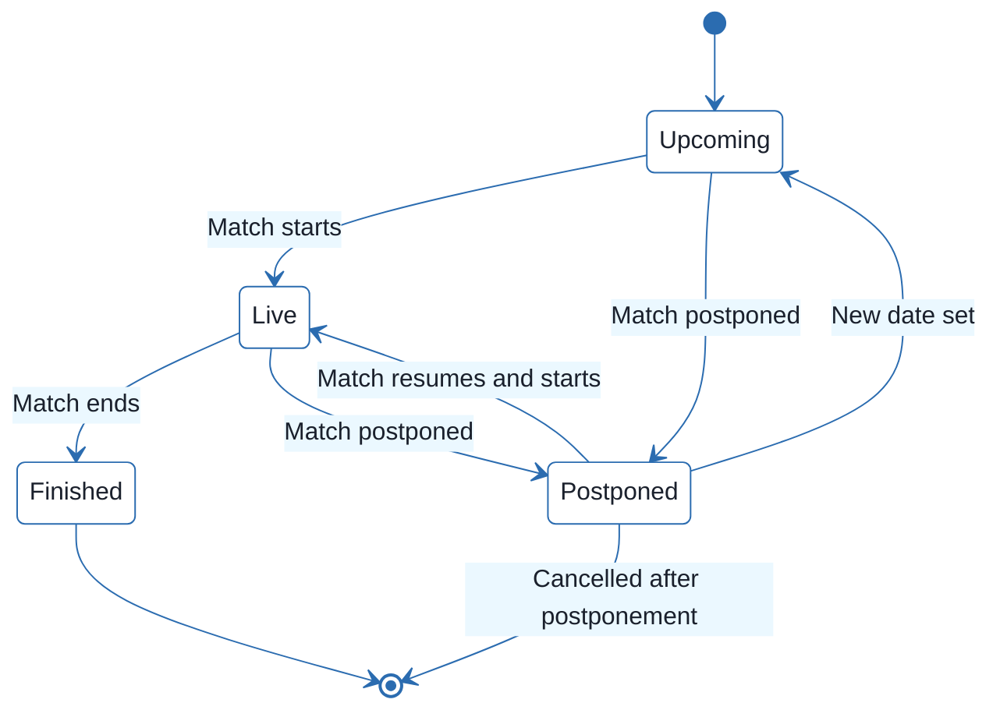
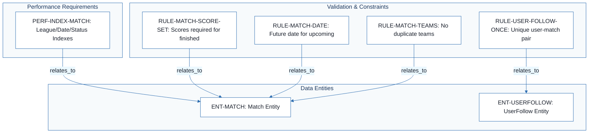
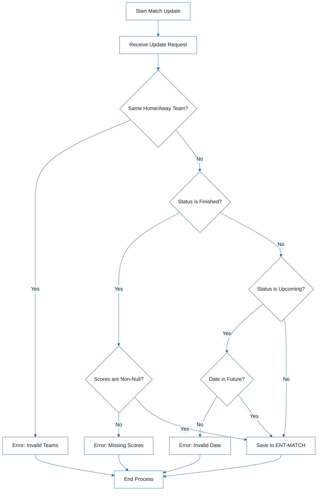

# Football Match Manager - Technical Specification & Architecture Document

## 1. Executive Summary & Architecture Overview

### 1.1 Executive Brief
The Football Match Manager is a specialized data layer designed to track soccer match entities, team memberships, and user followings. It implements a relational schema focused on match lifecycle state transitions, scoring validation, and user-match associations, hosted within a structured database environment using UUIDs for entity identification.

### 1.2 Maturity Assessment
The project is currently in a **REFINEMENT** state. While the data model is structurally complete from a schema perspective, there are high-severity gaps regarding business goals and scope definition. The lack of a defined project objective and the uncertainty surrounding the authentication implementation for the User entity prevent an immediate transition to a ready state.

### 1.3 Technical Stack
* **Identifiers**: UUID (128-bit universally unique identifiers)
* **Temporal Standard**: UTC (Coordinated Universal Time)
* **Data Types**: DateTime, Enum, Boolean, Integer, String, URL

### 1.4 Architectural Constraints
* **Temporal Logic**: Match `dateTime` must be in the future for 'upcoming' status.
* **State Integrity**: `homeScore` and `awayScore` must be non-null when status is 'finished'.
* **Value Constraints**: Scores must be strictly non-negative (min 0).
* **Entity Logic**: `homeTeamId` must not equal `awayTeamId`.
* **Uniqueness**: Team name must be globally unique; User email must be unique.
* **Relational Integrity**: `UserFollow` requires a composite unique constraint on (`userId`, `matchId`).
* **Domain Bounds**: Team `foundedYear` must be between 1800 and current year.
* **Field Limits**: Team abbreviation max 5 chars; Team/League name max 100 chars; Venue max 200 chars.

### 1.5 Critical Dependencies
* **Referential Integrity**: `ENT-MATCH` depends on `ENT-TEAM` and `ENT-LEAGUE` entities.
* **Referential Integrity**: `ENT-USERFOLLOW` depends on `ENT-USER` and `ENT-MATCH` entities.
* **Composite Key Dependency**: `UserFollow` uniqueness bound to (`userId`, `matchId`).
* **Indexing Requirements**: (`leagueId`, `dateTime`) and (`status`) on `ENT-MATCH` for performance filtering.
* **Indexing Requirements**: (`email`) on `ENT-USER` for authentication lookups.

## 2. Architecture Workflows







```mermaid
%%{init: {
  'theme': 'base',
  'themeVariables': {
    'primaryColor': '#1A365D',
    'primaryTextColor': '#1A202C',
    'primaryBorderColor': '#2B6CB0',
    'lineColor': '#2B6CB0',
    'secondaryColor': '#EBF8FF',
    'tertiaryColor': '#EBF8FF',
    'background': '#FFFFFF',
    'mainBkg': '#FFFFFF',
    'secondBkg': '#EBF8FF',
    'tertiaryBkg': '#F7FAFC',
    'secondaryTextColor': '#4A5568',
    'fontSize': '16px',
    'fontFamily': 'Inter, system-ui, sans-serif',
    'nodePadding': '15px',
    'borderRadius': '8px',
    'edgeLabelBackground': '#EBF8FF',
    'clusterBkg': '#F7FAFC',
    'clusterBorder': '#2B6CB0',
    'defaultLinkColor': '#2B6CB0',
    'titleColor': '#1A365D',
    'actorBorder': '#2B6CB0',
    'actorBkg': '#EBF8FF',
    'actorTextColor': '#1A365D',
    'actorLineColor': '#2B6CB0',
    'signalColor': '#2B6CB0',
    'signalTextColor': '#1A202C',
    'labelBoxBorderColor': '#2B6CB0',
    'labelBoxBkgColor': '#EBF8FF',
    'labelTextColor': '#1A202C',
    'loopTextColor': '#1A202C',
    'arrowHeadColor': '#2B6CB0',
    'sequenceNumberColor': '#1A365D',
    'sequenceActorBorder': '#2B6CB0',
    'sequenceActorBkg': '#EBF8FF',
    'sequenceArrowColor': '#2B6CB0',
    'noteBkgColor': '#FFF5EB',
    'noteBorderColor': '#DD6B20',
    'noteTextColor': '#1A202C'
  }
}}%%
flowchart TD
    START["Start Match Update"] --> UPDATE_REQ["Receive Update Request"]
    UPDATE_REQ --> CHECK_TEAMS{"Same Home/Away Team?"}
    CHECK_TEAMS -- Yes --> ERR_TEAMS["Error: Invalid Teams"]
    CHECK_TEAMS -- No --> CHECK_STATUS{"Status is Finished?"}
    CHECK_STATUS -- Yes --> CHECK_SCORES{"Scores are Non-Null?"}
    CHECK_STATUS -- No --> CHECK_DATE{"Status is Upcoming?"}
    CHECK_SCORES -- No --> ERR_SCORES["Error: Missing Scores"]
    CHECK_SCORES -- Yes --> SAVE_MATCH
    CHECK_DATE -- Yes --> DATE_FUTURE{"Date in Future?"}
    CHECK_DATE -- No --> SAVE_MATCH
    DATE_FUTURE -- No --> ERR_DATE["Error: Invalid Date"]
    DATE_FUTURE -- Yes --> SAVE_MATCH
    ERR_TEAMS --> END["End Process"]
    ERR_SCORES --> END
    ERR_DATE --> END
    SAVE_MATCH["Save to ENT-MATCH"] --> END
``` & Visual Diagrams

### 2.1 Data Model (ER Diagram)
```mermaid
%%{init: {
  'theme': 'base',
  'themeVariables': {
    'primaryColor': '#1A365D',
    'primaryTextColor': '#1A202C',
    'primaryBorderColor': '#2B6CB0',
    'lineColor': '#2B6CB0',
    'secondaryColor': '#EBF8FF',
    'tertiaryColor': '#EBF8FF',
    'background': '#FFFFFF',
    'mainBkg': '#FFFFFF',
    'secondBkg': '#EBF8FF',
    'tertiaryBkg': '#F7FAFC',
    'secondaryTextColor': '#4A5568',
    'fontSize': '16px',
    'fontFamily': 'Inter, system-ui, sans-serif',
    'nodePadding': '15px',
    'borderRadius': '8px',
    'edgeLabelBackground': '#EBF8FF',
    'clusterBkg': '#F7FAFC',
    'clusterBorder': '#2B6CB0',
    'defaultLinkColor': '#2B6CB0',
    'titleColor': '#1A365D',
    'actorBorder': '#2B6CB0',
    'actorBkg': '#EBF8FF',
    'actorTextColor': '#1A365D',
    'actorLineColor': '#2B6CB0',
    'signalColor': '#2B6CB0',
    'signalTextColor': '#1A202C',
    'labelBoxBorderColor': '#2B6CB0',
    'labelBoxBkgColor': '#EBF8FF',
    'labelTextColor': '#1A202C',
    'loopTextColor': '#1A202C',
    'arrowHeadColor': '#2B6CB0',
    'sequenceNumberColor': '#1A365D',
    'sequenceActorBorder': '#2B6CB0',
    'sequenceActorBkg': '#EBF8FF',
    'sequenceArrowColor': '#2B6CB0',
    'noteBkgColor': '#FFF5EB',
    'noteBorderColor': '#DD6B20',
    'noteTextColor': '#1A202C'
  }
}}%%
erDiagram
    ENT-LEAGUE ||--o{ ENT-MATCH : "has"
    ENT-TEAM ||--o{ ENT-MATCH : "participates"
    ENT-USER ||--o{ ENT-USERFOLLOW : "follows"
    ENT-MATCH ||--o{ ENT-USERFOLLOW : "is followed by"
    ENT-LEAGUE {
        uuid id PK
        string name
        string sport
        string country
        string logoUrl
        string currentSeason
    }
    ENT-MATCH {
        uuid id PK
        uuid homeTeamId FK
        uuid awayTeamId FK
        datetime dateTime
        string venue
        uuid leagueId FK
        string status
        int homeScore
        int awayScore
        datetime lastUpdated
    }
    ENT-TEAM {
        uuid id PK
        string name
        string abbreviation
        string crestUrl
        int foundedYear
    }
    ENT-USER {
        uuid id PK
        string email
        string displayName
        string avatarUrl
        boolean isActive
        datetime createdAt
        datetime lastLoginAt
    }
    ENT-USERFOLLOW {
        uuid userId PK,FK
        uuid matchId PK,FK
        datetime followedAt
        boolean notificationsEnabled
    }
```

### 2.2 Match State Lifecycle


### 2.3 Requirements Traceability Matrix


### 2.4 Match Validation Workflow


## 3. Detailed Technical Specifications & Business Rules

### 3.1 Requirements Traceability
| ID | Requirement / Entity | Description | Source Section |
| :--- | :--- | :--- | :--- |
| **ENT-MATCH** | Entity: Match | Represents a football match with fields: id, homeTeamId, awayTeamId, dateTime, venue, leagueId, status, homeScore, awayScore, lastUpdated | Match |
| **ENT-TEAM** | Entity: Team | Represents a football team with fields: id, name, abbreviation, crestUrl, foundedYear | Team |
| **ENT-LEAGUE** | Entity: League | Represents a football league or tournament with fields: id, name, sport, country, logoUrl, currentSeason | League |
| **ENT-USER** | Entity: User | Represents an application user with fields: id, email, displayName, avatarUrl, isActive, createdAt, lastLoginAt | User |
| **ENT-USERFOLLOW** | Entity: UserFollow | Represents the relationship between a User and a Match they are following with fields: userId, matchId, followedAt, notificationsEnabled | UserFollow |
| **RULE-MATCH-TEAMS** | Functional Req | A match cannot have the same team as both home and away. | Validation Rules |
| **RULE-MATCH-DATE** | Functional Req | Match dateTime must be in the future for status 'upcoming'. | Validation Rules |
| **RULE-MATCH-SCORE-SET** | Functional Req | When status changes to 'finished', both homeScore and awayScore must be set (non-null). | Validation Rules |
| **RULE-SCORE-POSITIVE** | Constraint | Scores cannot be negative. | Validation Rules |
| **RULE-TEAM-UNIQUE** | Functional Req | Team name must be unique across all teams. | Validation Rules |
| **RULE-USER-EMAIL-UNIQUE** | Functional Req | Email must be unique. | Validation Rules |
| **RULE-USER-FOLLOW-ONCE** | Constraint | A user can only follow a match once (Composite unique constraint on userId, matchId). | UserFollow |
| **PERF-INDEX-MATCH** | Non-Functional Req | Indexes on (leagueId, dateTime) and (status) for performance filtering. | Indexes (for performance) |

### 3.2 Security Rules
* **Identity Integrity**: User email must be unique (`RULE-USER-EMAIL-UNIQUE`).
* **Credential Complexity**: Passwords (if implemented) must meet complexity requirements (min 8 characters).
* **Access Control**: User account status is tracked via `isActive` boolean.

### 3.3 Data Models

#### ENT-MATCH
| Field | Type | Description | Validation |
| :--- | :--- | :--- | :--- |
| id | UUID | Unique identifier | Required, unique (PK) |
| homeTeamId | UUID | Reference to Team | Required, exists (FK) |
| awayTeamId | UUID | Reference to Team | Required, exists, != homeTeamId (FK) |
| dateTime | DateTime | Match date and time (UTC) | Required, future if 'upcoming' |
| venue | String | Stadium or location name | Optional, max 200 |
| leagueId | UUID | Reference to League | Required, exists (FK) |
| status | Enum | upcoming, live, finished, postponed, cancelled | Required, default: upcoming |
| homeScore | Integer | Goals scored by home team | Optional, min 0, default null |
| awayScore | Integer | Goals scored by away team | Optional, min 0, default null |
| lastUpdated | DateTime | Timestamp of last update | Auto-set on update |

#### ENT-TEAM
| Field | Type | Description | Validation |
| :--- | :--- | :--- | :--- |
| id | UUID | Unique identifier | Required, unique (PK) |
| name | String | Team name | Required, unique, max 100 |
| abbreviation | String | Team abbreviation | Optional, unique per league, max 5 |
| crestUrl | URL | URL to team crest/logo | Optional, valid URL |
| foundedYear | Integer | Year the club was founded | Optional, 1800 <= year <= current |

#### ENT-LEAGUE
| Field | Type | Description | Validation |
| :--- | :--- | :--- | :--- |
| id | UUID | Unique identifier | Required, unique (PK) |
| name | String | League name | Required, max 100 |
| sport | String | Sport type | Required, default: "football" |
| country | String | Country where league is based | Optional, max 100 |
| logoUrl | URL | URL to league logo | Optional, valid URL |
| currentSeason | String | Current season identifier | Optional (e.g., "2023/24") |

#### ENT-USER
| Field | Type | Description | Validation |
| :--- | :--- | :--- | :--- |
| id | UUID | Unique identifier | Required, unique (PK) |
| email | String | User email address | Required, unique, valid email |
| displayName | String | Display name for the user | Required, max 50 |
| avatarUrl | URL | URL to user avatar/image | Optional, valid URL |
| isActive | Boolean | Whether the user account is active | Required, default: true |
| createdAt | DateTime | Account creation timestamp | Auto-set on create |
| lastLoginAt | DateTime | Last login timestamp | Updated on login |

#### ENT-USERFOLLOW
| Field | Type | Description | Validation |
| :--- | :--- | :--- | :--- |
| userId | UUID | Reference to User | Required, exists (PK, FK) |
| matchId | UUID | Reference to Match | Required, exists (PK, FK) |
| followedAt | DateTime | Timestamp of following | Required, auto-set on create |
| notificationsEnabled | Boolean | Notification preference | Optional, default: false |

## 4. Project Governance & Structural Gaps

### 4.1 Structural Gaps
| Missing Section | Priority | Remediation Advice |
| :--- | :--- | :--- |
| Goals & Objectives | HIGH | The document is purely technical/data-oriented. A section explaining the business purpose of the Match Manager is needed. |
| Scope & Out-of-Scope | MEDIUM | Define whether this data model covers only the match engine or also user profiles, payments, etc. |
| Open Questions & Uncertainties | LOW | The document mentions 'if authentication is implemented', which should be explicitly listed as an open question. |

### 4.2 Remediation & Workflow
1. **Business Alignment**: Conduct a stakeholder workshop to define the "Goals & Objectives" and "Scope".
2. **Auth Decision**: Finalize the decision on whether the `ENT-USER` entity will be integrated with a full authentication system or remain a simple profile store.
3. **Validation Refinement**: Clarify if `ENT-TEAM` name uniqueness is global or scoped per league.

## 5. Technical & Domain Glossary (Terminology Reference)

| Term | Category | Context Anchor | Project Definition |
| :--- | :--- | :--- | :--- |
| Constraints | TECHNICAL_STACK | RULE-USER-FOLLOW-ONCE | Restrictive database rules, specifically the composite unique requirement preventing duplicate entries for the same pair of associated identifiers. |
| Cryptographic Hashing | TECHNICAL_STACK | RULE-USER-EMAIL-UNIQUE | The implicit security mechanism required to protect stored credentials mentioned in the complexity requirements for account access. |
| DateTime | TECHNICAL_STACK | ENT-MATCH | A temporal data type used for scheduling events and recording system timestamps. |
| MUN | BUSINESS_DOMAIN | ENT-TEAM | An example of a short-form identification string for a specific athletic club. |
| Match Validation | BUSINESS_DOMAIN | RULE-MATCH-TEAMS | The set of business rules ensuring logical consistency for sporting events, such as forbidding a team from playing against itself and requiring final scores upon completion. |
| Relationships | TECHNICAL_STACK | ENT-MATCH | The structural links between different data entities, including one-to-many and many-to-many associations. |
| Team Validation | BUSINESS_DOMAIN | RULE-TEAM-UNIQUE | Operational checks verifying that no two athletic organizations share the same identity name. |
| UTC | TECHNICAL_STACK | ENT-MATCH | The standardized global time reference used to avoid ambiguity across different geographical time zones. |
| UUID | TECHNICAL_STACK | ENT-MATCH | A 128-bit universally unique identifier used as the primary key for all major system entities. |
| User Validation | BUSINESS_DOMAIN | RULE-USER-EMAIL-UNIQUE | The integrity checks performed on account data, focusing on the uniqueness of contact addresses and credential strength. |
| UserFollow | BUSINESS_DOMAIN | ENT-USERFOLLOW | A junction entity tracking the subscription interest of a profile toward a specific sporting event. |
| UserFollow Validation | BUSINESS_DOMAIN | RULE-USER-FOLLOW-ONCE | The specific logic ensuring a single account cannot subscribe to the same event more than once. |