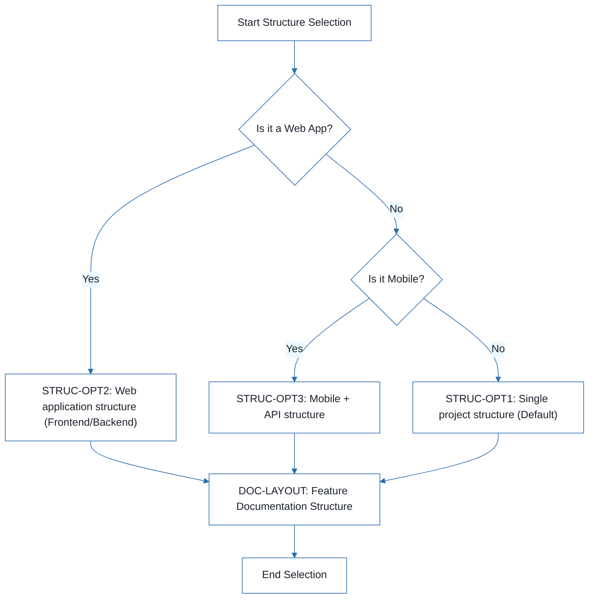
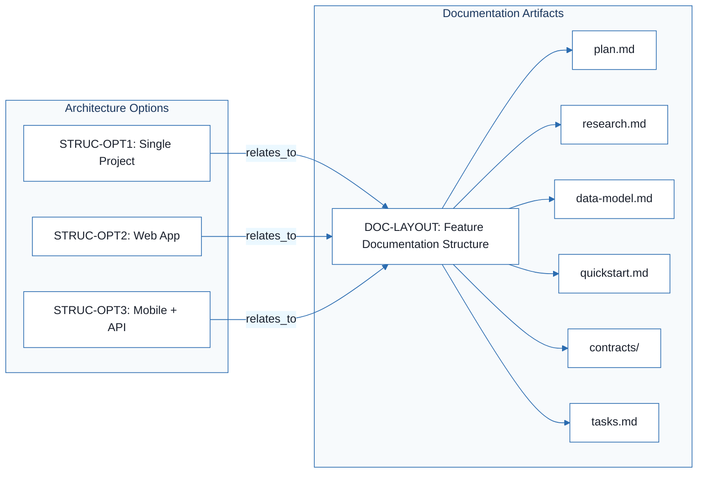

# Football Match Manager - Technical Specification & Architecture Document

## 1. Executive Summary & Architecture Overview

### 1.1 Executive Brief
The Football Match Manager project is currently in a preliminary planning phase, represented by a structural template. It aims to establish a management system for football matches, though the core value proposition and data patterns are not yet defined. The project is centered on selecting one of three architectural patterns: a monolithic single project, a client-server web application, or a mobile-backend split.

### 1.2 Maturity Assessment
The project is in a critical state of under-specification. While the documentation skeleton is complete, the absence of data models, API contracts, and security definitions constitutes high-severity structural gaps. Consequently, the project is currently in REFINEMENT status, as it lacks the technical substance required for implementation.

### 1.3 Technical Stack
*   **Languages/Frameworks**: TBD (Placeholders mentioned: Python 3.11, Swift 5.9, Rust 1.75)
*   **Primary Dependencies**: TBD (Placeholders mentioned: FastAPI, UIKit, LLVM)
*   **Storage**: TBD (Placeholders mentioned: PostgreSQL, CoreData)
*   **Testing**: TBD (Placeholders mentioned: pytest, XCTest, cargo test)
*   **Target Platform**: TBD (Placeholders mentioned: Linux server, iOS 15+, WASM)

### 1.4 Architectural Constraints
*   **Structural Adherence**: Must adhere to one of three predefined project structures: Single Project (`src/models/services/cli/lib`), Web Application (`backend/frontend`), or Mobile + API.
*   **Documentation Standard**: Mandatory documentation hierarchy following the `specs/[###-feature]/` pattern including `plan.md`, `research.md`, `data-model.md`, `quickstart.md`, `contracts/`, and `tasks.md`.

### 1.5 Critical Dependencies
*   **Structure Selection**: Selection of a specific architectural structure (`STRUC-OPT1`, `STRUC-OPT2`, or `STRUC-OPT3`) is a prerequisite for codebase initialization.
*   **Documentation Alignment**: Strict alignment between the chosen structure and the feature documentation layout (`DOC-LAYOUT`).

## 2. Architecture Workflows



```mermaid
%%{init: {
  'theme': 'base',
  'themeVariables': {
    'primaryColor': '#1A365D',
    'primaryTextColor': '#1A202C',
    'primaryBorderColor': '#2B6CB0',
    'lineColor': '#2B6CB0',
    'secondaryColor': '#EBF8FF',
    'tertiaryColor': '#EBF8FF',
    'background': '#FFFFFF',
    'mainBkg': '#FFFFFF',
    'secondBkg': '#EBF8FF',
    'tertiaryBkg': '#F7FAFC',
    'secondaryTextColor': '#4A5568',
    'fontSize': '16px',
    'fontFamily': 'Inter, system-ui, sans-serif',
    'nodePadding': '15px',
    'borderRadius': '8px',
    'edgeLabelBackground': '#EBF8FF',
    'clusterBkg': '#F7FAFC',
    'clusterBorder': '#2B6CB0',
    'defaultLinkColor': '#2B6CB0',
    'titleColor': '#1A365D',
    'actorBorder': '#2B6CB0',
    'actorBkg': '#EBF8FF',
    'actorTextColor': '#1A365D',
    'actorLineColor': '#2B6CB0',
    'signalColor': '#2B6CB0',
    'signalTextColor': '#1A202C',
    'labelBoxBorderColor': '#2B6CB0',
    'labelBoxBkgColor': '#EBF8FF',
    'labelTextColor': '#1A202C',
    'loopTextColor': '#1A202C',
    'arrowHeadColor': '#2B6CB0',
    'sequenceNumberColor': '#1A365D',
    'sequenceActorBorder': '#2B6CB0',
    'sequenceActorBkg': '#EBF8FF',
    'sequenceArrowColor': '#2B6CB0',
    'noteBkgColor': '#FFF5EB',
    'noteBorderColor': '#DD6B20',
    'noteTextColor': '#1A202C'
  }
}}%%
flowchart LR
    subgraph "Documentation Artifacts"
        DOC-LAYOUT["DOC-LAYOUT: Feature Documentation Structure"]
        PLAN["plan.md"]
        RES["research.md"]
        DM["data-model.md"]
        QS["quickstart.md"]
        CON["contracts/"]
        TSK["tasks.md"]
    end
    subgraph "Architecture Options"
        STRUC-OPT1["STRUC-OPT1: Single Project"]
        STRUC-OPT2["STRUC-OPT2: Web App"]
        STRUC-OPT3["STRUC-OPT3: Mobile + API"]
    end
    STRUC-OPT1 -->|"relates_to"| DOC-LAYOUT
    STRUC-OPT2 -->|"relates_to"| DOC-LAYOUT
    STRUC-OPT3 -->|"relates_to"| DOC-LAYOUT
    DOC-LAYOUT --> PLAN
    DOC-LAYOUT --> RES
    DOC-LAYOUT --> DM
    DOC-LAYOUT --> QS
    DOC-LAYOUT --> CON
    DOC-LAYOUT --> TSK
``` & Visual Diagrams

### 2.1 Project Structure Decision Flow
This flowchart describes the decision logic for selecting the appropriate project source code structure based on project requirements.

```mermaid
%%{init: {
  'theme': 'base',
  'themeVariables': {
    'primaryColor': '#1A365D',
    'primaryTextColor': '#1A202C',
    'primaryBorderColor': '#2B6CB0',
    'lineColor': '#2B6CB0',
    'secondaryColor': '#EBF8FF',
    'tertiaryColor': '#EBF8FF',
    'background': '#FFFFFF',
    'mainBkg': '#FFFFFF',
    'secondBkg': '#EBF8FF',
    'tertiaryBkg': '#F7FAFC',
    'secondaryTextColor': '#4A5568',
    'fontSize': '16px',
    'fontFamily': 'Inter, system-ui, sans-serif',
    'nodePadding': '15px',
    'borderRadius': '8px',
    'edgeLabelBackground': '#EBF8FF',
    'clusterBkg': '#F7FAFC',
    'clusterBorder': '#2B6CB0',
    'defaultLinkColor': '#2B6CB0',
    'titleColor': '#1A365D',
    'actorBorder': '#2B6CB0',
    'actorBkg': '#EBF8FF',
    'actorTextColor': '#1A365D',
    'actorLineColor': '#2B6CB0',
    'signalColor': '#2B6CB0',
    'signalTextColor': '#1A202C',
    'labelBoxBorderColor': '#2B6CB0',
    'labelBoxBkgColor': '#EBF8FF',
    'labelTextColor': '#1A202C',
    'loopTextColor': '#1A202C',
    'arrowHeadColor': '#2B6CB0',
    'sequenceNumberColor': '#1A365D',
    'sequenceActorBorder': '#2B6CB0',
    'sequenceActorBkg': '#EBF8FF',
    'sequenceArrowColor': '#2B6CB0',
    'noteBkgColor': '#FFF5EB',
    'noteBorderColor': '#DD6B20',
    'noteTextColor': '#1A202C'
  }
}}%%
flowchart TD
    START["Start Structure Selection"] --> DEC1{"Is it a Web App?"}
    DEC1 -- "Yes" --> STRUC-OPT2["STRUC-OPT2: Web application structure (Frontend/Backend)"]
    DEC1 -- "No" --> DEC2{"Is it Mobile?"}
    DEC2 -- "Yes" --> STRUC-OPT3["STRUC-OPT3: Mobile + API structure"]
    DEC2 -- "No" --> STRUC-OPT1["STRUC-OPT1: Single project structure (Default)"]
    STRUC-OPT1 --> DOC-LAYOUT["DOC-LAYOUT: Feature Documentation Structure"]
    STRUC-OPT2 --> DOC-LAYOUT
    STRUC-OPT3 --> DOC-LAYOUT
    DOC-LAYOUT --> END["End Selection"]
```

### 2.2 Documentation Traceability Map
Mapping of the documentation hierarchy and its relationship to the architectural choices.



## 3. Detailed Technical Specifications & Business Rules

### 3.1 Requirements Traceability
| Identifier | Requirement / Choice Description | Source Section |
| :--- | :--- | :--- |
| `DOC-LAYOUT` | Feature documentation structure consisting of plan, research, data-model, quickstart, contracts, and tasks. | Documentation (this feature) |
| `STRUC-OPT1` | Single project structure with src (models, services, cli, lib) and tests (contract, integration, unit). | [REMOVE IF UNUSED] Option 1: Single project (DEFAULT) |
| `STRUC-OPT2` | Web application structure split into backend (models, services, api) and frontend (components, pages, services). | [REMOVE IF UNUSED] Option 2: Web application |
| `STRUC-OPT3` | Mobile + API structure split into api and platform-specific mobile folders (ios/android). | [REMOVE IF UNUSED] Option 3: Mobile + API |

### 3.2 Security Rules
*   **Status**: NOT DEFINED.
*   **Gap**: Security and Identity mechanisms are currently missing from the specification.

### 3.3 Data Models
*   **Status**: NOT DEFINED.
*   **Gap**: Entities and database schemas for the Football Match Manager are currently missing.

## 4. Project Governance & Structural Gaps

### 4.1 Structural Gaps
| Missing Section | Priority | Remediation Advice |
| :--- | :--- | :--- |
| Data Models & Schemas | HIGH | Define the entities and database schema for the Football Match Manager. |
| API Contracts & Flow | HIGH | Define the REST/GraphQL endpoints and communication flows between components. |
| Security & Identity | MEDIUM | Specify authentication, authorization, and data protection mechanisms. |
| Open Questions & Uncertainties | LOW | List any remaining technical doubts after the research phase. |

### 4.2 Remediation & Workflow
The project must transition from the current "Template" state to a "Defined" state by executing the following workflow:
1.  **Phase 0 (Research)**: Define the core value proposition and technical approach.
2.  **Phase 1 (Design)**: Select one of the `STRUC-OPT` patterns and define the `data-model.md` and `contracts/`.
3.  **Phase 2 (Execution)**: Generate `tasks.md` based on the finalized technical specifications.

## 5. Technical & Domain Glossary (Terminology Reference)

| Term | Category | Context Anchor | Project Definition |
| :--- | :--- | :--- | :--- |
| Branch | TECHNICAL_STACK | Implementation Plan: Football Match Manager | The version control pointer designated as 001-football-match-manager. |
| Date | TECHNICAL_STACK | Implementation Plan: Football Match Manager | The temporal marker set to 2026-07-30. |
| Spec | TECHNICAL_STACK | Implementation Plan: Football Match Manager | The technical requirement document located at spec.md. |
| Python 3.11 | TECHNICAL_STACK | Technical Context | An illustrative language version used as a placeholder for the execution environment. |
| Primary Dependencies | TECHNICAL_STACK | Technical Context | External libraries or frameworks such as FastAPI or UIKit serving as foundational building blocks. |
| CoreData | TECHNICAL_STACK | Technical Context | An example persistent framework for local object management. |
| Storage | TECHNICAL_STACK | Technical Context | The persistence layer mechanism, such as PostgreSQL or local files. |
| Testing | TECHNICAL_STACK | Technical Context | The validation suite utilizing tools like pytest or XCTest. |
| Target Platform | TECHNICAL_STACK | Technical Context | The intended deployment environment such as Linux server or WASM. |
| Project Type | TECHNICAL_STACK | Technical Context | The architectural classification, for instance, a web-service or mobile-app. |
| Performance Goals | TECHNICAL_STACK | Technical Context | Quantifiable efficiency targets such as 60 fps or 1000 req/s. |
| Constraints | TECHNICAL_STACK | Technical Context | Strict operational limits including <200ms p95 or <100MB memory. |
| LOC | TECHNICAL_STACK | Technical Context | A metric measuring the total volume of written code, exemplified by 1M units. |
| GATE | TECHNICAL_STACK | Constitution Check | A mandatory validation checkpoint that must be cleared before proceeding to research or design phases. |
| LLVM | TECHNICAL_STACK | Technical Context | A compiler infrastructure example listed as a potential dependency. |
| WASM | TECHNICAL_STACK | Technical Context | A binary instruction format used as an example target execution environment. |
| iOS | TECHNICAL_STACK | STRUC-OPT3 | The Apple mobile operating system environment requiring specific directory structures for UI flows. |
| UI | TECHNICAL_STACK | STRUC-OPT3 | The visual interface layer containing platform-specific flow modules. |
| API | TECHNICAL_STACK | STRUC-OPT2 | The interface layer managing communication between the backend and frontend components. |
| Structure Decision | TECHNICAL_STACK | STRUC-OPT3 | The final selection of the repository layout among the provided options. |