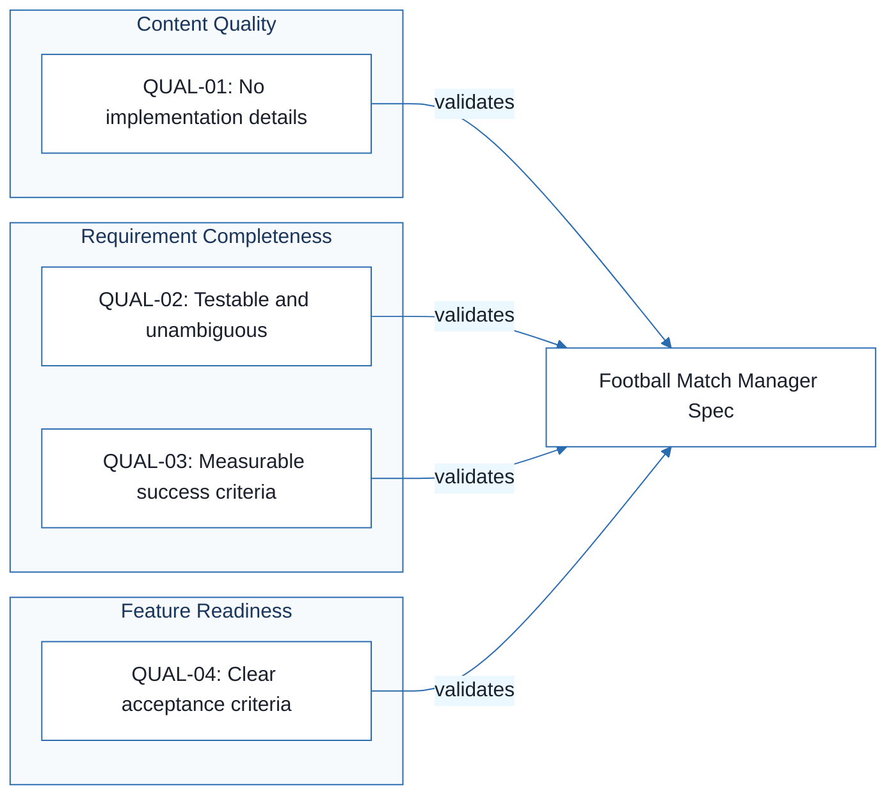

# Football Match Manager - Technical Specification & Architecture Document

## 1. Executive Summary & Architecture Overview

### 1.1 Executive Brief
The 'Football Match Manager' project currently lacks a functional specification. The provided input is exclusively a quality audit checklist intended to validate a separate documentation file. Consequently, there is no defined host platform, data pattern, or core business logic available for architectural synthesis.

### 1.2 Maturity Assessment
The project is critically underdeveloped as the current source is a meta-document (checklist) rather than a technical specification. With high-severity gaps in Goals, Functional Requirements, Non-Functional Requirements, and Scope, and a total absence of relational edges in the graph, the project is BLOCKED. Execution cannot proceed until the actual spec.md is provided.

### 1.3 Technical Stack
*   No languages, frameworks, or databases defined.

### 1.4 Architectural Constraints
*   Specifications must exclude implementation details (languages, frameworks, APIs).
*   Requirements must be testable and unambiguous.
*   Success criteria must be measurable and technology-agnostic.
*   Functional requirements must possess explicit acceptance criteria.

### 1.5 Critical Dependencies
*   Availability of the referenced 'spec.md' source document.
*   Definition of business objectives and core functional requirements.

## 2. Architecture Workflows

```mermaid
%%{init: {
  'theme': 'base',
  'themeVariables': {
    'primaryColor': '#1A365D',
    'primaryTextColor': '#1A202C',
    'primaryBorderColor': '#2B6CB0',
    'lineColor': '#2B6CB0',
    'secondaryColor': '#EBF8FF',
    'tertiaryColor': '#EBF8FF',
    'background': '#FFFFFF',
    'mainBkg': '#FFFFFF',
    'secondBkg': '#EBF8FF',
    'tertiaryBkg': '#F7FAFC',
    'secondaryTextColor': '#4A5568',
    'fontSize': '16px',
    'fontFamily': 'Inter, system-ui, sans-serif',
    'nodePadding': '15px',
    'borderRadius': '8px',
    'edgeLabelBackground': '#EBF8FF',
    'clusterBkg': '#F7FAFC',
    'clusterBorder': '#2B6CB0',
    'defaultLinkColor': '#2B6CB0',
    'titleColor': '#1A365D',
    'actorBorder': '#2B6CB0',
    'actorBkg': '#EBF8FF',
    'actorTextColor': '#1A365D',
    'actorLineColor': '#2B6CB0',
    'signalColor': '#2B6CB0',
    'signalTextColor': '#1A202C',
    'labelBoxBorderColor': '#2B6CB0',
    'labelBoxBkgColor': '#EBF8FF',
    'labelTextColor': '#1A202C',
    'loopTextColor': '#1A202C',
    'arrowHeadColor': '#2B6CB0',
    'sequenceNumberColor': '#1A365D',
    'sequenceActorBorder': '#2B6CB0',
    'sequenceActorBkg': '#EBF8FF',
    'sequenceArrowColor': '#2B6CB0',
    'noteBkgColor': '#FFF5EB',
    'noteBorderColor': '#DD6B20',
    'noteTextColor': '#1A202C'
  }
}}%%
flowchart TD
    START["Start Validation"] --> CHECK_QUAL_01
    CHECK_QUAL_01{"Contains implementation details?"}
    CHECK_QUAL_01 -- "Yes" --> FAIL_01["Violation: QUAL-01"]
    CHECK_QUAL_01 -- "No" --> CHECK_QUAL_02
    CHECK_QUAL_02{"Are requirements testable/unambiguous?"}
    CHECK_QUAL_02 -- "No" --> FAIL_02["Violation: QUAL-02"]
    CHECK_QUAL_02 -- "Yes" --> CHECK_QUAL_03
    CHECK_QUAL_03{"Are success criteria measurable?"}
    CHECK_QUAL_03 -- "No" --> FAIL_03["Violation: QUAL-03"]
    CHECK_QUAL_03 -- "Yes" --> CHECK_QUAL_04
    CHECK_QUAL_04{"Do all FRs have acceptance criteria?"}
    CHECK_QUAL_04 -- "No" --> FAIL_04["Violation: QUAL-04"]
    CHECK_QUAL_04 -- "Yes" --> SUCCESS["Specification Validated"]
    FAIL_01 --> REVISE["Revise Specification"]
    FAIL_02 --> REVISE
    FAIL_03 --> REVISE
    FAIL_04 --> REVISE
    REVISE --> START
    SUCCESS --> END["End Process"]
```

```mermaid
%%{init: {
  'theme': 'base',
  'themeVariables': {
    'primaryColor': '#1A365D',
    'primaryTextColor': '#1A202C',
    'primaryBorderColor': '#2B6CB0',
    'lineColor': '#2B6CB0',
    'secondaryColor': '#EBF8FF',
    'tertiaryColor': '#EBF8FF',
    'background': '#FFFFFF',
    'mainBkg': '#FFFFFF',
    'secondBkg': '#EBF8FF',
    'tertiaryBkg': '#F7FAFC',
    'secondaryTextColor': '#4A5568',
    'fontSize': '16px',
    'fontFamily': 'Inter, system-ui, sans-serif',
    'nodePadding': '15px',
    'borderRadius': '8px',
    'edgeLabelBackground': '#EBF8FF',
    'clusterBkg': '#F7FAFC',
    'clusterBorder': '#2B6CB0',
    'defaultLinkColor': '#2B6CB0',
    'titleColor': '#1A365D',
    'actorBorder': '#2B6CB0',
    'actorBkg': '#EBF8FF',
    'actorTextColor': '#1A365D',
    'actorLineColor': '#2B6CB0',
    'signalColor': '#2B6CB0',
    'signalTextColor': '#1A202C',
    'labelBoxBorderColor': '#2B6CB0',
    'labelBoxBkgColor': '#EBF8FF',
    'labelTextColor': '#1A202C',
    'loopTextColor': '#1A202C',
    'arrowHeadColor': '#2B6CB0',
    'sequenceNumberColor': '#1A365D',
    'sequenceActorBorder': '#2B6CB0',
    'sequenceActorBkg': '#EBF8FF',
    'sequenceArrowColor': '#2B6CB0',
    'noteBkgColor': '#FFF5EB',
    'noteBorderColor': '#DD6B20',
    'noteTextColor': '#1A202C'
  }
}}%%
flowchart LR
    subgraph "Content Quality"
        QUAL-01["QUAL-01: No implementation details"]
    end
    subgraph "Requirement Completeness"
        QUAL-02["QUAL-02: Testable and unambiguous"]
        QUAL-03["QUAL-03: Measurable success criteria"]
    end
    subgraph "Feature Readiness"
        QUAL-04["QUAL-04: Clear acceptance criteria"]
    end
    QUAL-01 -->|"validates"| SPEC["Football Match Manager Spec"]
    QUAL-02 -->|"validates"| SPEC
    QUAL-03 -->|"validates"| SPEC
    QUAL-04 -->|"validates"| SPEC
``` & Visual Diagrams

### 2.1 Specification Quality Validation Workflow
A workflow representing the validation process of the Football Match Manager specification based on the quality constraints.

```mermaid
%%{init: {
  'theme': 'base',
  'themeVariables': {
    'primaryColor': '#1A365D',
    'primaryTextColor': '#1A202C',
    'primaryBorderColor': '#2B6CB0',
    'lineColor': '#2B6CB0',
    'secondaryColor': '#EBF8FF',
    'tertiaryColor': '#EBF8FF',
    'background': '#FFFFFF',
    'mainBkg': '#FFFFFF',
    'secondBkg': '#EBF8FF',
    'tertiaryBkg': '#F7FAFC',
    'secondaryTextColor': '#4A5568',
    'fontSize': '16px',
    'fontFamily': 'Inter, system-ui, sans-serif',
    'nodePadding': '15px',
    'borderRadius': '8px',
    'edgeLabelBackground': '#EBF8FF',
    'clusterBkg': '#F7FAFC',
    'clusterBorder': '#2B6CB0',
    'defaultLinkColor': '#2B6CB0',
    'titleColor': '#1A365D',
    'actorBorder': '#2B6CB0',
    'actorBkg': '#EBF8FF',
    'actorTextColor': '#1A365D',
    'actorLineColor': '#2B6CB0',
    'signalColor': '#2B6CB0',
    'signalTextColor': '#1A202C',
    'labelBoxBorderColor': '#2B6CB0',
    'labelBoxBkgColor': '#EBF8FF',
    'labelTextColor': '#1A202C',
    'loopTextColor': '#1A202C',
    'arrowHeadColor': '#2B6CB0',
    'sequenceNumberColor': '#1A365D',
    'sequenceActorBorder': '#2B6CB0',
    'sequenceActorBkg': '#EBF8FF',
    'sequenceArrowColor': '#2B6CB0',
    'noteBkgColor': '#FFF5EB',
    'noteBorderColor': '#DD6B20',
    'noteTextColor': '#1A202C'
  }
}}%%
flowchart TD
    START["Start Validation"] --> CHECK_QUAL_01
    CHECK_QUAL_01{"Contains implementation details?"}
    CHECK_QUAL_01 -- "Yes" --> FAIL_01["Violation: QUAL-01"]
    CHECK_QUAL_01 -- "No" --> CHECK_QUAL_02
    CHECK_QUAL_02{"Are requirements testable/unambiguous?"}
    CHECK_QUAL_02 -- "No" --> FAIL_02["Violation: QUAL-02"]
    CHECK_QUAL_02 -- "Yes" --> CHECK_QUAL_03
    CHECK_QUAL_03{"Are success criteria measurable?"}
    CHECK_QUAL_03 -- "No" --> FAIL_03["Violation: QUAL-03"]
    CHECK_QUAL_03 -- "Yes" --> CHECK_QUAL_04
    CHECK_QUAL_04{"Do all FRs have acceptance criteria?"}
    CHECK_QUAL_04 -- "No" --> FAIL_04["Violation: QUAL-04"]
    CHECK_QUAL_04 -- "Yes" --> SUCCESS["Specification Validated"]
    FAIL_01 --> REVISE["Revise Specification"]
    FAIL_02 --> REVISE
    FAIL_03 --> REVISE
    FAIL_04 --> REVISE
    REVISE --> START
    SUCCESS --> END["End Process"]
```

### 2.2 Quality Constraint Traceability
Mapping of quality constraints to their respective validation sections.



## 3. Detailed Technical Specifications & Business Rules

### 3.1 Requirements Traceability
| Identifier | Type | Description | Source Section |
| :--- | :--- | :--- | :--- |
| QUAL-01 | Constraint | The specification must contain no implementation details (languages, frameworks, APIs). | Content Quality |
| QUAL-02 | Constraint | Requirements must be testable and unambiguous. | Requirement Completeness |
| QUAL-03 | Constraint | Success criteria must be measurable and technology-agnostic. | Requirement Completeness |
| QUAL-04 | Constraint | All functional requirements must have clear acceptance criteria. | Feature Readiness |

### 3.2 Security Rules
No security rules defined in the source documentation.

### 3.3 Data Models
No data models defined in the source documentation.

## 4. Project Governance & Structural Gaps

### 4.1 Structural Gaps
| Missing Section | Priority | Remediation Advice |
| :--- | :--- | :--- |
| Goals & Objectives | HIGH | The document is a checklist, not a spec. Provide the actual project goals and business objectives. |
| Functional Requirements | HIGH | Provide the detailed functional requirements for the Football Match Manager. |
| Non-Functional Requirements | HIGH | Define the performance, security, and availability requirements. |
| Scope & Out-of-Scope | HIGH | Clearly define what the feature will and will not do. |
| Open Questions & Uncertainties | MEDIUM | List any known unknowns or pending decisions. |

### 4.2 Remediation & Workflow
The project is currently in a "Blocked" state. The primary remediation step is the provision of the `spec.md` file. Once the functional specification is available, it must be audited against the `QUAL-01` through `QUAL-04` constraints before technical architecture can be designed.

## 5. Technical & Domain Glossary (Terminology Reference)

| Term | Category | Context Anchor | Project Definition |
| :--- | :--- | :--- | :--- |
| Feature | BUSINESS_DOMAIN | QUAL-04 | A distinct unit of system functionality that must satisfy specific measurable outcomes and possess validated acceptance criteria prior to technical planning. |