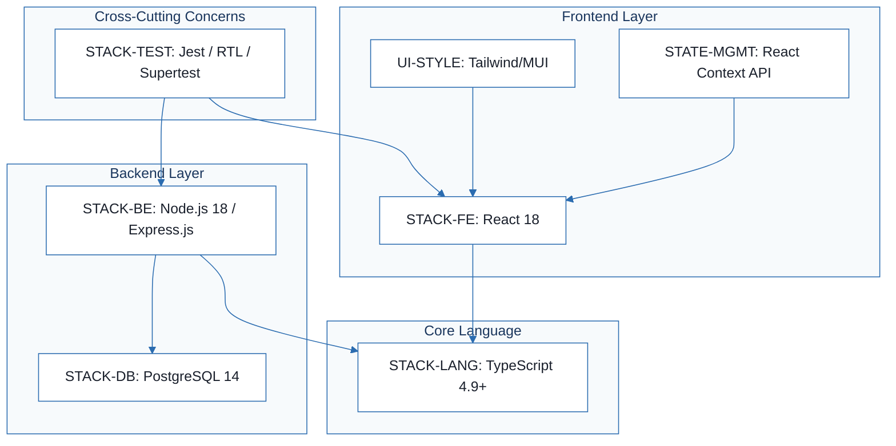
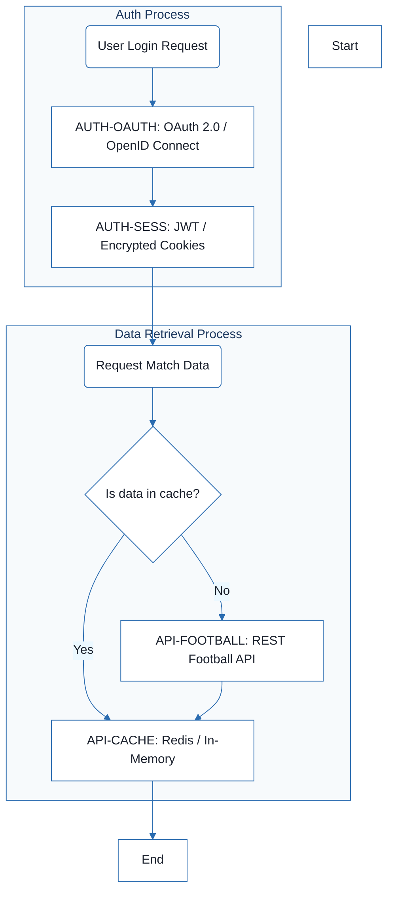
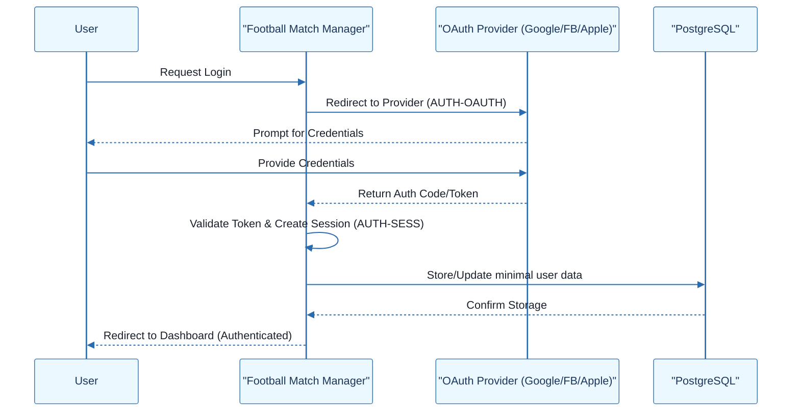
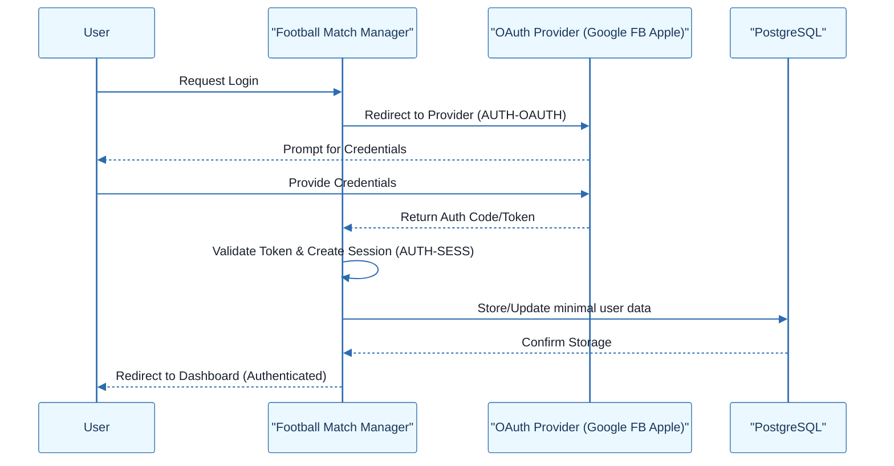
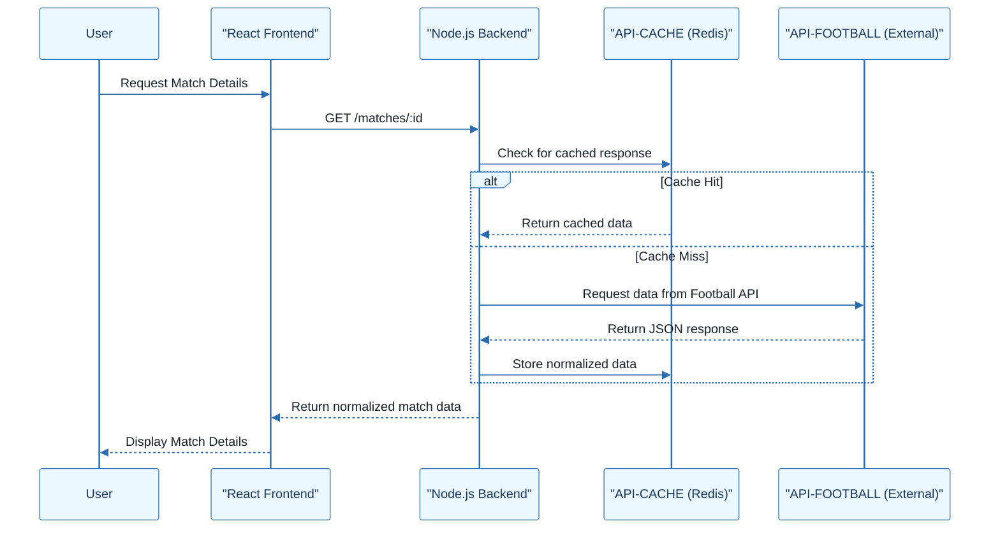

# Football Match Manager - Technical Specification & Architecture Document

## 1. Executive Summary & Architecture Overview

### 1.1 Executive Brief
The Football Match Manager is a full-stack application designed for managing football match data and user follows. Built on a TypeScript-centric architecture, it utilizes a React 18 frontend and a Node.js/Express backend, leveraging PostgreSQL for relational data integrity and a RESTful service layer for external sports data integration.

### 1.2 Maturity Assessment
The project is currently **BLOCKED**. While the technical stack is comprehensively defined, there is a critical absence of business logic and functional scope. The specifications are currently a technology decision log; they lack goals, objectives, and a defined feature set, meaning the "what" to build is unknown despite the "how" being decided.

### 1.3 Technical Stack
* **Languages & Frameworks**:
    * TypeScript 4.9
    * React 18
    * Node.js 18
    * Express.js
    * PostgreSQL 14
    * Sequelize / TypeORM
    * Jest
    * React Testing Library
    * Supertest
    * Passport.js
    * Redis
    * Tailwind CSS / Material-UI

### 1.4 Architectural Constraints
* Strict static type checking via TypeScript 4.9+.
* ACID compliance for match data and user follows via PostgreSQL.
* Secure session management via JWT or encrypted cookies.
* Mandatory HTTPS and CSRF protection for authentication.
* RESTful API abstraction layer with integrated caching (Redis/In-memory).
* Rate limiting and retry mechanisms for external football API calls.
* Global state management constrained to React Context API.

### 1.5 Critical Dependencies
* OAuth 2.0 / OpenID Connect providers (Google, Facebook, Apple).
* External Football Data API (Football-Data.org or API-FOOTBALL).
* Redis for API response caching.
* Relational mapping between Users and followed Match entities.
* Dependency of Frontend state and UI on React 18 core runtime.

## 2. Architecture Workflows







```mermaid
%%{init: {
  'theme': 'base',
  'themeVariables': {
    'primaryColor': '#1A365D',
    'primaryTextColor': '#1A202C',
    'primaryBorderColor': '#2B6CB0',
    'lineColor': '#2B6CB0',
    'secondaryColor': '#EBF8FF',
    'tertiaryColor': '#EBF8FF',
    'background': '#FFFFFF',
    'mainBkg': '#FFFFFF',
    'secondBkg': '#EBF8FF',
    'tertiaryBkg': '#F7FAFC',
    'secondaryTextColor': '#4A5568',
    'fontSize': '16px',
    'fontFamily': 'Inter, system-ui, sans-serif',
    'nodePadding': '15px',
    'borderRadius': '8px',
    'edgeLabelBackground': '#EBF8FF',
    'clusterBkg': '#F7FAFC',
    'clusterBorder': '#2B6CB0',
    'defaultLinkColor': '#2B6CB0',
    'titleColor': '#1A365D',
    'actorBorder': '#2B6CB0',
    'actorBkg': '#EBF8FF',
    'actorTextColor': '#1A365D',
    'actorLineColor': '#2B6CB0',
    'signalColor': '#2B6CB0',
    'signalTextColor': '#1A202C',
    'labelBoxBorderColor': '#2B6CB0',
    'labelBoxBkgColor': '#EBF8FF',
    'labelTextColor': '#1A202C',
    'loopTextColor': '#1A202C',
    'arrowHeadColor': '#2B6CB0',
    'sequenceNumberColor': '#1A365D',
    'sequenceActorBorder': '#2B6CB0',
    'sequenceActorBkg': '#EBF8FF',
    'sequenceArrowColor': '#2B6CB0',
    'noteBkgColor': '#FFF5EB',
    'noteBorderColor': '#DD6B20',
    'noteTextColor': '#1A202C'
  }
}}%%
sequenceDiagram
    participant User
    participant FE as "React Frontend"
    participant BE as "Node.js Backend"
    participant Cache as "API-CACHE (Redis)"
    participant API as "API-FOOTBALL (External)"
    User->>FE: Request Match Details
    FE->>BE: GET /matches/:id
    BE->>Cache: Check for cached response
    alt Cache Hit
        Cache-->>BE: Return cached data
    else Cache Miss
        BE->>API: Request data from Football API
        API-->>BE: Return JSON response
        BE->>Cache: Store normalized data
    end
    BE-->>FE: Return normalized match data
    FE-->>User: Display Match Details
``` & Visual Diagrams

### 2.1 Technical Stack Dependency Map
```mermaid
%%{init: {
  'theme': 'base',
  'themeVariables': {
    'primaryColor': '#1A365D',
    'primaryTextColor': '#1A202C',
    'primaryBorderColor': '#2B6CB0',
    'lineColor': '#2B6CB0',
    'secondaryColor': '#EBF8FF',
    'tertiaryColor': '#EBF8FF',
    'background': '#FFFFFF',
    'mainBkg': '#FFFFFF',
    'secondBkg': '#EBF8FF',
    'tertiaryBkg': '#F7FAFC',
    'secondaryTextColor': '#4A5568',
    'fontSize': '16px',
    'fontFamily': 'Inter, system-ui, sans-serif',
    'nodePadding': '15px',
    'borderRadius': '8px',
    'edgeLabelBackground': '#EBF8FF',
    'clusterBkg': '#F7FAFC',
    'clusterBorder': '#2B6CB0',
    'defaultLinkColor': '#2B6CB0',
    'titleColor': '#1A365D',
    'actorBorder': '#2B6CB0',
    'actorBkg': '#EBF8FF',
    'actorTextColor': '#1A365D',
    'actorLineColor': '#2B6CB0',
    'signalColor': '#2B6CB0',
    'signalTextColor': '#1A202C',
    'labelBoxBorderColor': '#2B6CB0',
    'labelBoxBkgColor': '#EBF8FF',
    'labelTextColor': '#1A202C',
    'loopTextColor': '#1A202C',
    'arrowHeadColor': '#2B6CB0',
    'sequenceNumberColor': '#1A365D',
    'sequenceActorBorder': '#2B6CB0',
    'sequenceActorBkg': '#EBF8FF',
    'sequenceArrowColor': '#2B6CB0',
    'noteBkgColor': '#FFF5EB',
    'noteBorderColor': '#DD6B20',
    'noteTextColor': '#1A202C'
  }
}}%%
flowchart TD
    subgraph "Core Language"
        STACK-LANG["STACK-LANG: TypeScript 4.9+"]
    end
    subgraph "Frontend Layer"
        STACK-FE["STACK-FE: React 18"]
        STATE-MGMT["STATE-MGMT: React Context API"]
        UI-STYLE["UI-STYLE: Tailwind/MUI"]
    end
    subgraph "Backend Layer"
        STACK-BE["STACK-BE: Node.js 18 / Express.js"]
        STACK-DB["STACK-DB: PostgreSQL 14"]
    end
    subgraph "Cross-Cutting Concerns"
        STACK-TEST["STACK-TEST: Jest / RTL / Supertest"]
    end
    STACK-FE --> STACK-LANG
    STACK-BE --> STACK-LANG
    STATE-MGMT --> STACK-FE
    UI-STYLE --> STACK-FE
    STACK-TEST --> STACK-FE
    STACK-TEST --> STACK-BE
    STACK-BE --> STACK-DB
```

### 2.2 Authentication & API Integration Flow


### 2.3 Authentication Sequence


### 2.4 Data Integration Sequence


## 3. Detailed Technical Specifications & Business Rules

### 3.1 Requirements Traceability
| ID | Requirement Description | Category | Source Section |
| :--- | :--- | :--- | :--- |
| STACK-LANG | Use TypeScript 4.9+ for static type checking and maintainability. | Non-Functional | 1. Language/Version |
| STACK-FE | Frontend developed with React 18 and TypeScript. | Non-Functional | 2. Primary Dependencies |
| STACK-BE | Backend developed with Node.js 18 and Express.js. | Non-Functional | 2. Primary Dependencies |
| STACK-DB | Use PostgreSQL 14 with Sequelize or TypeORM for relational data storage and ACID compliance. | Non-Functional | 3. Storage: Database Choice |
| STACK-TEST | Use Jest for both Frontend and Backend testing, with React Testing Library (FE) and Supertest (BE). | Non-Functional | 4. Testing: Testing Framework |
| AUTH-OAUTH | Implement Third-party login using OAuth 2.0 / OpenID Connect via passport.js (Google, Facebook, Apple). | Functional | Authentication Integration |
| AUTH-SESS | Secure session management using JWT or encrypted cookies with HTTPS and CSRF protection. | Functional | Authentication Integration |
| API-FOOTBALL | Integrate a RESTful Football Data API (e.g., Football-Data.org) with a service layer abstraction. | Functional | Football Data API Integration |
| API-CACHE | Implement caching (Redis or in-memory) and rate-limiting for API requests. | Functional | Football Data API Integration |
| STATE-MGMT | Use React Context API for global state management (Auth and followed matches). | Non-Functional | State Management (Frontend) |
| UI-STYLE | Use Tailwind CSS or Material-UI (MUI) for the user interface styling. | Non-Functional | Styling and UI Framework |

### 3.2 Security Rules
* **Authentication**: Mandatory use of OAuth 2.0 / OpenID Connect for third-party identity providers.
* **Session Integrity**: Sessions must be managed via JWT or encrypted cookies.
* **Transport & Access**: All authentication traffic must be over HTTPS.
* **Attack Mitigation**: Implementation of CSRF (Cross-Site Request Forgery) protection is required.

### 3.3 Data Models
* **Relational Model**: PostgreSQL 14 is mandated to ensure ACID compliance for critical entities (Users, Matches, Follows).
* **Semi-Structured Data**: Use of `JSONB` columns in PostgreSQL for flexible storage of external API responses.
* **Normalization**: API responses from external providers must be normalized to internal data models before storage or delivery to the frontend.

## 4. Project Governance & Structural Gaps

### 4.1 Structural Gaps
| Gap | Priority | Remediation Advice |
| :--- | :--- | :--- |
| Goals & Objectives | HIGH | The document describes the 'How' but not the business 'Why' or the primary goals of the Football Match Manager. |
| Scope & Out-of-Scope | HIGH | Define exactly which football features are included and which are explicitly excluded. |
| Open Questions & Uncertainties | MEDIUM | Identify unresolved decisions, specifically the final choice between Tailwind/MUI and the specific Football API provider. |

### 4.2 Remediation & Workflow
To move the project from **BLOCKED** to **ACTIVE**, the following workflow is required:
1. Define the Product Vision and primary business goals.
2. Establish a Functional Requirements Document (FRD) detailing the "What".
3. Resolve the pending technical choices (Tailwind vs MUI, specific API provider).
4. Map the functional requirements to the existing technical stack.

## 5. Technical & Domain Glossary (Terminology Reference)

| Term | Category | Context Anchor | Project Definition |
| :--- | :--- | :--- | :--- |
| ACID | TECHNICAL_STACK | STACK-DB | A set of properties ensuring reliable transaction-processing for match and follower data integrity. |
| API | TECHNICAL_STACK | API-FOOTBALL | The interface used to fetch external football data via a service layer abstraction. |
| BE | TECHNICAL_STACK | STACK-BE | The server-side logic powered by Node.js and Express.js. |
| CSRF | TECHNICAL_STACK | AUTH-SESS | A security mechanism preventing unauthorized command transmission from a user's browser. |
| CSS | TECHNICAL_STACK | UI-STYLE | The styling layer implemented via utility-first or pre-built component frameworks. |
| FE | TECHNICAL_STACK | STACK-FE | The client-side interface developed using React 18. |
| ID | BUSINESS_DOMAIN | Authentication Integration (Third-party Login) | The unique alphanumeric identifier used to link a third-party account to internal user records. |
| JSON | TECHNICAL_STACK | STACK-DB | The lightweight data-interchange format used for external API responses. |
| JSONB | TECHNICAL_STACK | STACK-DB | The binary storage format used in the relational database for flexible, indexed semi-structured data. |
| JWT | TECHNICAL_STACK | AUTH-SESS | A compact, URL-safe means of representing claims to be transferred between two parties for session management. |
| JavaScript | TECHNICAL_STACK | STACK-LANG | The baseline scripting language rejected as the primary development target in favor of a typed alternative. |
| LTS | TECHNICAL_STACK | STACK-BE | The long-term support version of the runtime environment, specifically version 18. |
| MUI | TECHNICAL_STACK | UI-STYLE | A library providing pre-built components based on Material Design guidelines. |
| OAuth 2.0 | TECHNICAL_STACK | AUTH-OAUTH | The authorization framework enabling third-party logins via Google, Facebook, and Apple. |
| ORM | TECHNICAL_STACK | STACK-DB | An abstraction layer using Sequelize or TypeORM to manage database interactions and migrations. |
| PostgreSQL | TECHNICAL_STACK | STACK-DB | The relational database management system used for structured match and team data. |
| React | TECHNICAL_STACK | STACK-FE | The frontend library version 18 utilized for building the user interface. |
| TypeScript | TECHNICAL_STACK | STACK-LANG | The strongly typed superset of the baseline scripting language, version 4.9+, used for both application layers. |
| UI | TECHNICAL_STACK | UI-STYLE | The visual layer styled via Tailwind or Material components. |
| Vue | TECHNICAL_STACK | STACK-FE | The alternative frontend framework rejected due to a lack of team expertise. |