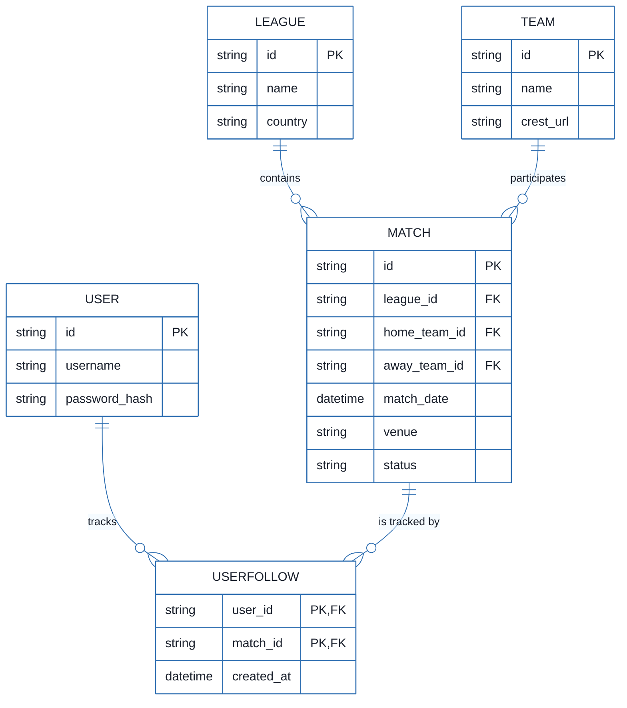
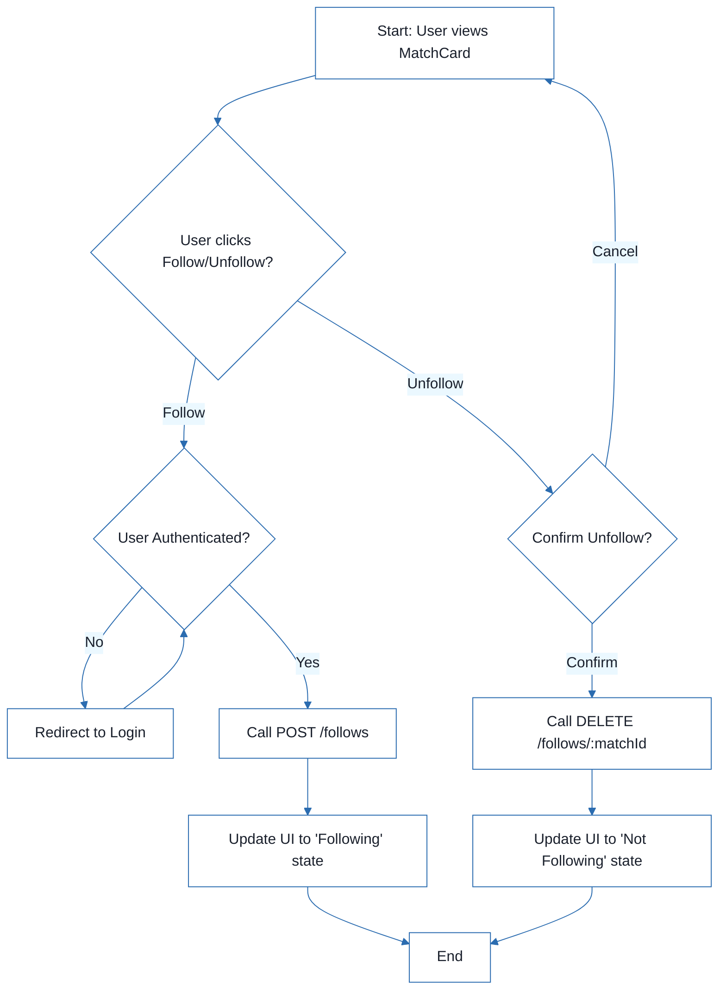
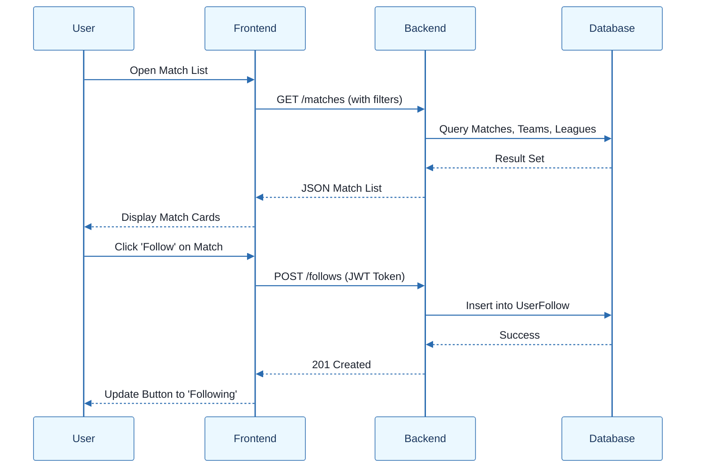

# Football Match Manager - Technical Specification & Architecture Document

## 1. Executive Summary & Architecture Overview

### 1.1 Executive Brief
The Football Match Manager is a full-stack tracking application designed to enable users to view, filter, and follow football matches. It utilizes a Node.js/PostgreSQL backend and a React frontend. The system centers on a relational data pattern where users manage personal interests through a follow-mechanism, linking identities to match and league entities.

### 1.2 Maturity Assessment
The specifications are highly structured and logically sequenced, showing a strong alignment between user stories and technical tasks. However, the architecture is in a REFINEMENT state due to missing detailed acceptance criteria and a lack of explicit security constraints such as JWT expiration and API rate limiting. While the operational flow is READY, these gaps prevent a final production-grade sign-off.

### 1.3 Technical Stack
* Node.js 18
* Express.js
* TypeScript 4.9
* React 18
* PostgreSQL
* Vite
* ESLint
* Prettier
* JWT

### 1.4 Architectural Constraints
* Backend project must strictly use Node.js 18 and TypeScript 4.9.
* Frontend development must be configured via Vite.
* All user story implementations are blocked until Phase 2 (Foundational) is fully complete.
* Mandatory implementation of JWT authentication middleware for protected follow-actions.
* API routing must follow the defined structure: auth, matches, follows, teams, leagues.
* Project structure must strictly adhere to `backend/src/` and `frontend/src/` path conventions.

### 1.5 Critical Dependencies
* PostgreSQL database schema and migrations framework.
* Backend environment variables (.env file).
* JWT for session authentication and authorization.
* Referential integrity between User, Match, and UserFollow entities.
* Cascading dependencies: Phase 2 completion is a hard gate for all User Story tasks (T021-T056).
* Frontend state management for 'Following' status dependent on FollowService responses.

## 2. Architecture Workflows

```mermaid
%%{init: {
  'theme': 'base',
  'themeVariables': {
    'primaryColor': '#1A365D',
    'primaryTextColor': '#1A202C',
    'primaryBorderColor': '#2B6CB0',
    'lineColor': '#2B6CB0',
    'secondaryColor': '#EBF8FF',
    'tertiaryColor': '#EBF8FF',
    'background': '#FFFFFF',
    'mainBkg': '#FFFFFF',
    'secondBkg': '#EBF8FF',
    'tertiaryBkg': '#F7FAFC',
    'secondaryTextColor': '#4A5568',
    'fontSize': '16px',
    'fontFamily': 'Inter, system-ui, sans-serif',
    'nodePadding': '15px',
    'borderRadius': '8px',
    'edgeLabelBackground': '#EBF8FF',
    'clusterBkg': '#F7FAFC',
    'clusterBorder': '#2B6CB0',
    'defaultLinkColor': '#2B6CB0',
    'titleColor': '#1A365D',
    'actorBorder': '#2B6CB0',
    'actorBkg': '#EBF8FF',
    'actorTextColor': '#1A365D',
    'actorLineColor': '#2B6CB0',
    'signalColor': '#2B6CB0',
    'signalTextColor': '#1A202C',
    'labelBoxBorderColor': '#2B6CB0',
    'labelBoxBkgColor': '#EBF8FF',
    'labelTextColor': '#1A202C',
    'loopTextColor': '#1A202C',
    'arrowHeadColor': '#2B6CB0',
    'sequenceNumberColor': '#1A365D',
    'sequenceActorBorder': '#2B6CB0',
    'sequenceActorBkg': '#EBF8FF',
    'sequenceArrowColor': '#2B6CB0',
    'noteBkgColor': '#FFF5EB',
    'noteBorderColor': '#DD6B20',
    'noteTextColor': '#1A202C'
  }
}}%%
flowchart LR
    subgraph "Phase 1 & 2: Infrastructure"
        T001["T001: Project Structure"]
        T010["T010: Setup Instructions"]
        T020["T020: Seed Data"]
    end
    subgraph "Phase 3: US1 - Viewing Matches"
        T021["T021: Match Model"]
        T025["T025: GET /matches"]
        T030["T030: Filter UI"]
    end
    subgraph "Phase 4: US2 - Adding Interests"
        T031["T031: User Model"]
        T035["T035: POST /follows"]
        T039["T039: State Management"]
    end
    subgraph "Phase 5: US3 - Removing Interests"
        T040["T040: DELETE /follows/:id"]
        T044["T044: Confirmation Dialog"]
    end
    subgraph "Phase 6: US4 - Match Details"
        T045["T045: GET /matches/:id"]
        T050["T050: Match Status/Scores"]
    end
    subgraph "Phase 7: US5 - Followed Matches"
        T051["T051: GET /follows"]
        T056["T056: Navigation to My Matches"]
    end
    T001 --> T010
    T010 --> T020
    T020 --> T021
    T020 --> T025
    T020 --> T030
    T030 --> T031
    T030 --> T035
    T030 --> T039
    T039 --> T040
    T039 --> T044
    T044 --> T045
    T044 --> T050
    T050 --> T051
    T050 --> T056
```







```mermaid
%%{init: {
  'theme': 'base',
  'themeVariables': {
    'primaryColor': '#1A365D',
    'primaryTextColor': '#1A202C',
    'primaryBorderColor': '#2B6CB0',
    'lineColor': '#2B6CB0',
    'secondaryColor': '#EBF8FF',
    'tertiaryColor': '#EBF8FF',
    'background': '#FFFFFF',
    'mainBkg': '#FFFFFF',
    'secondBkg': '#EBF8FF',
    'tertiaryBkg': '#F7FAFC',
    'secondaryTextColor': '#4A5568',
    'fontSize': '16px',
    'fontFamily': 'Inter, system-ui, sans-serif',
    'nodePadding': '15px',
    'borderRadius': '8px',
    'edgeLabelBackground': '#EBF8FF',
    'clusterBkg': '#F7FAFC',
    'clusterBorder': '#2B6CB0',
    'defaultLinkColor': '#2B6CB0',
    'titleColor': '#1A365D',
    'actorBorder': '#2B6CB0',
    'actorBkg': '#EBF8FF',
    'actorTextColor': '#1A365D',
    'actorLineColor': '#2B6CB0',
    'signalColor': '#2B6CB0',
    'signalTextColor': '#1A202C',
    'labelBoxBorderColor': '#2B6CB0',
    'labelBoxBkgColor': '#EBF8FF',
    'labelTextColor': '#1A202C',
    'loopTextColor': '#1A202C',
    'arrowHeadColor': '#2B6CB0',
    'sequenceNumberColor': '#1A365D',
    'sequenceActorBorder': '#2B6CB0',
    'sequenceActorBkg': '#EBF8FF',
    'sequenceArrowColor': '#2B6CB0',
    'noteBkgColor': '#FFF5EB',
    'noteBorderColor': '#DD6B20',
    'noteTextColor': '#1A202C'
  }
}}%%
sequenceDiagram
    participant User
    participant Frontend
    participant Backend
    participant Database
    User->>Frontend: Open Match List
    Frontend->>Backend: GET /matches (with filters)
    Backend->>Database: Query Matches, Teams, Leagues
    Database-->>Backend: Result Set
    Backend-->>Frontend: JSON Match List
    Frontend-->>User: Display Match Cards
    User->>Frontend: Click 'Follow' on Match
    Frontend->>Backend: POST /follows (JWT Token)
    Backend->>Database: Insert into UserFollow
    Database-->>Backend: Success
    Backend-->>Frontend: 201 Created
    Frontend-->>User: Update Button to 'Following'
``` & Visual Diagrams

### 2.1 Data Model
The following ER diagram defines the relational structure of the system, focusing on the tracking mechanism.
```mermaid
%%{init: {
  'theme': 'base',
  'themeVariables': {
    'primaryColor': '#1A365D',
    'primaryTextColor': '#1A202C',
    'primaryBorderColor': '#2B6CB0',
    'lineColor': '#2B6CB0',
    'secondaryColor': '#EBF8FF',
    'tertiaryColor': '#EBF8FF',
    'background': '#FFFFFF',
    'mainBkg': '#FFFFFF',
    'secondBkg': '#EBF8FF',
    'tertiaryBkg': '#F7FAFC',
    'secondaryTextColor': '#4A5568',
    'fontSize': '16px',
    'fontFamily': 'Inter, system-ui, sans-serif',
    'nodePadding': '15px',
    'borderRadius': '8px',
    'edgeLabelBackground': '#EBF8FF',
    'clusterBkg': '#F7FAFC',
    'clusterBorder': '#2B6CB0',
    'defaultLinkColor': '#2B6CB0',
    'titleColor': '#1A365D',
    'actorBorder': '#2B6CB0',
    'actorBkg': '#EBF8FF',
    'actorTextColor': '#1A365D',
    'actorLineColor': '#2B6CB0',
    'signalColor': '#2B6CB0',
    'signalTextColor': '#1A202C',
    'labelBoxBorderColor': '#2B6CB0',
    'labelBoxBkgColor': '#EBF8FF',
    'labelTextColor': '#1A202C',
    'loopTextColor': '#1A202C',
    'arrowHeadColor': '#2B6CB0',
    'sequenceNumberColor': '#1A365D',
    'sequenceActorBorder': '#2B6CB0',
    'sequenceActorBkg': '#EBF8FF',
    'sequenceArrowColor': '#2B6CB0',
    'noteBkgColor': '#FFF5EB',
    'noteBorderColor': '#DD6B20',
    'noteTextColor': '#1A202C'
  }
}}%%
erDiagram
    USER ||--o{ USERFOLLOW : "tracks"
    MATCH ||--o{ USERFOLLOW : "is tracked by"
    LEAGUE ||--o{ MATCH : "contains"
    TEAM ||--o{ MATCH : "participates"
    USER {
        string id PK
        string username
        string password_hash
    }
    MATCH {
        string id PK
        string league_id FK
        string home_team_id FK
        string away_team_id FK
        datetime match_date
        string venue
        string status
    }
    TEAM {
        string id PK
        string name
        string crest_url
    }
    LEAGUE {
        string id PK
        string name
        string country
    }
    USERFOLLOW {
        string user_id PK,FK
        string match_id PK,FK
        datetime created_at
    }
```

### 2.2 Match Interest Workflow
Business logic for adding and removing matches from user interests.


### 2.3 Implementation Traceability Map
Mapping from infrastructure setup to User Story delivery.


### 2.4 API Interaction Sequence
Sequence of interactions for viewing and following a match.


## 3. Detailed Technical Specifications & Business Rules

### 3.1 Requirements Traceability
| ID | Story/Phase | Description |
| :--- | :--- | :--- |
| T001 | PHASE-1 | Create project structure per implementation plan |
| T002 | PHASE-1 | Initialize backend project with Node.js 18, Express.js, TypeScript 4.9 dependencies |
| T003 | PHASE-1 | Initialize frontend project with React 18, TypeScript dependencies |
| T004 | PHASE-1 | Configure ESLint and Prettier for code quality |
| T005 | PHASE-1 | Setup TypeScript configuration for backend (tsconfig.json) |
| T006 | PHASE-1 | Setup TypeScript configuration for frontend (tsconfig.json) |
| T007 | PHASE-1 | Configure Vite for frontend development |
| T008 | PHASE-1 | Create .env file for backend environment variables |
| T009 | PHASE-1 | Setup package.json scripts for dev, build, test |
| T010 | PHASE-1 | Create README.md with setup instructions |
| T011 | PHASE-2 | Setup PostgreSQL database schema and migrations framework |
| T012 | PHASE-2 | Create database models for Match, Team, League, User, UserFollow entities |
| T013 | PHASE-2 | Implement database connection and configuration |
| T014 | PHASE-2 | Setup Express.js middleware (cors, morgan, json) |
| T015 | PHASE-2 | Create base Express app structure in backend/src/app.ts |
| T016 | PHASE-2 | Create server entry point in backend/src/server.ts |
| T017 | PHASE-2 | Setup JWT authentication middleware |
| T018 | PHASE-2 | Create error handling middleware |
| T019 | PHASE-2 | Setup API routes structure (auth, matches, follows, teams, leagues) |
| T020 | PHASE-2 | Create initial seed data for teams, leagues, and matches |
| T021 | US1 | Create Match model in backend/src/models/Match.ts |
| T022 | US1 | Create Team model in backend/src/models/Team.ts |
| T023 | US1 | Create League model in backend/src/models/League.ts |
| T024 | US1 | Implement MatchService in backend/src/services/MatchService.ts |
| T025 | US1 | Create GET /matches endpoint in backend/src/routes/matches.ts |
| T026 | US1 | Implement match filtering logic (by league, date, search) |
| T027 | US1 | Create MatchList component in frontend/src/components/MatchList.tsx |
| T028 | US1 | Create MatchCard component in frontend/src/components/MatchCard.tsx |
| T029 | US1 | Implement match listing in frontend/src/App.tsx |
| T030 | US1 | Add filter UI for league and date in frontend/src/App.tsx |
| T031 | US2 | Create User model in backend/src/models/User.ts |
| T032 | US2 | Create UserFollow model in backend/src/models/UserFollow.ts |
| T033 | US2 | Implement AuthService in backend/src/services/AuthService.ts |
| T034 | US2 | Implement FollowService in backend/src/services/FollowService.ts |
| T035 | US2 | Create POST /follows endpoint in backend/src/routes/follows.ts |
| T036 | US2 | Create FollowButton component in frontend/src/components/FollowButton.tsx |
| T037 | US2 | Add follow functionality to MatchCard component |
| T038 | US2 | Implement JWT authentication in frontend |
| T039 | US2 | Add "Following" state management in frontend |
| T040 | US3 | Create DELETE /follows/:matchId endpoint in backend/src/routes/follows.ts |
| T041 | US3 | Implement unfollow logic in FollowService |
| T042 | US3 | Add unfollow functionality to FollowButton component |
| T043 | US3 | Update match status in UI after unfollowing |
| T044 | US3 | Add confirmation dialog for unfollow action |
| T045 | US4 | Create GET /matches/:id endpoint in backend/src/routes/matches.ts |
| T046 | US4 | Implement match detail retrieval in MatchService |
| T047 | US4 | Create MatchDetail component in frontend/src/components/MatchDetail.tsx |
| T048 | US4 | Create match detail page/route in frontend/src/App.tsx |
| T049 | US4 | Display team crests, venue, league info in MatchDetail |
| T050 | US4 | Show match status and scores (if finished) |
| T051 | US5 | Create GET /follows endpoint in backend/src/routes/follows.ts |
| T052 | US5 | Implement get followed matches in FollowService |
| T053 | US5 | Create FollowedMatches component in frontend/src/components/FollowedMatches.tsx |
| T054 | US5 | Create "My Matches" page in frontend/src/App.tsx |
| T055 | US5 | Display followed matches with status indicators |
| T056 | US5 | Add navigation to followed matches page |
| T057 | PHASE-8 | Add unit tests for MatchService |
| T058 | PHASE-8 | Add unit tests for FollowService |
| T059 | PHASE-8 | Add integration tests for API endpoints |
| T060 | PHASE-8 | Add frontend unit tests for components |
| T061 | PHASE-8 | Implement error handling and user feedback |
| T062 | PHASE-8 | Add loading states and spinners |
| T063 | PHASE-8 | Implement responsive design for mobile |
| T064 | PHASE-8 | Add accessibility attributes (ARIA labels) |
| T065 | PHASE-8 | Create API documentation (Swagger/OpenAPI) |
| T066 | PHASE-8 | Update README with API usage examples |
| T067 | PHASE-8 | Add .gitignore for node_modules, .env, etc. |
| T068 | PHASE-8 | Setup ESLint and Prettier configurations |
| T069 | PHASE-8 | Run final code quality checks |
| T070 | PHASE-8 | Create deployment configuration (Dockerfile, docker-compose) |

### 3.2 Security Rules
* **Authentication**: All "follow" and "unfollow" actions must be protected by JWT authentication middleware (T017).
* **Authorization**: Users can only delete their own follow records (T040).
* **Data Integrity**: Referential integrity must be maintained between `User`, `Match`, and `UserFollow` entities (T012).

### 3.3 Data Models
The system utilizes a relational PostgreSQL schema:
* **User**: Stores identity and credentials (`id`, `username`, `password_hash`).
* **Match**: Stores event details (`id`, `league_id`, `home_team_id`, `away_team_id`, `match_date`, `venue`, `status`).
* **Team**: Stores club information (`id`, `name`, `crest_url`).
* **League**: Stores competition details (`id`, `name`, `country`).
* **UserFollow**: Junction table for tracking interests (`user_id`, `match_id`, `created_at`).

## 4. Project Governance & Structural Gaps

### 4.1 Structural Gaps
| Gap | Priority | Remediation Advice |
| :--- | :--- | :--- |
| Acceptance Criteria | MEDIUM | Define specific acceptance criteria for each User Story beyond the 'Independent Test' summary. |
| Testing & Validation | MEDIUM | Detailed test cases are mentioned as optional; however, explicit test scenarios for each US would improve quality. |
| Security & Performance Constraints | LOW | Add constraints regarding JWT expiration, DB indexing for match filtering, and API rate limiting. |
| Open Questions & Uncertainties | LOW | Document any ambiguities regarding data sources for football matches. |

### 4.2 Remediation & Workflow
The project follows an **Incremental Delivery** strategy:
1. **Foundation**: Complete Phase 1 (Setup) and Phase 2 (Foundational) to establish the hard gate for all features.
2. **MVP Core**: Implement Phase 3 (US1) to provide the primary value proposition (Viewing Match List).
3. **Feature Expansion**: Incrementally add US2 through US5.
4. **Hardening**: Execute Phase 8 (Polish) for testing, accessibility, and deployment configuration.

## 5. Technical & Domain Glossary (Terminology Reference)

| Term | Category | Context Anchor | Project Definition |
| :--- | :--- | :--- | :--- |
| ANY | TECHNICAL_STACK | T005 | The most permissive type assigned when a specific data structure is not yet defined within the static analysis of the source code. |
| API | TECHNICAL_STACK | T019 | The set of endpoints providing structured data exchange between the client and the server via defined routes. |
| ARIA | TECHNICAL_STACK | T064 | Attributes used to enhance the accessibility of web elements for assistive technologies. |
| AuthService | TECHNICAL_STACK | T033 | The server-side logic handler responsible for verifying user credentials and generating security tokens. |
| CORS | TECHNICAL_STACK | T014 | A security mechanism that allows or restricts requested resources on a web page to be requested from another domain. |
| Checkpoint | BUSINESS_DOMAIN | T020 | A synchronization milestone indicating that a specific set of prerequisites is fully operational before advancing to the next phase. |
| FollowButton | TECHNICAL_STACK | T036 | The interface element enabling the user to toggle the tracking status of a specific sporting event. |
| FollowService | TECHNICAL_STACK | T034 | The backend logic layer managing the creation and removal of tracking associations between users and events. |
| FollowedMatches | TECHNICAL_STACK | T053 | The view component that renders a filtered list of events designated as interesting by the authenticated user. |
| Goal | BUSINESS_DOMAIN | PHASE-3 | The primary functional objective that a specific user story must satisfy to be considered successful. |
| ID | TECHNICAL_STACK | T045 | A unique alphanumeric identifier used to target a specific database record for retrieval or modification. |
| Incremental Delivery | BUSINESS_DOMAIN | Implementation Strategy | The phased deployment approach where the system is built in successive operational layers from foundation to polish. |
| JSON | TECHNICAL_STACK | T014 | The lightweight data-interchange format used for all server-client communication payloads. |
| JWT | TECHNICAL_STACK | T017 | The compact, URL-safe means of representing claims to be transferred between two parties for authentication. |
| MVP | BUSINESS_DOMAIN | PHASE-3 | The minimum set of features required to provide a working version of the system to users. |
| MVP Scope | BUSINESS_DOMAIN | Implementation Strategy | The specific boundary of deliverables comprising the first three operational phases. |
| MatchCard | TECHNICAL_STACK | T028 | A reusable UI element representing a summarized view of a single sporting event. |
| MatchDetail | TECHNICAL_STACK | T047 | The interface component displaying comprehensive data, including venue and team crests, for a specific event. |
| MatchList | TECHNICAL_STACK | T027 | The layout component responsible for iterating and rendering a collection of event summaries. |
| MatchService | TECHNICAL_STACK | T024 | The backend logic provider for retrieving, filtering, and processing event-related data. |
| Middleware | TECHNICAL_STACK | T014 | Functions that execute during the request-response cycle to perform cross-cutting concerns like logging or authentication. |
| Organization | BUSINESS_DOMAIN | Tasks: Football Match Manager | The structural grouping of development tasks based on user stories to facilitate independent testing. |
| Prerequisites | BUSINESS_DOMAIN | Tasks: Football Match Manager | The set of required design and specification documents that must be available before implementation begins. |
| README | TECHNICAL_STACK | T010 | The root-level documentation file containing environment setup and system usage instructions. |
| React | TECHNICAL_STACK | T003 | The frontend library used for building the user interface via a component-based architecture. |
| Tests | TECHNICAL_STACK | T060 | Optional validation suites including unit and integration checks to ensure code reliability. |
| TypeScript | TECHNICAL_STACK | T002 | The strongly typed superset of JavaScript used across both client and server layers. |
| UI | TECHNICAL_STACK | T030 | The visual layer and interaction elements the end-user utilizes to navigate the application. |
| UserFollow | BUSINESS_DOMAIN | T012 | The relational entity mapping the association between a registered account and a specific sporting event. |
| Web app | TECHNICAL_STACK | Path Conventions | The combined software system consisting of the backend server and the frontend client. |
| ⚠️ CRITICAL | BUSINESS_DOMAIN | PHASE-2 | A priority marker indicating that a phase is a hard blocking dependency for all subsequent user story work. |