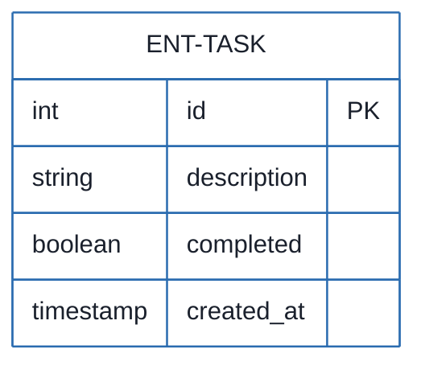
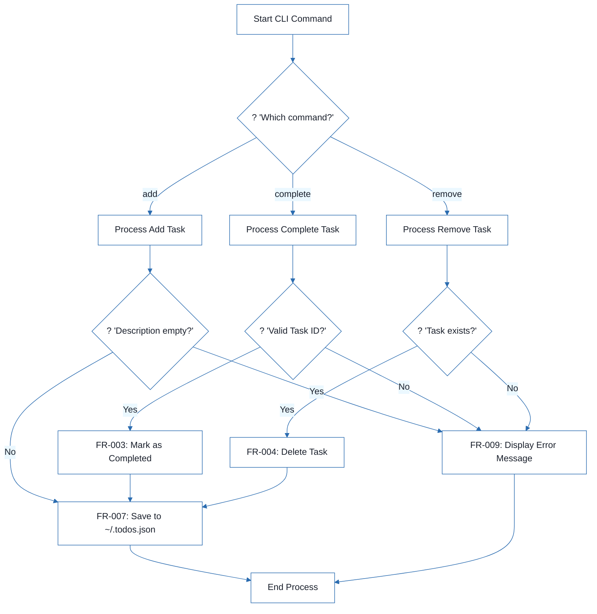
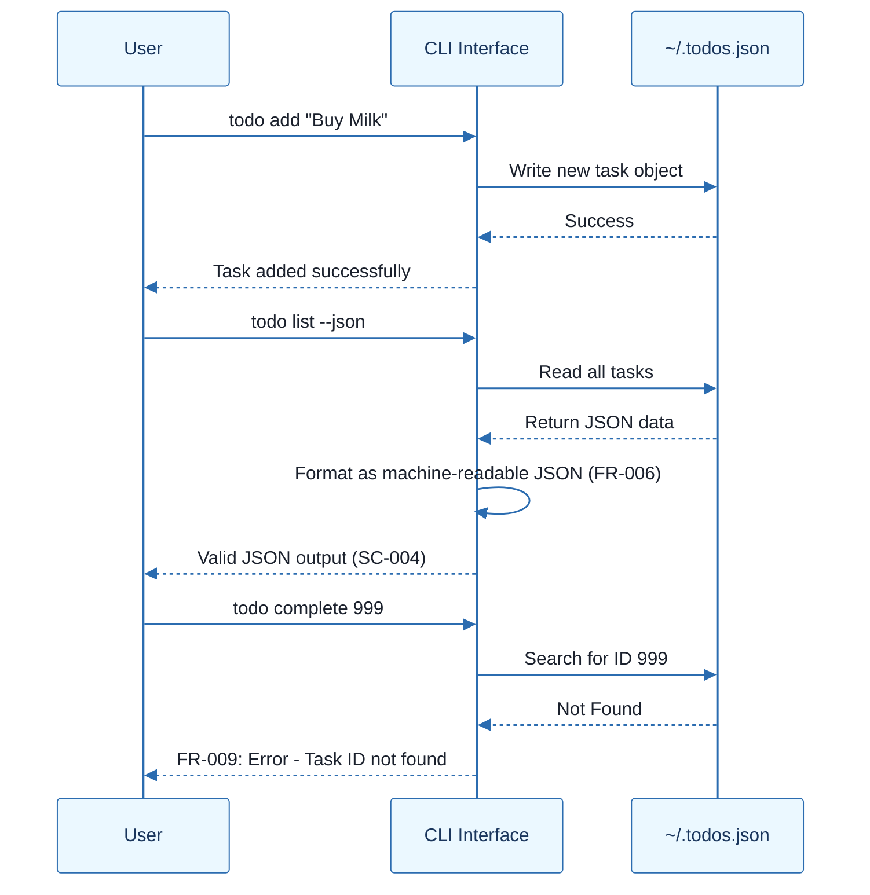

# CLI To-Do List Manager - Technical Specification & Architecture Document

## 1. Executive Summary & Architecture Overview

### 1.1 Executive Brief
The CLI To-Do List Manager is a local productivity tool designed for task capture and lifecycle management via a command-line interface. It utilizes a flat-file JSON storage pattern located at `~/.todos.json` to maintain task state, including unique sequential IDs and completion statuses, targeting high-performance local execution and machine-readable interoperability.

### 1.2 Maturity Assessment
The project is in a **REFINEMENT** state. While the functional core is well-defined with a 100% completeness score in extracted nodes, there are significant unresolved uncertainties regarding edge-case handling (invalid IDs, corrupted JSON, empty descriptions, and concurrency). Additionally, the absence of a 'Scope & Out-of-Scope' section creates a medium-severity structural gap that risks scope creep.

### 1.3 Technical Stack
* **Languages and Frameworks**: Python 3.8+
* **Storage**: Local JSON file (`~/.todos.json`)

### 1.4 Architectural Constraints
* **Execution Latency**: All core operations (add, list, complete, remove) must execute in < 2 seconds.
* **Scalability**: Stable performance for 1000+ tasks in the storage file.
* **Storage Path**: Strict data persistence at `~/.todos.json`.
* **Data Integrity**: Unique sequential integer IDs for each Task entity.
* **Output Format**: Human-readable default with a strict valid JSON alternative via `--json` flag.
* **User Success Rate**: 95% success rate for basic operations on first attempt.
* **Error Handling**: 80% reduction in user confusion through actionable error messages.

### 1.5 Critical Dependencies
* Local filesystem write access to the home directory for `~/.todos.json`.
* Python 3.8+ runtime environment.
* Task entity relational integrity: sequential ID generation linked to task creation.
* JSON parser compatibility for both storage persistence and `--json` output.

## 2. Architecture Workflows

```mermaid
%%{init: {
  'theme': 'base',
  'themeVariables': {
    'primaryColor': '#1A365D',
    'primaryTextColor': '#1A202C',
    'primaryBorderColor': '#2B6CB0',
    'lineColor': '#2B6CB0',
    'secondaryColor': '#EBF8FF',
    'tertiaryColor': '#EBF8FF',
    'background': '#FFFFFF',
    'mainBkg': '#FFFFFF',
    'secondBkg': '#EBF8FF',
    'tertiaryBkg': '#F7FAFC',
    'secondaryTextColor': '#4A5568',
    'fontSize': '16px',
    'fontFamily': 'Inter, system-ui, sans-serif',
    'nodePadding': '15px',
    'borderRadius': '8px',
    'edgeLabelBackground': '#EBF8FF',
    'clusterBkg': '#F7FAFC',
    'clusterBorder': '#2B6CB0',
    'defaultLinkColor': '#2B6CB0',
    'titleColor': '#1A365D',
    'actorBorder': '#2B6CB0',
    'actorBkg': '#EBF8FF',
    'actorTextColor': '#1A365D',
    'actorLineColor': '#2B6CB0',
    'signalColor': '#2B6CB0',
    'signalTextColor': '#1A202C',
    'labelBoxBorderColor': '#2B6CB0',
    'labelBoxBkgColor': '#EBF8FF',
    'labelTextColor': '#1A202C',
    'loopTextColor': '#1A202C',
    'arrowHeadColor': '#2B6CB0',
    'sequenceNumberColor': '#1A365D',
    'sequenceActorBorder': '#2B6CB0',
    'sequenceActorBkg': '#EBF8FF',
    'sequenceArrowColor': '#2B6CB0',
    'noteBkgColor': '#FFF5EB',
    'noteBorderColor': '#DD6B20',
    'noteTextColor': '#1A202C'
  }
}}%%
flowchart TD
    subgraph UserStories [User Stories]
        US-ADD-MANAGE["US-ADD-MANAGE: Add and Manage Tasks"]
        US-VIEW-FILTER["US-VIEW-FILTER: View and Filter Tasks"]
        US-REMOVE-CLEAR["US-REMOVE-CLEAR: Remove and Clear Tasks"]
    end
    subgraph FunctionalReqs [Functional Requirements]
        FR-001["FR-001: Add Tasks"]
        FR-002["FR-002: List Tasks"]
        FR-003["FR-003: Complete Tasks"]
        FR-004["FR-004: Remove Individual Tasks"]
        FR-005["FR-005: Clear Completed Tasks"]
        FR-006["FR-006: JSON Output Support"]
        FR-007["FR-007: Local JSON Storage"]
        FR-009["FR-009: Graceful Error Handling"]
    end
    subgraph SuccessCriteria [Success Criteria]
        SC-004["SC-004: Valid JSON Parseable"]
        SC-005["SC-005: Actionable Error Messages"]
    end
    US-ADD-MANAGE -->|"implements"| FR-001
    US-ADD-MANAGE -->|"implements"| FR-003
    US-VIEW-FILTER -->|"implements"| FR-002
    US-VIEW-FILTER -->|"implements"| FR-006
    US-REMOVE-CLEAR -->|"implements"| FR-004
    US-REMOVE-CLEAR -->|"implements"| FR-005
    FR-006 -->|"depends_on"| SC-004
    FR-009 -->|"depends_on"| SC-005
```







```mermaid
%%{init: {
  'theme': 'base',
  'themeVariables': {
    'primaryColor': '#1A365D',
    'primaryTextColor': '#1A202C',
    'primaryBorderColor': '#2B6CB0',
    'lineColor': '#2B6CB0',
    'secondaryColor': '#EBF8FF',
    'tertiaryColor': '#EBF8FF',
    'background': '#FFFFFF',
    'mainBkg': '#FFFFFF',
    'secondBkg': '#EBF8FF',
    'tertiaryBkg': '#F7FAFC',
    'secondaryTextColor': '#4A5568',
    'fontSize': '16px',
    'fontFamily': 'Inter, system-ui, sans-serif',
    'nodePadding': '15px',
    'borderRadius': '8px',
    'edgeLabelBackground': '#EBF8FF',
    'clusterBkg': '#F7FAFC',
    'clusterBorder': '#2B6CB0',
    'defaultLinkColor': '#2B6CB0',
    'titleColor': '#1A365D',
    'actorBorder': '#2B6CB0',
    'actorBkg': '#EBF8FF',
    'actorTextColor': '#1A365D',
    'actorLineColor': '#2B6CB0',
    'signalColor': '#2B6CB0',
    'signalTextColor': '#1A202C',
    'labelBoxBorderColor': '#2B6CB0',
    'labelBoxBkgColor': '#EBF8FF',
    'labelTextColor': '#1A202C',
    'loopTextColor': '#1A202C',
    'arrowHeadColor': '#2B6CB0',
    'sequenceNumberColor': '#1A365D',
    'sequenceActorBorder': '#2B6CB0',
    'sequenceActorBkg': '#EBF8FF',
    'sequenceArrowColor': '#2B6CB0',
    'noteBkgColor': '#FFF5EB',
    'noteBorderColor': '#DD6B20',
    'noteTextColor': '#1A202C'
  }
}}%%
sequenceDiagram
    participant User
    participant CLI as CLI Interface
    participant Storage as ~/.todos.json
    User->>CLI: todo add "Buy Milk"
    CLI->>Storage: Write new task object
    Storage-->>CLI: Success
    CLI-->>User: Task added successfully
    User->>CLI: todo list --json
    CLI->>Storage: Read all tasks
    Storage-->>CLI: Return JSON data
    CLI->>CLI: Format as machine-readable JSON (FR-006)
    CLI-->>User: Valid JSON output (SC-004)
    User->>CLI: todo complete 999
    CLI->>Storage: Search for ID 999
    Storage-->>CLI: Not Found
    CLI-->>User: FR-009: Error - Task ID not found
``` & Visual Diagrams

### 2.1 Data Model - Task Entity
```mermaid
%%{init: {
  'theme': 'base',
  'themeVariables': {
    'primaryColor': '#1A365D',
    'primaryTextColor': '#1A202C',
    'primaryBorderColor': '#2B6CB0',
    'lineColor': '#2B6CB0',
    'secondaryColor': '#EBF8FF',
    'tertiaryColor': '#EBF8FF',
    'background': '#FFFFFF',
    'mainBkg': '#FFFFFF',
    'secondBkg': '#EBF8FF',
    'tertiaryBkg': '#F7FAFC',
    'secondaryTextColor': '#4A5568',
    'fontSize': '16px',
    'fontFamily': 'Inter, system-ui, sans-serif',
    'nodePadding': '15px',
    'borderRadius': '8px',
    'edgeLabelBackground': '#EBF8FF',
    'clusterBkg': '#F7FAFC',
    'clusterBorder': '#2B6CB0',
    'defaultLinkColor': '#2B6CB0',
    'titleColor': '#1A365D',
    'actorBorder': '#2B6CB0',
    'actorBkg': '#EBF8FF',
    'actorTextColor': '#1A365D',
    'actorLineColor': '#2B6CB0',
    'signalColor': '#2B6CB0',
    'signalTextColor': '#1A202C',
    'labelBoxBorderColor': '#2B6CB0',
    'labelBoxBkgColor': '#EBF8FF',
    'labelTextColor': '#1A202C',
    'loopTextColor': '#1A202C',
    'arrowHeadColor': '#2B6CB0',
    'sequenceNumberColor': '#1A365D',
    'sequenceActorBorder': '#2B6CB0',
    'sequenceActorBkg': '#EBF8FF',
    'sequenceArrowColor': '#2B6CB0',
    'noteBkgColor': '#FFF5EB',
    'noteBorderColor': '#DD6B20',
    'noteTextColor': '#1A202C'
  }
}}%%
erDiagram
    ENT-TASK {
        int id PK
        string description
        boolean completed
        timestamp created_at
    }
```

### 2.2 Requirements Traceability Matrix


### 2.3 Task Management Workflow


### 2.4 CLI Interaction Sequence


## 3. Detailed Technical Specifications & Business Rules

### 3.1 Requirements Traceability
| ID | Type | Description | Source User Story | Success Criterion |
| :--- | :--- | :--- | :--- | :--- |
| **FR-001** | Functional | System MUST allow users to add new tasks with descriptions via the `add` command | US-ADD-MANAGE | N/A |
| **FR-002** | Functional | System MUST display all tasks with their IDs, descriptions, and completion status via the `list` command | US-VIEW-FILTER | N/A |
| **FR-003** | Functional | System MUST allow users to mark tasks as completed via the `complete` command | US-ADD-MANAGE | N/A |
| **FR-004** | Functional | System MUST allow users to remove individual tasks via the `remove` command | US-REMOVE-CLEAR | N/A |
| **FR-005** | Functional | System MUST allow users to clear all completed tasks via the `clear` command | US-REMOVE-CLEAR | N/A |
| **FR-006** | Functional | System MUST support JSON output format via `--json` flag for machine-readable output | US-VIEW-FILTER | SC-004 |
| **FR-007** | Functional | System MUST store all task data in a local JSON file at `~/.todos.json` | N/A | N/A |
| **FR-008** | Functional | System MUST assign unique sequential IDs to tasks | N/A | N/A |
| **FR-009** | Functional | System MUST handle errors gracefully with user-friendly error messages | N/A | SC-005 |
| **SC-001** | Success | Users can add, list, complete, and remove tasks in under 2 seconds on standard hardware | N/A | N/A |
| **SC-002** | Success | System handles 1000+ tasks in the JSON file without performance degradation | N/A | N/A |
| **SC-003** | Success | 95% of users can successfully perform basic operations on first attempt | N/A | N/A |
| **SC-004** | Success | JSON output is valid and parseable by standard JSON parsers | N/A | N/A |
| **SC-005** | Success | Error messages are clear and actionable, reducing user confusion by 80% | N/A | N/A |

### 3.2 Security Rules
* **Filesystem Access**: The application requires read/write permissions specifically for the home directory to manage `~/.todos.json`.
* **Input Validation**: All CLI inputs must be sanitized to prevent malformed JSON injection or shell-related vulnerabilities.

### 3.3 Data Models
**Entity: Task (ENT-TASK)**
| Field | Type | Description | Constraints |
| :--- | :--- | :--- | :--- |
| `id` | Integer | Unique identifier | Primary Key, Auto-incremented |
| `description` | String | Task content | Mandatory |
| `completed` | Boolean | Completion status | Default: `false` |
| `created_at` | Timestamp | Creation date/time | System generated |

## 4. Project Governance & Structural Gaps

### 4.1 Structural Gaps
| Gap ID | Missing Section | Priority | Remediation Advice |
| :--- | :--- | :--- | :--- |
| GAP-01 | Scope & Out-of-Scope | MEDIUM | Explicitly define what the CLI tool will NOT do (e.g., no cloud sync, no categories) to avoid scope creep. |

### 4.2 Remediation & Workflow
To resolve the identified gaps and uncertainties, the following workflow is proposed:
1. **Scope Definition**: Define the boundary of the MVP to prevent feature creep.
2. **Edge Case Specification**: Define the exact behavior for:
    * Invalid IDs during `complete` or `remove` operations.
    * Recovery or error reporting for corrupted `~/.todos.json`.
    * Validation rules for empty task descriptions.
    * Locking mechanism or error handling for concurrent file access.

## 5. Technical & Domain Glossary (Terminology Reference)

| Term | Category | Context Anchor | Project Definition |
| :--- | :--- | :--- | :--- |
| ID | BUSINESS_DOMAIN | FR-008 | A unique sequential integer assigned to each registered item to ensure deterministic referencing. |
| JSON | TECHNICAL_STACK | FR-007 | The lightweight data-interchange format used for persistent storage in the home directory and machine-readable output. |
| Python 3.8 | TECHNICAL_STACK | ASSUM-PY38 | The minimum required runtime environment version for executing the application logic. |
| todo clear | BUSINESS_DOMAIN | FR-005 | An operation that purges all entries marked as finished while preserving those still pending. |
| todo list | BUSINESS_DOMAIN | FR-002 | A command to retrieve and display the current set of registered items and their associated statuses. |