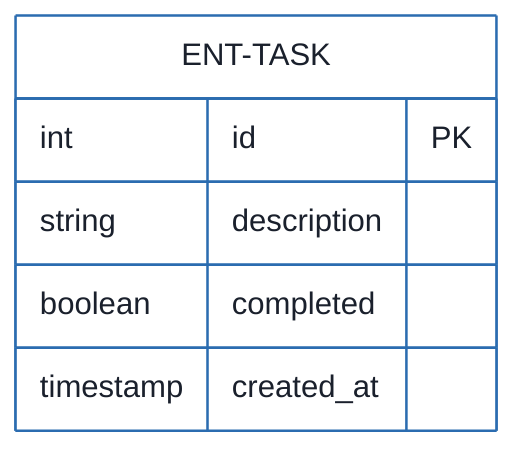
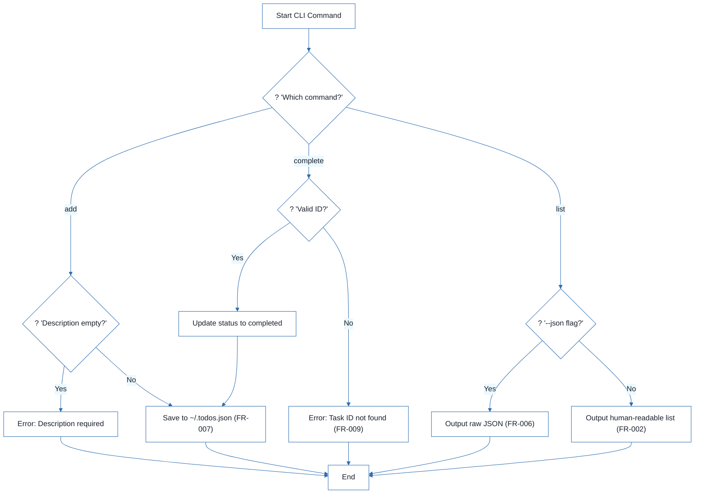
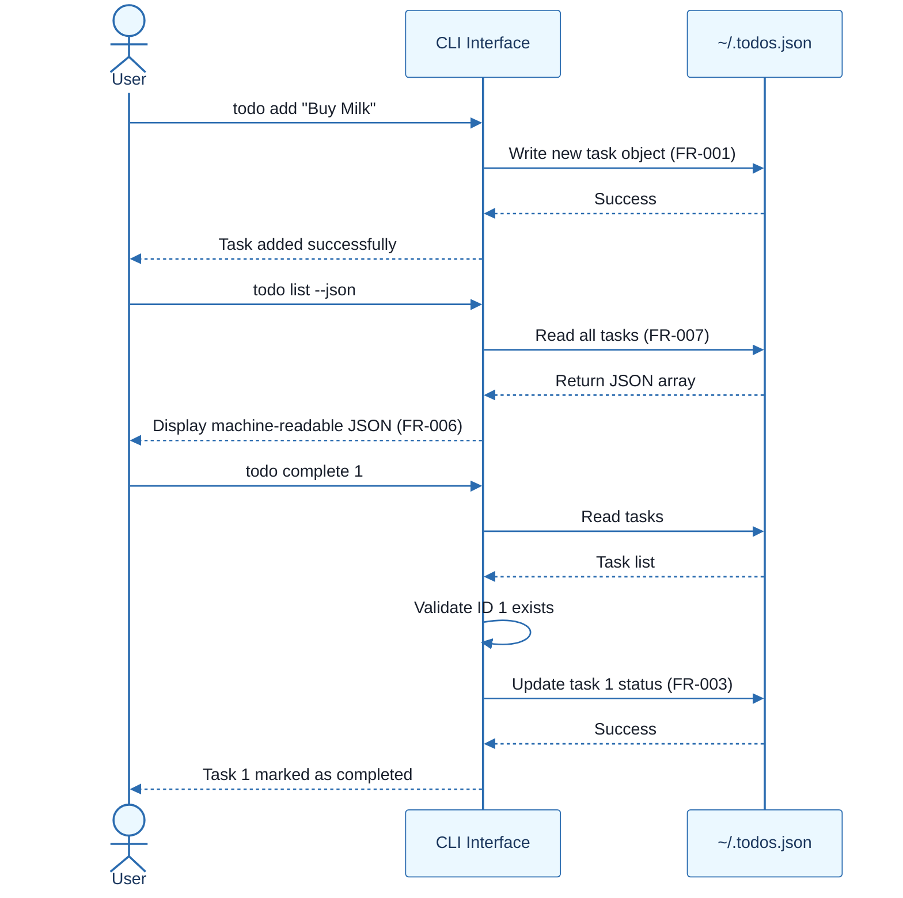

# CLI To-Do List Manager - Technical Specification & Architecture Document

## 1. Executive Summary & Architecture Overview

### 1.1 Executive Brief
A Python-based CLI To-Do List Manager designed for local task orchestration. The system implements a flat-file data pattern using a JSON store at `~/.todos.json` to manage task lifecycles (creation, completion, and deletion) with support for both human-readable and machine-readable output formats.

### 1.2 Maturity Assessment
The specification is structurally complete in terms of functional mapping but requires REFINEMENT. While the core logic is well-defined, there are unresolved technical uncertainties regarding error handling for corrupted JSON files, invalid ID inputs, and concurrent file access. The absence of a 'Scope & Out-of-Scope' definition creates a risk of scope creep regarding cloud synchronization or categorization features.

### 1.3 Technical Stack
* **Language**: Python 3.8+
* **Storage**: Local JSON file (`~/.todos.json`)
* **Interface**: Command Line Interface (CLI)

### 1.4 Architectural Constraints
* **Execution Latency**: All basic operations (add, list, complete, remove) must execute in under 2 seconds.
* **Scalability Threshold**: Zero performance degradation up to 1000+ tasks in the JSON store.
* **Data Storage**: Mandatory local persistence at `~/.todos.json`.
* **ID Generation**: Strict unique sequential integer assignment.
* **Output Format**: Dual-mode output (Standard text and Valid JSON via `--json` flag).
* **User Access**: Limited to single-user local environment without network connectivity.

### 1.5 Critical Dependencies
* Write access to the system home directory for `~/.todos.json` creation.
* Python 3.8+ runtime environment.
* Strict referential integrity between the CLI commands and the `ENT-TASK` entity attributes (`id`, `description`, `completed`, `created_at`).
* JSON standard compliance for machine-readable output parseability.

## 2. Architecture Workflows

```mermaid
%%{init: {
  'theme': 'base',
  'themeVariables': {
    'primaryColor': '#1A365D',
    'primaryTextColor': '#1A202C',
    'primaryBorderColor': '#2B6CB0',
    'lineColor': '#2B6CB0',
    'secondaryColor': '#EBF8FF',
    'tertiaryColor': '#EBF8FF',
    'background': '#FFFFFF',
    'mainBkg': '#FFFFFF',
    'secondBkg': '#EBF8FF',
    'tertiaryBkg': '#F7FAFC',
    'secondaryTextColor': '#4A5568',
    'fontSize': '16px',
    'fontFamily': 'Inter, system-ui, sans-serif',
    'nodePadding': '15px',
    'borderRadius': '8px',
    'edgeLabelBackground': '#EBF8FF',
    'clusterBkg': '#F7FAFC',
    'clusterBorder': '#2B6CB0',
    'defaultLinkColor': '#2B6CB0',
    'titleColor': '#1A365D',
    'actorBorder': '#2B6CB0',
    'actorBkg': '#EBF8FF',
    'actorTextColor': '#1A365D',
    'actorLineColor': '#2B6CB0',
    'signalColor': '#2B6CB0',
    'signalTextColor': '#1A202C',
    'labelBoxBorderColor': '#2B6CB0',
    'labelBoxBkgColor': '#EBF8FF',
    'labelTextColor': '#1A202C',
    'loopTextColor': '#1A202C',
    'arrowHeadColor': '#2B6CB0',
    'sequenceNumberColor': '#1A365D',
    'sequenceActorBorder': '#2B6CB0',
    'sequenceActorBkg': '#EBF8FF',
    'sequenceArrowColor': '#2B6CB0',
    'noteBkgColor': '#FFF5EB',
    'noteBorderColor': '#DD6B20',
    'noteTextColor': '#1A202C'
  }
}}%%
flowchart TD
    subgraph User_Stories [User Stories]
        US-01["US-01: Add and Manage Tasks"]
        US-02["US-02: View and Filter Tasks"]
        US-03["US-03: Remove and Clear Tasks"]
    end
    subgraph Functional_Requirements [Functional Requirements]
        FR-001["FR-001: Add Tasks"]
        FR-002["FR-002: List Tasks"]
        FR-003["FR-003: Complete Tasks"]
        FR-004["FR-004: Remove Tasks"]
        FR-005["FR-005: Clear Completed"]
        FR-006["FR-006: JSON Output"]
        FR-007["FR-007: Local JSON Storage"]
        FR-008["FR-008: Unique IDs"]
        FR-009["FR-009: Error Handling"]
    end
    subgraph Constraints_and_Metrics [Constraints & Metrics]
        SC-001["SC-001: Performance < 2s"]
        AS-02["AS-02: Home Dir Write Access"]
    end
    FR-001 -->|"implements"| US-01
    FR-003 -->|"implements"| US-01
    FR-002 -->|"implements"| US-02
    FR-006 -->|"implements"| US-02
    FR-004 -->|"implements"| US-03
    FR-005 -->|"implements"| US-03
    SC-001 -->|"relates_to"| FR-001
    FR-007 -->|"depends_on"| AS-02
```







```mermaid
%%{init: {
  'theme': 'base',
  'themeVariables': {
    'primaryColor': '#1A365D',
    'primaryTextColor': '#1A202C',
    'primaryBorderColor': '#2B6CB0',
    'lineColor': '#2B6CB0',
    'secondaryColor': '#EBF8FF',
    'tertiaryColor': '#EBF8FF',
    'background': '#FFFFFF',
    'mainBkg': '#FFFFFF',
    'secondBkg': '#EBF8FF',
    'tertiaryBkg': '#F7FAFC',
    'secondaryTextColor': '#4A5568',
    'fontSize': '16px',
    'fontFamily': 'Inter, system-ui, sans-serif',
    'nodePadding': '15px',
    'borderRadius': '8px',
    'edgeLabelBackground': '#EBF8FF',
    'clusterBkg': '#F7FAFC',
    'clusterBorder': '#2B6CB0',
    'defaultLinkColor': '#2B6CB0',
    'titleColor': '#1A365D',
    'actorBorder': '#2B6CB0',
    'actorBkg': '#EBF8FF',
    'actorTextColor': '#1A365D',
    'actorLineColor': '#2B6CB0',
    'signalColor': '#2B6CB0',
    'signalTextColor': '#1A202C',
    'labelBoxBorderColor': '#2B6CB0',
    'labelBoxBkgColor': '#EBF8FF',
    'labelTextColor': '#1A202C',
    'loopTextColor': '#1A202C',
    'arrowHeadColor': '#2B6CB0',
    'sequenceNumberColor': '#1A365D',
    'sequenceActorBorder': '#2B6CB0',
    'sequenceActorBkg': '#EBF8FF',
    'sequenceArrowColor': '#2B6CB0',
    'noteBkgColor': '#FFF5EB',
    'noteBorderColor': '#DD6B20',
    'noteTextColor': '#1A202C'
  }
}}%%
sequenceDiagram
    actor User
    participant CLI as CLI Interface
    participant Storage as ~/.todos.json
    User ->> CLI: todo add "Buy Milk"
    CLI ->> Storage: Write new task object (FR-001)
    Storage -->> CLI: Success
    CLI -->> User: Task added successfully
    User ->> CLI: todo list --json
    CLI ->> Storage: Read all tasks (FR-007)
    Storage -->> CLI: Return JSON array
    CLI -->> User: Display machine-readable JSON (FR-006)
    User ->> CLI: todo complete 1
    CLI ->> Storage: Read tasks
    Storage -->> CLI: Task list
    CLI ->> CLI: Validate ID 1 exists
    CLI ->> Storage: Update task 1 status (FR-003)
    Storage -->> CLI: Success
    CLI -->> User: Task 1 marked as completed
``` & Visual Diagrams

### 2.1 Data Model: Task Management
```mermaid
%%{init: {
  'theme': 'base',
  'themeVariables': {
    'primaryColor': '#1A365D',
    'primaryTextColor': '#1A202C',
    'primaryBorderColor': '#2B6CB0',
    'lineColor': '#2B6CB0',
    'secondaryColor': '#EBF8FF',
    'tertiaryColor': '#EBF8FF',
    'background': '#FFFFFF',
    'mainBkg': '#FFFFFF',
    'secondBkg': '#EBF8FF',
    'tertiaryBkg': '#F7FAFC',
    'secondaryTextColor': '#4A5568',
    'fontSize': '16px',
    'fontFamily': 'Inter, system-ui, sans-serif',
    'nodePadding': '15px',
    'borderRadius': '8px',
    'edgeLabelBackground': '#EBF8FF',
    'clusterBkg': '#F7FAFC',
    'clusterBorder': '#2B6CB0',
    'defaultLinkColor': '#2B6CB0',
    'titleColor': '#1A365D',
    'actorBorder': '#2B6CB0',
    'actorBkg': '#EBF8FF',
    'actorTextColor': '#1A365D',
    'actorLineColor': '#2B6CB0',
    'signalColor': '#2B6CB0',
    'signalTextColor': '#1A202C',
    'labelBoxBorderColor': '#2B6CB0',
    'labelBoxBkgColor': '#EBF8FF',
    'labelTextColor': '#1A202C',
    'loopTextColor': '#1A202C',
    'arrowHeadColor': '#2B6CB0',
    'sequenceNumberColor': '#1A365D',
    'sequenceActorBorder': '#2B6CB0',
    'sequenceActorBkg': '#EBF8FF',
    'sequenceArrowColor': '#2B6CB0',
    'noteBkgColor': '#FFF5EB',
    'noteBorderColor': '#DD6B20',
    'noteTextColor': '#1A202C'
  }
}}%%
erDiagram
    ENT-TASK {
        int id PK
        string description
        boolean completed
        timestamp created_at
    }
```

### 2.2 Requirements Traceability Matrix


### 2.3 Task Operation Workflow


### 2.4 CLI Interaction Sequence


## 3. Detailed Technical Specifications & Business Rules

### 3.1 Requirements Traceability
| ID | Type | Description | Source / Relation |
| :--- | :--- | :--- | :--- |
| **US-01** | User Story | Quickly capture tasks and manage completion status via CLI. | P1 |
| **US-02** | User Story | View tasks in readable or machine-readable JSON format. | P2 |
| **US-03** | User Story | Remove individual tasks or clear all completed tasks. | P3 |
| **FR-001** | Functional | System MUST allow users to add new tasks via `add` command. | Implements US-01 |
| **FR-002** | Functional | System MUST display all tasks (ID, desc, status) via `list` command. | Implements US-02 |
| **FR-003** | Functional | System MUST allow users to mark tasks as completed via `complete` command. | Implements US-01 |
| **FR-004** | Functional | System MUST allow users to remove individual tasks via `remove` command. | Implements US-03 |
| **FR-005** | Functional | System MUST allow users to clear all completed tasks via `clear` command. | Implements US-03 |
| **FR-006** | Functional | System MUST support JSON output format via `--json` flag. | Implements US-02 |
| **FR-007** | Functional | System MUST store all task data in a local JSON file at `~/.todos.json`. | Depends on AS-02 |
| **FR-008** | Functional | System MUST assign unique sequential IDs to tasks. | - |
| **FR-009** | Functional | System MUST handle errors gracefully with user-friendly messages. | - |
| **ENT-TASK** | Entity | Task: id (int), description (string), completed (bool), created_at (timestamp). | - |
| **SC-001** | Success Criterion | Basic operations must execute in under 2 seconds. | Relates to FR-001 |
| **SC-002** | Success Criterion | Handle 1000+ tasks without performance degradation. | - |
| **SC-003** | Success Criterion | 95% of users perform basic operations successfully on first attempt. | - |
| **SC-004** | Success Criterion | JSON output is valid and parseable by standard parsers. | - |
| **SC-005** | Success Criterion | Error messages reduce user confusion by 80%. | - |
| **AS-01** | Assumption | Users have Python 3.8+ installed on their system. | - |
| **AS-02** | Assumption | Users have write access to their home directory. | - |

### 3.2 Security Rules
* **Local Access Only**: The system is designed for a single-user local environment. No network connectivity or remote access is implemented.
* **File Permissions**: Reliance on OS-level home directory permissions to protect `~/.todos.json`.

### 3.3 Data Models
**Entity: Task (ENT-TASK)**
* `id`: Unique integer identifier (Auto-incremented).
* `description`: String describing the task.
* `completed`: Boolean indicating completion status (Default: `false`).
* `created_at`: Timestamp of task creation.

## 4. Project Governance & Structural Gaps

### 4.1 Structural Gaps
| Gap ID | Missing Section | Priority | Remediation Advice |
| :--- | :--- | :--- | :--- |
| GAP-01 | Scope & Out-of-Scope | MEDIUM | Explicitly define what the CLI tool will NOT do (e.g., no cloud sync, no categories). |

### 4.2 Remediation & Workflow
To address the identified gaps and open questions, the following workflow is proposed:
1. **Scope Definition**: Define a "Non-Goals" list to prevent scope creep.
2. **Error Handling Specification**: Define specific behaviors for:
    * Invalid IDs (FR-009).
    * Corrupted JSON files.
    * Empty task descriptions.
3. **Concurrency Strategy**: Determine if file locking is required for concurrent access to `~/.todos.json`.

## 5. Technical & Domain Glossary (Terminology Reference)

| Term | Category | Context Anchor | Project Definition |
| :--- | :--- | :--- | :--- |
| ID | BUSINESS_DOMAIN | FR-008 | A unique sequential integer assigned to each task for individual reference and targeting. |
| JSON | TECHNICAL_STACK | FR-007 | The structured data format used for local persistence in the home directory and as an optional machine-readable output. |
| Python 3.8 | TECHNICAL_STACK | AS-01 | The minimum required runtime environment installed on the host system to execute the application. |
| todo clear | BUSINESS_DOMAIN | FR-005 | An operation that purges all items marked as finished from the persistence layer while preserving those with a pending status. |
| todo list | BUSINESS_DOMAIN | FR-002 | A command that retrieves and displays all stored entries including their unique identifiers, descriptions, and completion states. |