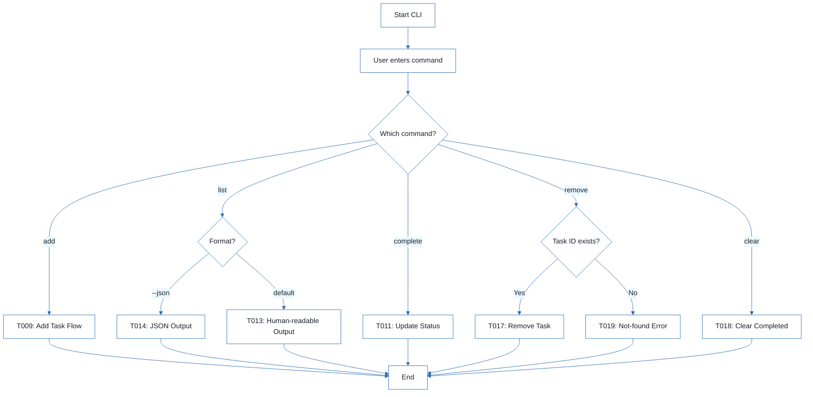
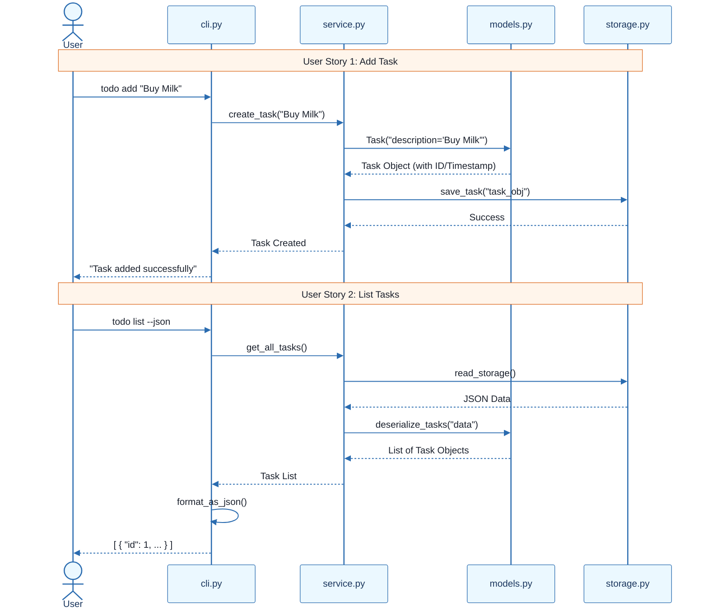
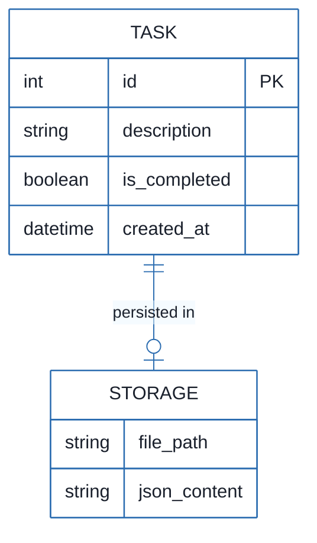

# CLI To-Do List Manager - Technical Specification & Architecture Document

## 1. Executive Summary & Architecture Overview

### 1.1 Executive Brief
This project implements a Python-based CLI To-Do List Manager utilizing a local JSON file for persistence. The architecture is decomposed into a shared service layer and a command-line interface, following a phased implementation strategy where foundational infrastructure blocks all user-story-specific development. The system focuses on core task lifecycle management: creation, sequential ID assignment, listing (human-readable and JSON), and removal.

### 1.2 Maturity Assessment
The specification is logically structured with a clear dependency graph, but it is currently in REFINEMENT. While the implementation roadmap is comprehensive, there are high-severity structural gaps regarding formal Acceptance Criteria and a complete absence of security constraints (e.g., input validation and shell injection prevention) and performance bounds for the JSON storage mechanism.

### 1.3 Technical Stack
* Python
* pyproject.toml

### 1.4 Architectural Constraints
* Sequential ID assignment for task entities.
* JSON serialization for data persistence.
* Strict sequential phase execution: Phase 1 (Setup) -> Phase 2 (Foundational) -> User Stories.
* Persistence target: `~/.todos.json`.
* Parseable JSON output requirement for `todo list --json` command.
* Module entry behavior restricted to `python -m todo_manager`.

### 1.5 Critical Dependencies
* Foundational Phase (PHASE-02) completion is a blocking prerequisite for all User Story implementation.
* JSON file I/O helpers in `src/todo_manager/storage.py` for state persistence.
* Referential integrity between task IDs and the JSON storage backend.
* `pyproject.toml` configuration for CLI entry points and tooling.

## 2. Architecture Workflows

```mermaid
%%{init: {
  'theme': 'base',
  'themeVariables': {
    'primaryColor': '#1A365D',
    'primaryTextColor': '#1A202C',
    'primaryBorderColor': '#2B6CB0',
    'lineColor': '#2B6CB0',
    'secondaryColor': '#EBF8FF',
    'tertiaryColor': '#EBF8FF',
    'background': '#FFFFFF',
    'mainBkg': '#FFFFFF',
    'secondBkg': '#EBF8FF',
    'tertiaryBkg': '#F7FAFC',
    'secondaryTextColor': '#4A5568',
    'fontSize': '16px',
    'fontFamily': 'Inter, system-ui, sans-serif',
    'nodePadding': '15px',
    'borderRadius': '8px',
    'edgeLabelBackground': '#EBF8FF',
    'clusterBkg': '#F7FAFC',
    'clusterBorder': '#2B6CB0',
    'defaultLinkColor': '#2B6CB0',
    'titleColor': '#1A365D',
    'actorBorder': '#2B6CB0',
    'actorBkg': '#EBF8FF',
    'actorTextColor': '#1A365D',
    'actorLineColor': '#2B6CB0',
    'signalColor': '#2B6CB0',
    'signalTextColor': '#1A202C',
    'labelBoxBorderColor': '#2B6CB0',
    'labelBoxBkgColor': '#EBF8FF',
    'labelTextColor': '#1A202C',
    'loopTextColor': '#1A202C',
    'arrowHeadColor': '#2B6CB0',
    'sequenceNumberColor': '#1A365D',
    'sequenceActorBorder': '#2B6CB0',
    'sequenceActorBkg': '#EBF8FF',
    'sequenceArrowColor': '#2B6CB0',
    'noteBkgColor': '#FFF5EB',
    'noteBorderColor': '#DD6B20',
    'noteTextColor': '#1A202C'
  }
}}%%
flowchart TD
    subgraph Setup_Phase ["Phase 1: Setup"]
        PHASE-01["PHASE-01: Setup (Shared Infrastructure)"]
        T001["T001: Package Skeleton"]
        T002["T002: Test Structure"]
        T003["T003: Project Metadata"]
        PHASE-01 --> T001
        PHASE-01 --> T002
        PHASE-01 --> T003
    end
    subgraph Foundational_Phase ["Phase 2: Foundational"]
        PHASE-02["PHASE-02: Foundational (Blocking Prerequisites)"]
        T004["T004: Entity Definitions"]
        T005["T005: JSON Storage I/O"]
        T006["T006: CLI Parsing"]
        T007["T007: Service Error Handling"]
        T008["T008: Module Entry"]
        PHASE-02 --> T004
        PHASE-02 --> T005
        PHASE-02 --> T006
        PHASE-02 --> T007
        PHASE-02 --> T008
    end
    subgraph User_Stories ["User Story Implementation"]
        PHASE-03["PHASE-03: US1 - Add/Manage Tasks"]
        PHASE-04["PHASE-04: US2 - View/Filter Tasks"]
        PHASE-05["PHASE-05: US3 - Remove/Clear Tasks"]
        T009["T009: Add Command Flow"]
        T010["T010: Task Creation Logic"]
        T011["T011: Completion Updates"]
        T012["T012: User Messages"]
        T013["T013: Human-readable List"]
        T014["T014: JSON Formatting"]
        T015["T015: Listing Logic"]
        T016["T016: Empty-list Handling"]
        T017["T017: Remove Command Flow"]
        T018["T018: Clear Completed Flow"]
        T019["T019: Not-found Handling"]
        T020["T020: Storage Persistence"]
        T009 --> PHASE-03
        T010 --> PHASE-03
        T011 --> PHASE-03
        T012 --> PHASE-03
        T013 --> PHASE-04
        T014 --> PHASE-04
        T015 --> PHASE-04
        T016 --> PHASE-04
        T017 --> PHASE-05
        T018 --> PHASE-05
        T019 --> PHASE-05
        T020 --> PHASE-05
    end
    subgraph Polish_Phase ["Phase 6: Polish"]
        PHASE-06["PHASE-06: Polish & Cross-Cutting"]
        T021["T021: Documentation"]
        T022["T022: Quickstart Notes"]
        T023["T023: Smoke Tests"]
        T024["T024: Linting/Formatting"]
        T025["T025: JSON Parse Validation"]
        PHASE-06 --> T021
        PHASE-06 --> T022
        PHASE-06 --> T023
        PHASE-06 --> T024
        PHASE-06 --> T025
    end
    PHASE-02 --> PHASE-01
    PHASE-03 --> PHASE-02
    PHASE-04 --> PHASE-02
    PHASE-05 --> PHASE-02
    PHASE-06 --> PHASE-03
    PHASE-06 --> PHASE-04
    PHASE-06 --> PHASE-05
```







```mermaid
%%{init: {
  'theme': 'base',
  'themeVariables': {
    'primaryColor': '#1A365D',
    'primaryTextColor': '#1A202C',
    'primaryBorderColor': '#2B6CB0',
    'lineColor': '#2B6CB0',
    'secondaryColor': '#EBF8FF',
    'tertiaryColor': '#EBF8FF',
    'background': '#FFFFFF',
    'mainBkg': '#FFFFFF',
    'secondBkg': '#EBF8FF',
    'tertiaryBkg': '#F7FAFC',
    'secondaryTextColor': '#4A5568',
    'fontSize': '16px',
    'fontFamily': 'Inter, system-ui, sans-serif',
    'nodePadding': '15px',
    'borderRadius': '8px',
    'edgeLabelBackground': '#EBF8FF',
    'clusterBkg': '#F7FAFC',
    'clusterBorder': '#2B6CB0',
    'defaultLinkColor': '#2B6CB0',
    'titleColor': '#1A365D',
    'actorBorder': '#2B6CB0',
    'actorBkg': '#EBF8FF',
    'actorTextColor': '#1A365D',
    'actorLineColor': '#2B6CB0',
    'signalColor': '#2B6CB0',
    'signalTextColor': '#1A202C',
    'labelBoxBorderColor': '#2B6CB0',
    'labelBoxBkgColor': '#EBF8FF',
    'labelTextColor': '#1A202C',
    'loopTextColor': '#1A202C',
    'arrowHeadColor': '#2B6CB0',
    'sequenceNumberColor': '#1A365D',
    'sequenceActorBorder': '#2B6CB0',
    'sequenceActorBkg': '#EBF8FF',
    'sequenceArrowColor': '#2B6CB0',
    'noteBkgColor': '#FFF5EB',
    'noteBorderColor': '#DD6B20',
    'noteTextColor': '#1A202C'
  }
}}%%
erDiagram
    TASK ||--o| STORAGE : "persisted in"
    TASK {
        int id PK
        string description
        boolean is_completed
        datetime created_at
    }
    STORAGE {
        string file_path
        string json_content
    }
``` & Visual Diagrams

### 2.1 Project Implementation Roadmap & Traceability
```mermaid
%%{init: {
  'theme': 'base',
  'themeVariables': {
    'primaryColor': '#1A365D',
    'primaryTextColor': '#1A202C',
    'primaryBorderColor': '#2B6CB0',
    'lineColor': '#2B6CB0',
    'secondaryColor': '#EBF8FF',
    'tertiaryColor': '#EBF8FF',
    'background': '#FFFFFF',
    'mainBkg': '#FFFFFF',
    'secondBkg': '#EBF8FF',
    'tertiaryBkg': '#F7FAFC',
    'secondaryTextColor': '#4A5568',
    'fontSize': '16px',
    'fontFamily': 'Inter, system-ui, sans-serif',
    'nodePadding': '15px',
    'borderRadius': '8px',
    'edgeLabelBackground': '#EBF8FF',
    'clusterBkg': '#F7FAFC',
    'clusterBorder': '#2B6CB0',
    'defaultLinkColor': '#2B6CB0',
    'titleColor': '#1A365D',
    'actorBorder': '#2B6CB0',
    'actorBkg': '#EBF8FF',
    'actorTextColor': '#1A365D',
    'actorLineColor': '#2B6CB0',
    'signalColor': '#2B6CB0',
    'signalTextColor': '#1A202C',
    'labelBoxBorderColor': '#2B6CB0',
    'labelBoxBkgColor': '#EBF8FF',
    'labelTextColor': '#1A202C',
    'loopTextColor': '#1A202C',
    'arrowHeadColor': '#2B6CB0',
    'sequenceNumberColor': '#1A365D',
    'sequenceActorBorder': '#2B6CB0',
    'sequenceActorBkg': '#EBF8FF',
    'sequenceArrowColor': '#2B6CB0',
    'noteBkgColor': '#FFF5EB',
    'noteBorderColor': '#DD6B20',
    'noteTextColor': '#1A202C'
  }
}}%%
flowchart TD
    subgraph Setup_Phase ["Phase 1: Setup"]
        PHASE-01["PHASE-01: Setup (Shared Infrastructure)"]
        T001["T001: Package Skeleton"]
        T002["T002: Test Structure"]
        T003["T003: Project Metadata"]
        PHASE-01 --> T001
        PHASE-01 --> T002
        PHASE-01 --> T003
    end
    subgraph Foundational_Phase ["Phase 2: Foundational"]
        PHASE-02["PHASE-02: Foundational (Blocking Prerequisites)"]
        T004["T004: Entity Definitions"]
        T005["T005: JSON Storage I/O"]
        T006["T006: CLI Parsing"]
        T007["T007: Service Error Handling"]
        T008["T008: Module Entry"]
        PHASE-02 --> T004
        PHASE-02 --> T005
        PHASE-02 --> T006
        PHASE-02 --> T007
        PHASE-02 --> T008
    end
    subgraph User_Stories ["User Story Implementation"]
        PHASE-03["PHASE-03: US1 - Add/Manage Tasks"]
        PHASE-04["PHASE-04: US2 - View/Filter Tasks"]
        PHASE-05["PHASE-05: US3 - Remove/Clear Tasks"]
        T009["T009: Add Command Flow"]
        T010["T010: Task Creation Logic"]
        T011["T011: Completion Updates"]
        T012["T012: User Messages"]
        T013["T013: Human-readable List"]
        T014["T014: JSON Formatting"]
        T015["T015: Listing Logic"]
        T016["T016: Empty-list Handling"]
        T017["T017: Remove Command Flow"]
        T018["T018: Clear Completed Flow"]
        T019["T019: Not-found Handling"]
        T020["T020: Storage Persistence"]
        T009 --> PHASE-03
        T010 --> PHASE-03
        T011 --> PHASE-03
        T012 --> PHASE-03
        T013 --> PHASE-04
        T014 --> PHASE-04
        T015 --> PHASE-04
        T016 --> PHASE-04
        T017 --> PHASE-05
        T018 --> PHASE-05
        T019 --> PHASE-05
        T020 --> PHASE-05
    end
    subgraph Polish_Phase ["Phase 6: Polish"]
        PHASE-06["PHASE-06: Polish & Cross-Cutting"]
        T021["T021: Documentation"]
        T022["T022: Quickstart Notes"]
        T023["T023: Smoke Tests"]
        T024["T024: Linting/Formatting"]
        T025["T025: JSON Parse Validation"]
        PHASE-06 --> T021
        PHASE-06 --> T022
        PHASE-06 --> T023
        PHASE-06 --> T024
        PHASE-06 --> T025
    end
    PHASE-02 --> PHASE-01
    PHASE-03 --> PHASE-02
    PHASE-04 --> PHASE-02
    PHASE-05 --> PHASE-02
    PHASE-06 --> PHASE-03
    PHASE-06 --> PHASE-04
    PHASE-06 --> PHASE-05
```

### 2.2 CLI Command Execution Workflow


### 2.3 Task Management Sequence


### 2.4 Data Model Entity Relationship


## 3. Detailed Technical Specifications & Business Rules

### 3.1 Requirements Traceability
| ID | Requirement / Task Description | Source Section | Priority / Story |
| :--- | :--- | :--- | :--- |
| T001 | Create the Python package skeleton in src/todo_manager/__init__.py, __main__.py, cli.py, models.py, storage.py, and service.py | Phase 1: Setup | N/A |
| T002 | Create the test directory structure in tests/unit/ and tests/integration/ | Phase 1: Setup | N/A |
| T003 | Add project metadata and tooling entry points in pyproject.toml | Phase 1: Setup | N/A |
| T004 | Implement task entity definitions and serialization helpers in src/todo_manager/models.py | Phase 2: Foundational | N/A |
| T005 | Implement JSON storage path resolution and file I/O helpers in src/todo_manager/storage.py | Phase 2: Foundational | N/A |
| T006 | Implement shared command-line parsing and top-level dispatch in src/todo_manager/cli.py | Phase 2: Foundational | N/A |
| T007 | Implement shared service-layer error handling and task collection utilities in src/todo_manager/service.py | Phase 2: Foundational | N/A |
| T008 | Define module entry behavior for python -m todo_manager in src/todo_manager/__main__.py | Phase 2: Foundational | N/A |
| T009 | Implement the `add` command flow in src/todo_manager/cli.py and src/todo_manager/service.py | Implementation for US1 | US1 |
| T010 | Implement task creation, sequential ID assignment, and `created_at` population in src/todo_manager/models.py | Implementation for US1 | US1 |
| T011 | Implement completion updates for existing tasks in src/todo_manager/service.py | Implementation for US1 | US1 |
| T012 | Add user-facing success and error messages for add and complete operations in src/todo_manager/cli.py | Implementation for US1 | US1 |
| T013 | Implement human-readable task listing output in src/todo_manager/cli.py | Implementation for US2 | US2 |
| T014 | Implement `--json` output formatting in src/todo_manager/cli.py | Implementation for US2 | US2 |
| T015 | Add listing logic that preserves task order and status fields in src/todo_manager/service.py | Implementation for US2 | US2 |
| T016 | Handle the empty-list case with a clear message in src/todo_manager/cli.py | Implementation for US2 | US2 |
| T017 | Implement the `remove` command flow in src/todo_manager/cli.py and src/todo_manager/service.py | Implementation for US3 | US3 |
| T018 | Implement the `clear` command flow for removing completed tasks in src/todo_manager/service.py | Implementation for US3 | US3 |
| T019 | Add not-found handling for invalid task IDs in src/todo_manager/cli.py | Implementation for US3 | US3 |
| T020 | Ensure storage writes persist removals and clears safely in src/todo_manager/storage.py | Implementation for US3 | US3 |
| T021 | Document the CLI usage and storage behavior in README.md | Phase 6: Polish | N/A |
| T022 | Add quickstart verification notes and examples in specs/001-cli-todo-manager/quickstart.md | Phase 6: Polish | N/A |
| T023 | Run a manual smoke test of add, list, complete, remove, and clear against ~/.todos.json | Phase 6: Polish | N/A |
| T024 | Verify linting and formatting expectations for the source files in src/todo_manager/ | Phase 6: Polish | N/A |
| T025 | Confirm the generated JSON output remains parseable for the todo list --json path | Phase 6: Polish | N/A |
| TEST-US1 | Run `todo add "Task description"` and `todo complete <id>`, then confirm stored task list reflects new task and completion status. | Phase 3: US1 | US1 |
| TEST-US2 | Run `todo list` and `todo list --json` and confirm output is readable or parseable JSON. | Phase 4: US2 | US2 |
| TEST-US3 | Run `todo remove <id>` and `todo clear`, then confirm target/completed tasks are removed. | Phase 5: US3 | US3 |

### 3.2 Security Rules
* **Input Validation**: No explicit security constraints defined. Remediation required to prevent shell injection in CLI arguments.
* **Data Integrity**: Sequential ID assignment must be maintained to prevent collisions.

### 3.3 Data Models
* **Task Entity**:
    * `id` (int): Primary Key, sequential.
    * `description` (string): Text content of the task.
    * `is_completed` (boolean): Completion status.
    * `created_at` (datetime): Timestamp of creation.
* **Storage Model**:
    * `file_path` (string): Path to `~/.todos.json`.
    * `json_content` (string): Serialized JSON array of Task entities.

## 4. Project Governance & Structural Gaps

### 4.1 Structural Gaps
| Gap | Priority | Remediation Advice |
| :--- | :--- | :--- |
| Acceptance Criteria | HIGH | The document defines 'Goals' and 'Tests' for each story, but lacks a formal list of acceptance criteria (e.g., 'Should handle special characters in task descriptions'). |
| Security & Performance Constraints | MEDIUM | No constraints mentioned regarding the size of the JSON file or input validation security (e.g., preventing shell injection in CLI arguments). |
| Open Questions & Uncertainties | LOW | Declaring any remaining unknowns regarding the OS file system behavior for `~/.todos.json` would be beneficial. |

### 4.2 Remediation & Workflow
1. **Immediate**: Define formal Acceptance Criteria for US1, US2, and US3.
2. **Short-term**: Implement input sanitization for CLI arguments to mitigate injection risks.
3. **Mid-term**: Define performance bounds for the JSON storage (e.g., maximum number of tasks before performance degrades).

## 5. Technical & Domain Glossary (Terminology Reference)

| Term | Category | Context Anchor | Project Definition |
| :--- | :--- | :--- | :--- |
| Checkpoint | TECHNICAL_STACK | PHASE-02 | A synchronization milestone verifying that base infrastructure is operational before initiating parallel feature development. |
| Foundational | TECHNICAL_STACK | PHASE-02 | The blocking layer of shared infrastructure, including serialization and I/O helpers, upon which all subsequent features depend. |
| Goal | BUSINESS_DOMAIN | PHASE-03 | The high-level functional objective that a specific user story must achieve to satisfy the end-user requirement. |
| ID | BUSINESS_DOMAIN | T010 | A unique sequential numeric identifier assigned to each task entity during its creation process. |
| JSON | TECHNICAL_STACK | T005 | The lightweight data-interchange format used for persistent storage in ~/.todos.json and for specific command-line output flags. |
| MVP | BUSINESS_DOMAIN | PHASE-03 | The minimal set of functional capabilities, centered on creating and completing tasks, required for the first viable release. |
| Organization | TECHNICAL_STACK | Tasks: CLI To-Do List Manager | The grouping strategy where implementation steps are clustered by user story to ensure independent testability. |
| Prerequisites | TECHNICAL_STACK | Tasks: CLI To-Do List Manager | The set of design documents, including data models and command contracts, that must be available before starting implementation. |
| README | TECHNICAL_STACK | T021 | The primary documentation file detailing command-line interface usage and the behavior of the underlying storage. |
| Setup | TECHNICAL_STACK | PHASE-01 | The initial phase consisting of package skeleton creation, directory structuring, and pyproject.toml configuration. |
| T016 | TECHNICAL_STACK | T016 | The specific implementation step for handling and messaging the state where the task collection is empty. |
| Tests | TECHNICAL_STACK | Tasks: CLI To-Do List Manager | Verification procedures executed via quickstart checks and smoke tests to validate operational correctness. |
| population in | BUSINESS_DOMAIN | T010 | The process of assigning a timestamp value to the created_at attribute during the instantiation of a task. |
| todo clear | BUSINESS_DOMAIN | T018 | The operational command intended to purge all task entities that have been marked as completed from the persistent store. |
| todo list | BUSINESS_DOMAIN | T013 | The operational command for retrieving and displaying all stored tasks in either a human-readable or machine-parseable format. |
| ⚠️ CRITICAL | TECHNICAL_STACK | PHASE-02 | A high-severity dependency marker indicating that subsequent work is strictly blocked until the associated phase is finalized. |